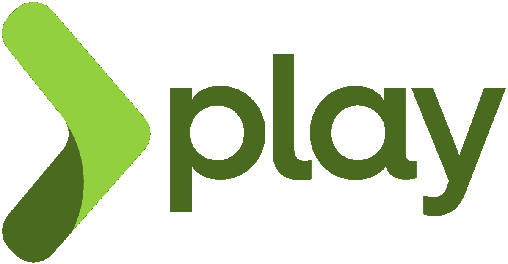
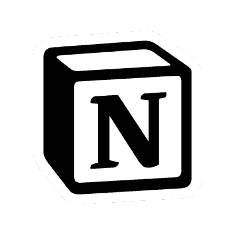
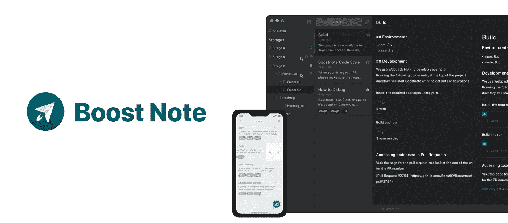
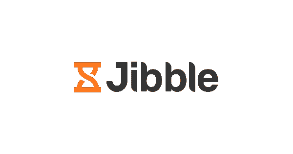
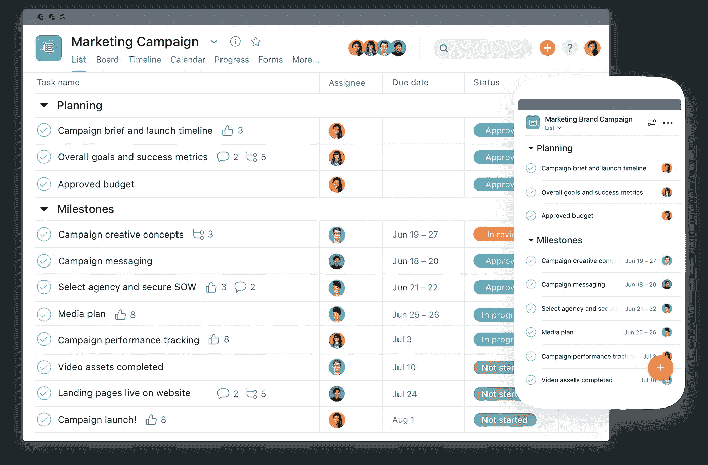
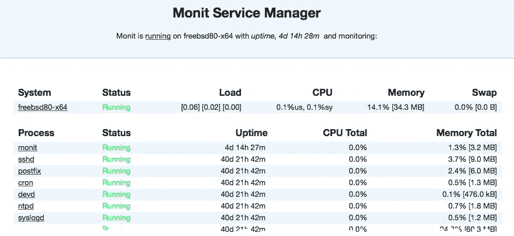

# 作为一名程序员在生产力上苦苦挣扎？试试这 9 个工具

> 原文：<https://javascript.plainenglish.io/9-super-productivity-tools-for-programmers-8bb91f4fb642?source=collection_archive---------1----------------------->

## 程序员的关键生产力提升工具，确保工作流程顺畅。

Photo by [Pankaj Patel](https://unsplash.com/@pankajpatel?utm_source=medium&utm_medium=referral) on [Unsplash](https://unsplash.com?utm_source=medium&utm_medium=referral)

## **1** 。**白银搜寻者**

在由数千行代码组成的文档中搜索特定的代码行并不容易，有时这真的令人沮丧。Silver Searcher 是一个跨平台的源代码搜索工具，可以在这种情况下使用。它被列为开发人员的最佳生产力工具之一。

类似于 ***ack*** ，但是速度更快，使用 ***Silver Searcher*** 工具可以很容易地在一个大文档中找到特定的代码行。

## **2。羊群**

Flock 是一个实用应用程序，它将您团队的所有对话、应用程序和工具集中在一个地方，以便您可以专注于重要的事情，从而更快地完成工作。它还为应用程序提供了生产力概念。

***例如，*** 您可以将**文档**和**文件**钉到会话或与会话相关的频道。

***优点:***

*   轻松分享
*   协作工具
*   提醒和注释
*   沟通管理

## **3。通量**

开发人员花大量时间看屏幕，这直接影响他们的视力。这使得在任何项目中保护好你的眼睛变得非常重要。Flux 是一种根据一天中的时间和您的位置自动调整颜色的工具。

*   它可以调整显示器的色温，从而提高您的工作效率。
*   就像黄昏和黎明一样，Flux 会做出相应的调整，使工作环境更加愉快，并确保你不会受到糟糕的屏幕照明的破坏性影响。

## **4。游戏框架**

对于使用 *Java* 和 *Scala* 语言进行开发的开发者来说，Play framework 是一个非常好的工具。它加速了这两种语言的开发过程。

配备了 web 浏览器和文本编辑器，您可以使用 Play 框架更轻松地测试应用程序和网站，还可以实时看到变化。大多数 Java 库都与这个工具兼容，它在 web 和移动应用程序开发中运行良好。

## **5。观念**

概念是一个基于云的工作空间，在这里你可以**编写**、**创建**、**协作**并组织起来。该应用程序支持集成的 ***任务*** 、 ***数据库*** 和 ***维基*** 。它有一个看板界面，简化了创建和存储协作文档的过程。

*   这个应用程序的优点是，您可以与您的客户共享某些信息，并隐藏其余的信息，以免他们被额外的信息淹没，并且您可以在使用它时根据您的需要轻松地配置它。

## **6。增强注释**

Boostnote 是一个开源应用程序，开发人员使用它在项目期间做笔记。有了这个工具，很容易组织信息。注意，它并不适合所有人，主要是程序员用来做笔记的。

Boostnote 的伟大之处在于它提供了 ***文件夹*** 和 ***标签*** 来更好地组织你的笔记。它还支持复选框，并包括一个进度条来跟踪所有任务的完成情况。

***高亮特性:***

*   笔记标记
*   离线写作
*   搜索功能
*   降价票据

## **7。Jibble**

Jibble 是一个时间跟踪应用程序和基于云的多设备考勤跟踪器。该应用程序允许用户不仅从计算机上远程使用该服务，还可以从员工的手机上远程使用该服务，使其更易于访问。此外，在开发商的时间里，更容易看到项目的成本。

## **8。体式**

Asana 是一个高度可定制的软件即服务，旨在改善团队协作和工作管理。它可以帮助团队在一个工具中管理项目和任务。团队可以直接在 Asana 中创建项目，给队友分配工作，指定截止日期，并就任务进行交流。

你真的可以根据你具体团队和项目的需求来定制。它易于使用，干净，同时色彩丰富。

***关键特性:***

*   任务、项目和工作流管理
*   实时报告和通信
*   任务创建和分配非常简单

## **9。监控**

Monit 是一个全面的监控工具，只要服务器出现故障，它就会派上用场。它执行自动维护，并在出现错误时采取有意义的因果行动。

有一个用户友好的界面，您可以在其中查看所有受监控主机的状态和分析，以预测各种服务器进程的潜在问题。Monit 运行在 POSIX 系统上，使用大约 10-15mb 的内存。

***关键好处:***

*   简洁明了
*   响应用户界面
*   内置数据库支持

 [## 如何在 CSS 中创建阴影

### 为您的应用程序构建出色的视觉效果

javascript.plainenglish.io](/working-with-shadows-in-css-15ff0717cf71)  [## 作为软件开发人员，你正在犯的 5 个 UI 错误

### 开发人员在前端应用程序中经常犯的 UI 错误

javascript.plainenglish.io](/5-ui-mistakes-you-are-making-as-a-software-developer-6e311d769a77)  [## 成为终端忍者你应该知道的 15 个终端命令

### 面向高效开发人员的终端命令

javascript.plainenglish.io](/15-commands-that-will-make-you-a-terminal-ninja-403399ab55b6) 

*更多内容看*[***plain English . io***](http://plainenglish.io/)