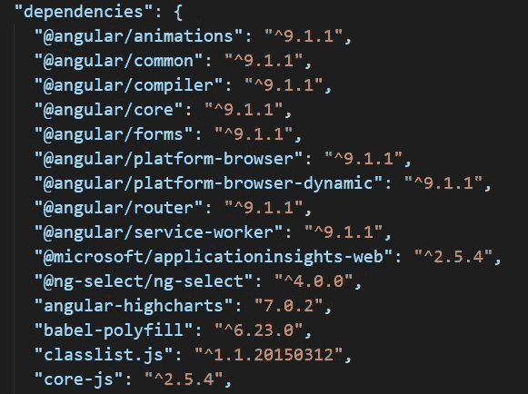
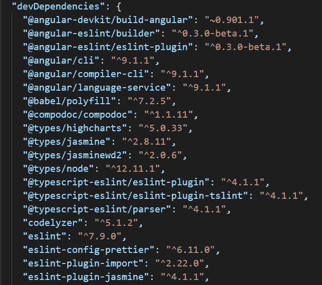
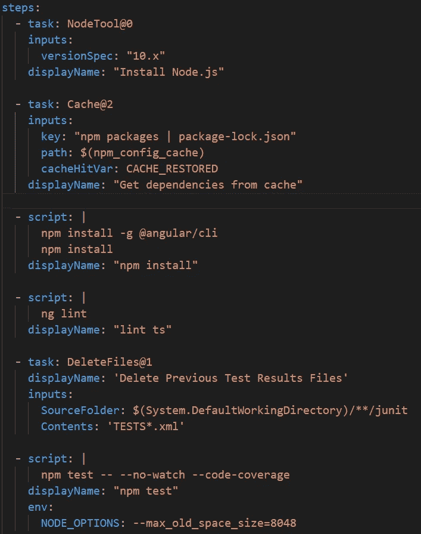

# 每个程序员都应该知道的 9 件事

> 原文：<https://javascript.plainenglish.io/9-things-every-programmer-should-know-bb959286c27b?source=collection_archive---------15----------------------->

## 了解一些编程中最重要的术语——每个程序员都应该知道的术语。


Photo by [**Lukas**](https://www.pexels.com/@goumbik?utm_content=attributionCopyText&utm_medium=referral&utm_source=pexels) from [**Pexels**](https://www.pexels.com/photo/person-using-macbook-pro-574077/?utm_content=attributionCopyText&utm_medium=referral&utm_source=pexels)

您可能是编程新手，或者您可能已经编程一段时间了，但仍然对软件开发中使用的一些术语和术语感到困惑。

在这篇文章中，我将分享我认为每个程序员都应该知道的 9 件事。这不仅仅对软件开发人员有用，对任何在软件开发行业工作的人都有用。

我们将讨论以下内容:

> 你如何修改代码？应用程序如何通信，如何从数据库中获取数据以及将数据保存到数据库中？你如何让你的应用保持响应速度？什么是框架？什么是云？应用在哪里运行？你怎么用别人的代码？什么是依赖？如何对代码进行自动化测试和其他检查？

# **1。Git**

Git 是用来备份代码和保存对代码的修改的。这是一种版本控制软件。它允许您在出错时轻松撤销更改，并返回到项目历史中的任何一点。

当多人同时对同一代码进行修改，并且可以自动组合这些修改时，这非常有用。有时候两个人会对同一行代码做不同的修改。如果您试图组合和合并这些更改，Git 会告诉您存在冲突。然后，您可以决定要保留谁的更改。

代码存储在存储库中，存储库可以保存在本地或在线。最常见的存储位置之一是在网站 [Github](https://github.com/) 上。Git 不是唯一的版本控制软件，但它是最常用的。它不一定只用于编程，它可以用于任何事情。

# **2。HTTP 请求和 API**

API 代表应用程序编程接口，基本上是指一个应用程序如何与其他应用程序通信以及在它们之间传输数据。HTTP 是应用程序中传输数据最常见的方式之一，你可以使用“GET Request”向数据库发出请求以获取数据，或者使用“POST request”向数据库添加数据。

通常，您可以调用一个内置函数来为您创建 HTTP 请求。您只需传入数据和发送数据的 URL，以及它是 GET 还是 POST 请求。数据通常以 JSON 格式传输，但也可以以其他格式发送。你可能会这样做。

```
this.http.get(url)this.http.post(url, data)
```

您还可以使用 HTTP 请求在您的计算机上加载本地文件，并将结果存储在一个变量中。您只需将 URL 替换为文件的路径。

```
this.http.get(filepath)
```

# **3。异步编程**

通常情况下，当代码运行时，它会一个接一个地执行每一步，并等待上一步完成后再进入下一步。有时，尽管从其他地方加载或检索数据可能需要很长时间。这将最终阻止其他任何东西运行，并使应用程序完全没有反应。可能应用程序的某个部分需要这些数据，但应用程序的其他部分不需要，等待什么都不做是没有意义的。

为了解决这个问题，你可以让应用程序继续执行剩下的代码，并承诺一旦得到数据，就对数据做一些事情。通过这种方式，用户仍然可以与应用程序进行交互，并点击周围，你可以显示一个加载微调器或其他东西来代替你正在等待的东西。

您可以在开始加载数据之前设置一个变量，例如 *loadingData* 为 true，然后在加载完成时将其设置回 false，并使用它来确定何时显示加载微调器。您可以指定成功加载数据时的操作，以及出现问题但未能加载数据时的操作。你可能会看到这样的东西。

```
this.loadingData = true
this.http.get(url).subscribe(
    (data) => {
        // Do something with the data once finished loading it
        this.loadingData = false
    },
    (error) => {
        // Print out the error message if it fails to load
        console.log(error)
        this.loadingData = false
    }
)
```

HTTP 请求和从你的电脑上加载文件是非常缓慢的任务，你需要这样做来确保应用程序对用户的响应。

# **4。语言 Vs 框架**

一种语言(例如 JavaScript)是你用来写代码的特定语言。框架(例如 Angular、React Native)是用该语言构建应用程序的一种特殊方式。使用同一种语言，你可以有许多不同的方式来构建一个应用程序。框架定义了一些关于如何组装应用程序的规则。

例如，在 Angular web 应用程序中，您必须将应用程序分成组件和服务。组件是实际显示在 UI 中的东西。服务用于存储数据和常用功能。组件从服务中获取数据，并将其显示在 UI 中。

你不需要使用框架，但它们可以帮助你开发你自己的应用程序，并为你处理许多事情，这样你甚至不需要了解它们，就可以专注于你的应用程序的独特之处。

# **5。云**

云基本上是指在别人的电脑上运行代码，而不是在你自己的电脑上运行你的应用程序。像 AWS 和 Azure 这样的东西允许你付费在他们自己的电脑上运行和租用各种各样的软件。

你可以在他们的服务器上运行你的整个应用程序，或者只需付费为你的应用程序添加一些附加功能，这是一种快速设置应用程序的好方法，而不必从头开始设置。这样，你就不必担心诸如确保你的应用程序能够处理很多用户，并且一直保持运行等问题。

# **6。端口**

端口是应用程序在电脑上实际运行的地方。一台电脑上通常有 1000 个可用端口，允许它同时运行许多不同的应用程序。您不能在任何给定的端口上运行多个应用程序，但您可以在不同的端口上运行同一应用程序的多个副本。电脑的前几个端口是为电脑需要运行的重要应用程序保留的。

当您在本地运行应用程序时，它会在您电脑的一个端口上运行。当你启动它的时候，它应该说它在哪个端口上运行。将会有一个设置文件，您可以在其中进行更改。

假设您在端口 8080 上启动了一个 web 应用程序。你可以打开一个网页浏览器，进入“ [https://127.0.0.1:8080/](https://127.0.0.1:1/) ”或“ [https://localhost:8080/](https://127.0.0.1:1/) ”。

当你在浏览器中访问一个在线网站时，你实际上会被重定向到运行该应用程序的电脑上的某个特定端口。为了处理许多用户试图同时访问同一个应用程序，会有许多应用程序的副本在运行，你会被重定向到最不繁忙的应用程序之一。

# **7。包装经理**

包管理器是软件工具，可用于安装额外的软件和额外的代码库，以便在应用中使用。有许多不同的包管理器，每种编程语言都有不同的包管理器。要安装一个库，你通常只需要在命令终端输入一些东西。

web 应用程序中使用的最流行的包管理器之一是节点包管理器或 NPM。你可以安装 https://www.npmjs.com/ NPM 官方网站[上列出的任何软件包。要安装一个软件包，你只需输入](https://www.npmjs.com/)

```
npm install <package-name>
```

进入指挥终端。对于其他语言的包管理器来说非常相似。一旦你安装了它，你就可以把它导入到你的文件中。

# **8。依赖性**

你的应用程序的依赖项只是你在应用程序中使用的其他人的代码的列表。您的应用程序中的某个位置会有一个文件，其中列出了您的项目中使用的所有包或代码库以及它们的版本。比如 Angular web apps 中，会有一个名为 *package.json* 的文件。在本例中，您可以看到使用了 Angular 的第 9 版，还可以看到其他一些 NPM 包，如 *core-js。*



再往下，还有一个在开发应用程序时使用的软件包列表。这些东西就像编写测试和处理代码格式的软件。



在 package.json 中，您不必指定确切的版本。数字前的脱字符号 *^* 表示使用该版本或高于该版本的任何版本。当你使用 *npm install* 时，它会自动选择所有软件包的确切版本，根据它们之间的兼容性，然后创建另一个文件 *package-lock.json* ，其中包含你的项目中使用的确切版本。您可以通过省略插入符号在 *package.json* 文件中指定一个特定的版本。

# 9.管道

管道用于自动对代码执行一系列操作。这通常用于在任何人将他们所做的更改合并到主分支之前，自动运行测试和其他代码检查。

通常有一个文件名以*结尾的文件。yaml* 列出已经完成的任务。作为一个例子，这是 Azure 管道文件的一部分。里面是要做的步骤列表。首先，它安装应用程序，然后检查格式，然后运行一些测试。



# 摘要

如何备份和保存你对代码所做的修改，让很多人更容易同时对同一代码进行修改。

**HTTP 请求** —如何在应用程序之间传输数据，以及如何将数据保存到数据库以及从数据库中获取数据。

**异步编程**——你承诺一旦数据加载完毕，你会对数据做些什么。同时，您让其他代码运行。

**语言 Vs 框架** —语言定义了如何编写代码的规则，而框架定义了用该语言构建应用的方式。

**云** —付费在别人电脑上运行软件。可能是他们自己提供的软件，或者你在他们的电脑上运行你自己的代码。

**端口—** 电脑上运行应用程序的地方。

**包管理器** —用于安装其他人制作的额外的代码包。

**依赖关系** —项目中使用的所有不同的代码包。有一个在已发布的应用程序中使用的包和仅在开发中使用的包的列表。

**管道** —用于在合并代码之前自动运行测试和其他检查。

*更多内容请看*[*plain English . io*](http://plainenglish.io/)