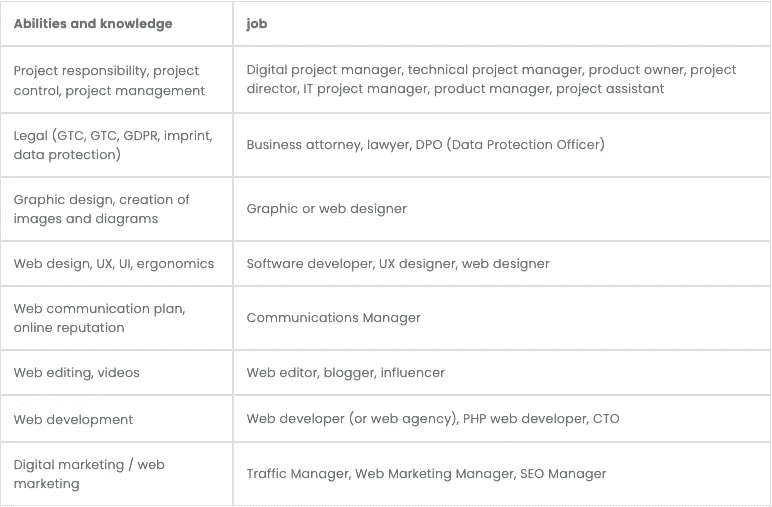
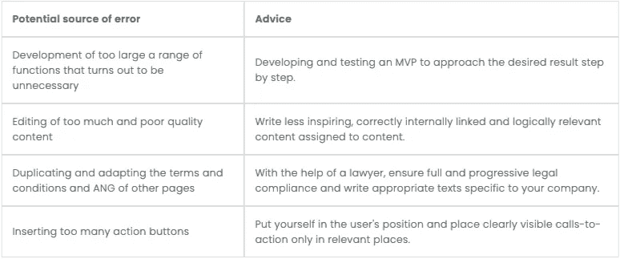

# 成功的网络项目可以遵循的 9 个技巧

> 原文：<https://javascript.plainenglish.io/9-tips-you-can-follow-for-a-successful-web-project-7e3bc31715f3?source=collection_archive---------14----------------------->

## 并避免最常见的错误来源。

Photo by [Lala Azizli](https://unsplash.com/@lazizli?utm_source=medium&utm_medium=referral) on [Unsplash](https://unsplash.com?utm_source=medium&utm_medium=referral)

任何已经深入参与一个数字项目的人都会确认，除了引入的方法，经验是最重要的。

这就是为什么我从自己作为一名员工的经验中提出了 9 个建议，它们将帮助你在网页设计中建立一个成功的网页项目，并避免最常见的错误来源。

# 1.网络战略与公司战略的一致性

将一个 web 项目与公司的战略隔离开来是注定要失败的，因为，正如我已经看到的，前者是公司整体战略的延伸。所以要从公司目标的基础上来定义平台的目标。这里有一些问题可以帮助你确定你的营销策略:

*   网站的目标是什么？
*   竞争对手是谁？
*   SEO 指标有多强？(信任流、域授权)
*   市场上有哪些机会和风险？
*   我们的优势和劣势是什么(例如，写出好内容的能力)？
*   我们有办法实现我们设定的目标吗？

一旦选择了策略，坚持下去是很重要的，即使在这个过程中需要克服一些小障碍。

# 2.互补技能和共享文化

经验、设计、开发——开发团队成员的许多特征和技能对于 web 或 IT 项目的成功至关重要。每个团队成员在项目中都有自己的角色和职责，这透明而清晰地构建了任务的委托。以下是网站重新设计所需的各种技能，以及符合这些要求的职业:

Supplied by the author

互联网上的竞争变得非常激烈。因此，要完成一个 web 项目，拥有一个经验丰富的开发团队是必不可少的。整个团队还需要共享相同的 IT 项目文化，以加快网站的开发。

# 3.少即是多

web 开发过程经常被低估，结果是项目的 web 开发过程几乎系统地偏离了最初计划的路径。因此，设计和规划一个真正的最小可行产品(MVP)是至关重要的。在开始一个过于详细的项目之前，这是测试项目核心的一个很好的方法，如果项目发展，会有变得太大和潜在灾难性的风险。

Supplied by the author

# 4.现实的规划

乐观在日常生活中是一种力量，但在项目管理中却是一种弱点。但是，对项目规划过于悲观也是无益的。好的项目管理艺术是基于创建一个好的参考系统，这样参与项目的每个人都可以做出正确的决定，并在必要时调整项目。

所需人力资本的精确量化以及项目计划中的精确预算和资源分配允许执行追溯计划(例如，甘特图)，这使得计划团队的所有成员能够了解项目的规模。

# 5.有效的项目管理方法

根据项目的类型，可以使用各种有趣的项目管理方法:

*   传统方法:瀑布，关键路径，
*   PMI/PMBOK 方法，
*   敏捷方法(Scrum，看板，极限编程)，
*   适应性方法:事件链，极端项目管理。

敏捷 Scrum 方法是 IT 项目管理中最常用的方法。由于短的沟通渠道、高灵活性、透明性和简单的实现，它与初创企业/web 和开发人员文化是和谐的。它非常符合 web 平台的生命周期。

# 6.信任是好的，控制更好

每个人都可以收集关于使用网站、平台或网络应用程序的数据。在仪表板中展示它们并不困难。它为公司提供了一个重要的优势:与公司直接相关的纯事实相关的数据，而没有这些数据，你只能做出粗略的、通常不精确的假设。通过将分析建立在这样的数据基础上，诸如“我确信用户会喜欢它”这样的不具体的猜测将被避免。

要把这个假设变成事实，就要看用户在每个页面上花费的时间，分析反弹率，识别相关事件和转化。

因此，您应该花两个工作日在 Google Analytics 中创建一份个性化报告，概述网站上与您相关的所有活动。

# 7.要有创意！

创意与任何网站设计项目都密不可分，因为它是创新的主要载体。此外，创新对于创造和保持竞争优势至关重要。

为了培养团队的创造力，创造不受项目相关压力影响的头脑风暴时间是很重要的。在这种情况下，设计思维方法是令人兴奋的，因为它结合了团队的分析思维和直觉思维。

# 8.规避风险，但仍有勇气尝试新事物

总的来说，网络营销、UX 设计和 IT 开发是非常务实的。因此，在有效应用已被证明的方法时，没有必要重新发明轮子或冒险进入完全未知的水域。几乎所有的 web 项目都要为那些从未被测试过的过程和流程承担风险，最终以不正确的方式结束。只有财务能力强的公司才能轻易地从这类错误中恢复过来。

然而，这并不是说应该完全避免测试。强烈建议进行低风险(时间和财务)的营销、功能和图形测试。例如，新的广告渠道应该首先用少量的广告预算进行测试。此外，对功能、视觉效果或登录页面进行 A / B 测试是识别潜在错误源的好方法，并且完成了访问、使用或转换的次数，以优化序列中的交易。

# 9.通讯技能

无论是内部的(在项目团队和公司内部)还是外部的(客户、用户、关注者、读者等))，公司的沟通在网页设计中也至关重要。它永久地将项目的概念固定在第三方的脑海中。以下是 web 项目管理中需要通信解决的关键元素:

**内部:**

*   项目中最重要的里程碑，
*   延误和提前交货进度、
*   正在进行的项目进展，
*   重大变化及其原因。

**对外**:

*   发布日期(仅在确定的情况下)，
*   网站或产品价值主张和基线，
*   网络研讨会邀请。

# 改进对网络项目的管理

Web 项目管理是非常刺激的，因为它将许多专业领域整合到项目工作中，并且可以依靠从中产生的知识来生产非常复杂的最终产品。

项目参与者的创造力使得创造一种与传统项目截然不同的数字体验成为可能。严格性和创造性之间的这种平衡需要有经验和互补的人使用适当的方法进行合作(例如，敏捷开发)。

像 Asana 这样的协作管理工具也可以提高项目监控的有效性，从而提高项目的成功程度，在不偏离计划的情况下获得定性的结果。试试看。

就这样。我希望您能够成功实施这些技巧。谢谢你的阅读！

[*更多内容参见*](http://plainenglish.io/)