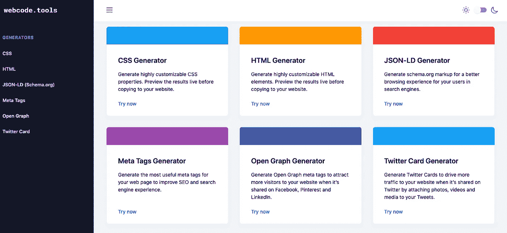
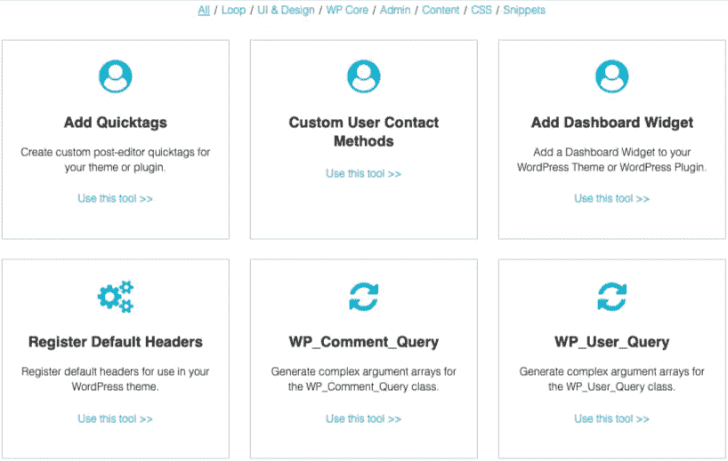
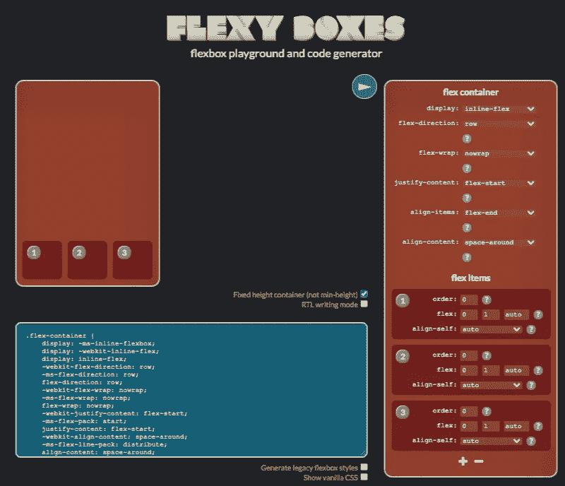
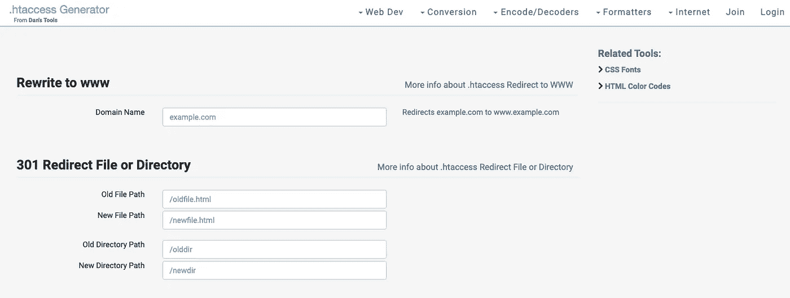
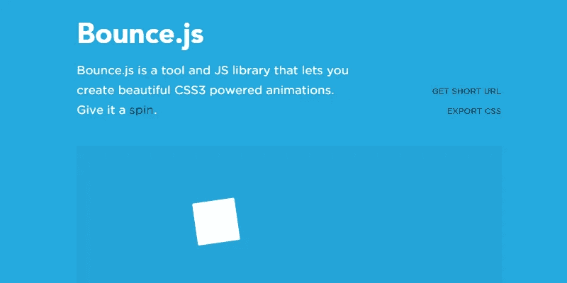
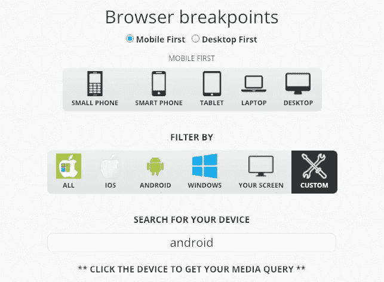
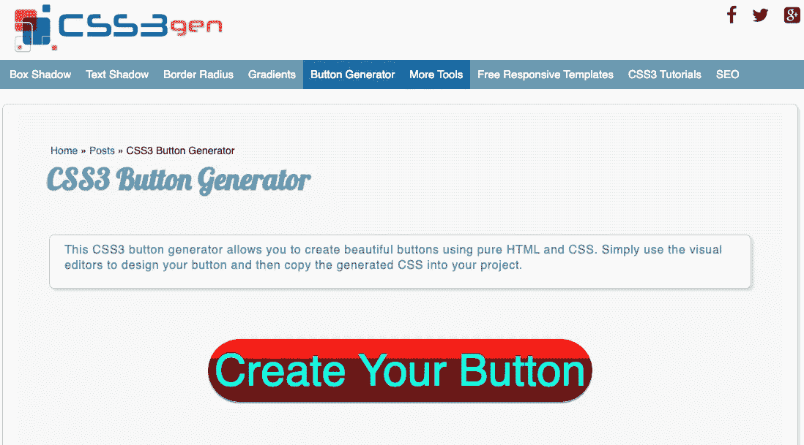
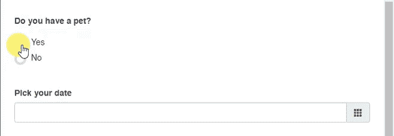
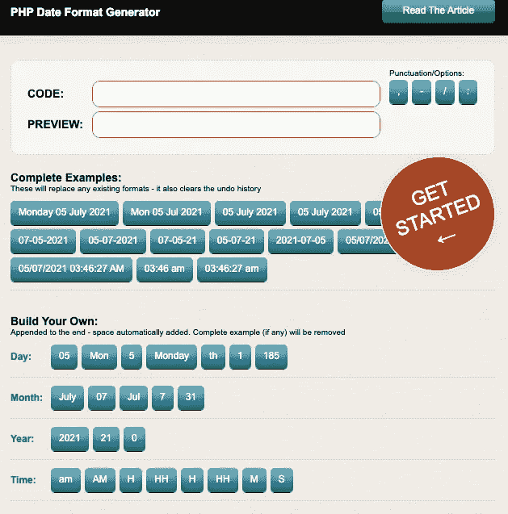

# 让你成为高效开发者的 9 个工具

> 原文：<https://javascript.plainenglish.io/9-tools-that-will-make-you-a-productive-and-effective-developer-8affc4a6d2a4?source=collection_archive---------6----------------------->

## 没有代码错误的风险。

Screenshot by the author — [Webcode. tools](https://webcode.tools/)

Web 开发浩如烟海，很难样样精通。你需要了解 HTML，CSS，JavaScript，PHP，以及更多的 web 开发知识。

如果你对提到的语言知之甚少，代码生成器可以很快成为你最好的朋友。

## **1。** [**代码生成器**](https://www.nimbusthemes.com/wordpress-code-generators/)

Screenshot by the author

如果你在 WordPress 中创建一个站点，你有时会面临主题的限制。此外，如果没有代码，一些特性和定制是无法执行的。然而，如果你使用 WordPress Code Generator，这将不再是一个问题。

大约有 20 种可能的操作:为你的仪表盘创建小部件，个性化你的工具条，或者在你的菜单中创建新的区域。

你需要输入与你的 WordPress 站点相同的 CSS 选择器。如果你不知道如何去做，这个工具会给你很多建议。

## **2。**

****

**Screenshot by the author**

**在 CSS 中，FlexBox 模型允许元素的灵活排列，并限制了浮动的使用。免费的 Flexy Boxes 工具允许您创建和编辑基于这些 flex box 的复杂布局。您可以控制元素的数量及其方向和对齐属性。代码是自动生成的，您必须将它复制/粘贴到您的 CSS 表单中。**

## ****3。** [**。htaccess 生成器**](https://www.htaccessredirect.net/)**

****

**Screenshot by the author**

**的。htaccess 文件位于您的服务器上，在许多情况下都很有用。它允许你进行重定向，重写 URL，或者在文件上设置某些安全措施。不幸的是，尽管可以做很多好事，但并不是每个人都知道要记住的代码行。**

**。htaccess 生成器将为您完成这项工作。首先，你要根据你想要执行的动作填写必要的字段，然后点击页面底部的“生成代码”，就大功告成了。**

****警告—** 务必备份您的。htaccess 文件，然后再修改它。处理不当或一行错误的代码都可能导致错误。**

## ****4。**[**bounce . js**](http://bouncejs.com/)**

****

**Screenshot by the author**

**网站上的动画总是没有什么效果。但是它们仍然很难编码，尤其是当你不具备所有必需的知识时。**

**幸运的是，Bounce.js JavaScript 库可以自动生成链接到动画的 CSS3 代码。你可以定制你的组件，相关的动画，持续时间，延迟等等。**

## ****5。**[**CSS3**媒体查询生成器](https://simplecss.eu/)**

****

**Screenshot by the author**

**媒体查询是响应式设计的基础。但是这些 CSS 代码写起来可能很乏味。但是，使用免费的 CSS3 媒体查询生成器工具，您可以根据自己的要求创建详细的查询。**

**此外，您甚至可以实时测试生成的代码——当您的代码生效时，背景会发生变化。**

## ****6。** [**CSS3 生成器**](https://css3gen.com/)**

****

**Screenshot by the author**

**这次，让我们用免费的 CSS3 生成器工具在 CSS3 的世界里多呆一会儿。非常完整，这个生成器为你提供了渐变、按钮、边框、文本阴影等 CSS 代码。它甚至考虑了 CSS 转换、动画或背景代码。**

## ****7。** [**jQuery 表单生成器**](https://www.jqueryform.com/)**

****

**Image source: [Jqueryform](https://www.jqueryform.com/)**

**几乎所有的网站都有一个表格:例如，联系或者订阅时事通讯。有了 jQuery Form Builder，创建这些表单将变得更加容易。**

**通过简单的拖放，您可以添加您想要的字段，然后根据您的意愿自定义它们。代码是自动生成的，当然，在检索之前，您可以测试您的问卷。**

## ****8。** [**PHP 日期格式生成器**](https://www.mraffaele.com/labs/php-date-format-generator/)**

****

**Image source: [Jqueryform](https://www.jqueryform.com/)**

**当你需要用 PHP 填写日期的格式时，你是不是一直在看文档？答案肯定是肯定的，因为日期的格式千差万别，很难全部记住。**

**感谢 PHP 日期格式生成器，您将节省时间。首先，您需要为自动生成的代码选择所需的格式。当然，如果建议的格式都不适合你，你可以创建自己的格式。**

## **9.[终极 Web 代码生成器](https://webcode.tools/)**

**如果以上工具都没有赢得你的青睐，那么最终的 Web 代码生成器可能适合你。有点像前端代码生成器的瑞士军刀。**

****

**Screenshot by the author**

**您可以生成 HTML5、CSS3 和 JSON 等。用法很简单:您必须填写几个字段并改变一些参数。**

**这些工具不是让我们变懒，而是让我们在工作中变得高效，而不会犯耗时的错误。因此，让我们利用这些工具，使我们的工作变得容易得多。**

***更多内容看*[***plain English . io***](http://plainenglish.io/)**