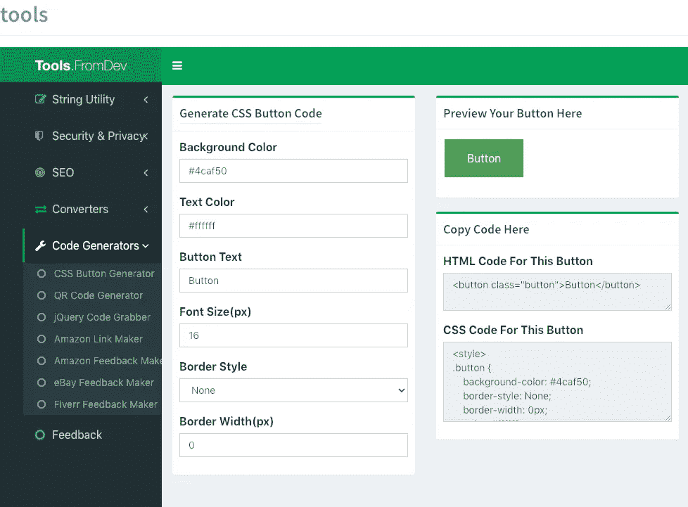

# 对网络开发者有用的 9 个网络应用

> 原文：<https://javascript.plainenglish.io/9-useful-web-apps-for-web-developers-4cd9a0ea9a2f?source=collection_archive---------1----------------------->

## 应用程序将帮助你在工作中更有效率。

Photo provided by the author

任何在大型公司工作站担任软件开发人员的人都可能会遇到这个问题——有时缺少自己无法安装的必要工具。通常这些只是小事情，比如你最喜欢的编辑器。

然而，必须动员一半的 IT 部门来安装它们，这需要时间——前提是指导原则允许后续安装。有时，有些事情只需要查看技术信息或某些代码片段，而不需要参加在线课程。

对于这两种情况，都有提供一系列开发工具的在线服务。大多数工作站都安装了网络浏览器，也可以连接互联网——可以使用有用的工具，而不必引起管理员的注意。我给你 9 个方便(免费)的在线服务来帮助你进行软件和网络开发。

## 1.[工具。from dev:web 开发者工具](https://tools.fromdev.com/)

这是一个小而好的工具包，在实际的 web 开发中，它在很多地方都会有帮助。Fromdev 是一个博客，主要为软件开发人员提供书籍和在线教程。有点隐藏在网站上。然而，有一个小工具箱应该是令人高兴的，尤其是对 web 开发人员来说。

除了用于 XML、JS 和 HTML 的 Escape/Unescape 工具之外，还有一个密码生成器、各种转换工具以及用于 SEO 和创建 CSS 按钮或 QR 码的实用生成器。

## 2.O [在线 bash:测试 Bash 程序](https://rextester.com/l/bash_online_compiler)

如果手头没有 Bash 例如，在 Windows 下或在像 iPad 这样的平板电脑上——也可以在线测试和执行 shell 脚本的自发建议。这不是免费在线狂欢的问题。此外，在线 bash 允许协作工作。

## 3. [CodeSandbox:用于快速 Web 开发的 IDE](https://codesandbox.io/)

如果你想快速破解几行代码，你应该仔细看看 CodeSandbox:在线开发环境不仅是免费的，还能让你导入、提交和拉请求到 GitHub 库。

通过这种方式，可以在浏览器中快速轻松地创建和测试程序原型。甚至免费版也支持容器技术和协同工作。

CodeSandbox 对于不同工作站的用户来说是一种实用的分散式编码辅助工具:无论您当前使用的是哪台计算机，沙盒都在浏览器中运行。付费账户(每月 9 美元)，仍然有无限的开发者沙箱和私人 GitHub repos。

## 4. [Playcode:开发者球坑](https://playcode.io/)

Playcode 和 CodeSandbox 进入了一个相似的领域。Web 开发人员可以在这里在线编写或测试他们的代码。整个工具比 CodeSandbox 简单一点，因此更清晰，但功能不太丰富。

该工具补充了一些实用功能的付费帐户，如 1gb 的存储空间、显著增加的资产大小、代码部署和更强大的漏洞查找器。

## 5. [Browserling:庞大的在线工具集合](https://www.browserling.com/tools)

跨浏览器测试门户浏览提供了一个巨大的完全免费的工具集，不仅仅是为 web 开发者。几乎每种用途都有一个合适的在线工具:除了简单的 Minify 和 Prettify，还有用于转换、加密或小图像处理的在线工具。

实际测试环境的免费版本仅限于与 Windows 和 Internet Explorer 的三分钟会话，这意味着网站的跨浏览器测试只有在付费版本(19 美元)中才有意义。

## 6.[js fiddle:HTML、CSS 和 JavaScript 的测试工具](https://jsfiddle.net/)

JSFiddle 的协作代码平台很小但很好:在这里，HTML、CSS 和 JavaScript 的代码片段可以被存储、测试和协作编辑。该编辑器不会打扰用户的任何登录或计划，并且可以在浏览器中完全免费使用。那些支持 JSFiddle 的人每月花费 8 美元，并提供额外的功能，比如没有广告、私人提琴和一个调试控制台。

## 7.Ideone:60 种语言的在线调试器和编译器

在线代码编辑器 Ideone 是在线测试代码片段的理想工具:该工具支持 60 多种编程语言，除了 C ++、Java 或 Python，还支持一些不太知名的语言，如 Prolog 或 Whitespace。代码直接在网上编译和执行，很容易追踪错误。代码片段也可以通过简单地分割 URL 来传递。

## 8. [JSLinux:浏览器中的几个 Linux 和 Windows](https://bellard.org/jslinux/)

有时候开发人员需要一台 Linux 机器，JSLinux 就派上了用场:该服务免费提供几个 Linux 发行版，无需安装任何虚拟机。除了 Alpine Linux 和 Buildroot，甚至还有 Fedora，但不是全新的版本。

这两个发行版都可以作为命令行或通过 X 窗口运行，尽管后者并不总是以最佳方式运行。FreeDOS 甚至 Windows 也包括在内。有了 copy.sh，也有了 Windows 98 或 MS-DOS 等旧操作系统的替代品，不过，这更多的是一种噱头。

## 9.[我能使用吗:看看在哪个浏览器上能用](https://caniuse.com/)

Web 开发人员需要知道他们可以使用哪些技术来接触尽可能多的用户。对于众多的浏览器型号和版本来说，这并不容易。服务 caniuse.com 有助于解决这个问题:开发人员可以使用一个简单的输入掩码来检查哪些浏览器和版本支持哪些函数和 API。

工具帮助我们使开发人员的工作变得更加容易和快捷。我们工具箱里的工具越多，我们完成工作的速度就越快。我希望你能把这些工具包括在你的收藏里，在你需要的时候随时使用它们。