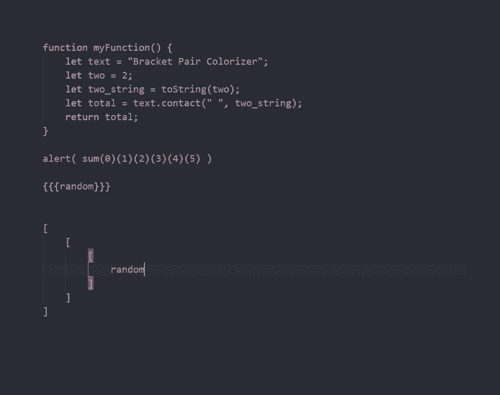
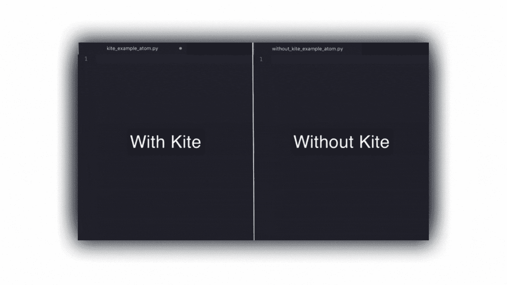
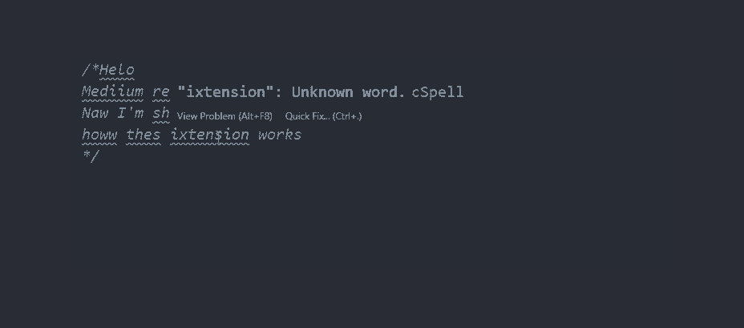
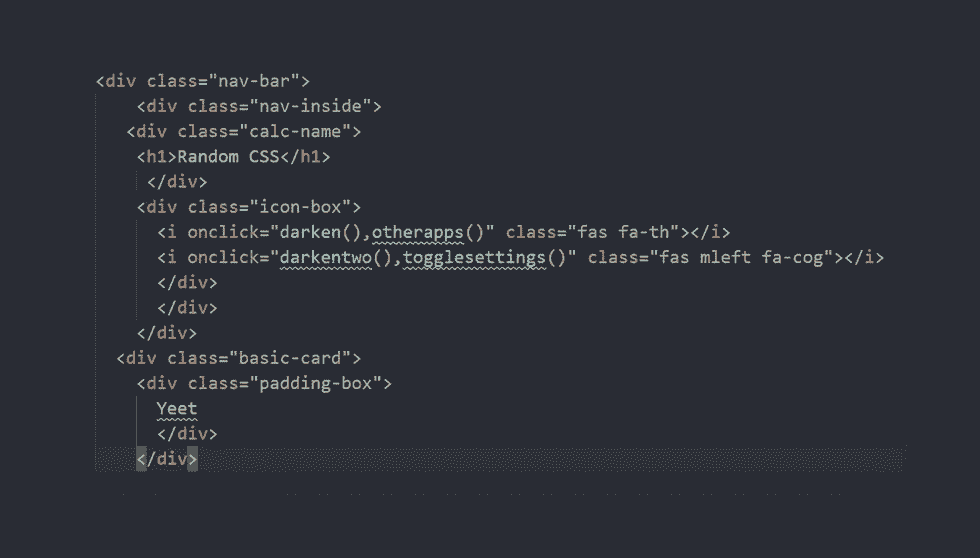
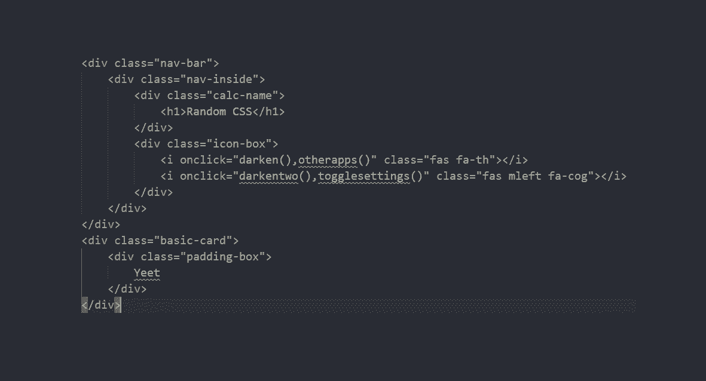
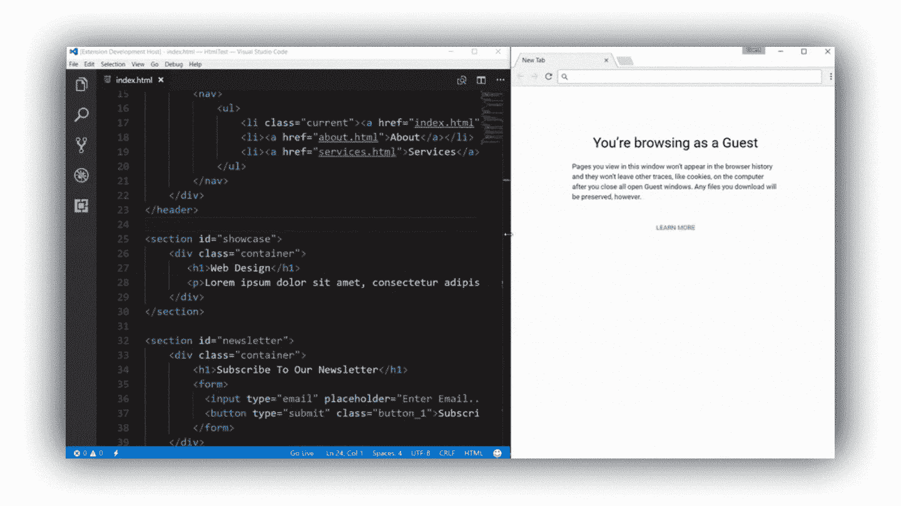
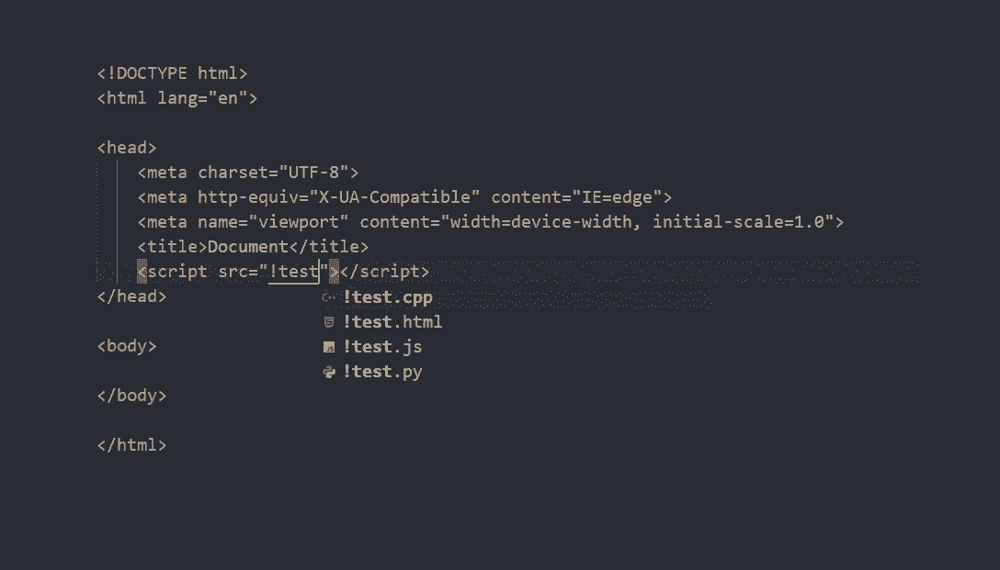
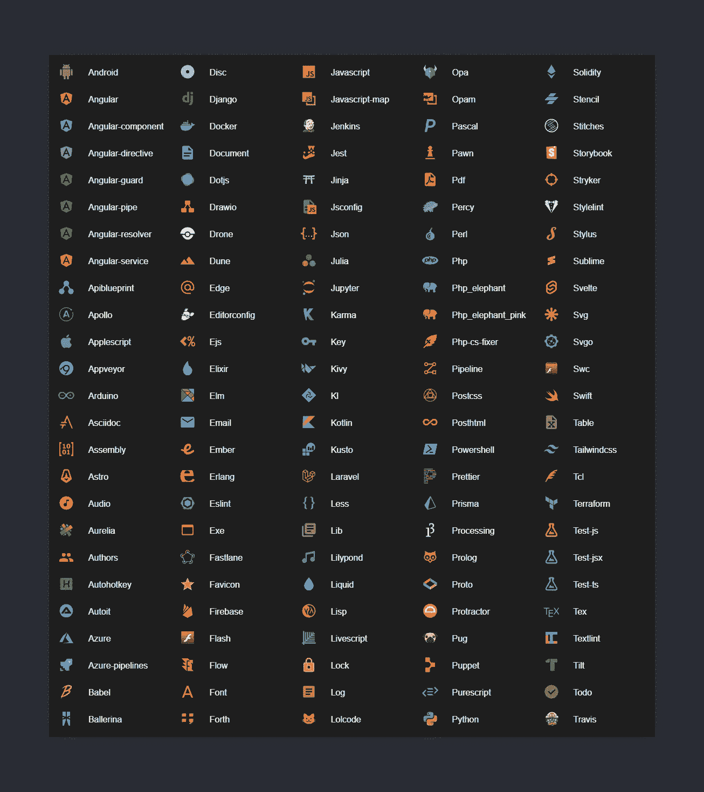
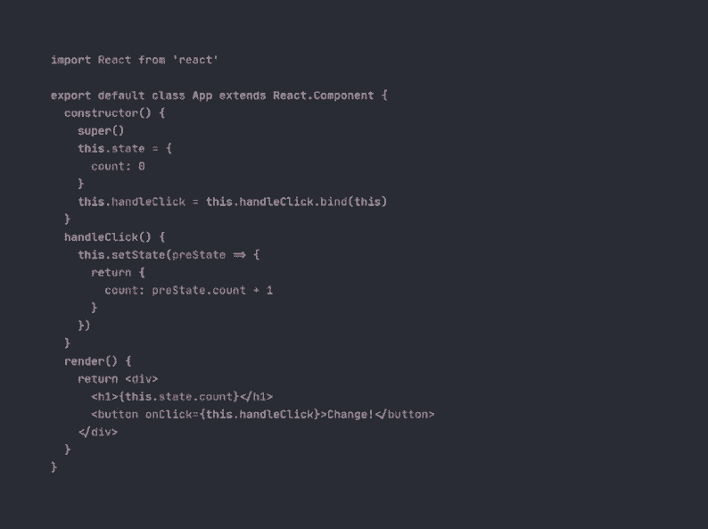

# 作为开发人员，您绝对需要 9 个 VSCode 扩展

> 原文：<https://javascript.plainenglish.io/9-vscode-extensions-you-definitely-need-as-developer-b30d819839f6?source=collection_archive---------3----------------------->

## VSCODE

## 如果您有这些扩展来改进您的工作流程，减少错误数量，并使日常编码更容易，这将会有所帮助。

Photo by [Dmitry Chernyshov](https://unsplash.com/@oneor0?utm_source=unsplash&utm_medium=referral&utm_content=creditCopyText) on [Unsplash](https://unsplash.com/s/photos/mac?utm_source=unsplash&utm_medium=referral&utm_content=creditCopyText)

如果您像我一样每天都使用 VSCode，这些扩展将会帮助您改进工作流程，并使它比现在更好。我已经使用它们很长时间了，可以推荐它们。我相信你会发现你的理想，因为这些扩展提供了各种重要的功能，使你的 ide 更有吸引力。

我特别喜欢用 JavaScript 编程，我无法想象没有这些扩展我会做什么。我在互联网上搜索了最近和最伟大的扩展，这些都是 2021 年最好的扩展。

# [支架对上色器 2](https://marketplace.visualstudio.com/items?itemName=CoenraadS.bracket-pair-colorizer-2)

我想你已经处于这样一种情况，你找不到一个括号的起点和另一个括号的终点。或者可能很难理解函数的结构，并且您已经失去了作用域。如果您能联想到这些情况，那么 [**括号对彩色化器 2**](https://marketplace.visualstudio.com/items?itemName=CoenraadS.bracket-pair-colorizer-2) 肯定会帮您解决。它与常用的方括号、方括号和括号一起使用。

这个版本和第一个版本的主要区别在于第二个版本更快更准确。事实上，这个扩展将帮助您保持注意力集中，而不是每次都让您困惑。

Bracket Pair Colorizer 2

# [风筝](https://marketplace.visualstudio.com/items?itemName=kiteco.kite)

想象你正在写一行字，甚至不必结束它，因为 [**风筝**](https://marketplace.visualstudio.com/items?itemName=kiteco.kite) 会为你写。您需要做的就是点击 TAB 键，它会自动完成您的代码。我个人喜欢**风筝**，因为它帮助我更快地编写代码。此外，它还会显示您在键入时可能犯的错误。将**风筝**安装到你的 VSCode 中后，它会要求你将一个应用程序下载到你的电脑上。

如果你因为某些原因不喜欢使用 Kite，那么你可以安装[**Visual Studio IntelliCode**](https://marketplace.visualstudio.com/items?itemName=VisualStudioExptTeam.vscodeintellicode)或者[**JavaScript (ES6)代码片段**](https://marketplace.visualstudio.com/items?itemName=xabikos.JavaScriptSnippets) 。Kite 和其他几乎相似的扩展之间的主要区别是，它们大多只适用于一种语言，而 Kite 几乎适用于所有编程语言，并且还使用了升级的人工智能。

Kite

# [代码拼写检查器](https://marketplace.visualstudio.com/items?itemName=streetsidesoftware.code-spell-checker)

如果你没有听从 Kite 的建议，错误地输入了函数的名字，那么 [**代码拼写检查器**](https://marketplace.visualstudio.com/items?itemName=streetsidesoftware.code-spell-checker) 会立即显示你应该在哪里修改一些东西。当然，它会告诉你评论中的哪些单词语法不正确。

Code Spell Checker

# [更漂亮](https://marketplace.visualstudio.com/items?itemName=esbenp.prettier-vscode)

****确实如其所说。它让你的代码更漂亮，可读性更好。它有许多参数可以让你的编码更舒适。例如，您永远不需要计算空格的数量或考虑在哪里放置括号——它会为您做所有事情，您不需要手动做任何事情。还有，你可以用 [**为它美化**](https://marketplace.visualstudio.com/items?itemName=HookyQR.beautify) 。****

********

****Prettier: Before****

********

****Prettier: After****

# ****[直播服务器](https://marketplace.visualstudio.com/items?itemName=ritwickdey.LiveServer)****

****这个扩展特别适合 web 开发人员，因为它允许您在编辑代码后不重新加载页面。通过使用[**Live 服务器**](https://marketplace.visualstudio.com/items?itemName=ritwickdey.LiveServer) ，你可以按下屏幕下方的 *Go Live* 按钮，每一个改动都会自动应用到你的网页上。我个人喜欢这个扩展，它节省了我大量的时间。****

********

****Live Server****

# ****[路径智能感知](https://marketplace.visualstudio.com/items?itemName=christian-kohler.path-intellisense)****

****如果您总是忘记您的图像位于何处，或者您需要填写“href”和“src”标签，[**Path Intellisense**](https://marketplace.visualstudio.com/items?itemName=christian-kohler.path-intellisense)**会自动为您提供当前正在使用的路径，您只需手动点击 Enter 即可。******

************

******Path Intellisense******

# ******[素材图标主题](https://marketplace.visualstudio.com/items?itemName=PKief.material-icon-theme)******

******例如，如果您曾经即时处理过三个或更多的文件，那么几乎每次创建一个网站都需要浏览所有文件，很难理解 HTML 文件或 JavaScript 文件在哪里。 [**素材图标主题**](https://marketplace.visualstudio.com/items?itemName=PKief.material-icon-theme) 一定会让你这类任务轻松很多。它为你当前使用的每个文件添加了许多可视图标。一如既往，这是我个人的选择，你可以安装另一个“图标主题”。几乎每个文件都有图标，我给你看其中的一些:******

********

****Material Icon Theme****

# ****[一个暗亲](https://marketplace.visualstudio.com/items?itemName=zhuangtongfa.Material-theme)****

****我是那种不能只使用默认 VSCode 设计主题的人，我个人使用 [**One Dark Pro**](https://marketplace.visualstudio.com/items?itemName=zhuangtongfa.Material-theme) 让我的代码更漂亮，让我的眼睛更享受。你可以按照自己的意愿设置一切，例如，改变字体大小或者将一切设置成*斜体*样式。对于大多数人来说，这是最受欢迎的解决方案之一。不过你也可以轻松使用其他扩展比如 [**Atom 主题**](https://marketplace.visualstudio.com/items?itemName=akamud.vscode-theme-onedark) 甚至类似 [**德古拉官方**](https://marketplace.visualstudio.com/items?itemName=dracula-theme.theme-dracula) 的东西。****

********

****One Dark Pro****

# ****[**有无不和谐**](https://marketplace.visualstudio.com/items?itemName=icrawl.discord-vscode)****

****最新的扩展，我只是为了好玩才添加的。[**不和谐存在**](https://marketplace.visualstudio.com/items?itemName=icrawl.discord-vscode) 与不和谐一起工作，当你在编码时，它会显示你的不和谐状态，你的朋友可以很容易地看到他们什么时候可以打断你，什么时候不应该。此外，您可以跟踪您的编码时间，因为它也显示不一致。****

# ****结论****

****为什么定期更新 VSCode 扩展列表至关重要？因为 VSCode 更新有时会包含默认安装的扩展，如自动关闭标记或自动重命名标记(您不必手动安装)。****

****我希望你喜欢这篇文章；我试图找出整个 VSCode 市场上最好的扩展，正如我之前提到的，我包括了几个我个人已经使用了很长时间的扩展。****

****如果您有任何问题或建议，或者如果您想查看 Python 等特定主题的扩展，请留下评论，我一定会阅读并解决它。****

*****更多内容请看*[***plain English . io***](http://plainenglish.io/)****