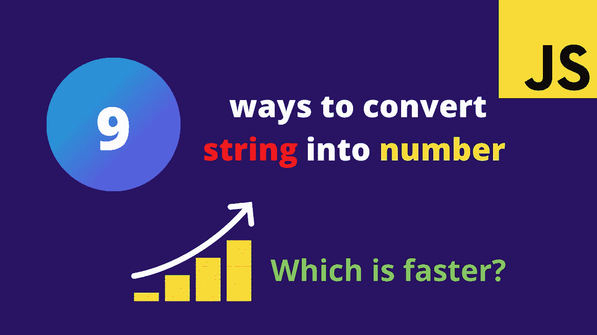
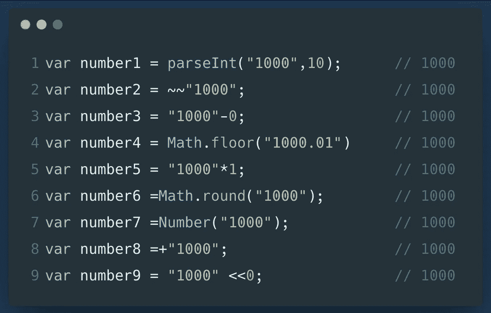
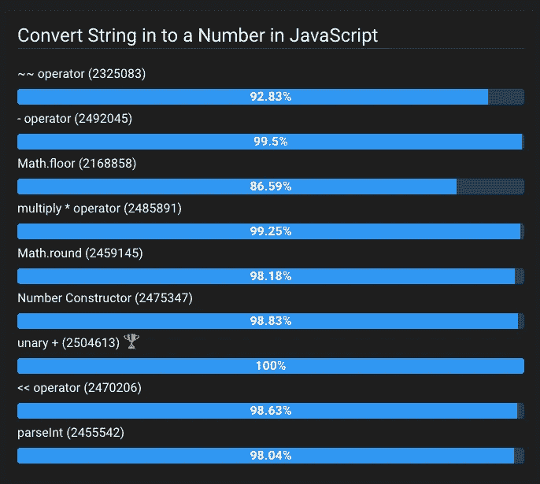

# 在 JavaScript 中将字符串转换成数字的 9 种方法

> 原文：<https://javascript.plainenglish.io/9-ways-to-convert-strings-into-numbers-in-javascript-111d0431edb5?source=collection_archive---------5----------------------->

管理数据是编程的基本概念之一。将数字转换成字符串是一种常见而简单的操作。在 JavaScript 中，您可以将一个数字表示为一个实际的数字(例如`1000`)，或者作为字符串(例如。`'1000'`)。

在任何应用程序中，我们都需要将字符串转换成数字，这是一个常见的用例。在本文中，我将向您展示在 JavaScript 中将字符串转换成数字的 9 种不同方法。

操纵数据有许多有效的方法。由程序员决定他们更喜欢哪一个，选择性能而不是可读性或者二者之间的平衡。

Convert String into Integer in JavaScript

在这里，我们可以检查每一个的性能

 [## JSBEN。CH JavaScript 性能基准测试平台

### 在线 JavaScript 基准测试工具/游乐场。找到最佳性能并加速您的代码！

jsben.ch](https://jsben.ch/77iZe) 

根据操作系统和浏览器类型，结果可能会有所不同。

这些是 JavaScript 中把字符串转换成数值的方法。当谈到**性能**时，你可以使用任何一个`'*'`乘法运算符或`'-' or '+'`一元运算符。

在这里找到[源代码](https://github.com/jayanthbabu123/9-ways-Converting-string-into-number-in-JavaScript/blob/main/numbers.js)

感谢您阅读文章:)