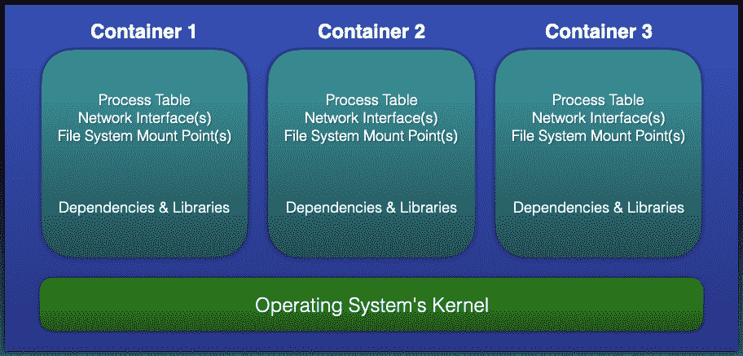
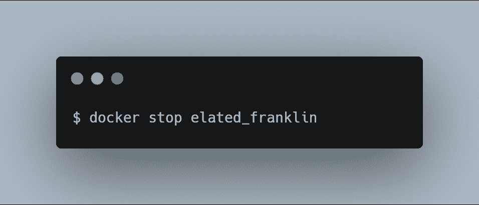
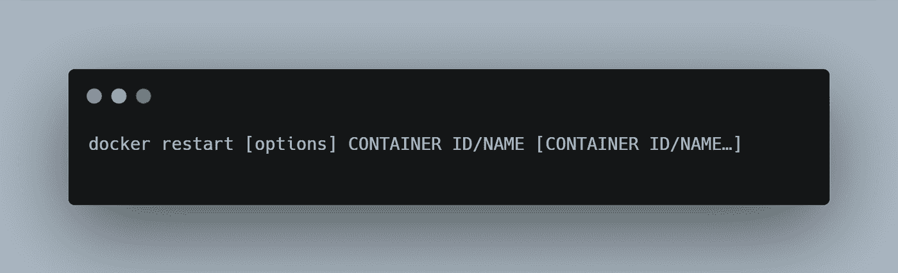
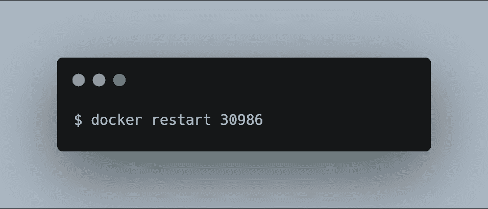

# 码头工人 12 分钟入门指南

> 原文：<https://javascript.plainenglish.io/a-12-minute-beginners-guide-to-docker-480b5adc44a1?source=collection_archive---------11----------------------->

12 分钟学会 Docker。

无论你是计划在 DevOps 领域开始职业生涯还是已经开始，如果你的简历中没有 Docker，那么你肯定是时候考虑一下了，因为 Docker 对于任何进入 DevOps 领域的人来说都是一项关键技能。

> 在我们深入研究并开始探索 Docker 之前，让我们先来看看我们将在这本初学者指南中涉及的主题。

*   Docker 是什么？
*   Docker 解决的问题
*   使用 Docker 的优缺点
*   Docker 的核心组件
*   码头术语
*   什么是 Docker Hub？
*   Docker 版本
*   安装 Docker
*   一些基本的 Docker 命令让你开始
*   总结

## **什么是 Docker？**

Docker 是一个软件平台，它简化了**构建、运行、管理、**和**分发应用程序的过程。**它通过对安装和运行它的计算机的操作系统进行虚拟化来实现这一点。

*   Docker 的第一版于 2013 年发布& Docker 是使用 **Go** 编程语言开发的。
*   Docker 已经被一些世界领先的组织和大学广泛接受，如 **Visa、PayPal、康奈尔大学、**和**印第安纳大学**使用 Docker 运行和管理他们的应用。

## **问题**

假设您计划在一台服务器上托管三个不同的基于 **Python 的**应用程序(可以是*物理的*或*虚拟的*)。这些应用程序中的每一个都使用不同版本的 Python，以及相关的库和依赖项，它们因应用程序而异。

*   由于我们不能在同一台机器上安装不同版本的 Python，这使得我们无法在同一台机器上托管所有三个应用程序。

## **解决方案**

让我们看看如何在不使用 Docker 的情况下解决这个问题。在这种情况下，我们可以通过拥有三台物理机或一台强大到足以在其上托管和运行三台虚拟机的强大物理机来解决这个问题。

*   这两个选项都允许我们在每台机器上安装不同版本的 **Python** ，以及它们相关的依赖项。无论我们选择哪种解决方案，购买和维护硬件的相关成本都非常高。

在这种情况下，Docker 可能是解决这个问题的一个有效且经济的方法。为了理解这一点，我们需要看看 Docker 是如何工作的。

## 码头主持人

安装并运行 Docker 的机器简单来说一般称为 **Docker 主机**或**主机**。

因此，每当您计划在主机上部署应用程序时，都会在主机上创建一个逻辑实体来托管该应用程序。在 Docker 术语中，我们称这个逻辑实体为**容器**或 **Docker 容器**。

Docker 容器上没有安装和运行任何操作系统。但是它将拥有进程表、网络接口和文件系统挂载点的虚拟副本。

*   这些是从托管和运行容器的主机的操作系统继承的。
*   主机操作系统的内核在其上运行的所有容器之间共享。

> 这允许每个容器与同一主机上的其他容器隔离开来。因此，它支持具有不同应用程序需求和依赖性的多个容器在同一主机上运行，只要它们具有相同的操作系统需求。

*   简而言之， **Docker** 将虚拟化安装和运行它的主机的操作系统，而不是虚拟化硬件组件。

## **使用 Docker 的优势**

*使用 Docker 的一些主要好处如下:*

*   Docker 支持具有不同应用程序需求和依赖性的多个应用程序。只要它们具有相同的操作系统要求，它们就可以一起托管在同一台主机上。
*   大量的应用程序可以被托管在同一个主机上，因为容器通常只有几兆字节大小，并且只占用很少的磁盘空间。
*   容器上没有安装操作系统。因此，与虚拟机*(安装并运行完整的操作系统)*相比，它消耗的内存非常少。这还将启动时间缩短到了几秒钟，而启动虚拟机需要几分钟。
*   Docker 对运行它所需的硬件要求不高。

## **使用 Docker 的缺点**

具有不同操作系统要求的应用程序不能一起托管在同一个 Docker 主机上。

***例如:***

*   比方说，我们有 4 个不同的应用程序，其中 3 个需要基于 Linux 的操作系统，另一个需要基于 Windows 的**操作系统。**
*   在这种情况下，需要基于 Linux 操作系统的三个应用程序可以托管在单个 Docker 主机上，而需要基于 Windows 操作系统的应用程序必须托管在不同的 Docker 主机上。

## **Docker 的核心部件**

**Docker 引擎**是 Docker 的核心组件之一。它负责 Docker 平台的整体功能。它是一个基于**客户端-服务器**的应用程序，由三个主要组件组成:

1.  **服务器:**服务器运行一个名为 docker ( **docker Daemon** )的守护进程，它只是一个负责在 Docker 平台上创建和管理 Docker **镜像、容器、网络、**和**卷**的进程。此外，它还负责在 Docker 平台上创建和管理 Docker 映像、容器、网络和卷。
2.  **REST API:**REST API 指定了应用程序如何与服务器交互，并指示它完成工作。
3.  **客户端:**客户端只是一个 ***命令行*** 界面，允许用户使用命令与 Docker 进行交互。

## **码头工人术语**

**Docker 图片**和 **Docker 容器**是你每天在使用 Docker 时都会遇到的两个基本东西。

*   Docker 映像是一个包含应用程序的模板，以及在 Docker 上运行该应用程序所需的所有依赖项。
*   Docker 容器是一个逻辑实体，运行 Docker 镜像的一个实例。

## **什么是 Docker Hub？**

Docker Hub 是官方的在线资料库，在这里您可以找到我们可用的所有 Docker 图片。Docker Hub 还允许我们存储和分发自定义图像。我们也可以根据自己的要求将它们设为公有或私有(*与我们在****Git****和****Github****)*)。

> ***注意:*** *免费用户只能保留一个 Docker 镜像私有。如果你想保持多个 Docker 图像的私密性，你必须订阅付费订阅计划。*

## **Docker 版本**

Docker 有两个不同的版本，如下所示:

*   **社区版(CE):** 适合个人开发者和小团队。与企业版相比，它提供的功能有限。
*   企业版:另一方面，企业版适合大型团队和在生产环境中使用 Docker。企业版进一步分为三个不同的版本，如下所示:

1.  基础版
2.  标准版
3.  高级版

## **安装对接器**

以下是 Docker CE 官方安装指南的链接。您可以按照以下指南在您的机器上安装 Docker:

*   [**CentOS Linux**](https://docs.docker.com/install/linux/docker-ce/centos/)
*   [Debian Linux](https://docs.docker.com/install/linux/docker-ce/debian/)
*   [**Fedora Linux**](https://docs.docker.com/install/linux/docker-ce/fedora/)
*   [Ubuntu Linux](https://docs.docker.com/install/linux/docker-ce/ubuntu/)
*   [**微软视窗**](https://docs.docker.com/docker-for-windows/install/)
*   [**macOS**](https://docs.docker.com/docker-for-mac/install/)

## **Docker 命令**

## 1.docker 创建

我们将看到的第一个命令是 **docker create** 命令。

*   这个命令允许我们创建一个新的容器。

> ***注意:*** *方括号内的东西都是可选的。这适用于您将在本指南中看到的所有命令。*

使用此命令的一些示例如下所示:

*   在上面的例子中，docker 使用最新的 Fedora 图像创建一个新的容器。
*   在创建容器之前，它会检查 Docker 主机上是否有 Fedora 的最新官方图像。如果 Docker 主机上没有最新的映像，它会在创建容器之前从 Docker Hub 下载 Fedora 映像。如果 Docker 主机上已经存在 Fedora 映像，它将利用该映像并创建容器。
*   如果容器创建成功，Docker 将返回容器 ID(类似于 02576 e 880 a2 ccbb 4 ce 5c 51032 ea 3 B3 bb 8316 e5b 626861 fc 87d 28627 c 810 af 03)。
*   每个容器都有一个唯一的容器 ID。我们使用容器 ID 来引用容器，以便在容器上执行各种操作，比如启动、停止、重新启动等等。

让我们参考的另一个例子 **docker create** 命令，它有传递给它的选项和命令。

在上面的例子中， ***docker create*** 命令使用 **Ubuntu** 镜像创建一个容器(如前所述，如果镜像在 docker 主机上不可用，它将在创建容器之前从 Docker Hub 下载最新的镜像)。

*   选项-t 和-i 指示 Docker 为容器分配一个终端，以便用户可以与容器进行交互。它还指示 Docker 在容器启动时执行 bash 命令。

## 2.docker ps

docker ps 命令允许我们查看 docker 主机上运行的所有容器。

> 它只显示当前在 Docker 主机上运行的容器。

如果您想查看在这个 Docker 主机上创建的所有容器，而不管它们的当前状态，比如它们是正在运行还是已经退出，那么您需要包含选项 **-a** ，它将依次显示在这个 Docker 主机上创建的所有容器。

> *在我们进一步进行之前，让我们试着解码并理解****docker PS****命令的输出。*

*   **集装箱 ID:** 由字母数字字符组成的唯一字符串，与每个集装箱相关联。
*   **IMAGE:** 用于创建这个容器的 Docker 图像的名称。
*   **命令:**启动容器时需要执行的任何特定于应用程序的命令。
*   **CREATED:** 这显示了自该容器创建以来所经过的时间。
*   **状态:**显示容器的当前状态，以及经过的时间。

如果容器正在运行，它将随着经过的时间段显示为 Up(例如，Up 约一小时或 Up 3 分钟)。

如果容器被停止，则它将显示为 Exited，后跟圆括号内的退出状态代码，以及经过的时间段(例如，**3 周前退出(0)**或**15 秒前退出(137)，**其中 0 和 137 是退出代码)。

*   **端口:**显示为容器定义的任何端口映射。
*   **名称:**除了**容器 ID 外，**每个容器还被赋予一个唯一的名称。我们可以使用容器 ID 或唯一名称来引用容器。Docker 自动为它创建的每个容器分配一个唯一的傻名字。但是，如果您想为容器指定自己的名称，可以通过在 docker create 或 docker run(稍后我们将查看 docker run 命令)命令中包含--name(双连字符名称)选项来实现。

> *我希望这能让你更好地理解 docker ps 命令的输出。*

## 3.码头开始

该命令启动任何停止的容器

*   我们可以通过指定容器 ID 的前几个唯一字符或指定其名称来启动容器。

使用此命令的一些示例如下所示:

*   在上面的例子中，Docker 从容器 **ID 30986 开始启动容器。**

而在这个例子中，Docker 启动了名为**elastic _ Franklin 的容器。**

## 4.码头停车

列表中的下一个命令是 **docker stop** 命令，它停止任何正在运行的容器。

类似于 docker start 命令，我们可以通过指定容器 ID 的前几个唯一字符或指定其名称来停止容器。

使用此命令的一些示例如下所示:

*   在上面的例子中，Docker 将从容器 **ID 30986 开始停止容器。**

*   然而在这个例子中，Docker 将停止名为**elastic _ Franklin 的容器。**

## 5.docker 重启

我们要看的下一个命令是 **docker restart** 命令，该命令重新启动任何正在运行的容器。

*   我们可以通过指定容器 ID 的前几个唯一字符或指定其名称来重新启动容器。

使用此命令的一些示例如下所示:

*   在上面的例子中，Docker 将从容器 ID 30986 开始重新启动容器。

*   而在本例中，Docker 将重启名为**elastic _ Franklin 的容器。**

## 码头运行

我们将看到的下一个命令是 **docker run** 命令。该命令首先创建容器，然后启动容器。简而言之，这个命令是 docker **create** 和 docker **start** 命令的组合。

使用此命令的一些示例如下所示:

*   在上面的例子中，Docker 将使用最新的 Ubuntu 映像创建容器，然后立即启动容器。
*   如果我们执行上面的命令，它将启动容器并立即停止它——我们根本没有机会与容器交互。

如果我们想要与容器交互，那么我们需要指定选项:-它(连字符后跟 I 和 t)向 docker run 命令提供终端，使用它我们可以通过键入不适当的命令来与容器交互。

***例如:***

> 注意，为了从容器中出来，您需要在终端中键入 exit。

## 6.码头工人室

如果我们想要删除一个容器，我们使用 **docker rm** 命令。

使用此命令的一些示例如下所示:

*   在上面的例子中，我们指示 Docker 在一个命令中删除两个容器。要删除的第一个容器使用其容器 ID 来指定，要删除的第二个容器使用其名称来指定。

> ***注意:*** *集装箱需要处于停止状态才能被删除。*

## 7.docker 图像

**docker images** 是列表中的下一个命令，它列出了您的 docker 主机上存在的所有 Docker 映像。

## 8.码头工人 rmi

列表中的下一个命令是 **docker rmi** 命令，它允许我们从 docker 主机中删除一个映像。

使用此命令的一些示例如下所示:

*   上面的命令从 Docker 主机中删除名为 ***mysql*** 的映像。

*   上述命令从 Docker 主机中删除名为 ***httpd*** 和 ***fedora*** 的图像。

*   上述命令从 Docker 主机中删除以图像 ***ID 94e81*** 开始的图像。

*   上面的命令从 Docker 主机中删除名为 ubuntu、标签为 ***trusty*** 的图像。

**总结**

集装箱化最近受到了应有的重视，尽管它已经存在了很长时间。一些主要的技术公司，如**谷歌、亚马逊网络服务(AWS)、英特尔、特斯拉、**和**瞻博网络**都有自己的定制版本的容器引擎。他们非常依赖它们来构建、运行、管理和分发他们的应用程序。

Docker 是一个非常强大的容器化引擎，在构建、运行、管理和分发应用程序时，它可以提供很多功能。

 [## Docker 是如何工作的，为什么开发者需要它

### Docker 入门

javascript.plainenglish.io](/how-docker-works-why-developers-need-it-81b1eebaab5e)  [## 你不知道 CSS 能做的 4 件事

### 鲜为人知的 CSS 特性及示例

javascript.plainenglish.io](/4-things-you-didnt-know-css-can-do-13b364296570)  [## Web 开发人员的 9 个专业 CSS 技巧

### 你需要知道的 CSS 技巧

javascript.plainenglish.io](/9-pro-css-tips-for-web-developers-508b8302ff6f) 

*更多内容请看*[*plain English . io*](http://plainenglish.io/)