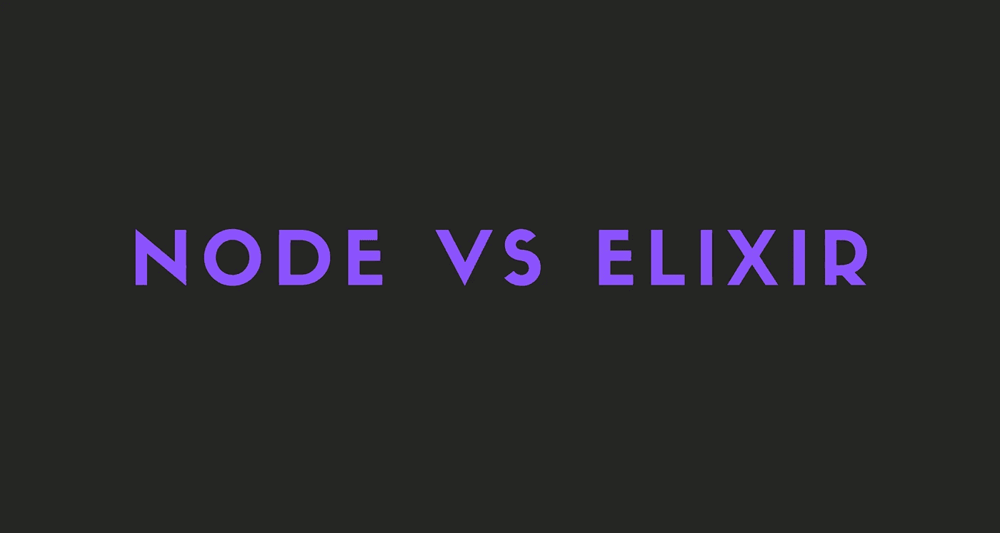
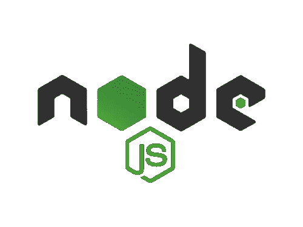

# Node.js 与 Elixir: 2021 对比

> 原文：<https://javascript.plainenglish.io/a-2021-comparison-of-node-js-and-elixir-8744574033a7?source=collection_archive---------0----------------------->

## 哪种语言是构建高性能和可伸缩后端的最佳选择？

在这个故事中，我们将讨论构建高性能和可伸缩后端的最佳语言，并将 Node.js 与 Elixir 进行比较。

我也写过一个类似的关于最好的前端 JavaScript 框架的故事。你可以通过访问下面的链接来阅读。

 [## 2021 年最佳前端 JavaScript 框架对比

### 哪个 JavaScript 框架最适合你？

javascript.plainenglish.io](/best-frontend-javascript-framework-96ecef9791fa) 

开始吧！

# 开始之前

在我们开始之前，我只想让你知道，对于任何事情，都没有最好的语言。

每种语言和框架都有自己的优点和缺点，对于您想要实现的目标来说，它们是好是坏。

所以，如果你试图选择一种语言或框架，不要选择最流行或最简单的。相反，选择最适合这份工作的。

# 节点. js

我们都知道 Node.js，我们都知道它是构建后端的好语言。Node.js 最好的一点是，你不用为它学习一门新的语言。只是 JavaScript 而已。

# Node.js 的优点

## 非阻塞代码

这是选择 Node.js 作为后端语言的最有力的理由。Node.js 完全是事件驱动的，大部分代码基于回调运行。

这种方法有助于应用程序不暂停或休眠，而是可供其他请求使用。

## **V8 发动机**

Node.js 实现中使用的引擎最初是为 Chrome 浏览器开发的。Chrome 的 V8 是用 C++编写的，用来把用 JavaScript 编写的函数编译成机器代码，而且速度惊人。

由于谷歌对其引擎进行了大量投资，V8 每年都有性能提升，Node.js 从中获益匪浅。

## 丰富的生态系统

现在 npm 注册表中有超过一百万个可用的库，并且每周有超过 10，000 个新库发布，Node.js 生态系统非常丰富。

## 简单易学

Node.js 并不是什么新东西。只是 JavaScript 而已。所以 JavaScript 开发人员不需要花费太多精力去学习它。

# Node.js 的缺点

## 表演

别误会，Node.js 很快。但它不是最快的。如果您希望能够处理成千上万的并发用户，Node.js 并不是最好的语言。Node.js 只是为繁重的计算任务而生。

## 回调地狱

由于其异步特性，Node.js 严重依赖回调，这些函数在队列中的每个任务完成后运行。将许多排队的任务放在后台，每个任务都有回调，这可能会导致所谓的回调地狱，直接影响代码的质量。

# 何时使用 Node.js

*   你不想学习一门新的语言
*   你有一个 JavaScript 开发团队
*   你希望能够使用 JavaScript 库

# 长生不老药

我最喜欢的语言。Elixir 是一种函数式编程语言，使用类似于 Ruby 的语法，运行在 Erlang VM (BEAM)上。

我还写了一个关于长生不老药是什么的故事。你可以通过访问下面的链接来阅读。

 [## 什么是仙丹？

### 什么是仙丹，为什么它很牛逼？

medium.com](https://medium.com/geekculture/what-is-elixir-3f6a96d8f642) 

# 长生不老药的优点

## Erlang VM(波束)

Elixir 可以访问 Erlang 可以访问的所有并发工具，这使它成为构建可伸缩的分布式系统的最强大的现代语言之一。

## 类似 Ruby 的语法

如果你已经用 Ruby 编程了，那么 Elixir 的语法会感觉很熟悉。Ruby 是最简洁和面向生产力的语言之一，但是它在性能和并发性方面有所欠缺。Erlang VM 解决了这两个问题，因此，Elixir 是两全其美的产品。

## 并发

当创建一个将被全球数百万人使用的应用程序时，同时运行多个进程的能力至关重要。必须实时地同时处理来自多个用户的多个请求，而不会对应用程序产生任何负面影响或降低其速度。

## 功能的

虽然 Elixir 和 Erlang 可以说是自成一组(它们都是面向过程的)，但是 Elixir 也具有现代 FP 语言的所有结构。特别是，不可变的数据结构对并发性帮助很大，模式匹配对于编写声明性代码非常有用。

## 动态类型化

与 Haskell 和 Scala 等其他函数式语言相比，Elixir 具有动态类型。这意味着类型是在运行时检查的，而不是在编译期间。虽然在构建关键系统时这可能是一个缺点，但它也提高了简单 web 应用程序的开发速度。静态类型可以通过类型规范引入到 Elixir 中。

# 长生不老药的缺点

## 流行

长生不老药很受欢迎。越来越多的开发者开始采用它，这很好。

但问题是，尽管 Elixir 的社区非常有用而且很大，但它没有 JavaScript 社区大。

这意味着您不会像在 JavaScript 中那样找到很多关于某个主题的教程。

# 何时使用仙丹

*   你喜欢函数式编程语言
*   你想要一个快速稳定的后端
*   您喜欢使用 Elixir 和 OTP 构建分布式和可伸缩的系统

# 获胜者

我是怎么说的，没有明确的赢家。但是，您可以遵循一个简单的逻辑来决定下一个项目的语言。

如果你想更容易地获得帮助并经常使用教程，请使用 Node.js。但是如果你想要一个快速稳定的后端，请使用 Elixir。

我个人认为你应该尝试两种语言，然后决定。不要因为别人说一门语言好或者不好就去选择这门语言。

# 最后的想法

我个人更喜欢 Elixir 而不是 Node.js，但是当然，最好使用最好的工具。

希望这个故事对你有帮助。我很想知道你决定使用或学习哪种语言！

# 仅此而已。感谢您阅读这个故事！

如果你喜欢这个故事，一定要为它鼓掌！你想问我什么都可以。

在 Twitter 上关注我:

 [## re _ ally 边缘

twitter.com](https://twitter.com/Re_allyedge) 

在 Patreon 上支持我:

 [## 阿里木阿尔斯兰卡亚是创造编程故事和教程。帕特里翁

### 今天就成为阿里木阿尔斯兰卡亚的赞助人:在世界上最大的…

www.patreon.com](https://www.patreon.com/allyedge) 

*更多内容看*[***plain English . io***](http://plainenglish.io)