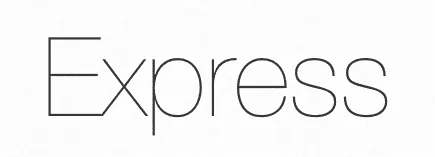

# 2021 年最佳 Node.js 框架对比

> 原文：<https://javascript.plainenglish.io/a-2021-comparison-of-the-best-node-js-frameworks-6a4ae2c4fa30?source=collection_archive---------1----------------------->

哪个 Node.js 框架最适合你？

在这个故事中，我们将回顾 Express、NestJS 和 AdonisJS。这三者都有好的一面和坏的一面，正确使用的话会非常有用。

我还将列出每个框架的所有优点、缺点和重要特性，以便您可以更容易地决定想要学习或使用哪个 Node.js 框架。

## 注意

这个故事是我的“2021 年最佳前端 JavaScript 框架比较”故事的 Node.js 版本。如果您想了解更多关于最好的前端 JavaScript 框架的知识，请务必阅读这篇文章！

 [## 2021 年最佳前端 JavaScript 框架对比

### 哪个 JavaScript 框架最适合你？

javascript.plainenglish.io](/best-frontend-javascript-framework-96ecef9791fa) 

开始吧！

# 表达

Node.js 的快速、非个人化、极简的 web 框架

Express 就是这样，真的。Express 就像 Node.js 生态系统的 React。您有一个非常简单的基础框架，您可以简单地在其上添加新的库，或者使用构建在 Express 上的其他框架。

## 灵活性

Express 非常简单，可以按照您想要的任何方式进行配置。它非常灵活，你甚至可以在它上面构建一个框架！

所以如果你是来自己编写所有特性代码的，那么 Express 就是为你准备的。

## 表演

大多数开发人员喜欢 Node.js 的原始速度，当涉及到框架选择时，完美主义者可能会鄙视任何性能风险。

Express 在 Node.js 之上提供了一个具有 web 应用程序功能的薄层，如基本路由、中间件、模板引擎和静态文件服务，因此 Node.js 的 I/O 性能不会受到影响。

即使人们更喜欢 Fastify.js 而不是 Express，因为它更快，我仍然认为 Express 更好。主要是因为它更受欢迎和稳定，至少现在是这样。

# 何时使用 Express

*   你想要一个快速简单的发展
*   你想控制一切
*   你想使用一个稳定和流行的框架

# NestJS

一个渐进式 Node.js 框架，用于构建高效、可靠和可伸缩的服务器端应用程序。

你编码过 Angular 吗？如果是的话，你应该知道它有多有条理和严密。嗯，NestJS 字面意思就是 Node.js 生态系统的 Angular！

## 角状发育

在 NestJS 中，你有模块、组件、管道、服务等等。就像棱角分明！一切都井井有条，易于控制。

对于构建大规模应用程序，NestJS 简直令人惊叹。

## 流行的

NestJS 非常受欢迎，并且拥有令人惊叹的文档。你可以在文档中找到你需要的任何东西，并且很容易得到帮助。

当然，NestJS 一直在积极维护和改进。也就是说，如果你想使用一个长期存在的框架，NestJS 可能是一个不错的选择。

你甚至有一个类似 Angular 的 CLI，让你更快更容易地管理你的代码库。

我是说，这多棒啊！

## 以打字打的文件

尽管您也可以在 Express 中使用 TypeScript，但是 NestJS 正是为此而生的。如果您是 TypeScript 爱好者，NestJS 将让您访问所有的 TypeScript 特性。

# 何时使用 NestJS

*   你想用打字稿
*   比起灵活性，你更喜欢稳定性
*   您正在构建大规模的应用程序，您需要 MVC

# AdonisJS

Node.js 的全功能 web 框架

阿多尼斯和内斯特吉斯很像。它是有组织的，受欢迎的，使用 TypeScript。唯一不同的是，阿多尼斯不像棱角分明。

## 拥挤的框架核心

> AdonisJS 不是一个极简框架。为了让您的项目有一个良好的开端，我们在框架的核心中打包了许多基线特性。

这是阿多尼斯开发者说的，他们是正确的。AdonisJS 不是 Express 那样的极简框架。它为您提供了大量的样板代码，通常会为您完成大部分工作。

## 特征

AdonisJS 有很多特色。最棒的是，你不需要任何外部包来做任何事情！你只需要安装所需的模块，Adonis 会为你做剩下的事情！

我没开玩笑。几分钟就可以添加社交认证！

## 流行的

就像 NestJS 一样，AdonisJS 也很受欢迎，被积极维护。所以它也会在周围停留很长一段时间。

# 何时使用 AdonisJS

*   您希望使用 TypeScript 并进行简单快速的开发
*   比起灵活性，你更喜欢稳定性
*   你不想一个人做所有事情

# 最后的想法

与 Express 相比，我个人更喜欢 NestJS 和 Adonis，但是当然，最好使用最好的工具。

希望这个故事对你有帮助。我很想听听你决定使用或学习什么框架！

## 仅此而已。感谢您阅读这个故事！

如果你喜欢这个故事，一定要让我们在评论中知道，并随时问我你想问的任何问题。

在 Twitter 上关注我:

 [## re _ ally 边缘

twitter.com](https://twitter.com/Re_allyedge) 

在 Patreon 上支持我:

 [## 阿里木阿尔斯兰卡亚是创造编程故事和教程。帕特里翁

### 今天就成为阿里木阿尔斯兰卡亚的赞助人:在世界上最大的…

www.patreon.com](https://www.patreon.com/allyedge) 

*更多内容看*[***plain English . io***](http://plainenglish.io/)