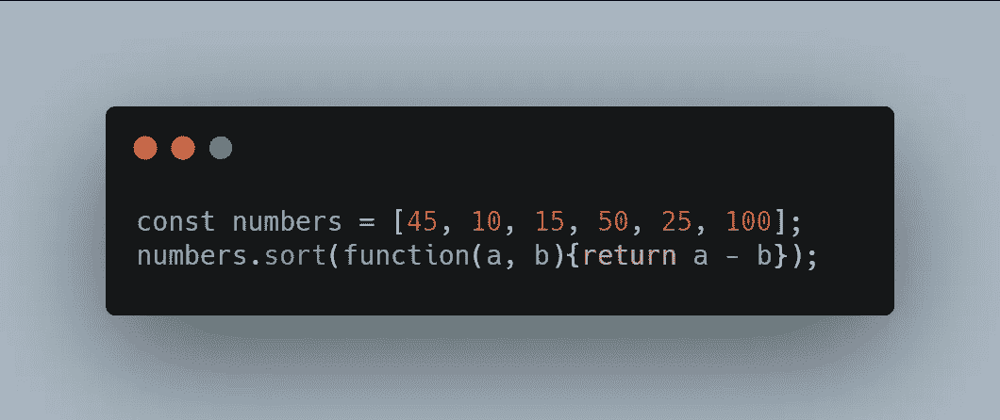

# 24 种 JavaScript 数组方法的 6 分钟指南

> 原文：<https://javascript.plainenglish.io/a-6-minute-guide-to-24-javascript-array-methods-52bf5f0e209c?source=collection_archive---------16----------------------->

24 个 JavaScript 数组方法及示例。

## 1.**创建数组**

在 Javascript 中创建数组有多种方法，最简单的一种是简单地将数组值赋给一个变量。

*   创建数组的另一种方法是创建一个**空数组**，然后给它赋值。

*   注意，您也可以使用数组构造函数来创建数组。

***例如:***

## **2。访问数组元素**

您可以使用索引值访问数组元素。当创建长度为 **N** 的数组时，值存储在从索引 **(0)** 到 **(N-1)的数组中。**

*   在上面给出的数组中***等级【0】****返回***‘A’，*** 还要注意的是，索引值应该始终用方括号给出。*
*   *您可以使用 *for* 循环或任何其他循环来循环访问数组元素。*

## ***3。访问完整的数组***

*通过引用*数组名*可以访问整个数组。*

****例如:****

**

## ***4。在数组**中添加元素*

*   *元素可以添加在*、在 ***结束*** 或者在开始和结束之间的某个地方。**
*   **要在开始时添加元素，可以使用***【un shift()***方法，要在结束时添加元素，可以使用***【push()****方法。***

> ***还可以使用 *splice()* 方法向数组中添加元素。***

## *****5。从数组**中移除一个元素***

*   ***从数组中移除元素最简单的方法是使用 ***pop()*** 方法，该方法返回数组的最后一个元素并改变原始数组。***
*   **另一种从数组中移除元素的方法是使用 ***shift()*** 方法，该方法与 ***pop()*** 方法类似，但是从数组的开头移除并返回元素。**

## ****6。改变数组中的元素****

**更改数组中特定位置的元素很简单，只需为该特定索引分配一个新值即可。**

****

*   **该方法改变了原始数组，新数组的第 ***零索引*** 将具有与原始数组不同的值。**

## ****7。检查数组**中值的存在**

*   **要检查数组中是否存在某个元素，我们可以使用***array . isarray(value)***方法&如果数组中存在该值，则返回 ***true*** *。***

*****例如:*****

****

## ****8。从数组中删除一个元素****

*   **使用 Javascript 操作符 ***delete*** *可以轻松删除数组元素；***

****

*   **但是 delete 方法有一个问题，因为它在数组中留下了**未定义的**漏洞，所以我们应该使用 ***pop()*** 或 **shift** 来代替 delete。**

## ****9。合并数组****

*   **使用 ***concat()*** 方法可以将两个不同的数组连接成一个数组。**

****

*   **该方法不改变原始数组，并且**返回**一个新数组。**

## ****10。数组切片****

*****slice()*** 方法将数组的一部分切割成一个新数组。此方法创建一个新数组，而不改变原始数组。**

*   **该方法最多可接受两个参数，其中第一个参数对应于开始，第二个参数对应于切片的最后一个**索引**。**

## ****11。将数组转换为字符串****

**使用 **toString *()*** 方法可以很容易地将数组转换成逗号分隔的字符串。**

****

## ****12。对数组排序****

**要按字母顺序对数组进行排序，可以使用 **sort *()*** 方法。**

****

## ****13。反转数组****

**Javascript 提供了一个**反转 *()*** 方法来反转一个数组。**

*****例如:*****

****

## ****14。数字排序****

**在 Javascript 中， ***sort()*** 方法用于按字母顺序对字符串数组进行排序。**

*   **但是如果使用数值数组，这个方法将给出不正确的结果。由于这个原因，我们使用 compare 函数和***sort()****对包含数值的数组进行排序。***

******例如:******

****

## ****15。寻找数组中最大的数字****

**你可以使用***math . max . apply***找到一个数组中最大的数。**

*****例如:*****

****

## ****16。寻找数组的最小个数****

**你可以使用 ***Math.min.apply*** 找到一个数组中的最小数。**

*****例如:*****

****

## ****17。 *join() M* 方法****

**此方法通过逗号分隔符连接数组的所有元素，并返回一个字符串。逗号是默认分隔符，但您可以为该方法选择不同的分隔符。**

> **对空数组应用此方法将返回空字符串。**

## **18 **。 *fill()* 数组方法****

**此方法通过用静态值填充数组来更改原始数组。您可以将所有元素更改为静态元素或少数选定元素。**

*****例如:*****

****

## **19。 *indexof()* 阵列法**

**当您知道一个元素并想获得该元素在数组中的索引时，这种方法被证明是很方便的。此方法返回函数中传递的元素的索引。**

*   **它返回第一次出现的索引，如果元素不在数组中，它返回 **-1** 。**

*****例如:*****

****

## **20。 *Array.forEach() M* 方法**

**该方法为数组中的每个元素调用一次**函数(回调)**。**

*****例如:*****

**该函数有 3 个输入:**项目值、项目索引、数组****

****

## ****21。 *Array.map()* 方法****

**这个函数通过对数组的每个元素应用一个函数来创建一个新的数组。**

*****例如:*****

> **此方法不会更改原始数组。**

****

> **在上面的例子中，每个数组元素都乘以 **10****

## ****22** 。 ***Array.filter()* 方法****

**此方法使用通过给定测试的数组元素创建一个新数组。**

****

> **上面的例子创建了一个项目少于 **15** 的新数组**

## ****23。 *reduce()* 方法****

**这个方法在每个数组元素上运行一个函数，在不改变原始数组的情况下减少到一个值。**

*****例如:*****

****

> **上面的例子返回一个数组中所有元素的和。**

## ****24。*****方法*****

***这个方法检查是否所有的数组元素都通过了测试。***

******

> ***上面的例子检查数组的所有元素是否都大于 10。***

*** [## 你不知道 CSS 能做的 4 件事

### 鲜为人知的 CSS 特性及示例

javascript.plainenglish.io](/4-things-you-didnt-know-css-can-do-13b364296570)  [## 6 个 HTML 标签用于改进网络搜索引擎优化

### 改善网络搜索引擎优化的鲜为人知的 HTML 标签

javascript.plainenglish.io](/use-these-8-html-tags-for-improved-web-seo-ca9763c951b4)  [## 初学者的 10 个 CSS 最佳实践

### CSS 初学者的最佳实践

javascript.plainenglish.io](/10-css-best-practices-for-beginners-81ac8b471187) 

*多内容于* [***浅显易懂***](http://plainenglish.io/)***