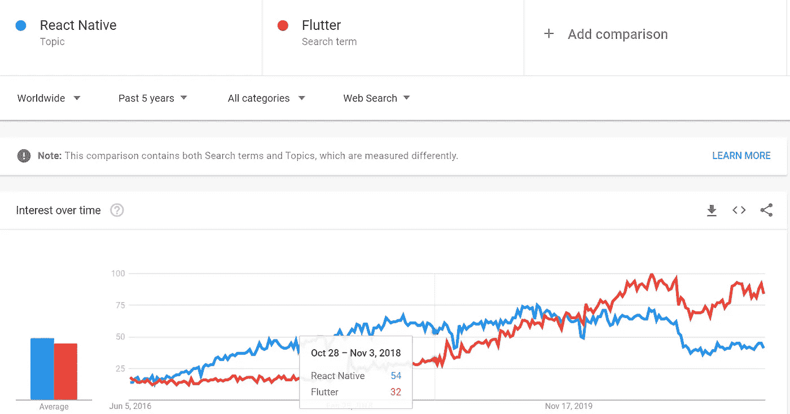

# 一个初学者友好的指南，从头开始创建一个在线课程网站或电子商务网站

> 原文：<https://javascript.plainenglish.io/a-beginner-friendly-guide-to-create-an-online-course-website-or-e-commerce-website-from-scratch-cb49f4e4ecae?source=collection_archive---------19----------------------->

## 帮助你开始创业


Photo by [Tran Mau Tri Tam](https://unsplash.com/@tranmautritam?utm_source=medium&utm_medium=referral) on [Unsplash](https://unsplash.com?utm_source=medium&utm_medium=referral)

我们都知道这是在线业务的趋势，因此对网站和应用程序的需求正在上升。甚至谷歌和脸书也在竞争。

谷歌知道这件事，所以他们推出了 Flutter。Flutter 基本上是一个用于创建应用程序的 UI 工具包。

甚至脸书也知道它，所以他们也在 2015 年在 Flutter 之前推出了 React Native。



Source: Google Trends

根据 Google trends 的说法，开发者正在使用 React Native 和 Flutter 来满足他们的需求。

甚至我们在日常生活中也使用网站/应用程序。

Udemy、Amazon、Medium、YouTube 是我们日常生活中使用的最好的网站/应用程序的一些例子。

最后，根据 T2 网站的统计，每天有超过 547，200 个新网站上线。这确实是一个巨大的数字。

因此，无论你是一个创业者、企业家、初创公司，甚至是一个初学者，你都必须至少尝试一下。

现在让我们跳过我们在这里讨论的问题。

1.  在这里，我会帮你理清创建在线课程网站或电子商务网站所需的每一个细节。

2.我将从基础开始，然后在不使你不知所措的情况下进入高级水平。需要的话也可以休息一下。

3.是的，我们将讨论创建网站，我也不会给你提供任何代码。对于这些，你可以访问 GitHub 或 YouTube。

对于其他任何疑问，都可以在这里评论，我一定会帮助你的。

实际上，电子商务和在线网站大多具有相同的结构和相似的概念。因此，我们将处理一般，然后你可以应用到你的具体网站的概念。

简单说一下吧。

我在一家初创公司工作，我必须与 3 名开发人员和一名设计师一起创建一个在线课程平台。

最初，设计师在 Adobe XD 中根据客户的需求创建网站的设计。Adobe XD 会让你花钱，所以你也可以用 Figma。

我们得到了客户的认可，然后开始编码。

我们用 Next.js 做前端，用 Strapi 做后端。两者都是免费使用的。

1 名开发人员负责管理 Strapi 中的后端，另外 2 名开发人员负责前端 UI 部分和 api 集成。

我们已经完成了这个任务，然后我想为什么我不帮助我的在线读者为他们创建一个呢。

# 如何创建一个网站

在这里，我将谈论你的网站所需要的一切。

1.  **有想法也有计划**

如果你没有一个想法，还没有为你的网站做规划，那就先试着去做。你的经历无关紧要，规划帮助你高效工作，甚至节省你的时间。

你甚至可以在 Trello 或 Milanote 等在线软件中进行规划。Trello 可以免费使用。

**2。创建设计**

现在你已经计划好了一切，甚至有了主意。这样你就可以开始设计了。为此，你可以聘请设计师，或者自己创作。

想要了解设计，请访问 [Dribbble](https://dribbble.com/) 。你甚至可以通过[视频](https://www.youtube.com/watch?v=FK4YusHIIj0)来学习。

如果你真的不知道创建哪个页面，看看亚马逊或者 Udemy。

如果您正在创建一个电子商务网站，您可以从后端获取产品，或者如果您希望创建者将他们的课程上传到在线课程网站，则为他们创建一个仪表板。因此，当创建者登录后，他们就可以上传他们的课程。

3.**计划编码**

所以现在你有了设计，然后找到你将使用的前端和后端语言。找到最适合您需求的语言。

你可以使用像 Next.js 这样的 React、Angular 或 Vue even 框架。

我们的应用程序使用了 Next.js。为了设计我们的网站，我们使用了 TailwindCSS。

[](/stop-using-css-and-bootstrap-use-tailwind-css-instead-94c689ec3b8a) [## 停止使用 CSS 和 Bootstrap，改用 Tailwind CSS

### 顺风 CSS 给你更多的灵活性，节省你的时间。

javascript.plainenglish.io](/stop-using-css-and-bootstrap-use-tailwind-css-instead-94c689ec3b8a) 

现在对于后端，可以使用 AWS、Node.js 和 MongoDB、Strapi 或 firebase。

我们使用了 Strapi，因为它像 WordPress 一样可以免费使用。甚至你可以在你的前端轻松集成它。

这完全取决于你，我在这里只是与你分享我们所使用的。我不会比较任何一种语言，因为它们都是最好的。

如果你是自己创建的，试着使用你熟悉的语言。它将帮助你轻松创建你的网站。

**4。基础知识**

不了解基本知识，花费你的时间和金钱是没有用的。因此，在继续下一步之前，一定要先接触 HTML、CSS 和 JavaScript。

如果不知道去哪里学习，下面是顶级 web 开发者推荐的 [80+免费资源。](/80-free-resources-for-web-designers-and-web-developers-in-2021-f400be2875ea)

这是一份完整的指南，指导你如何开始 Web 开发。

让我再帮你一点，当你开始练习时，不要每次都创建 react 应用程序，你可以使用 [CodeSandbox](http://codesandbox.com/) 。

```
npx create-react-app my-app    //Don't use it everytime for practise
```

此外，还有各种各样的技术，如 React、Angular、Vue、Gatsby、Next.js、Hugo、Jekyll 等等。所以不要什么都学，要努力找到自己需要的然后去学。

**5。使用 NPM 或纱线卷装**

每个网站都需要 NPM(节点包管理器)。无论是为了认证/授权、安全目的、添加附加功能，甚至是为了状态管理。

例如:

a) JWT 的授权。

b)出于安全目的的 Dotenv、Bcrypt、Passport。

c) React Table、React Dnd、React Dropzone、React Calendar、React Date Picker 等其他功能或特性。

d)减少或简化状态管理。

想了解更多，可以看下面的指南。

[](/13-free-npm-packages-that-helped-me-to-earn-a-1500-profit-ddab299bdd37) [## 13 个免费 NPM 套餐帮助我赚取了 1500 美元的利润

### 这些肯定会提高你的收入和生产力。

javascript.plainenglish.io](/13-free-npm-packages-that-helped-me-to-earn-a-1500-profit-ddab299bdd37) 

**6。状态管理**

要创建一个电子商务或在线课程网站，你可能需要状态管理。

为此，你可以使用 [React Context](https://reactjs.org/docs/context.html) ，Redux，甚至 Easy Peasy。这是你自己的选择。

上述所有状态管理工具的概念都是相似的。

如果你想阅读的话，这里有一本对初学者友好的简易指南。

[](https://betterprogramming.pub/stop-using-redux-consider-easy-peasy-if-you-want-3214c41bcce5) [## 停止使用 Redux——如果你愿意，请考虑简单

### 较少的样板代码使它成为更好的选择

better 编程. pub](https://betterprogramming.pub/stop-using-redux-consider-easy-peasy-if-you-want-3214c41bcce5) 

您可以自由使用任何状态管理工具。

**7。附加功能或概念**

是的，我知道对一个初学者来说要消化的东西要多得多，所以这将是我讨论前端 Web 开发的最后一点。

假设你的网站上有很多产品，你可以创建一个搜索功能，也可以搜索一些课程。

除此之外，多了解一下 grid 和 flexbox，它会让你从负担中解脱出来。

[](/3-ultimate-functionalities-or-concepts-that-you-can-add-to-your-website-d10c594f8ea4) [## 3 个终极功能或概念，你可以添加到你的网站

### 您将了解搜索功能、三元运算符中的多个条件以及简单易用。

javascript.plainenglish.io](/3-ultimate-functionalities-or-concepts-that-you-can-add-to-your-website-d10c594f8ea4) 

**8。API**

对我来说，在 React 中设计 UI 和编写代码很容易。

但我必须为 API 和所有这些东西奋斗。

要掌握它，你只需访问 YouTube。从这些很酷的视频中学习:

1.  [针对初学者的 API](https://www.youtube.com/watch?v=GZvSYJDk-us)。
2.  [使用 Postman](https://www.youtube.com/watch?v=VywxIQ2ZXw4) 进行 API 测试。

这两门课程价值超过 100 美元，但由于它们的创造者，它们是免费的。无论是初学者还是专家，肯定会对你有很大帮助。

另外，这里有一个使用 Axios 显示 API 数据的简单指南。

[](/display-api-data-using-axios-in-a-react-app-with-hooks-eb9ca298f27) [## 在带有钩子的 React 应用程序中使用 Axios 显示 API 数据

### JavaScript 中 fetch 方法的替代方法

javascript.plainenglish.io](/display-api-data-using-axios-in-a-react-app-with-hooks-eb9ca298f27) 

**9。后端**

我们已经讨论了前端和 API。

现在我们来谈谈后端。

我在上面提到过，有几种前端技术(语言)类似于有各种后端语言。

像 Node.js，MongoDB，Mongoose，Django，Flask，甚至你可以用 Strapi，Contentful，Ghost 等。选择权在你。

我用过 Node.js，MongoDB，Mongoose，Strapi，Ghost，都很好用。

是的，Node.js、MongoDB 和 Mongoose 需要时间，但是很棒。相比之下，Strapi、Ghost 和 Contentful 对博客来说很棒也很简单。

# 给你的网站的提示

1.  获得灵感或解决顾客问题。

如果你真的想成功，不要使用现有的概念。尝试提供不同的东西或解决客户/用户问题。如果你找不到问题，问问你的朋友、家人，甚至在线问问。但是一定要解决问题或者向客户提供更好的方法。

**2。整合先进理念**

整合较新的概念，如人工智能，ML 等。是的，这将花费你的钱，但它将有利于你的生意。

电子商务或在线课程行业有很多竞争对手。所以，要留意你的竞争对手。

尽可能用最新的技术更新你的网站。

**3。向客户提供众多优惠**

我们都知道亚马逊，杰夫·贝索斯于 1994 年 7 月 5 日在华盛顿州贝尔维尤的车库里创建了亚马逊。

但是你知道亚马逊 2020 年的营收吗？

根据 Statista 的数据，2020 年，在线零售平台亚马逊的净收入为 213.3 亿美元，高于上一年的 116 亿美元净收入。

帮助亚马逊赚取如此多利润的主要因素是其通过提供大量优惠来留住客户的策略。

亚马逊不仅从电子商务网站和应用程序中获利。

> 根据 Statista 的数据，在上一个报告年度，亚马逊网络服务(AWS)的收入为 453.7 亿美元。
> 
> 亚马逊也从 KDP 获利。

再举一个例子，在印度，凯什·安巴尼于 2016 年 9 月推出了 Jio 4G 服务。现在它是印度最大的电信运营商。

你知道 Jio 提供给客户什么吗？

几个月内免费给用户打电话和上网。

因此，向顾客提供新的优惠有助于增加销售。

**4。让界面适合用户**

所以你学到了很多，实现了很多，花费了很多。

但是如果你的网站界面不太适合用户，那就没有用了。所以尽量让它对用户更友好。

为此，您可以创建页眉和页脚以便于导航，使用搜索选项，提供客户支持，使用聊天机器人等。

[](/dont-spend-dollars-to-build-chatbots-use-tiledesk-instead-12ef7b1d812c) [## 不要花费美元来构建聊天机器人，而是使用 TileDesk

### 通过与顾客更多的互动来增加你的销售额。

javascript.plainenglish.io](/dont-spend-dollars-to-build-chatbots-use-tiledesk-instead-12ef7b1d812c) 

**5。使用 Formik**

一个网站总是需要一个注册，关注我们，或订阅我们的形式。这是在网站所有者和用户之间建立联系的最好方式之一。

毫无疑问，我们可以将谷歌表单集成到我们的网站中，甚至使用 React 文档中解释的[受控](https://reactjs.org/docs/forms.html#controlled-components)或[非受控组件](https://reactjs.org/docs/uncontrolled-components.html)。

但老实说，我不喜欢在我的网站上使用谷歌表单。现在，第二个选项是使用受控或非受控组件来创建表单。

毫无疑问，这两种方法都很棒，我们可以用它们做任何事情。但是它由许多样板文件组成，在超过 5 个字段后看起来很奇怪。因此，我了解了 Formik，实际上，是 React 文档向我推荐了 Formik。

您可以在这里了解更多信息— [停止使用 React 表单，考虑使用 Formik 替代](/stop-using-react-forms-and-consider-using-formik-instead-d19d1b047366)。

**6。不付费营销**

是的，你可以免费开始营销。

简单解释一下吧。

为什么用户会使用你的网站或应用？如果你解决了他们的问题。

那他们会怎么做？他们会向别人宣传你的服务。

我举个例子给你解释一下。

我一直在一家公司做网页开发。两个月后，我完成了我的工作，离开了公司，因为我是一名自由职业者。

突然过了六个月，当我和我的大学朋友聊天时，因为服务的原因，他们正在向我推广同一个网站。

**7。客户支持**

最后但同样重要的是提供客户支持。这是成功的关键因素之一。

没有这一点，任何人都无法成功。

假设你创建了一个应用程序，有 1000 个人在使用它。有些功能足够好，但有些功能更差。因此一些用户离开了。

你会做什么？

1.  试着每个月与你的一些顾客交谈，了解他们面临的困难。
2.  使用调查来更新您的网站功能。

还有很多。

# 奖金

我知道知识过剩，工作会过剩。所以你必须经常管理你的时间。

关于这一点，你可以阅读我的导师指导的这篇文章——6 个帮助我成为专业 Web 开发人员的免费工具。

就这样——谢谢。

如果你有任何疑问，请告诉我。

*更多内容请看*[***plain English . io***](http://plainenglish.io/)