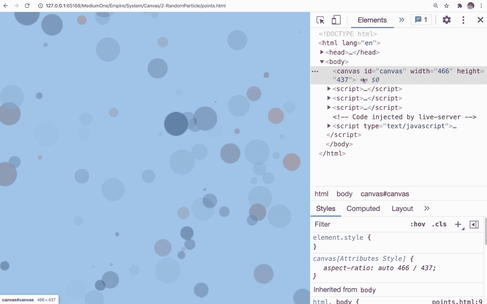

# 一个初学者的画布指南，有一些真正有趣的演示

> 原文：<https://javascript.plainenglish.io/a-beginners-guide-of-canvas-with-some-real-funny-demos-97818823ae7e?source=collection_archive---------16----------------------->

## 制作动画，让你的网站更漂亮。

当我们开发一个普通的网站时，我们习惯使用一些 HTML 标签，如`div`、`span`和`ul`。但是这些标签能力有限，`div`只是一个矩形容器，`ul`只是一个列表容器，它们不能用来创建动画和更多的自定义样式。

如果你想在你的网页上画一只猴子或者添加一个随机的粒子效果，你该怎么做？

`Canvas`就是为此而生的。

从 [MDN](https://developer.mozilla.org/en-US/docs/Web/API/Canvas_API) ，Canvas 有如下定义:

> **Canvas API** 提供了通过 [JavaScript](https://developer.mozilla.org/en-US/docs/Web/JavaScript) 和[HTML](https://developer.mozilla.org/en-US/docs/Web/HTML)元素绘制图形的方法。除此之外，它还可以用于动画、游戏图形、数据可视化、照片处理和实时视频处理。

用我的话来说，`Canvas`就是字面上的画布。任何人都可以在这个上面画任何东西。

如果你对这种技术感兴趣，你可以和我一起学习如何使用画布。在接下来的教程中，我将用大量的动画和图表来介绍它，然后做一些有趣的演示。

索引:

*   [画布的基本用法](https://bytefish.medium.com/basic-usage-of-canvas-54e3afb8aa54)
*   [画矩形和圆形](https://bytefish.medium.com/draw-rectange-and-circle-in-canvas-e7594e77a8e8)
*   [将鼠标变成画笔](https://bytefish.medium.com/turn-your-mouse-into-a-paintbrush-710d06646e76)
*   [创建随机粒子效果](https://medium.com/p/bbb8a67d494)