# JavaScript 数组入门指南(第 2 部分)

> 原文：<https://javascript.plainenglish.io/a-beginners-guide-to-arrays-in-javascript-part-2-4fe0665bd2a3?source=collection_archive---------15----------------------->

*如果你还没看完第一部分，点击* [***这里***](https://medium.com/javascript-in-plain-english/array-data-type-and-array-methods-in-javascript-50a29af0c49b) *。*

## 6。的方法。pop()

`pop()`方法从数组中移除最后一个元素并返回该元素。此方法更改数组的长度。语法: `**arr.pop()**`。如果你在一个空数组上调用`pop()`，它会返回`undefined`。

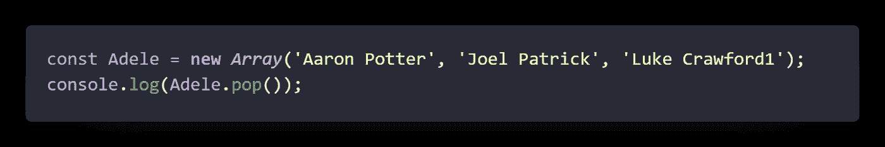

我们的产出:

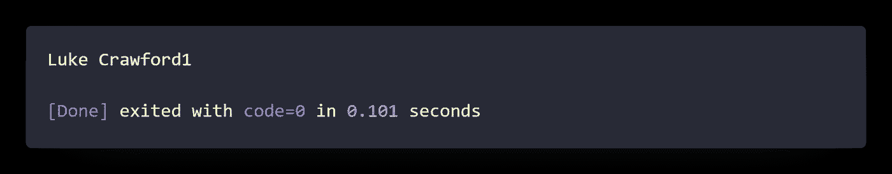

如果我们像你上面看到的那样写代码，那么从数组中删除的最后一个值将会显示在屏幕上。如果要在删除屏幕上的最后一个元素后打印数组:

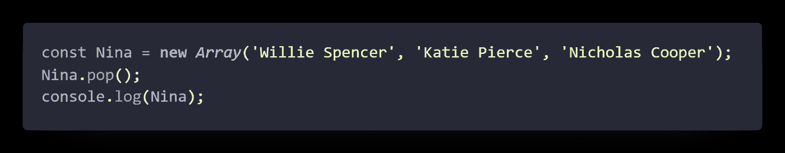

我们的输出是:

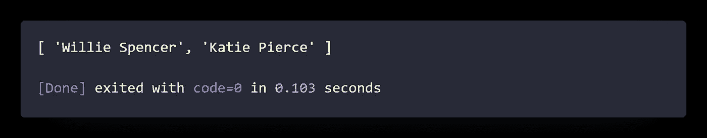

## **7。的方法。unshift()**

`unshift()`方法将一个或多个元素添加到数组的开头，并返回数组的新长度。语法:`arr.unshift(element1[, ...[, elementN]])`

虽然这个方法类似于 `push ()` 方法，唯一的区别是用`.unshift ()`方法添加到数组的值替换了数组的第一个元素，其他元素的索引向右移动一个单位。

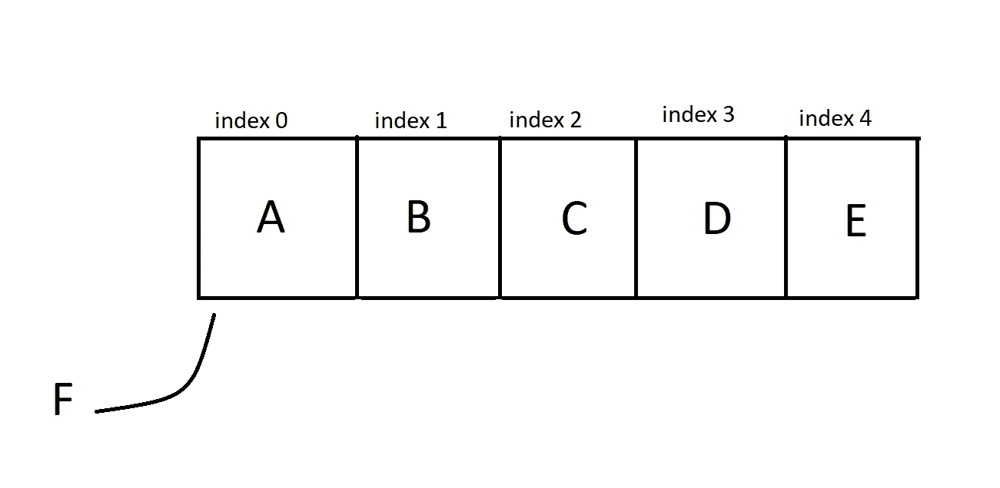

Before adding an element to the Array with the .unshift () method:

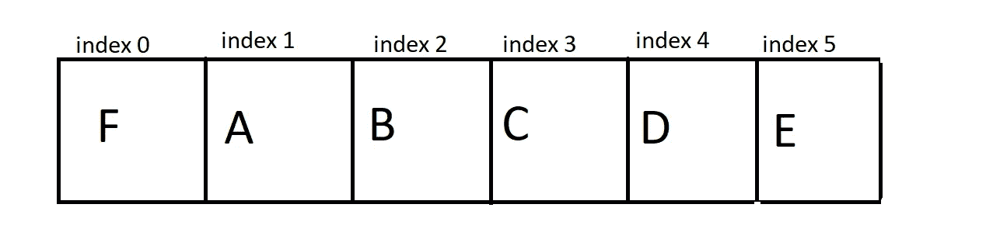

After adding an element to the Array with the .unshift () method:

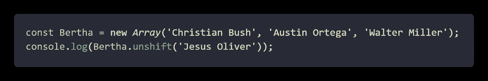

我们的输出是:

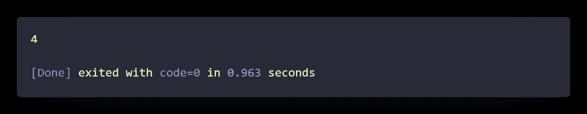

*如你所见，如果我们这样写代码，它会在元素添加到数组后打印出数组中元素的个数。如果我们想打印数组本身，那么:*

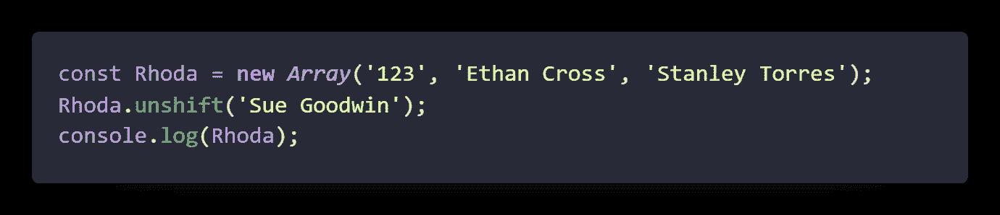

我们的输出是:

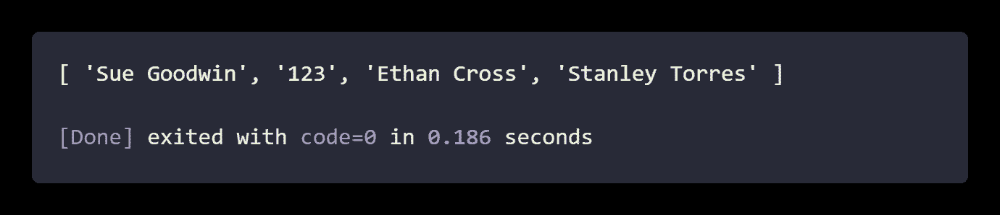

## **8。的方法。shift()**

方法从数组中移除元素并返回移除的元素。此方法更改数组的长度。语法:`**arr.shift()**`

`shift()`方法移除第 0 个索引处的元素，并将连续索引处的值下移，然后返回移除的值。如果`length`属性为 0，则返回`undefined`。

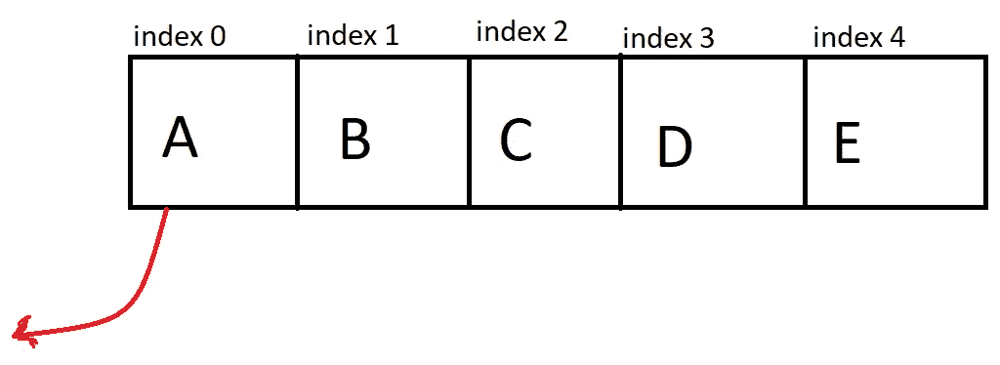

before the shift () method

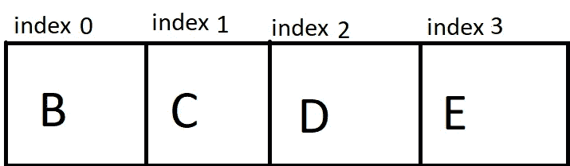

after the shift() method

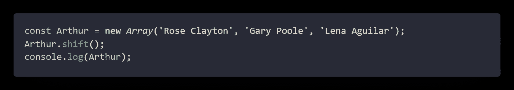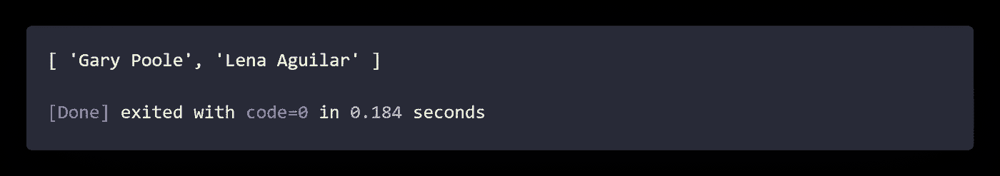

## **9。的方法。slice()**

`slice()` 方法返回一个数组中选中的元素，作为一个新的数组对象。`slice()` 方法选择从给定的开始参数开始的元素，并在给定的结束参数结束，但不包括给定的结束参数。
**注:**原数组不会改变。

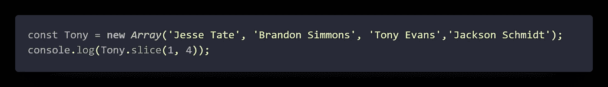

我们的输出是:

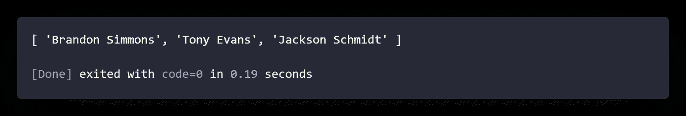

## 10。的方法。拼接()

方法的作用是:在数组中添加/删除条目，并返回被删除的条目。语法:

`let arrDeletedItems = arr.splice(start[, deleteCount[, item1[, item2[, ...]]]])`

`**start**`开始改变数组的索引。

如果大于数组的长度，`**start**`将被设置为数组的长度。在这种情况下，不会删除任何元素，但是该方法将作为一个添加函数，添加与 item[n*]所提供的一样多的元素。

如果是负数，它将从数组的末尾开始计算。(在这种情况下，原点`**-1**`，意为`**-n**`是第`n`个最后元素的索引，因此等同于`**array.length - n**`的索引。)如果`**array.length + start**`小于`**0**`，将从索引`**0**`开始。

`**deleteCount**`可选一个整数，表示数组中要从`**start**`中移除的元素个数。如果省略`**deleteCount**`，或者其值等于或大于`**array.length - start**`(即等于或大于数组中剩余的元素数，从`**start**`开始)，那么从`**start**`到数组末尾的所有元素都将被删除。

如果`**deleteCount**`为`**0**`或`**negative**`，则不移除任何元素。在这种情况下，您应该至少指定一个新元素。

从`start`开始，可选要添加到数组中的元素。如果不指定任何元素，`splice()`只会从数组中删除元素。

**注意:**这个方法改变了原来的数组。

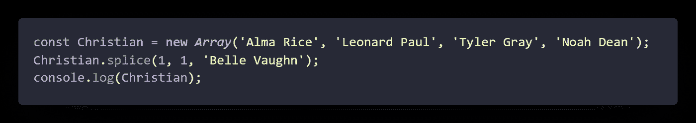

我们的输出是:

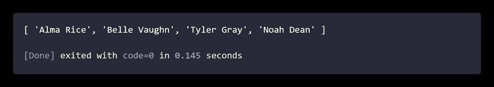

## **11。的方法。反向()**

`reverse()`方法在适当的位置反转数组。第一个数组元素成为`**last**`，最后一个数组元素成为`**first**`。`reverse()`方法就地转置调用数组对象的元素，改变数组，并返回对数组的引用。`reverse()`是有意仿制的；此方法可被调用或应用于类似数组的对象。不包含反映一系列连续的、从零开始的数字属性中的最后一个属性的长度属性的对象可能不会以任何有意义的方式表现。

语法:`**arr.reverse()**`

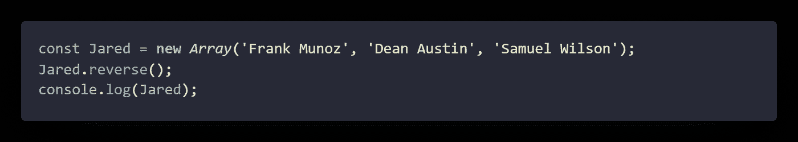

我们的输出是:

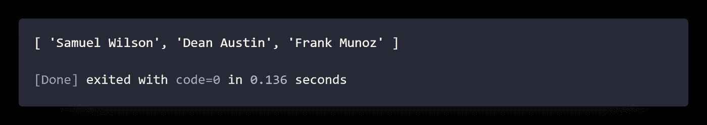

## **12。的方法。concat()**

方法用于合并两个或更多的数组。此方法不更改现有数组，而是返回一个新数组。语法是:`**const new_array = old_array.concat([value1[, value2[, …[, valueN]]]])**`

`concat()`方法创建一个新的数组，由调用它的对象中的元素组成，对于每个参数，依次是该参数的元素(如果参数是数组)或参数本身(如果参数不是数组)。它不会递归到嵌套数组参数中。

`concat()`方法不会改变这个数组或任何作为参数提供的数组，而是返回一个浅层副本，其中包含从原始数组组合而来的相同元素的副本。原始数组的元素被复制到新数组中，如下所示:

1.  对象引用(而不是实际的对象):concat 将对象引用复制到新数组中。原始数组和新数组都引用同一个对象。也就是说，如果修改了被引用的对象，这些更改对新数组和原始数组都是可见的。这包括也是数组的数组参数元素。
2.  数据类型，如字符串、数字和布尔(不是字符串、数字和布尔对象):concat 将字符串和数字的值复制到新数组中。

**注意:**连接数组/值将保持原始值不变。此外，对新数组的任何操作(除了对作为对象引用的元素的操作)都不会对原始数组产生影响，反之亦然。

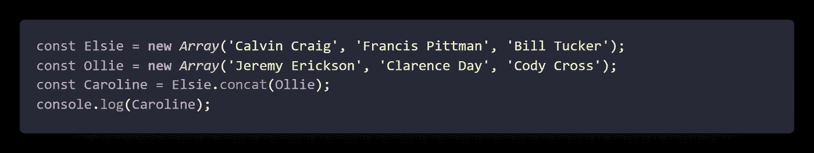

我们的输出是:

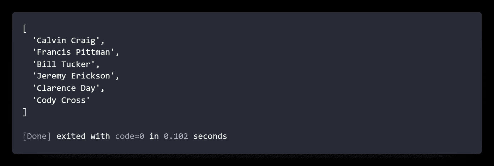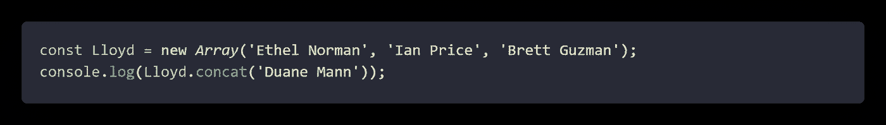

我们的输出是:

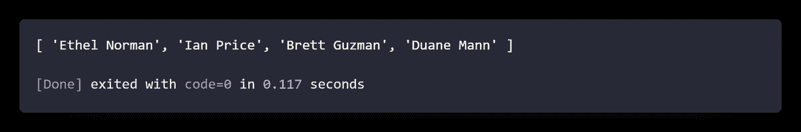

## **13。的方法。sort()**

方法对数组中的元素进行排序，并返回排序后的数组。默认的排序顺序是升序，建立在将元素转换成字符串，然后比较它们的 `**UTF-16**`代码单元值序列的基础上。排序的时间和空间复杂度无法保证，因为它取决于实现。语法: `**arr.sort([compareFunction])**`

如果没有提供 compareFunction，所有非未定义的数组元素将被转换为字符串并按照`UTF-16`代码单元的顺序比较字符串。例如，`“banana”`在`“cherry”`之前。在数字排序中，`9`在`80`之前，但是因为数字被转换为字符串，所以按照 Unicode 顺序，`“80”`在`“9”`之前。所有未定义的元素都被排序到数组的末尾。如果提供了`compareFunction`，则所有非未定义的数组元素都按照比较函数的返回值排序(所有未定义的元素都排序到数组的末尾，不调用`compareFunction`)。如果 a 和 b 是被比较的两个元素，那么:

1.  如果`compareFunction(a, b)` 返回的值小于`0`，则将 a 排序到比 b 低的索引(即 a 先出现)。
2.  如果`compareFunction(a, b)`返回`0`，则 a 和 b 相对于彼此保持不变，但是相对于所有不同的元素进行排序。
3.  如果`compareFunction(a, b)`返回大于`0`的值，则将 b 排序到低于 a 的索引(即 b 先出现)。
4.  `compareFunction(a, b)`当给定一对特定的元素 a 和 b 作为其两个参数时，必须始终返回相同的值。如果返回不一致的结果，则排序顺序是未定义的。

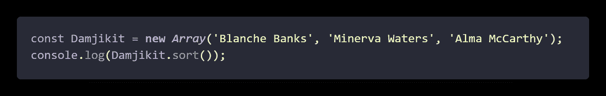

我们的输出是:

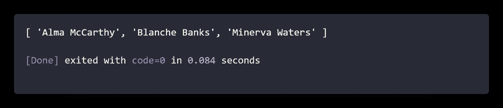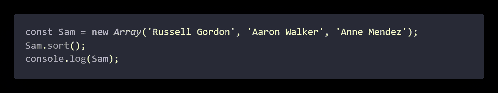

我们的输出是:

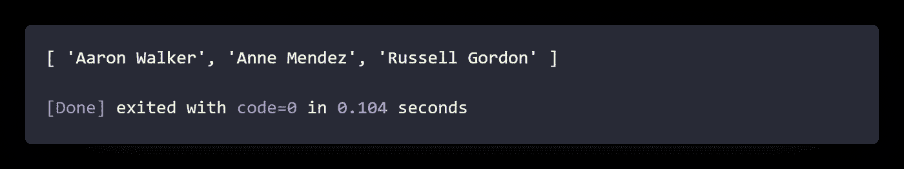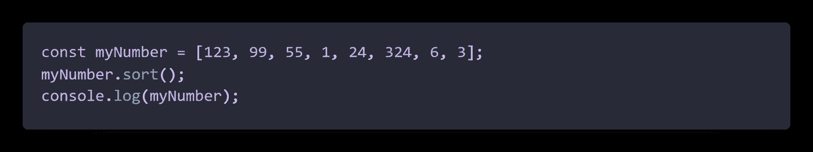

我们的输出是:

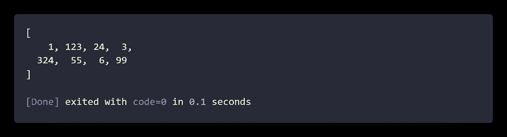

## 14。的方法。查找()

`find()`方法返回满足测试函数的数组中第一个元素的值。如果`no values`满足测试函数，则返回`undefined`。

1.  如果你需要在数组中找到的元素的索引，使用 `findIndex()`。
2.  如果你需要找到一个值的索引，使用`.indexOf()`。(它类似于`findIndex()`，但是检查每个元素是否与值相等，而不是使用测试函数。)
3.  如果你需要发现一个值是否存在于一个数组中，使用`.includes()`。同样，它检查每个元素是否与值相等，而不是使用测试函数。
4.  如果您需要查找是否有任何元素满足提供的测试函数，请使用`.some()`。
    语法: `**arr.find(callback(element[, index[, array]])[, thisArg])**`

    `.find()`方法对数组的每个索引执行一次`**callback function**`，直到回调返回一个真值。如果是这样，find 会立即返回该元素的值。否则，find 返回 undefined。

    `callback`为数组的每个索引调用，而不仅仅是那些赋值的索引。这意味着与只访问赋值的方法相比，它对于稀疏数组可能效率较低。

    如果提供了一个`thisArg`参数用于查找，它将在每次回调调用中用作 this 值。如果没有提供，则使用 undefined。

    `.find()`方法不会改变调用它的数组，但是提供给回调函数可以。如果是这样，find 处理的元素将在第一次调用 callback 之前设置。因此:

1) `callback`在调用 find 开始后不会访问任何添加到数组中的元素。
2)如果`callback`改变了数组中一个现有的尚未被访问的元素，则传递给`callback`的值将是 find 访问该元素索引时的值。被删除的元素仍然被访问。

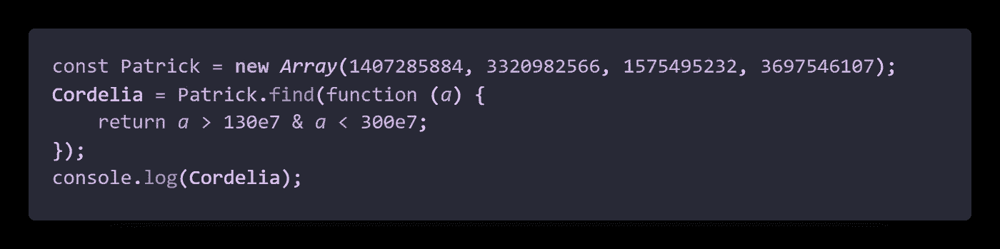

我们的输出是:

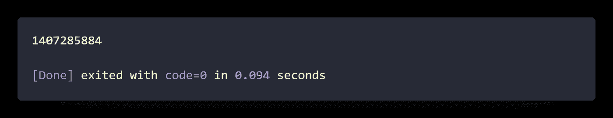