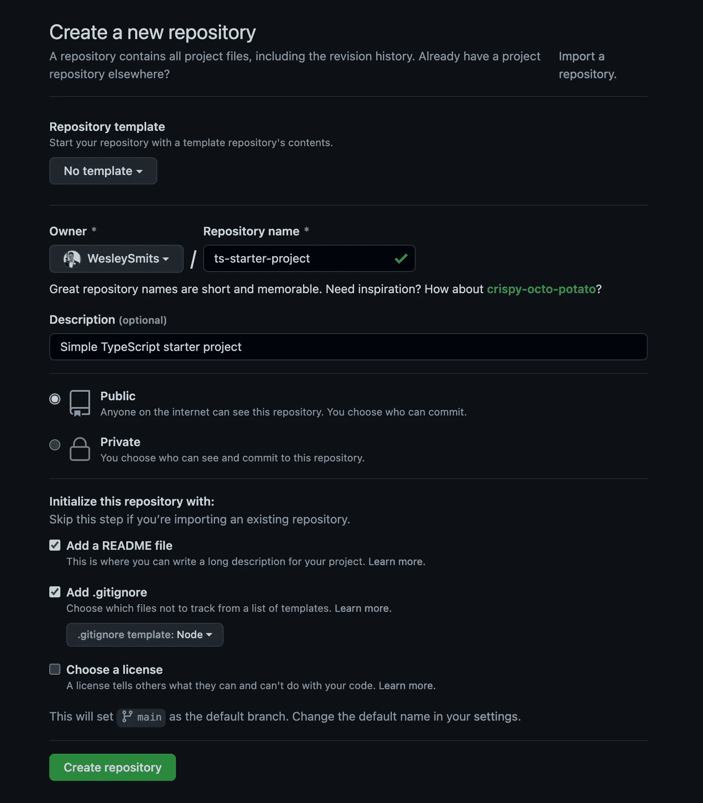

# 创建 TypeScript 初学者项目的初学者指南

> 原文：<https://javascript.plainenglish.io/a-beginners-guide-to-creating-a-typescript-starter-project-6129deeeb973?source=collection_archive---------2----------------------->

## 教程

## 创建新项目将变得快速、简单、轻松


在过去的两年中，我做了很多小型的 web 项目，在这些项目中，我使用了一个简单的 TypeScript starter 项目，该项目消除了新项目总是有的基本安装过程。

我想创建一个新的启动项目，并记录步骤，为其他人提供一些价值，并帮助他们创建自己的项目。

一旦这个 starter 完成，你可以在 GitHub 中将它标记为一个[模板库](https://docs.github.com/en/repositories/creating-and-managing-repositories/creating-a-template-repository)。这仅仅意味着无论何时创建一个新的存储库，您都可以很容易地将它作为一个基本的设置。

## 开胃菜包括什么？

这是我们将在这个初始项目中使用的技术堆栈:

*   **。editorconfig** —在不同的编辑器之间强制一致性。
*   **纱线** —用于安装外包装。
*   **更漂亮的** —用于自动代码格式化
*   **ESLint** —用于自动编码林挺
*   **Babel**——将代码转换成所有浏览器都能理解的东西
*   **Webpack** —用于捆绑您的代码
*   **TypeScript** —用于为您的 JavaScript 添加类型安全
*   post CSS——所以你今天可以使用现代的 CSS 功能
*   **Jest** —用于对 JavaScript/TypeScript 代码运行单元测试
*   **Cypress**——用于运行端到端测试

*PS:每一步都单独提交到这个启动器的* [*GitHub 库*](https://github.com/WesleySmits/ts-starter-project) *上。如果您自己在实现它时遇到了困难，您可以查看提交来仔细检查您的工作。*

## 创建您的 GitHub 资源库



登录你的 GitHub 配置文件，然后[创建一个新的库](https://github.com/new)。给它起一个类似于`ts-starter-project`的名字，并确保选中复选框来添加一个`README`和`.gitignore`文件。

你可以在上面的截图中看到我使用的设置。

## 创建您的文件夹

在终端中导航到您的项目文件夹，克隆您的存储库，然后导航到该文件夹。

## 1.添加一个`.editorconfig`文件

> Editorconfig 有助于为在不同编辑器和 ide 中处理同一项目的多个开发人员保持一致的编码风格。EditorConfig 项目由一个用于定义编码样式的文件格式和一组文本编辑器插件组成，这些插件使编辑器能够读取文件格式并遵循定义的样式。EditorConfig 文件易于阅读，并且它们与版本控制系统配合得很好。

在项目的根目录下创建一个`.editorconfig`文件，并粘贴以下内容:

您可以根据自己的喜好进行配置，但是我更喜欢将缩进设置为 4 个空格，并且总是插入一个最后的换行符。这些都是非常常规的标准，值得遵循。

## 2.用 WebPack 和 Babel 创建一个简单的 Hello World 页面

## 2.1 设置基础

从项目文件夹中运行终端中的`npm init -y`。这将为你创建一个默认的`package.json`文件。

## 2.2 安装纱线

如果您还没有安装 yarn，您可以使用以下命令进行全局安装:

*PS:如果你更喜欢用 NPM 也没关系。我个人比较喜欢纱线。*

## 2.3 安装 Babel

Babel 允许我们编写现代 JavaScript 代码，而不用担心浏览器支持。它将把代码转换成所有浏览器都能理解的东西。运行以下命令来安装 babel 的所有要求。

## 2.3 设置 Webpack

Webpack 将所有 JavaScript / TypeScript 文件捆绑成一个或几个包，这取决于您的配置。这也包括已安装的 NPM 软件包。Webpack 还可以为生产缩减代码。

对于这个项目，我们将安装最新版本的 Webpack 作为开发依赖项。运行以下命令，将 Webpack 和 Webpack 命令行界面(`webpack-cli`)包添加到 package.json.file 中:

在项目的根目录下创建另一个文件，将其命名为`webpack.config.js`，并粘贴以下代码:

这将在`app`目录中查找所有 JS 资产，并将所有编译后的资产复制到`public`目录中。

现在创建以下文件和文件夹:

*   应用
*   钢性铸铁
*   射流研究…
*   app.js
*   index.html

让我们在`app.js`中放置一个简单的警告，这样我们可以很容易地看到代码是否被正确加载:

现在，最后，让我们添加一些 HTML，看看我们的设置是否有效。将以下内容粘贴到`index.html`文件中:

如果您现在在浏览器中打开`index.html`文件，您将不会看到警告。我们已经声明希望从我们的公共文件夹中加载捆绑的 JavaScript 代码，但是我们实际上还没有编译代码。

让我们向 package.json 文件添加一个构建命令。在`scripts`部分，添加以下一行:

现在从终端运行 build 命令:

您应该会收到一条消息，说明 Webpack 已经成功编译。如果您刷新浏览器窗口，现在您应该会看到一个警告。

不要忘记将公共文件夹添加到`.gitignore`文件中。我们不需要提交这些文件，它们是在每次构建时生成的:

## 2.4 动态加载页面

到目前为止，我们已经直接在浏览器中打开了`index.html`文件。脚本文件也被手动添加到 HTML 文件中。这是目前的工作，但随着应用程序的增长，将会有更多的脚本和样式。Webpack 会根据性能最佳实践将这些文件聪明地分成几个文件。

这些文件不应该手动添加到 HTML 文件中。Webpack 应该会帮我们解决这个问题。

有一个叫做`HTMLWebpackPlugin`的包可以处理这个问题。它将创建一个包含所有需要的脚本/样式的`index.html`文件。使用以下命令安装软件包:

从`index.html`文件中删除硬编码的脚本引用:

将以下代码添加到`webpack.config.js`文件中:

如果您再次运行 build 命令，它应该会在 public 文件夹中生成一个新的`index.html`文件，该文件的工作方式与前一个文件完全一样，但是这一次使用了动态添加的资产。

## 2.5 添加 Webpack 开发服务器

我们现在要添加 Webpack 开发服务器，它有几个优点:

*   它启动了一个开发服务器，因此我们不再需要在浏览器中手动加载 index.html，取而代之的是，我们将收到一个本地主机链接。
*   它提供实时重装。当资产被修改时，它会自动刷新页面内容。

使用以下命令安装软件包:

将以下命令添加到 package.json 中的脚本部分:

如果您运行这个命令(`yarn serve`)，您应该得到以下输出:

```
$ webpack serve
<i> [webpack-dev-server] Project is running at:
<i> [webpack-dev-server] Loopback: http://localhost:8080/
<i> [webpack-dev-server] On Your Network (IPv4): http://192.168.178.88:8080/
<i> [webpack-dev-server] On Your Network (IPv6): [http://[fe80::1]:8080/](http://[fe80::1]:8080/)
```

你可以`Ctrl or Cmd + click`在浏览器中打开链接，在那里你会看到应用程序正在运行。

## 3.添加类型脚本

尽管这是一个 TypeScript starter 项目，但它目前只包含普通的 JavaScript。让我们设置应用程序以支持 TypeScript。

让我们将`app.js`文件的名称改为`app.ts`。同样在`webpack.config.js`中，我们应该改变引用来反映文件名的变化。

此外，让我们添加一些实际的类型脚本代码到我们的`app.ts:`

如果您再次运行 build 命令，您将看到以下错误:

```
Compiled with problems:X

ERROR in ./js/app.ts 1:14

Module parse failed: Unexpected token (1:14)
You may need an appropriate loader to handle this file type, currently no loaders are configured to process this file. See https://webpack.js.org/concepts#loaders
> const greeting: string = 'Hello World!';
| console.log(greeting);
```

要解决这个问题，我们需要做几件事:

1.  安装 TypeScript 并设置一个`tsconfig.json`文件来设置 TypeScript 配置
2.  安装 Webpack 加载器，以便 Webpack 知道如何处理 TypeScript 文件
3.  使用我们的`webpack.config.js`中的装载机

**安装打字稿**

在终端中运行以下命令:

现在在项目的根目录下创建一个`tsconfig.json`文件，并粘贴以下代码:

这将配置您的项目启用严格模式。这意味着，TypeScript 将对您的代码有更严格的规则。由于我们没有需要重构的先前代码，这将确保未来代码的质量，此时不需要任何努力。

现在让我们安装 TypeScript 加载程序:

我们现在可以使用 Webpack 配置文件中的`ts-loader`来处理带有以下代码的 TypeScript 文件:

如果您重新启动 Webpack dev 服务器，您将会看到一条警告消息，证明您的 TypeScript 文件得到了正确处理。

## 添加更漂亮和 ESLint

Prettier 是一个固执己见的代码格式化程序，它可以在保存时重新打印您的代码，这样您就不必担心如何正确处理换行符、空行、额外空格或团队使用的正确类型的引号。

ESLint 是一个 JavaScript 代码 linter，它可以检查上面提到的问题，还可以发现错误、未使用的变量或其他错误或与最佳实践的偏差。

更漂亮的有一个很好的差异解释[这里](https://prettier.io/docs/en/comparison.html)。

## 安装更漂亮

运行以下命令来安装更漂亮的并创建配置文件:

`.prettierignore`文件将保存一个列表，列出所有我们不希望格式化得更漂亮的文件，这可以在很多方面与`.gitignore`保持同步。首先将`public`文件夹添加到这个文件中。

```
public
```

`.prettierrc.json`文件包含我们想要对配置选项进行的任何更改。以下是我在项目中更喜欢使用的配置:

这将删除尾部逗号，强制使用分号，将双引号改为单引号，在对象属性中不使用引号，或者所有属性都用引号括起来，在将代码分成几行之前，最长不超过 100 个字符。

**格式化现有代码**

现在运行一个一次性命令，让 Prettier 格式化我们现有的所有代码。

如果你跟随教程，你会看到对`webpack.config.js`、`tsconfig.json`、`README.md`甚至`index.html`做了更漂亮的改动。

**编辑整合**

Prettier 集成了最流行的代码编辑器。我自己用的是 VSCode，已经安装了[beauty-vs code](https://marketplace.visualstudio.com/items?itemName=esbenp.prettier-vscode)。此外，我在编辑器设置中打开了保存时自动格式化。

## 安装 ESLint

要集成 ESLint，我们需要安装几个包。我将简要解释它们的用法:

*   eslint —用于实际使用 eslint
*   @ typescript-eslint/ESLint-plugin-向 ESLint 添加 TypeScript 林挺规则
*   @ TypeScript-eslint/parser-允许 ESLint 分析类型脚本代码
*   eslint-watch —这样我们就可以对文件更改运行 eslint
*   eslint-config-AirBNB-base——AirBNB 有一套奇妙的可用规则，为我们提供了一个很好的遵循规则的起点
*   eslint-plugin-import-这增加了 ESLint 对林挺导入/导出语法的支持，并防止了文件路径和导入名称拼写错误的问题
*   eslint-config-appellister-关闭所有不必要的或可能与 appellister 冲突的规则
*   eslint-plugin-beauty-作为 ESLint 规则运行得更漂亮，并报告差异作为单个 ESLint 问题

运行以下命令安装所有这些组件:

现在用下面的命令创建一个`.eslintrc.json`文件:

在这里，我们将为 ESLint 添加配置，我们希望遵循哪些规则，我们希望使用哪些插件等。将以下代码添加到文件中:

现在让我们在 package.json 中再添加两个脚本。一个用于运行一次 ESLint 并报告任何错误，另一个用于观察文件更改并报告出现的问题:

现在，如果您运行这些命令中的任何一个，您应该会在`app.ts`文件中得到两个错误。如果 TypeScript 可以 100%地从用法中推断出某个变量的类型，那么您不希望将该变量简单地设置为字符串类型，也不希望意外地将警报发送到生产环境中。

为了解决这个问题，我们暂时清空`app.ts`。

## 添加后置 CSS

PostCSS 是一个用 JavaScript 转换 CSS 的工具。我们可以通过 Webpack 配置运行它，它会以普通 CSS 的形式输出到浏览器。使用 PostCSS 有很多好处，比如在需要的地方自动添加厂商前缀，添加样式链接，允许我们使用最新的 CSS 标准，并将其转换回所有浏览器都能理解的内容。

我们将安装 PostCSS 以及一些有助于样式化的 PostCSS 插件:

*   postcss-preset-env —这使您可以将现代 css 转换成大多数浏览器都能理解的内容，从而根据您的目标浏览器或运行时环境确定您需要的多填充
*   postscs-nested——这允许像 Sass 一样展开嵌套规则。更多信息参见 [GitHub repo](https://github.com/postcss/postcss-nested) 。
*   postcss-import —该插件通过内联内容来转换@import 规则
*   这个插件允许你在 postcss 中使用 css 自定义属性
*   CSS nano——CSS nano 是一个现代的、模块化的压缩工具，编写于 PostCSS 生态系统之上，它允许我们使用许多强大的功能来适当地压缩 CSS。
*   postcss-loader —处理 postcss 文件的加载程序
*   CSS-loader-CSS-loader 像 import/require()一样解释@import 和 url()，并将解析它们。
*   样式加载器——处理向 DOM 添加样式的加载器
*   这个插件将 css 解压到不同的文件中。它为每个包含 CSS 的 JS 文件创建一个 CSS 文件。它支持 CSS 和 SourceMaps 的按需加载。

让我们全部安装，包括`postcss`本身:

让我们创建一个 PostCSS 配置文件:

将以下配置粘贴到文件中:

这个文件存在于你的项目的根目录中，它会自动告诉 PostCSS 使用这些插件。

为了让一切正常工作，您应该将加载器添加到`webpack.config.js:`

最后，让我们创建一个 CSS 文件，其中包含一些样式，以验证一切都按预期工作。在`app/css/`文件夹中创建一个`main.pcss`文件，并将其添加为 Webpack 的入口点。如果一切顺利，你的页面现在应该有一个非常明显的背景。

PS:如果你觉得你不需要一些 PostCSS 插件，可以随意把它们从 yarn install 和`postcss.config.js`中去掉。

## 添加笑话

Jest 是一个很棒的 JavaScript 测试框架。它允许您轻松地为代码添加单元测试，以验证它是否按预期工作。它还提供了代码覆盖率统计数据，以确保我们测试了正确的流程。

为了将 Jest 添加到我们的 TypeScript 项目中，我们必须安装三个包:

1.  显然，我们需要笑话本身。
2.  ts-jest——这是一个 Jest 转换器，支持源映射，允许您使用 Jest 来测试用 TypeScript 编写的项目。
3.  @types/jest —这个包包含 jest 的类型定义。

让我们将它们全部安装到我们的 devDependencies 中:

此外，让我们更新 package.json 中的测试命令，立即运行 Jest。此外，让我们添加一个 watch 命令，这样我们就可以编写在保存文件时运行的测试。

`ts-jest`提供生成 jest.config.js 文件的命令，将`ts-jest`设置为解析器。让我们现在运行它来创建文件。

最后，我们需要让 TypeScript 知道 Jest 类型定义。更新`tsconfig.json`中的类型数组。

我们现在可以添加我们的第一个测试。让我们创建一个可以在`app.ts`中测试的简单函数。

现在在同一个文件夹中创建一个`app.test.ts`，它将包含我们对`app.ts`的测试。

该文件简单地从`app.ts`导入函数，并测试 1 和 2 相加等于 3。

如果您现在在终端中运行 test 命令，您应该会看到一个通过的测试。

## 额外笑话提示

如果您的编辑器支持 Jest 扩展，这将有助于在后台自动运行测试。我使用 VSCode 并安装了 [Jest 扩展](https://marketplace.visualstudio.com/items?itemName=Orta.vscode-jest)。通过 my VSCode 设置中的以下设置，它现在可以在测试文件或源文件发生更改时自动运行测试。

## 添加柏树

Cypress 是为现代网络构建的下一代前端测试工具。它允许您从用户的角度对您的应用程序运行测试，并验证用户获得了您想要的体验。

运行以下命令安装 Cypress:

将下面一行添加到 package.json 脚本中，这样您就可以轻松地打开 Cypress:

如果您运行这个命令，您将会看到 Cypress 会针对他们在线的应用程序安装一些演示测试。演示测试对于了解 Cypress 能做什么以及如何做非常有帮助。我建议你仔细阅读这些测试，并根据这些测试自己尝试一下 Cypress。

完成后，您可以删除`cypress/integration`、`cypress/fixtures`和`cypress/screenshots`文件夹中的所有文件。

我还建议将`cypress/screenshots`文件夹添加到您的`.gitignore`文件中。

## 清理

我们已经到了本教程的末尾，是时候进行一些清理了，所以您的新项目不会用演示代码创建。您可以清空以下文件:

*   应用程序
*   应用测试
*   main.pcss

## 结论

我希望您能从本教程中学到一些关于如何构建一个简单的 TypeScript 初学者的东西。如果您有任何想法、问题、反馈或改进，请在评论中告诉我。

GitHub 库包含了本文所有章节的独立提交，以防你想查看那里的变化。

如果你愿意支持我，你可以[在推特上关注我](https://twitter.com/iamwesleysmits)或者[给我买一台高保真音响](https://ko-fi.com/wesleysmits)。

*更多内容请看*[***plain English . io***](http://plainenglish.io/)