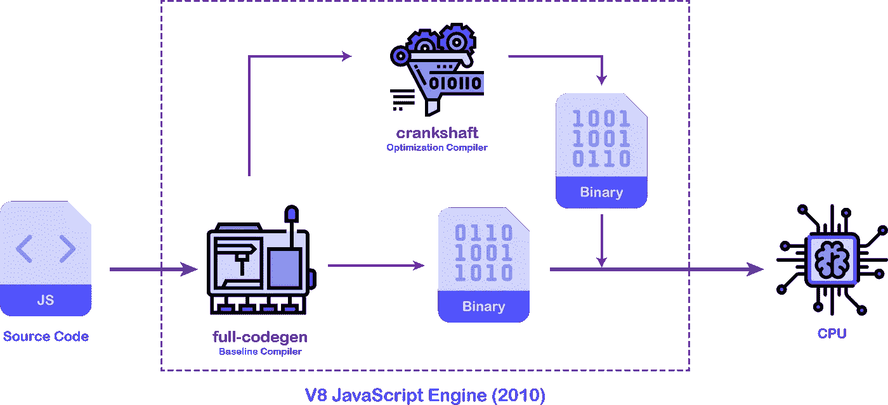
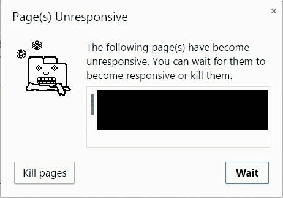
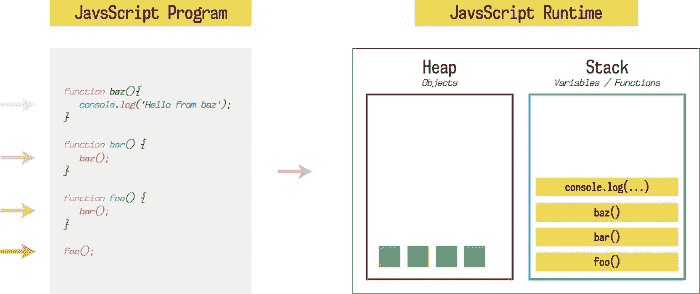
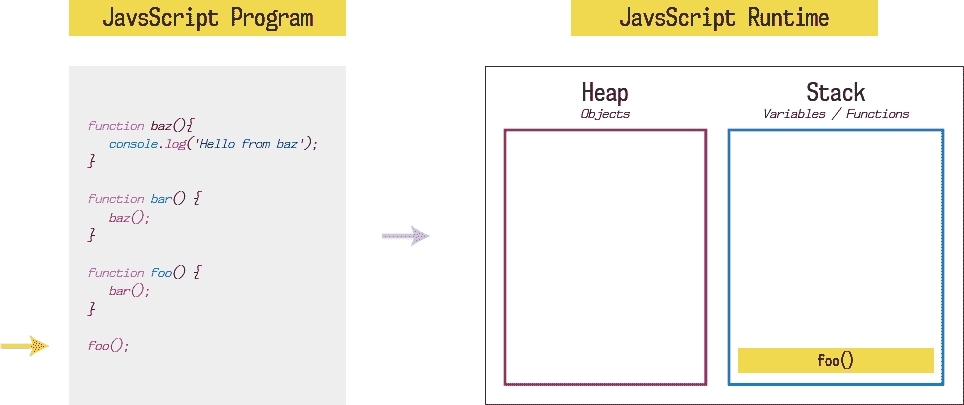
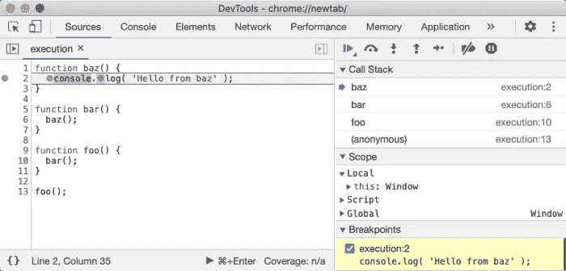

# 引擎盖下的 JavaScript 初学者指南

> 原文：<https://javascript.plainenglish.io/a-beginners-guide-to-javascript-under-the-hood-bc60fc352163?source=collection_archive---------2----------------------->

JavaScript 是一种解释语言，这意味着我们不必在将它发送到浏览器之前进行编译。解释器获取原始代码并为您运行。

通常情况下，一个基本的 JavaScript 引擎会包含一个编译器，它的工作是将 JavaScript 源代码编译成一个中间表示 *(IR)* ，这个中间表示通常被称为字节码，这个字节码被提供给解释器。

编译器的基本工作是尽可能快地编译代码，并为解释器提供优化程度较低的字节码。现在，由于解释器必须处理未优化的代码，当应用程序高度动态和交互时，会有一些副作用。

这可以通过谷歌 Chrome 浏览器在网络上显示谷歌地图时遇到的问题来理解。他们需要找到提高 JavaScript 性能的方法。所以在谷歌 V8 引擎的最初几天，他们做了两件事来优化 JavaScript 性能。

在 **V8** JavaScript 引擎的 **2010 版本**中，**全代码生成**是**基线编译器**，它的工作是尽可能快地吐出未优化的机器代码，以实现更快的应用引导。

当应用程序运行时，**曲轴**编译器将会启动并优化源代码，并将替换编译器生成的那部分机器代码。随着更多优化代码的生成，这将带来更好的性能。

正如您所看到的，上面的模型没有解释器。这是一个 JIT *(Just-In-Time)* 编译模型，因为代码被动态编译成机器码，随后被优化*。*

后来，他们做了一些优化来提高 JavaScript 的性能。

# JavaScript 中的代码实际上是如何运行的？

JavaScript 很容易理解，是前端开发必不可少的部分。

但是有一点将它与当前场景中的许多其他语言区分开来，那就是单线程。这意味着它一次只能执行一个代码。这意味着代码的任何部分需要更长的时间或像永远一样去执行，这将阻塞所有需要在那之后执行的东西。

一行代码就可以阻塞整个应用程序。

当你打开一个浏览器时，这个单线程负责网页上发生的所有事情。滚动、点击事件和监听 DOM 中的其他事件。

如果执行被阻止，浏览器将停止做任何事情，它将冻结或只是没有反应。

实现这一点的简单代码是永无止境的 while 循环或永不退出的递归。

在此之后的任何代码都不会被执行，因为其余的代码将变得无法访问，因为它将永远不会结束，浏览器将继续处理永恒的 while 循环。

感谢现代浏览器，因为不是所有打开的浏览器标签都依赖于单个 JavaScript 线程。相反，他们为每个标签或每个域使用单独的 JavaScript **线程。**

现在，让我们深入了解 JavaScript 运行时，以及一切是如何结合在一起实现这一奇迹的。

JavaScript 的一切都发生在全局执行上下文中。

全局执行上下文由两部分组成:

1.  记忆创造阶段
2.  代码执行阶段

在内存创建阶段，JavaScript 为变量和函数分配内存。在变量的情况下，undefined 被指定为占位符，而在函数的情况下，函数的整个代码被存储。

在代码执行阶段，代码逐行执行。在这里，undefined 被变量的值所代替。

如果你现在已经明白了，你就能回答*为什么我们能够在* *初始化*之前调用函数了。

*答案是因为在内存创建阶段，首先执行的是将内存分配给函数，并像存储其他变量一样存储它。类似于为什么在变量初始化之前调用变量会显示 undefined 而不是未定义。*

回到我们的代码示例，代码内部发生的是我们的函数**第三个**调用我们的函数**第二个**调用函数**第一个**登录我们的控制台。

一旦内存分配部分完成。

当我们运行这个程序时，首先是函数**第三个**一直运行到控制台记录语句。但是在后台，每当一个函数被调用时，它就被推入堆栈*(LIFO last-in-first-out)*，并且只有当整个函数被执行时才被弹出。

所以在我们的例子中，函数**第三个**被按下，然后函数**第二个**，然后函数**第三个。**

第三个功能是读取，并且 *hello* 正在我们的控制台中记录。一旦完成，函数内部就没有要执行的东西了，它就被弹出来了。第二和第三个函数也是如此。

堆是一个空闲的内存存储单元，你可以在其中随机存储内存。堆由 JavaScript 运行时管理，并由垃圾收集器清理。

您也可以在浏览器中看到这一点，方法是将调试器设置在第二行，并检查源代码选项卡下的调用堆栈开发工具。

因为 JavaScript 是单线程的，所以每个进程只有一个栈和一个堆。因此，如果任何其他程序想要执行某个东西，它必须等到前一个程序完全执行完。该线程俗称**主线程**或**主执行线程**。

让我们想一个场景。如果浏览器发送一个 HTTP 请求，请求通过网络加载一些数据，或者加载一个图像以显示在网页上，该怎么办？浏览器会冻结直到请求被解决吗？如果是的话，那么对用户体验非常不好。

已经比我想要的时间长了。关于这方面的更多信息，第 2 部分将会发布，敬请期待。

感谢阅读和下面的任何反馈意见。

*更新:刚刚写了* ***第二部*** *看看* [***这里***](https://medium.com/javascript-in-plain-english/a-beginners-guide-to-javascript-under-the-hood-part-2-89d34a6a09e1) ***。***