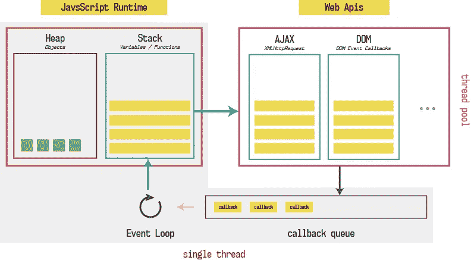
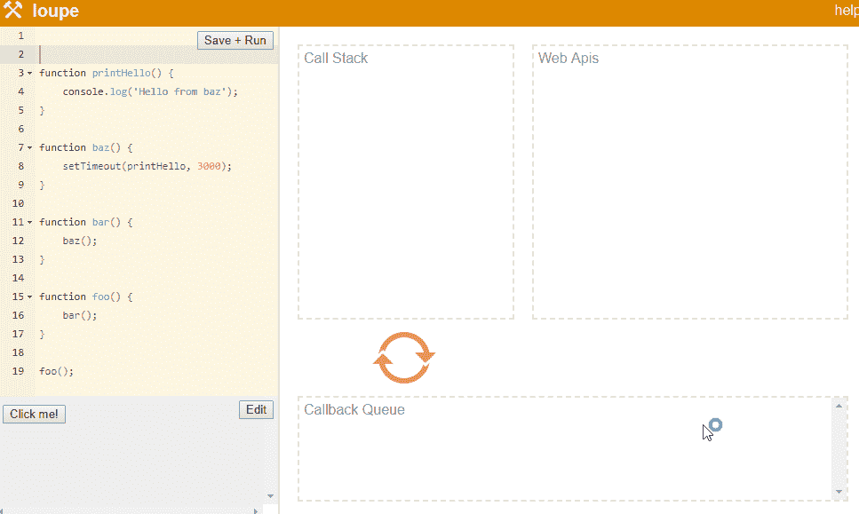

# 底层 JavaScript 初学者指南—第 2 部分

> 原文：<https://javascript.plainenglish.io/a-beginners-guide-to-javascript-under-the-hood-part-2-89d34a6a09e1?source=collection_archive---------5----------------------->

在我们开始这篇文章之前，让我们回顾一下到目前为止我们所学到的一切。

每当 JavaScript 想要运行一段代码时，它会创建一个全局执行上下文，该上下文包含两个部分，即。

1.  记忆创造阶段
2.  代码执行阶段

首先，内存*(堆)*被分配给所有变量，并被赋予未定义的值**。**

当内存阶段结束，代码开始执行时，所有的变量都被赋值，每当一个函数需要执行时，它就被压入堆栈，在执行完函数后，它就被弹出。

JavaScript 是单线程的，每个进程只有一个栈和一个堆。因此，如果任何其他程序想要执行某个东西，它必须等到前一个程序完全执行完。该线程俗称**主线程**或**主执行线程**。

如果浏览器发送 HTTP 请求，通过网络在网页上加载一些图像或数据怎么办？会发生什么？浏览器会因为是单线程的而冻结吗？

浏览器带有 JavaScript 引擎，负责执行 web 应用程序中的任何 JavaScript。但是你猜怎么着，浏览器有更多的功能。

浏览器也有我们在开发项目中使用的这些 Web APIs，比如 AJAX、console *(也是 console)*等等。

一开始会觉得有点不知所措，但请和我在一起；理解起来毫不费力。

JavaScript 运行时实际上由另外两个组件组成，即**事件循环**和**回调队列**。回调队列也被称为**消息队列**或**任务队列。**

现在回到我们的问题*如果我们发送 AJAX 请求，浏览器会冻结吗？*

如果浏览器在收到 HTTP 网络响应时不得不使用相同的 JavaScript 线程来执行任务，我们的用户体验将会非常糟糕，我们的网页甚至会几分钟都没有响应。

因此，浏览器实现它们自己的逻辑来执行这些 Web APIs 操作，例如发送 HTTP 请求，或者使用 *setTimeout* 或 *setInterval* 来延迟执行。这些操作不会阻塞主执行线程，因为它们被分配到由浏览器管理的不同线程上。

这些 API 也被称为 Web APIs，因为它们不是 JavaScript 的一部分，本质上是异步的。这意味着您可以让这些 API 在后台做一些事情，并在完成后返回数据，而不会中断主执行线程。

现在，每当我们调用这些 API 时，我们必须做的一件事就是为它们提供一个**回调函数**。回调函数的职责是在 Web API 完成工作后，在主线程中执行一些 JavaScript 代码。

现在让我们把它们放在一起。

现在，无论何时调用函数，它都会被推入堆栈。如果该函数包含 Web API 调用，JavaScript 将通过回调函数将其控制权委托给 Web API，然后继续执行剩余的代码。

现在，函数可能会命中 return 语句，并从堆栈中弹出，然后继续执行剩余的代码。

同时，主执行线程正在完成它的工作；同时，Web API 在后台完成它的工作，并记住与该工作相关的回调函数。一旦工作完成，Web API 将该工作的结果绑定到回调函数，并将其发送到**回调队列** *(还记得我们之前介绍的 2 部分 1。* ***事件循环*** *和 2。c****all back queue****)。*

**事件循环**的工作是检查堆栈是否为空，如果为空并且任务仍在**回调队列**中，那么它会将其推入堆栈。稍后，堆栈将执行回调函数。

它类似于我们之前理解的程序，唯一的变化是我们使用 *setTimeout* 在 2000 毫秒后首先调用我们的函数。

让我们深入了解引擎盖下会发生什么。首先，**功能第三个**将被推入堆栈，然后**功能第二个**。一旦 function second 开始执行并调用 *setTimeout* API，JavaScript 将把回调函数传递给 Web API 并继续执行。

因为没有什么要执行的，所以第二个函数将从堆栈中弹出，第三个函数也是如此。同时，Web API 将等待 2 秒钟。一旦时间结束，它将把回调函数传递给回调队列，回调队列将触发**事件循环**，由于堆栈为空，事件循环将把这个回调函数推入堆栈，执行将开始。

感谢菲利普·罗伯斯制作了这个神奇的工具来直观地展示引擎盖下到底发生了什么。

事件循环和回调队列不是 JavaScript 引擎的一部分，而是位于 JavaScript 引擎之外，由 web 浏览器或 Node.js 等运行时提供。

上面的解释还解释了 *setTimeout* 将执行所需的最小时间作为参数，可能会花费更多时间，但绝不会减少。

如果堆栈忙于执行函数， *setTimeout 的回调*可能必须等待堆栈变空，因此作为参数提供的时间是回调执行所需的最小时间。

*感谢您的阅读和任何反馈意见。*