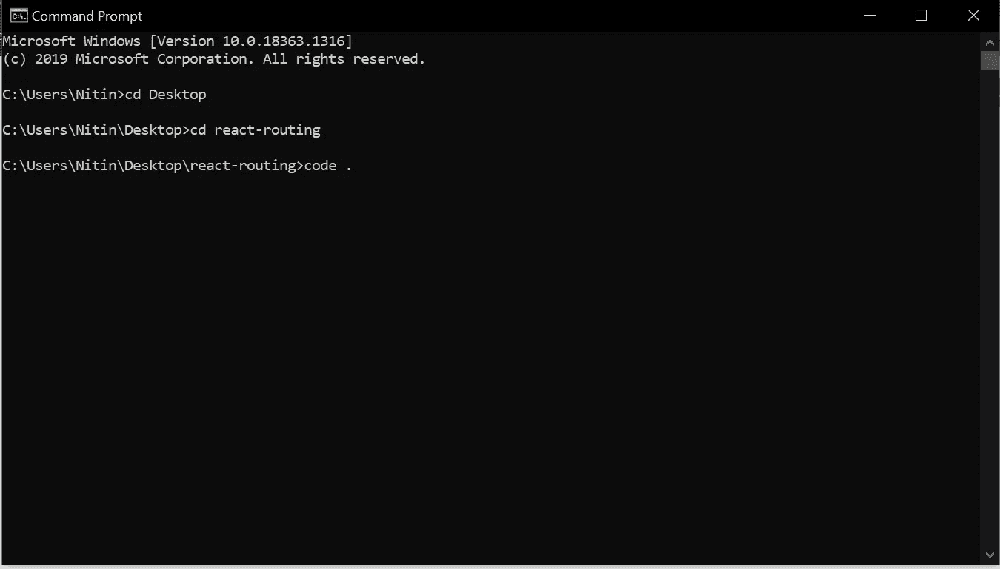
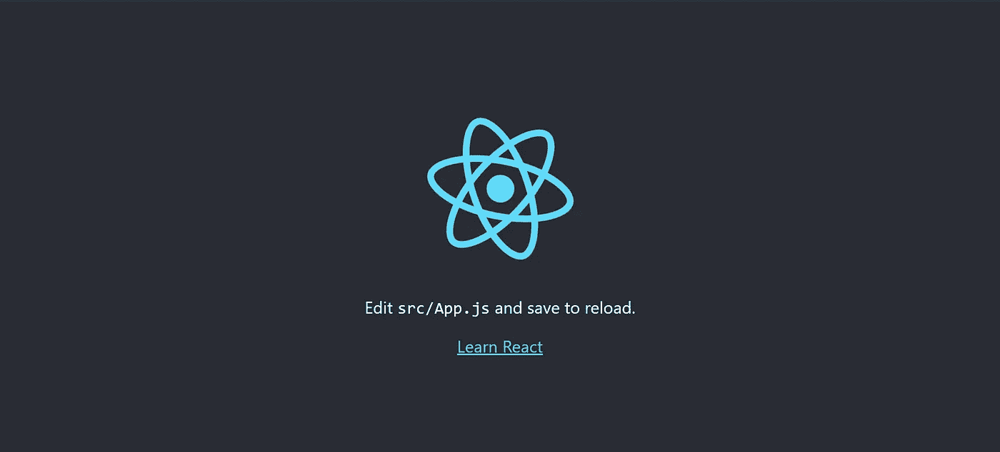
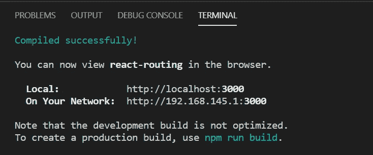
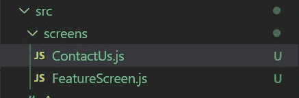
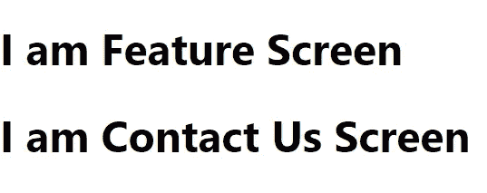

# React 路由器初学者指南

> 原文：<https://javascript.plainenglish.io/a-beginners-guide-to-react-router-34b4e86fded3?source=collection_archive---------11----------------------->

## 使用 react-router-dom 轻松导航到不同的屏幕


Photo by [Taras Shypka](https://unsplash.com/@bugsster?utm_source=medium&utm_medium=referral) on [Unsplash](https://unsplash.com?utm_source=medium&utm_medium=referral)

如果您正在使用 React 或者想要学习它，您可能会对在不同的屏幕上导航感到困惑。

对吗？

我们都知道，网站和应用不能在同一个屏幕上。多个页面构成一个网站。

因此，我们正在创建一个基本的 React 应用程序来理解 [react-router-dom](https://www.npmjs.com/package/react-router-dom) 。

为此，我们使用 [react-router-dom](https://www.npmjs.com/package/react-router-dom) ，我将详细解释它。

所以让我们开始吧。

# 1.创建 React 应用程序

在所需的目录下打开命令提示符，并键入

```
npx create-react-app react-routing
```

它将创建一个名为 react-routing 的 React 应用程序。

在你的代码编辑器中打开它(我用的是 VS 代码)。通过拖放文件夹或在命令提示符下键入以下代码。

```
code .
```

确保您位于 react-routing 目录中。

我在

```
C:\Users\Nitin
```

所以我用 cd(更改目录)更改了我的目录。



Source: Author

# 2.运行 React 应用程序

一旦在 VS 代码中打开了 react-routing，就可以直接在 VS 代码中运行。

通过 terminal 打开内置终端= >新终端出现在顶部导航栏或按快捷键 as

```
Ctrl + `
```

和类型

```
npm start 
```

然后，您将切换到 localhost:3000，使用默认的 React 屏幕。



Source: React

当你看到上面的屏幕时，恭喜你，你已经准备好继续前进了。

# 3.正在安装 React 路由器 Dom

当您运行 React 应用程序时，您的 VS 代码终端如下所示。



现在，您不能在终端中写入任何内容。因此，要终止它，请键入

```
Ctrl + c
```

现在安装依赖项。

```
npm install react-router-dom
```

我们正在下载一个路由包。它是与 React 集成的第三方包。

# 4.创建文件夹和文件

在 VS 代码中，如下所示更改文件夹结构。

只需在 src 中添加一个名为 screens 的文件夹和两个名为 **ContactUs.js** 和 **FeatureScreen.js.** 的文件



我们为什么要这样做？导航到不同的屏幕。

把文件想象成屏幕。

因此，这里我们创建了两个屏幕 ContactUs 和 FeatureScreen。

干得好！您已经设置了 React 应用程序，现在是时候了解 react-router-dom 了。

**在 FeatureScreen.js 中添加以下代码。**

```
import React from 'react';function FeatureScreen() {
return (
   <div>
       <h1> I am Feature Screen </h1>
   </div>
       ); 
}export default FeatureScreen;
```

这里我们创建一个函数组件并返回标签

# 。

类似地，在 ContactUs.js 中编写以下代码。

```
import React from 'react';
function ContactUs() {
return (
    <div>
        <h1> I am Contact Us Screen </h1>
    </div>
        );
}export default ContactUs;
```

# 5.React 路由器 Dom 的工作

在 React 中，index.js 是 React 应用程序运行的主文件，而 App.js 是渲染的主文件。

我们正在与 App.js 合作

在 App.js 中键入以下代码

```
import React from 'react';
import { BrowserRouter as Router, Route } from 'react-router-dom';
import FeatureScreen from './screens/FeatureScreen';
import ContactUs from './screens/ContactUs';function App() {
 return (
    <Router>
       <Route path="/" >
          <FeatureScreen/>
       </Route> <Route path="/contacts">
          <ContactUs/>
       </Route>
    </Router>
 );
}export default App;
```

我们如何设置路由？

首先，

```
import { BrowserRouter as Router, Route } from 'react-router-dom';
```

这里我们导入了 BrowserRouter，并将其重命名为 Router。和路由，我将在后面解释。

然后我们导入 FeatureScreen.js 和 ContactUs.js

```
import FeatureScreen from './screens/FeatureScreen';
import ContactUs from './screens/ContactUs';
```

现在我们来谈谈功能组件。

```
function App() {
 return (
    <Router>
       <Route path="/" >
          <FeatureScreen/>
       </Route> <Route path="/contacts">
          <ContactUs/>
       </Route>
    </Router>
 );
}
```

帮助导航到不同的屏幕。所以我们包装了所有使用路由器的东西。

什么会使用路由器？我们提到的屏幕是 FeatureScreen 和 ContactUs。所以我们把功能屏幕包起来，在里面联系我们。

但是路由器内部的路由是什么呢？它是 React 路由器 Dom 中的一个组件。

Route 组件用来添加路径，您可以从下面的代码中看到。

```
<Route path="/" >
    <FeatureScreen/>
</Route>
```

所以当路径是 http://localhost:3000/

当路径为 http://localhost:3000/contacts 时，ContactUs 将呈现

```
<Route path="/contacts">
     <ContactUs/>
</Route>
```

该路由只能在路由器组件内部使用。在里面，我们放置了 FeatureScreen 和 ContactUs 组件。

# 6.运行你的程序。

当您在 http://localhost:3000/上使用 npm start 运行程序时，您可以正确地看到它。

但是 http://localhost:3000/contacts 会显示这两个屏幕。



Source: Author

为什么呢？代码从上到下运行。所以当你要求的时候

```
http://localhost:3000/contacts
```

还有就是

```
http://localhost:3000/
```

因此它将呈现两个屏幕。

但是我们不希望这样。

# 7.错误处理

要解决该错误，请在 Route 组件中添加 exact，如下所示。

```
<Route path="/" **exact**>
   <FeatureScreen/>
</Route>
```

现在你的 App.js 看起来像这样

```
import React from 'react';
import { BrowserRouter as Router, Route } from 'react-router-dom';
import FeatureScreen from './screens/FeatureScreen';
import ContactUs from './screens/ContactUs';function App() {
 return (
    <Router>
       <Route path="/" exact>
          <FeatureScreen/>
       </Route> <Route path="/contacts" exact>
          <ContactUs/>
       </Route>
    </Router>
 );
}export default App;
```

# 8.添加重定向组件

我们学习了 react-router-dom 的基础知识。

但是如果用户访问一个我们没有定义的路径呢

```
http://localhost:3000/about
```

为了处理这种类型的错误，我们将使用重定向组件。

导入重定向组件。

```
import { BrowserRouter as Router, Route, Redirect } from 'react-router-dom';
```

在路由器组件内部，添加以下代码。

```
<Redirect to="/"/>
```

**所以你的 App.js 看起来像**

```
import React from 'react';
import { BrowserRouter as Router, Route, Redirect } from 'react-router-dom';
import FeatureScreen from './screens/FeatureScreen';
import ContactUs from './screens/ContactUs';function App() {
 return (
    <Router>
       <Route path="/" exact>
          <FeatureScreen/>
       </Route> <Route path="/contacts" exact>
          <ContactUs/>
      </Route>
      **<Redirect to="/"/>**
    </Router>
 );
}export default App;
```

确保从 react-router-dom 导入重定向组件。

现在当你跑的时候

```
http://localhost:3000/contacts
```

您将被重定向到

```
http://localhost:3000/
```

为什么会这样呢？同样，代码从上到下运行。所以当你加上

```
path="/contacts" 
```

与...一起发送

```
path=/contact 
```

执行，但在此之后，重定向组件被执行，返回到默认的 URL。

# 9.解决问题。

我们面临的一个问题是，当我们有一个路径而不是默认路径时，它仍然会重定向到默认路径。

要解决这个问题，添加另一个名为 Switch 的组件。

所以从 react-router-dom 导入交换机组件。

```
import { BrowserRouter as Router, Route, Redirect, Switch } from 'react-router-dom';
```

并将该组件放在包装所有路由组件的路由器组件中。

```
<Router>
  **<Switch>**
    <Route path="/" exact>
      <FeatureScreen/>
    </Route>
    <Route path="/contacts" exact>
      <ContactUs/>
    </Route>
    <Redirect to="/"/>
  **</Switch>**
</Router>
```

切换组件将根据给定的路径呈现屏幕。如果没有路径，则将其重定向到默认路径。

现在你的 App.js 看起来像

```
import React from 'react';
import { BrowserRouter as Router, Route, Redirect, Switch } from 'react-router-dom';
import FeatureScreen from './screens/FeatureScreen';
import ContactUs from './screens/ContactUs';function App() {
 return (
    <Router>
     **<Switch>**
      <Route path="/" exact>
          <FeatureScreen/>
      </Route> <Route path="/contacts" exact>
          <ContactUs/>
      </Route>
      <Redirect to="/"/> **</Switch>**    </Router>
 );
}export default App;
```

现在，您已经了解了 React 导航所需的一切。如果你不明白什么，再读一遍。我试图使它尽可能简单。

完整的代码出现在 [Github](https://github.com/nitinfab/react-router-dom) 上。可以叉着用。

***如果你喜欢我的作品，想要支持，可以*** [***请我喝杯咖啡！***](https://www.buymeacoffee.com/nitinfab)

谢了。

**延伸阅读:**

[](https://medium.com/code-blog/getting-started-and-earning-105-813-yr-as-a-web-developer-for-beginners-19b2cd26fcc2) [## 作为一名面向初学者的 Web 开发人员，开始工作并获得每年 105，813 美元的收入。

### 成为 Web 开发人员的简单方法。

medium.com](https://medium.com/code-blog/getting-started-and-earning-105-813-yr-as-a-web-developer-for-beginners-19b2cd26fcc2) [](https://medium.com/javascript-in-plain-english/80-free-resources-for-web-designers-and-web-developers-in-2021-f400be2875ea) [## 2021 年为网页设计师和网页开发者提供 80+免费资源。

### 成为网页开发者的完整指南。

medium.com](https://medium.com/javascript-in-plain-english/80-free-resources-for-web-designers-and-web-developers-in-2021-f400be2875ea) [](https://medium.com/javascript-in-plain-english/getting-started-with-react-native-for-beginners-958d39fee16a) [## 面向初学者的 React Native 入门

### 学习所有你想知道的关于 React Native 的知识。

medium.com](https://medium.com/javascript-in-plain-english/getting-started-with-react-native-for-beginners-958d39fee16a)