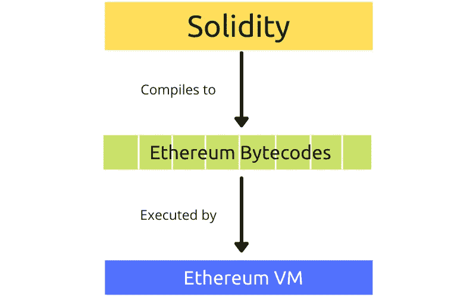
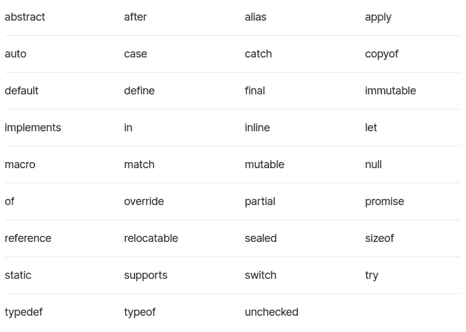
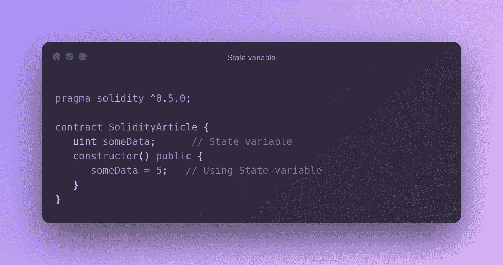
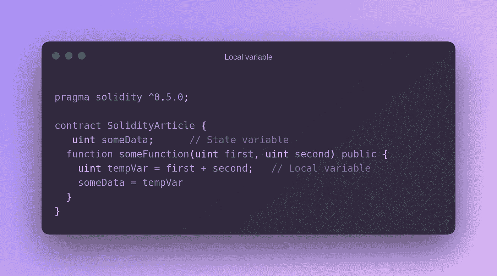
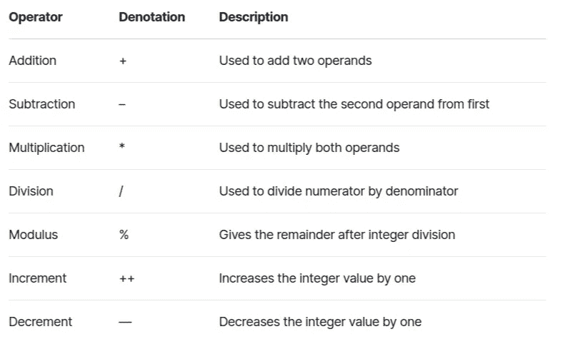
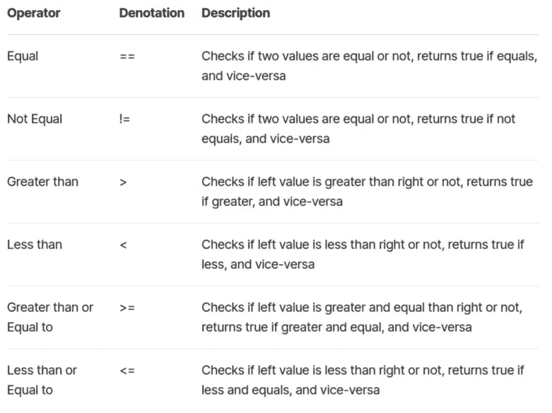
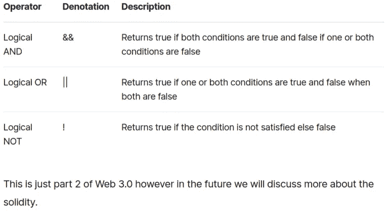

# 坚实的初学者指南:区块链开发

> 原文：<https://javascript.plainenglish.io/a-beginners-guide-to-solidity-blockchain-development-fb3e00212dad?source=collection_archive---------6----------------------->


Photo by [Pierre Borthiry](https://unsplash.com/@peiobty?utm_source=medium&utm_medium=referral) on [Unsplash](https://unsplash.com?utm_source=medium&utm_medium=referral)

Solidity 是一种面向对象的高级编程语言，用于在区块链创建自动化交易的智能合约。这种语言是以太坊项目的参与者在 2014 年提出时创造的。这种语言主要用于在以太坊区块链签订智能合同。

根据它的文档，“Solidity 是一种花括号语言。它受 C++、Python、JavaScript 的影响，设计目标是以太坊虚拟机(EVM)。”

坚固也被认为是 JavaScript 的一种方言。这意味着如果你懂 JavaScript，学习 Solidity 应该很简单。在了解更多关于可靠性的知识之前，让我们先了解一些区块链的基本术语。

# 以太坊虚拟机

以太坊虚拟机(EVM)是以太坊智能合约运行时环境。以太坊虚拟机专注于提供安全性，并允许世界各地的机器执行程序。

虚拟机有效地在代码和执行代码的机器之间创建了一个抽象层。它需要促进软件的可移植性，并确保程序相互隔离，并与它们的宿主隔离。

以太坊虚拟机是作为基于以太坊的智能合约的运行时环境而创建的。



# 智能合同

智能契约是一个分散的程序，它通过执行业务逻辑来响应事件。货币交换、服务交付、数字版权管理控制的信息解锁以及其他形式的数据操作(如更改产权上的名称)都是智能合同执行的可能结果。精明的合同通常写得很扎实。

像 Solidity 这样的智能合约语言是不能被以太坊虚拟机直接执行的。相反，它们被转换成称为操作码的低级机器指令。

现在，您已经了解了 EVM 和智能合约，我们可以继续学习可靠性

# 环境设置

在安装 Solidity 之前，你需要确保你的电脑上已经安装了 Node.js 和 NPM。要在您的 Linux (Ubuntu)中安装 node.js，您可以遵循这篇文章。

一旦你在你的机器上成功安装了 Node.js 和 NPM，你就可以开始安装 Solidity 编译器了，如下所示:

```
sudo npm install -g solc
```

上面的命令将安装 Solcjs 并使其在整个系统中全局可用。现在你可以跑了

```
solcjs --version
```

如果一切正常，您会在终端中看到类似下面的内容

> *你也可以使用名为 Remix IDE 的在线编辑器来编译和运行你的 Solidity 代码。*

# 保留关键字

以下是 Solidity 中的保留关键字:



# 在 Solidity 中导入其他文件

在 Solidity 中导入一个文件类似于 JavaScript，要导入一个文件你可以简单地写

上述语句将“文件”中的所有全局符号导入到当前全局范围中。但是，如果您想创建一个新的全局符号 someName，并将“file”中的所有全局符号作为成员，您可以编写

就像其他编程语言一样，Solidity 既支持单行注释，也支持多行注释。

*   以`//`开始一行，以包含单行注释。
*   以`/*`开始，以`*/`结束，包含多行注释。

# 固体中的变量

在实度中主要有两种类型的变量。

*   **局部变量**:其值将**持续**直到函数完成的变量
*   **状态变量**:其值永久保存在合同存储系统中的变量

## 态变数

状态变量将值永久存储在约定存储中。每个方法都应该有自己的作用域，状态变量应该在任何已定义的函数之外声明。



## 局部变量

局部变量的上下文包含在函数中，不能从函数外部检索。这些变量通常用于存储临时值。



# 实性算子

运算符在每种编程语言中都很重要，因为它们为编程奠定了基础。同样，如果不使用运算符，Solidity 的功能也是不完整的。

坚固性支持以下类型的运算符:

*   算术运算符
*   关系运算符
*   逻辑运算符
*   按位运算符
*   赋值运算符
*   条件运算符

然而，在这篇文章中，我们将只研究其中的 3 个，但在以后的文章中，我将尝试解释所有这些:)

## 算术运算符

这些运算符用于执行数学运算。



## 关系运算符

这些运算符用于比较两个值



## 逻辑运算符

这些运算符用于组合两个或多个条件



# 结论

这就是本文的全部内容。我希望这篇文章对你有用，如果你需要任何帮助，请在评论区告诉我。

你想请我喝杯咖啡吗，你可以在这里做。

让我们在 [Twitter](https://twitter.com/suhailkakar) 和 [LinkedIn](https://www.linkedin.com/in/suhailkakar/) 上连线。

👋感谢阅读，下次见

*原载于*[*blog.suhailkakar.com*](https://blog.suhailkakar.com/a-beginners-guide-to-solidity-blockchain-development)

*更多内容看*[***plain English . io***](http://plainenglish.io/)