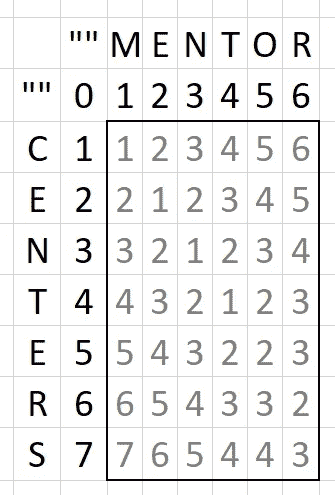
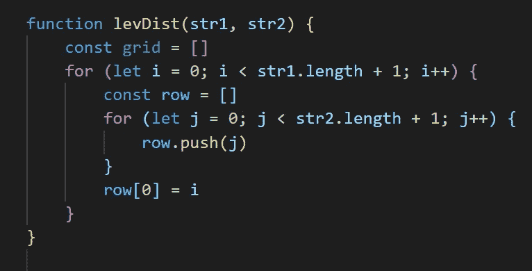
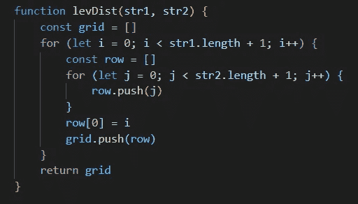

# Levenshtein 距离算法初学者指南(第 2 部分)

> 原文：<https://javascript.plainenglish.io/a-beginners-guide-to-the-levenshtein-distance-algorithm-part-2-how-to-code-a-matrix-in-javascript-5ab308eefcf0?source=collection_archive---------3----------------------->

## 如何用 JavaScript 编写矩阵

本系列的第 1 部分描述并解释了一种称为 Levenshtein 距离的编辑距离度量，这是将一个单词变成另一个单词所需的最少字符编辑次数(就插入、删除或替换而言)。在本文中，我们将看看如何编写一个类似于第 1 部分中描述的[的矩阵，以便可以计算传递给函数的任意一对字符串的 Levenshtein 距离。本教程将在示例中使用普通的 JavaScript，并为初级程序员提供一步一步的指导。](https://medium.com/@redlisa125/a-beginners-guide-to-the-levenshtein-distance-algorithm-part-1-d581fef7588f)

首先，理解矩阵只是一个嵌套的数组是很重要的。例如，下面的数组:

```
arry = [[0, 1, 2],[3, 4, 5],[6, 7, 8]] 
```

可以改写为:

```
arry =[[0, 1, 2],
 [3, 4, 5],
 [6, 7, 8]]
```

接下来，让我们看看如何使用 JavaScript 访问矩阵中的值。我们可以使用符号 arry[0](返回[0，1，2])和 arry [1](表示[3，4，5])等来访问水平的“行”。第二个索引可用于访问所选数组内的值，或数组的垂直“列”组件。例如，arry[1][2]给出了数组[3，4，5]的索引二值，即 5。

为了在 Levenshtein 距离的代码中使用这样的矩阵，我们需要能够动态地访问这些值(即使用变量而不是硬编码的索引值)。让 *i* 表示所选择的内部数组或水平行索引，让 *j* 表示所选择的数组或垂直列索引内的值。为了更好地理解这一点，想象矩阵的垂直轴和水平轴使用 *i* 和 *j* 来标记，如下所示:


如果 *i* = 1 且 *j* = 0，则矩阵值将为 arry[1][0]或 3。当编写 Levenshtein 距离算法时，我们的 JavaScript 代码将为 *i* 和 *j* 生成用于比较两个字符串的值。

回忆一下我们在[第 1 部分](https://medium.com/@redlisa125/a-beginners-guide-to-the-levenshtein-distance-algorithm-part-1-d581fef7588f)中比较两个字符串的矩阵。



我们将使用代码生成一个矩阵，其值如上所示。


编码这个或任何矩阵的第一步是实例化一个包含嵌套数组的外部数组。设置这个空的外部数组等于一个名为 *grid* 的变量。然后我们将使用 for 循环用内部数组填充它。


由于字符串 1 的字符是可理解的行标签，我们知道我们需要创建与字符串 1 中的字母数量相同的数组，加上一个用于开头的空字符串。在 for 循环中，起始值是 *i* = 0，条件是对于小于字符串长度加 1 的所有值，迭代应该继续，并且对于每个循环，索引号 *i* 应该增加 1。对于每次迭代，创建一个名为*行*的空数组。在我们来自第 1 部分的例子中，字符串 1 是“centers ”,这将创建八个空数组，一个用于“centers”中的每个字符，另一个用于开头的空字符串。

接下来，使用嵌套的 for 循环填充每行中的值。我们将需要与字符串 2 中的字符数相同数量的值，加上一个用于开头的空字符串。每个索引 *j* 处的值将变成一个数字，该数字被推送到*行*数组。所以在第二个 for 循环中，让索引 *j* 也从 0 开始。对于小于字符串长度加 1 的所有索引号，迭代应该再次继续。并且对于每个循环，索引号 *j* 也应该增加 1。将 *j* 作为值压入到现在作为占位符创建的每个索引位置。这将为字符串 2 中的每个字符在每一行中生成一个列值。在我们的“centers”和“mentor”示例中，这将在每一行中创建七列值，每一列代表“mentor”中的一个字母加上一个空字符串。


我们可以将这些数字更新为数字行标签，作为每行的直观引用，而不是将 0 作为每个内部数组的第一个值。我们可以通过将每行中的索引 0 值设置为 *i* (该值为 0，并根据字符串 1 的长度递增)并将这些值推送到矩阵中来实现这一点。这将填充一个基本数组，其中第一列的编号为 0，长度为字符串 1，其余行的值设置为 1，长度为字符串 2。



在本系列的下一部分中，编写用 Levenshtein 距离值填充这样一个矩阵的逻辑时，这也很方便。从第一部分我们知道，每一行的第一个值，也就是第一列，总是从给定索引处的字符串 2 到一个空字符串所需的删除次数，或者从数字 0 到字符串 1 的长度值加上一个空字符串。通过用数字标记我们的行，我们已经用任意两个字符串的 Levenshtein 距离计算的第一列正确地填充了我们的矩阵。


最后，为了将所有的*行*数组组合在名为*网格*的父数组中以形成一个矩阵，将这些行中的每一行推入*网格*数组并返回*网格*。



将“中心”和“导师”传递给该函数将产生以下矩阵:


最终的代码看起来像这样:

```
function levDist(str1, str2) { const grid = [] for (let i = 0; i < str1.length + 1; i++) { const row = [] for (let j = 0; j < str2.length + 1; j++) { row.push(j) } row[0] = i grid.push(row) } return grid}
```

现在我们已经编写了一个简单的矩阵，我们可以使用更多的逻辑来填充矩阵，这些值表示传递给函数的任意两个字符串的所有子字符串在每个索引处的 Levenshtein 距离，矩阵中的最后一个值将给出这两个字符串的 Levenshtein 距离。在本系列的第 3 部分[中学习如何用 Levenshtein 距离值填充矩阵。](https://medium.com/@redlisa125/a-beginners-guide-to-the-levenshtein-distance-algorithm-part-3-how-to-code-the-levenshtein-b4721538ba7)

> 来源:
> [https://www.30secondsofcode.org/js/s/Levenshtein 恩斯坦-距离](https://www.30secondsofcode.org/js/s/Levenshtein enshtein-distance) [https://www.youtube.com/watch?v=_1Qb95R87jU](https://www.youtube.com/watch?v=_1Qb95R87jU)
> [https://medium.com/@ethannam/understanding-the-Levenshtein 恩斯坦-距离-方程式-初学者-c 4285 a 5604 f 0](https://medium.com/@ethannam/understanding-the-Levenshtein enshtein-distance-equation-for-beginners-c4285a5604f0)
> [https://www.youtube.com/watch?v=MiqoA-yF-0M](https://www.youtube.com/watch?v=MiqoA-yF-0M)

*更多内容看* [*说白了就是*](http://plainenglish.io/) *。报名参加我们的* [*免费每周简讯*](http://newsletter.plainenglish.io/) *。在我们的* [*社区不和谐*](https://discord.gg/GtDtUAvyhW) *获得独家获得写作机会和建议。*