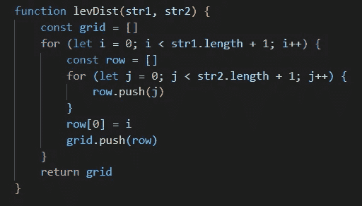
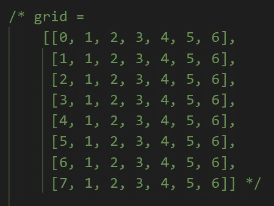
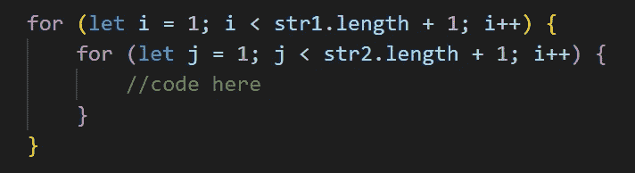
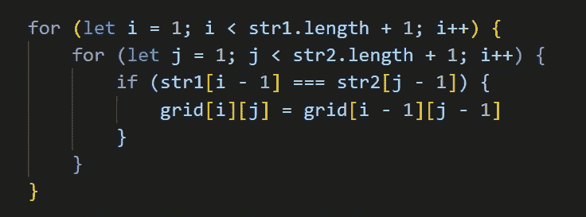
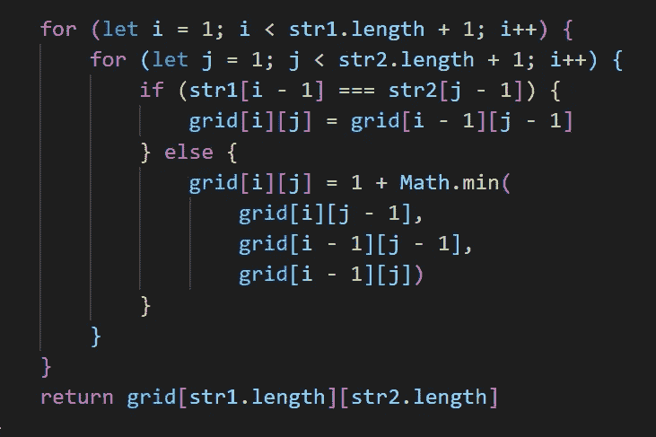
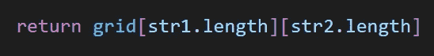
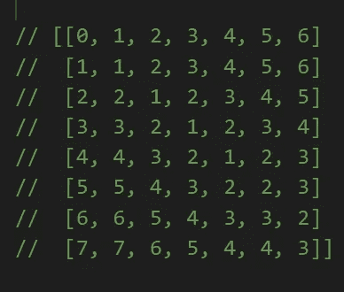

# Levenshtein 距离算法初学者指南(第 3 部分)

> 原文：<https://javascript.plainenglish.io/a-beginners-guide-to-the-levenshtein-distance-algorithm-part-3-how-to-code-the-levenshtein-b4721538ba7?source=collection_archive---------2----------------------->

## 如何编码 Levenshtein 距离矩阵


Photo by [Fotis Fotopoulos](https://unsplash.com/@ffstop?utm_source=medium&utm_medium=referral) on [Unsplash](https://unsplash.com?utm_source=medium&utm_medium=referral)

本系列的第 1 和第 2 部分已经涵盖了对 Levenshtein 距离的基本解释和对 T2 如何编写简单矩阵的分步说明。接下来，我们将创建用任意两个字符串的 Levenshtein 距离值填充矩阵的代码。如果字符串“centers”和“mentor”被传递到函数中，让我们再来看看第 2 部分中代码生成的最终矩阵。



此时，只有第一列显示了正确的 Levenshtein 距离值，因此我们必须用正确的 Levenshtein 距离计算填充其余的数组值。

[回想一下第 1 部分](https://medium.com/@redlisa125/a-beginners-guide-to-the-levenshtein-distance-algorithm-part-1-d581fef7588f)中确定 Levenshtein 距离中每个索引值的模式:如果子字符串的端点相等，则当前索引处的网格值与其左上角的网格值相同。如果子字符串的端点不相等，则当前索引值是周围三个值中最小的一个值，并加 1。

这意味着我们的代码将需要能够检查子字符串的端点在任何给定索引处是否相等，以及索引处周围的值是否相等。如果端点相等，它将需要能够抓住左上角的值。如果端点不相等，它将需要能够找到三个周围值中的最小值。

让我们编写这个功能的代码。删除现有代码底部的“return *grid* ”。我们将用新的逻辑替换它:首先，我们希望循环遍历每行中的每个元素，这样我们就可以设置它的值。为此，我们可以设置另一个嵌套的 for 循环。不过，这一次，我们从第一个索引开始(将 *i* 和 *j* 的起始值设置为 1 ),因为第 0 个索引是一个空字符串，并且这个值已经被我们从[第 2 部分](https://medium.com/@redlisa125/a-beginners-guide-to-the-levenshtein-distance-algorithm-part-2-how-to-code-a-matrix-in-javascript-5ab308eefcf0)设置的矩阵填充。



接下来，创建一个 if 语句，检查字符串 1 在当前索引处是否等于字符串 2。请记住，在矩阵中，两个字符串在每个单词的开头都有一个空字符串("")，但实际的字符串是作为参数传入的，而不是。因此，要检查每个字符串中的最后一个字符，必须使用不同于矩阵中当前索引的索引。每个字符串的端点字符位于索引 *str1* [ *i -* 1]和 *str2* [ *j -* 1]。

如果端点字符相同，则将当前索引值设置为与左上角索引值相同的值。如果当前索引是*网格* [ *i* ][ *j* ]，那么左上角索引是(*网格*[*I-*1][*j-*1])。



否则，如果端点字符不相等，则找到三个周围值中的最小值，或者是当前索引左侧的值(*网格*[*I*]*【j-*1])，当前索引左上角的值(*网格*[*I-*1][*j-*1])， 或者当前索引正上方的值(*网格*[*I-*1】[*j*])，并将当前索引值设置为这个最小值，递增 1。



这段代码将遍历每个数组中的每个元素，并用传入的任意两个字符串的所有子字符串的 Levenshtein 距离值填充它。要查找两个完整字符串之间的最终 Levenshtein 距离，请返回最后一个网格值，即右下角的值。



这个值代表两个字符串的 Levenshtein 距离。

最终的代码看起来像这样:

```
function levDist(str1, str2) { const grid = [] for (let i = 0; i < str1.length + 1; i++) { const row = [] for (let j = 0; j < str2.length + 1; j++) { row.push(j) } row[0] = i grid.push(row) } for (let i = 1; i < str1.length + 1; i++) { for (let j = 1; j < str2.length + 1; j++) { if (str1[i - 1] === str2[j - 1]) { grid[i][j] = grid[i - 1][j - 1] }else { grid[i][j] = 1 + Math.min(
               grid[i][j - 1],
               grid[i - 1][j - 1], 
               grid[i - 1][j]) } } } return grid[str1.length][str2.length]}
```

从我们的[第 1 部分](https://medium.com/@redlisa125/a-beginners-guide-to-the-levenshtein-distance-algorithm-part-1-d581fef7588f)示例中传递两个字符串“导师”和“中心”,得到这个矩阵和 Levenshtein 距离数 3。



Levenshtein 距离是一个很难理解的复杂算法，更不用说编码了。当我需要学习这个算法时，我很难找到针对初学者的现有教程，所以我创建了自己的教程。这个由三部分组成的教程旨在将每个步骤分解成一个过程，任何经验水平的程序员都可以接近这个过程。只要对 JavaScript 有基本的了解，任何人都可以征服这个挑战！

> 来源:
> 
> https://www.30secondsofcode.org/js/s/Levenshtein·恩斯坦距离
> https://www.youtube.com/watch?v=_1Qb95R87jU
> https://medium.com/@ethannam/understanding-the-Levenshtein·恩斯坦距离——初学者方程式——c 4285 a 5604 f 0
> https://www.youtube.com/watch?v=MiqoA-yF-0M

*更多内容看* [*说白了。报名参加我们的*](http://plainenglish.io/) [*免费每周简讯*](http://newsletter.plainenglish.io/) *。在我们的* [*社区*](https://discord.gg/GtDtUAvyhW) *获得独家写作机会和建议。*