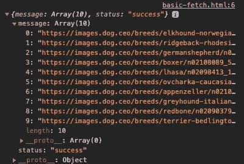
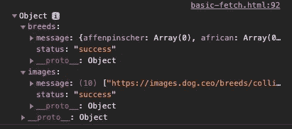

# 通过第三方 API 使用 JavaScript Fetch 的初学者指南

> 原文：<https://javascript.plainenglish.io/a-beginners-guide-to-using-javascript-fetch-with-3rd-party-apis-725c4b33a9c5?source=collection_archive---------10----------------------->

让我们演示 GET 请求的实际使用，使用 Fetch API 构建一个基于特定品种生成狗的图片的应用程序。

Photo by [Julissa Helmuth](https://www.pexels.com/@jhelmuth?utm_content=attributionCopyText&utm_medium=referral&utm_source=pexels) from [Pexels](https://www.pexels.com/photo/beach-sand-water-summer-3800470/?utm_content=attributionCopyText&utm_medium=referral&utm_source=pexels)

# 为什么要使用第三方 API？

回想一下您最近一次在访问网站时看到地图的情形。很有可能地图是使用第三方 API 外包的，比如谷歌地图或 ESRI。

开发者选择第三方 API 而不是从头构建服务的原因有很多。最明显的是*其他人已经为我们做了繁重的工作。*

## Fetch API 简介

`fetch` API 返回一个承诺，包含在 JavaScript 中。Fetch 正逐渐取代 Ajax `XMLHttpRequest`方法成为[现代标准](https://developer.mozilla.org/en-US/docs/Glossary/AJAX)。

当编写浏览器端 JavaScript 时，我们可以使用`fetch` API 来访问和操作来自 HTTP 管道的数据。在这种情况下，HTTP 管道包括狗的图片。

*请记住，大多数第三方 API 都需要某种请求头或认证，如果是这样的话，在发送请求之前还需要做一些工作。*

# 对第三方 API 的基本提取

像所有第三方 API 一样，我们需要参考文档，因为每个 API 都有自己独特的命名约定和要求。今天，我们将使用[狗 API](https://dog.ceo/dog-api/) 进行演示。

让我们首先向 Dog API 请求检索 10 张随机的狗图片。

Basic Fetch request

不太可怕吧？如果我们在浏览器中打开它，我们应该会看到如下所示的响应

此时，我们可以访问通过第三方 API 提供的数据。让我们以此为基础，将请求的内容添加到 DOM 中。

这里我们通过嵌套在一个对象中的数组进行映射，该对象是我们从 Fetch *请求*中接收到的*响应*。你都明白了吗？

对于这个数组中的每个条目或 URL，我们做了 4 件事。

1.  创建一个新的`img`元素。
2.  将 URL 添加到`src`属性中。
3.  从 URL 中提取品种的名称作为`alt`属性。
4.  最后，我们将新图像添加到 DOM 中。

一旦我们完成了数据映射，最终结果应该是一系列呈现到 DOM 的图像。去试试吧！

# 使用 Promise.all 发出多个提取请求

如果我们需要同时向不同的端点发出几个请求呢？自然，我们可能会想出一个庞大的解决方案，比如链接 Fetch 语句或者将它们嵌套在`.then`语句中。😳

我认为这不是世界上最糟糕的事情，但是后者可能是未来维护者的噩梦。幸运的是，有更好的方法。

继续我们的狗应用程序，让我们实现一个搜索功能，一次浏览和选择多个品种。

参考文档，似乎[/api/breedies/list/all](https://dog.ceo/api/breeds/list/all)将是我们需要到达的端点，以列出 API 上所有可用的狗品种。

让我们重构当前的 Fetch，使用一个`Promise.all`事件一次到达 2 个或更多端点。

Example using Promise.all()

事情开始变得有点复杂，但仍然是明智的。在继续前进之前，我们可以`console.log`我们的反应来验证它是我们所期望的。

如果一切都不顺利，我们应该在控制台上看到类似这样的东西。

Promise.all response example

太棒了，接下来我们可以将它连接到 DOM，这样当页面加载时，我们可以同时列出随机的狗图片,*和*获取品种名称列表，以动态填充我们的搜索表单。

Updating DOM to list Checkboxes in the form

# 动态发出多个提取请求

假设我们需要发出的请求数量取决于用户输入。当使用第三方 API 时，我们经常会发现自己受限于已经为我们设计好的东西。

使用 Dog API，如果我们的用户想要同时查看多个狗品种的图片，我们将需要发出多个请求，每个特定品种一个请求。

如果不知道要提前获取的确切路径，我们将不得不动态地构建这些路径。我们已经有我们的品种渲染到我们的形式作为复选框。让我们进行下一步，将这个表单连接到我们的脚本来收集这些数据。

Global event listener for our form

到目前为止，我们已经收集了用户在`queue`中指定的所有品种名称，但是我们仍然没有进行有效请求所需的 URL。让我们使用现有的数据来构建一个新的 URL 数组。

在这一点上，我们已经取得了我们的`queue`,并将每一项重新格式化为一个有效的 URL，我们可以将它发送给 API。现在我们已经准备好动态获取数据了！

Dynamic Fetch requests using Promise.all

还在跟踪吗？现在剩下的就是把结果呈现给用户了！这将是一个 4 步的过程。

1.  清除 DOM 上的当前图像
2.  基于我们的响应对象动态构建一个新的数组。
3.  在不允许重复的情况下，我们必须在展示范围滑块中指定的图像总量时，随机选择品种。
4.  将结果打印到 DOM

上述标准的实现可能如下所示。

这就是全部了！你可以在这里找到这个演示的完整源代码[，在这里](https://gist.github.com/hi-matbub/b8eb80c964a1cb70494c1e38189e1a41)预览风格化的 [live app。编码快乐！👋](https://hi-matbub.github.io/fetch-api-challenge/)