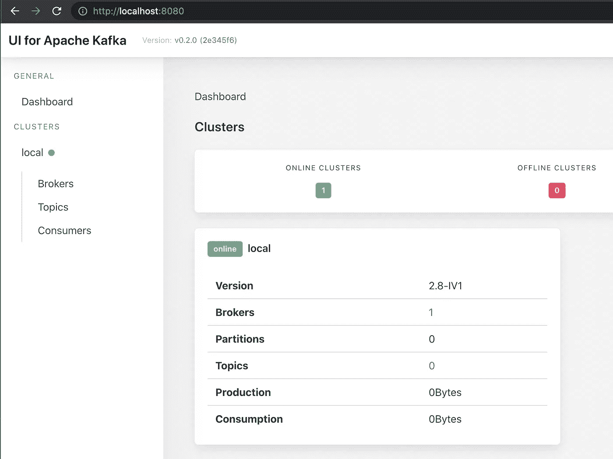
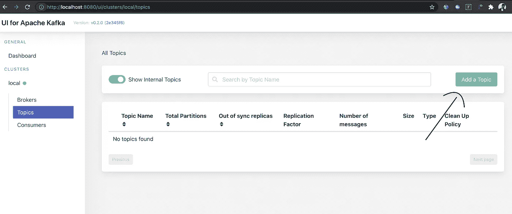
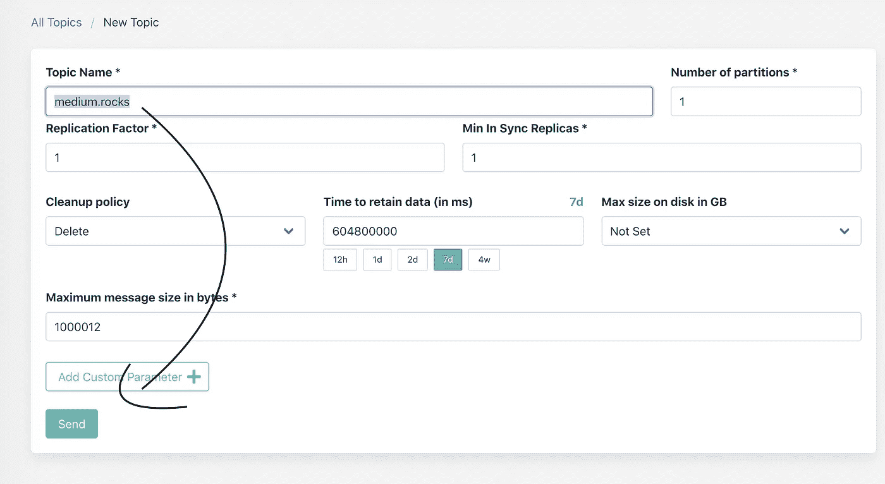
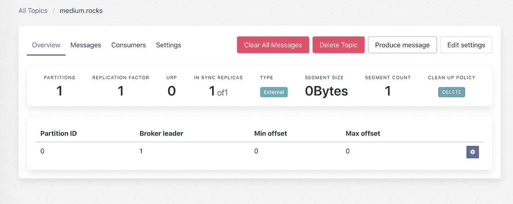
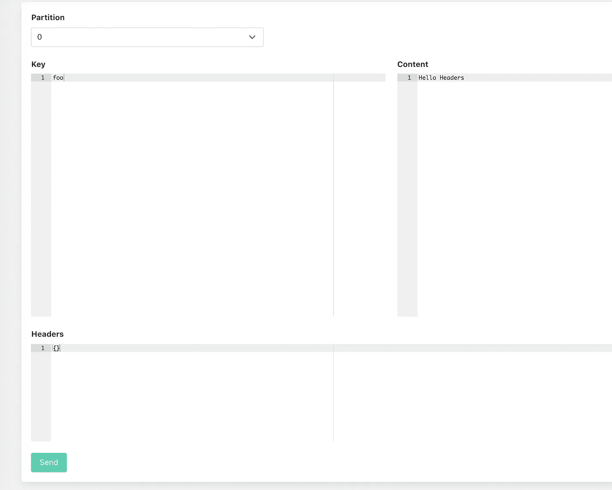
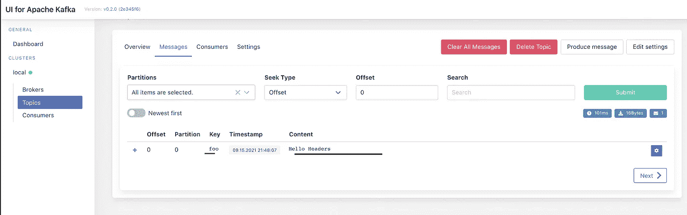
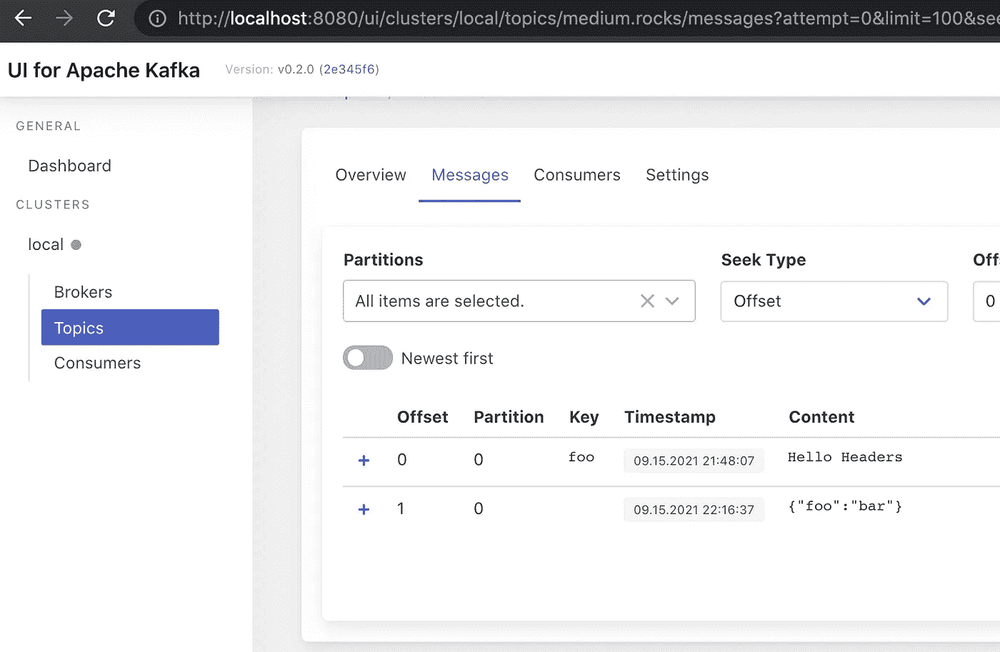
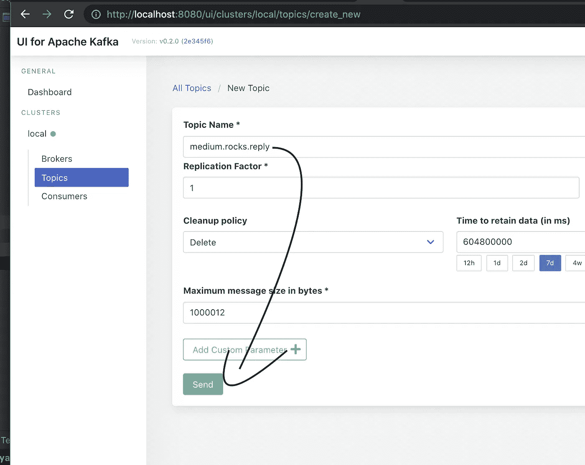

# 用 NestJS 的打字稿介绍卡夫卡

> 原文：<https://javascript.plainenglish.io/a-beginners-introduction-to-kafka-with-typescript-using-nestjs-7c92fe78f638?source=collection_archive---------0----------------------->

## 一个实用的方法，用真实的例子向你介绍 Kafka，KafkaJS，NestJS 微服务。


We will use all Kafka APIs

嘿，在这篇文章中，我们将介绍 Kafka 的基本操作，使用 NestJS 作为我们选择的基于 Typescript 的后端。

> 像往常一样，如果你不想阅读，但看到了源代码…在文章的最后，你会发现我的 git 库，一切都设置好了。

如果你是新来的，我正在用媒体写一些随机的软件工程内容，特别是用打字稿。最近我用 NestJS 添加了一些关于 GraphQL 和 T2 REST API 的教程。在本文中，我将尝试跳过 REST/GraphQL 的一些内容，专注于 Kafka 和 NestJS。

在继续之前，需要了解 Docker、Node.js 和 Typescript/Javascript 的基础知识，以便在没有太多问题的情况下遵循实用指南。

[](/graphql-backend-in-nodejs-made-easy-with-nestjs-1489be18b994) [## 使用 NestJS 简化 Node.js 中的 GraphQL 后端

### 在本文中，我将向您展示如何以一种非常非常简单的方式开始一个 GraphQL 后端项目…使用 NestJS！

javascript.plainenglish.io](/graphql-backend-in-nodejs-made-easy-with-nestjs-1489be18b994) 

# 酷，那么卡夫卡是什么？

在动手之前，简单的解释总是有效的。我们使用 Kafka，但正式的方式是 Apache Kafka，它是一个使用流处理的软件总线的框架实现，并且是开源的。维基百科给出了更详细的解释[这里](https://en.wikipedia.org/wiki/Apache_Kafka)。

试着抽象一下解释，你可以考虑一种方法，你可以发送消息到特定的地方，在那里你“不在乎”谁会收到它，如果他们会收到的话。你放消息的这些特定地方被称为**主题**，你可以认为当你在那里添加一条消息时，你就是一个**生产者**，任何获取这条信息的人都可以被认为是一个**消费者。**这一过程可以让数百万消费者以某种方式获得所发送的信息。

该过程是完全异步的，包含五个主要的 API:

*   生产者:负责创建消息
*   消费者:负责…消费信息
*   连接器:可以“重用”生产者/消费者 API 和链接主题
*   流:负责将输入转换为输出结果
*   Admin:用于管理 Kafka 主题。

我们可能要花几百个小时去深入了解卡夫卡是什么、为什么以及如何有趣，但现在我们将集中在一个简短的现实生活例子中使用它。

> 想看看谁也用卡夫卡？所有财富 100 强企业的 [~80%呢？](https://kafka.apache.org/)

对于使用卡夫卡，你是幸运的！你不需要做太多的事情来使它运行起来。在 [**Docker**](https://www.docker.com/) 的帮助下，您将能够使用我的示例运行 Docker 命令来设置所有需要的服务器，并包括一个仪表板工具来简化我们的过程。

我们可以开始了吗？

在动手之前，我们必须确保我们已经配置了一个 Kafka，并且正在运行。继续之前，请确保您的计算机中有 Docker。由于我们要使用 NestJS，我将使用一个名为 nestjs-kafka-tutorial 的文件夹，其中将包含我要共享的 [github 项目](https://github.com/makinhs/nestjs-kafka-tutorial)。因此，在您的工作文件夹中，让我们首先创建一个允许我们运行我们需要运行的文件，名为 **docker-compose.yml** ，包含以下内容:

```
version: '2'
services:
  zookeeper:
    image: confluentinc/cp-zookeeper:latest
    environment:
      ZOOKEEPER_CLIENT_PORT: 2181
      ZOOKEEPER_TICK_TIME: 2000
    ports:
      - 22181:2181

  kafka:
    image: confluentinc/cp-kafka:latest
    depends_on:
      - zookeeper
    ports:
      - 29092:29092
    environment:
      KAFKA_BROKER_ID: 1
      KAFKA_ZOOKEEPER_CONNECT: zookeeper:2181
      KAFKA_ADVERTISED_LISTENERS: PLAINTEXT://kafka:9092,PLAINTEXT_HOST://localhost:29092
      KAFKA_LISTENER_SECURITY_PROTOCOL_MAP: PLAINTEXT:PLAINTEXT,PLAINTEXT_HOST:PLAINTEXT
      KAFKA_INTER_BROKER_LISTENER_NAME: PLAINTEXT
      KAFKA_OFFSETS_TOPIC_REPLICATION_FACTOR: 1

  kafka_ui:
    image: provectuslabs/kafka-ui:latest
    depends_on:
      - kafka
    ports:
      - 8080:8080
    environment:
      KAFKA_CLUSTERS_0_ZOOKEEPER: zookeeper:2181
      KAFKA_CLUSTERS_0_NAME: local
      KAFKA_CLUSTERS_0_BOOTSTRAPSERVERS: kafka:9092
```

简而言之，我们正在运行一个必需的服务器、将被编排的代理和一个 UI 工具。那里的图片可以在网上免费使用，在我写这篇文章的时候仍然可以免费使用。

这样，我们可以在您的根文件夹中运行以下命令:

```
docker compose up -d
```

这将反映在以下内容中:

```
➜  nestjs-kafka-tutorial git:(main) ✗ docker compose up -d
[+] Running 4/4
 ⠿ Network nestjs-kafka-tutorial_default        Created                                                                                                                                                     0.1s
 ⠿ Container nestjs-kafka-tutorial_zookeeper_1  Started                                                                                                                                                     0.6s
 ⠿ Container nestjs-kafka-tutorial_kafka_1      Started                                                                                                                                                     1.5s
 ⠿ Container nestjs-kafka-tutorial_kafka_ui_1   Started                                                                                                                                                     2.4s
➜  nestjs-kafka-tutorial git:(main) ✗
```

如果将脱离终端(它将在后台运行),并将“神奇地”为您启动卡夫卡。要查看它是否工作，您只需打开 [http://localhost:8080/](http://localhost:8080/) ，将会看到以下内容:



UI for Apache Kafka using the docker compose file

如果您有在线集群，您就可以开始了！

我们就来测试一下能不能和卡夫卡“玩”起来。让我们在主题按钮中创建一个**主题**，然后添加一个主题:



Adding a topic…

现在，我们可以用任何名称创建一个新主题(建议搜索命名模式):



Creating a medium.rocks topic

通过这个设置，我们可以向一个名为“medum.rocks”的主题发送消息。现在，要使用仪表板发送消息，我们可以执行以下操作:

*   点击**产生信息**



*   添加密钥和内容并发送



如果刷新浏览器，您将看到以下内容:



如果你做了这些工作，我们就可以开始编码了！不要担心，在本文中，我们将通过 STRING 或其他方式共享 JSON 内容。毕竟，我们是爱打字稿的不是吗？

让我们做 [NestJS](https://nestjs.com/) ！NestJS 是一个非常可扩展的框架，默认情况下使用 ExpressJS 来支持构建 API。它支持构建整体的和非整体的 API。为了简化本文，我将在我的 git repo 中创建两个迷你项目，一个包含生产者项目，另一个包含消费者项目。我可能会在另一篇文章中回顾一下微服务配置和搭建，但这篇文章我们将让 Kafka 发挥作用！

因此，请确保安装他们的 CLI:

```
npm i -g @nestjs/cli
```

在我们的根文件夹中，让我们创建生产者 API！

```
nest new producer
```

我将使用 yarn 作为包管理器，但您可以随意使用您想要的任何东西:

```
**nestjs-kafka-tutorial** **git:(main)** nest new producer⚡  We will scaffold your app in a few seconds..CREATE producer/.eslintrc.js (631 bytes)CREATE producer/.prettierrc (51 bytes)CREATE producer/README.md (3339 bytes)CREATE producer/nest-cli.json (64 bytes)CREATE producer/package.json (1964 bytes)CREATE producer/tsconfig.build.json (97 bytes)CREATE producer/tsconfig.json (365 bytes)CREATE producer/src/app.controller.spec.ts (617 bytes)CREATE producer/src/app.controller.ts (274 bytes)CREATE producer/src/app.module.ts (249 bytes)CREATE producer/src/app.service.ts (142 bytes)CREATE producer/src/main.ts (208 bytes)CREATE producer/test/app.e2e-spec.ts (630 bytes)CREATE producer/test/jest-e2e.json (183 bytes)? **Which package manager would you ❤️  to use?** yarn✔ Installation in progress... ☕🚀  Successfully created project producer👉  Get started with the following commands:$ cd producer$ yarn run startThanks for installing Nest 🙏Please consider donating to our open collectiveto help us maintain this package.**🍷  Donate:** https://opencollective.com/nest
```

这应该足够搭建基本的 NestJS 项目了。NestJS 项目的基本框架给出了一个最小的配置，其中设置了一个 REST 端点，运行在端口 3000 上。对于这一部分，请确保在您的终端中，您正在名为“producer”的文件夹中工作。

在生成器内部执行任何操作之前，请移除。git 文件夹和。gitignore 因为在这个项目中我们已经有了。git 在我们的根，我们避免过度配置和不谈论卡夫卡。

```
nestjs-kafka-tutorial git:(main) ✗ cd producer
producer git:(master) ✗ rm -rf .git
➜  producer git:(main) ✗
➜  producer git:(main) ✗ rm -rf .gitignore 
➜  producer git:(main) ✗
```

我们现在需要添加 Kafka 和微服务模块。

添加卡夫卡很简单，如下所示:

```
yarn add kafkajs
```

回应会是这样的:

```
**➜  producer** **git:(main) ✗** yarn add kafkajs**yarn add v1.22.10**warning ../../../package.json: No license field[1/4] 🔍  Resolving packages...[2/4] 🚚  Fetching packages...[3/4] 🔗  Linking dependencies...warning " > ts-loader@9.2.5" has unmet peer dependency "webpack@^5.0.0".[4/4] 🔨  Building fresh packages...success Saved lockfile.success Saved 1 new dependency.info Direct dependencies└─ kafkajs@1.15.0info All dependencies└─ kafkajs@1.15.0✨  Done in 3.61s.
```

现在，微服务模块:

```
yarn add @nestjs/microservices
```

大概是这样的:

```
**➜  producer** **git:(main) ✗** yarn add @nestjs/microservices**yarn add v1.22.10**warning ../../../package.json: No license field[1/4] 🔍  Resolving packages...[2/4] 🚚  Fetching packages...[3/4] 🔗  Linking dependencies...warning " > ts-loader@9.2.5" has unmet peer dependency "webpack@^5.0.0".[4/4] 🔨  Building fresh packages...success Saved lockfile.success Saved 2 new dependencies.info Direct dependencies└─ @nestjs/microservices@8.0.6info All dependencies├─ @nestjs/microservices@8.0.6└─ json-socket@0.3.0✨  Done in 5.07s.**➜  producer** **git:(main) ✗**
```

酷，我们至少要为我们的制作人做点什么！

现在，使用我们的 app.module.ts，它是 NestJS 应用程序的主模块，我们可以像下面这样配置 Kafka 模块:

```
import { Module } from '@nestjs/common';
import { AppController } from './app.controller';
import { AppService } from './app.service';
import {ClientsModule, Transport} from '@nestjs/microservices';

@Module({
  imports: [
    ClientsModule.*register*([
      {
        name: 'any_name_i_want',
        transport: Transport.*KAFKA*,
        options: {
          client: {
            clientId: 'any_client_id_i_want',
            brokers: ['localhost:29092'],
          },
          consumer: {
            groupId: 'an_unique_string_id',
          },
        },
      },
    ]),
  ],
  controllers: [AppController],
  providers: [AppService],
})
export class AppModule {}
```

同样，为了便于在不同的环境中运行同一个项目，我避免但 100%建议将任何硬代码配置字符串移动到. env 文件中。除此之外，这里最重要的是:

```
brokers: ['localhost:29092'],
```

这个端口 29092 和 localhost 是在我们的 **docker-compose.yml** 中设置的。在实际场景中，您应该将这个 URL 更改为您的 stage/production URL，并再次使用. env 文件来设置它，否则您将会编写过多的代码。

让我们运行应用程序，看看在添加 Kafka 模块时是否有任何错误:

```
➜  producer git:(main) ✗ yarn start
yarn run v1.22.10
warning ../../../package.json: No license field
$ nest start
[Nest] 14895  - 09/15/2021, 10:09:16 PM     LOG [NestFactory] Starting Nest application...
[Nest] 14895  - 09/15/2021, 10:09:16 PM     LOG [InstanceLoader] ClientsModule dependencies initialized +27ms
[Nest] 14895  - 09/15/2021, 10:09:16 PM     LOG [InstanceLoader] AppModule dependencies initialized +0ms
[Nest] 14895  - 09/15/2021, 10:09:16 PM     LOG [RoutesResolver] AppController {/}: +4ms
[Nest] 14895  - 09/15/2021, 10:09:16 PM     LOG [RouterExplorer] Mapped {/, GET} route +2ms
[Nest] 14895  - 09/15/2021, 10:09:16 PM     LOG [NestApplication] Nest application successfully started +1ms
```

似乎一切都好！使用 ClientsModule，我们可以在控制器中注入一个 Kafka 客户端！让我们现在就开始吧:

要使用 kafka 客户端，请访问您的 src/app.controller.ts。

它包含脚手架的以下内容:

```
import { Controller, ***Get*** } from '@nestjs/common';
import { AppService } from './app.service';

@Controller()
export class AppController {
  constructor(private readonly appService: AppService) {}

  @Get()
  getHello(): string {
    return this.appService.getHello();
  }
}
```

在构造函数中，我们可以像下面这样简单地添加 kafka 客户端:

```
import { Controller, ***Get***, Inject } from '@nestjs/common';
import { AppService } from './app.service';
import { ClientKafka } from '@nestjs/microservices';

@Controller()
export class AppController {
  constructor(
    private readonly appService: AppService,
    @Inject('any_name_i_want') private readonly client: ClientKafka,
  ) {}

  @Get()
  getHello(): string {
    return this.appService.getHello();
  }
}
```

这里唯一看起来奇怪的是“任何名字我想要”。这个变量应该与您在客户端模块上设置的相同，这已经是复制代码，也是将它放在. env 上的另一个原因。

酷，现在添加了一个名为“kafka-test”的随机“get”请求，你永远不能说它是一个 REST 端点:

```
import { Controller, ***Get***, Inject } from '@nestjs/common';
import { AppService } from './app.service';
import { ClientKafka } from '@nestjs/microservices';

@Controller()
export class AppController {
  constructor(
    private readonly appService: AppService,
    @Inject('any_name_i_want') private readonly client: ClientKafka,
  ) {}

  @Get()
  getHello(): string {
    return this.appService.getHello();
  }

  @Get('kafka-test')
  testKafka(){
    return this.client.emit('medium.rocks', {foo:'bar'})
  }
}
```

当您点击 get to localhost:3000/kafka-test 时，该应用程序将尝试向我们之前创建的名为“medium.rocks”的主题发出一条 JSON 消息。我用 Postman 来测试，但是你可以像这样卷曲:

```
curl --location --request GET 'http://localhost:3000/kafka-test'
```

您将收到类似以下内容的邮件:

```
[{"topicName": "medium.rocks","partition": 0,"errorCode": 0,"baseOffset": "2","logAppendTime": "-1","logStartOffset": "0"}]
```

这只是确认你发送了你想要的信息。

回到我们之前讨论过的 kafka 仪表板，您可以刷新浏览器并看到以下内容:



现在你有了 foo/bar 内容和 Kafka 的另一个好处…消费者不需要实时阅读你的信息。我不会在这方面深入探讨，但是您可以配置一个消费者从一个特定的点或者只从“实时消息”中读取，这为您作为一个软件工程师创造了许多可能性。

对于初学者来说，我们已经和制作人结束了。现在我们去创建一个消费者，作为奖励，我想展示一种经典的“请求/响应”方法，当卡夫卡之间交流时，有时**使用**是有意义的。

为了创建一个消费者，我们将完全按照**相同的**NestJS 搭建…所以回到我们的根文件夹:

```
nest new consumer
```

作为生产者的回应:

```
**➜  nestjs-kafka-tutorial** **git:(main) ✗** nest new consumer⚡  We will scaffold your app in a few seconds..CREATE consumer/.eslintrc.js (631 bytes)CREATE consumer/.prettierrc (51 bytes)CREATE consumer/README.md (3339 bytes)CREATE consumer/nest-cli.json (64 bytes)CREATE consumer/package.json (1964 bytes)CREATE consumer/tsconfig.build.json (97 bytes)CREATE consumer/tsconfig.json (365 bytes)CREATE consumer/src/app.controller.spec.ts (617 bytes)CREATE consumer/src/app.controller.ts (274 bytes)CREATE consumer/src/app.module.ts (249 bytes)CREATE consumer/src/app.service.ts (142 bytes)CREATE consumer/src/main.ts (208 bytes)CREATE consumer/test/app.e2e-spec.ts (630 bytes)CREATE consumer/test/jest-e2e.json (183 bytes)? **Which package manager would you ❤️  to use?** yarn✔ Installation in progress... ☕🚀  Successfully created project consumer👉  Get started with the following commands:$ cd consumer$ yarn run startThanks for installing Nest 🙏Please consider donating to our open collectiveto help us maintain this package.**🍷  Donate:** https://opencollective.com/nest**➜  nestjs-kafka-tutorial** **git:(main) ✗**
```

现在打开消费者文件夹并移除。饭桶和。gitignore *为了* *为了这篇文章:*

```
**➜  nestjs-kafka-tutorial** **git:(main) ✗** cd consumer**➜  consumer** **git:(master) ✗** rm -rf .git .gitignore
```

从 NestJS 安装 kafkajs 和微服务模块:

```
**➜  consumer** **git:(main) ✗** yarn add @nestjs/microservices kafkajs**yarn add v1.22.10**warning ../../../package.json: No license field[1/4] 🔍  Resolving packages...[2/4] 🚚  Fetching packages...[3/4] 🔗  Linking dependencies...warning " > ts-loader@9.2.5" has unmet peer dependency "webpack@^5.0.0".[4/4] 🔨  Building fresh packages...success Saved lockfile.success Saved 3 new dependencies.info Direct dependencies├─ @nestjs/microservices@8.0.6└─ kafkajs@1.15.0info All dependencies├─ @nestjs/microservices@8.0.6├─ json-socket@0.3.0└─ kafkajs@1.15.0✨  Done in 6.53s.**➜  consumer** **git:(main) ✗**
```

现在，打开 consumer/src/app.module.ts:

```
import { Module } from '@nestjs/common';
import { AppController } from './app.controller';
import { AppService } from './app.service';
import { ClientsModule, Transport } from '@nestjs/microservices';

@Module({
  imports: [
    ClientsModule.*register*([
      {
        name: 'any_name_i_want',
        transport: Transport.*KAFKA*,
        options: {
          client: {
            clientId: 'any_client_id_i_want',
            brokers: ['localhost:29092'],
          },
          consumer: {
            groupId: 'an_unique_string_id',
          },
        },
      },
    ]),
  ],
  controllers: [AppController],
  providers: [AppService],
})
export class AppModule {}
```

> 再次…这篇文章只是为了展示如何在 Typescript 中使用 Kafka，用 NestJS。请不要在你的项目中使用硬编码配置。请至少使用. env。

一切看起来都一样，对吗？但是，对于消费者来说，我们需要更改 **main.ts** 文件，允许我们消费消息。为此，我们将使用以下内容更新 main.ts:

```
import { ***NestFactory*** } from '@nestjs/core';
import { AppModule } from './app.module';
import {MicroserviceOptions, Transport} from '@nestjs/microservices';

async function bootstrap() {
  const app = await ***NestFactory***.createMicroservice<MicroserviceOptions>(
    AppModule,
    {
      transport: Transport.*KAFKA*,
      options: {
        client: {
          brokers: ['localhost:29092'],
        },
      },
    },
  );
  await app.listen();
}
bootstrap();
```

> 我已经说了很多，但是经纪人可能会使用. env 文件…这是你的功课

现在，我们终于要配置消费者了…我们将重构脚手架，并聆听“medium.rocks”主题。要做到这一点，在我们的 app.controller.ts 中，让我们用以下内容进行重构:

```
import {Controller} from '@nestjs/common';
import {
  ***Ctx***,
  KafkaContext,
  ***MessagePattern***,
  Payload,
} from '@nestjs/microservices';

@Controller()
export class AppController {
  constructor() {
  }

  @MessagePattern('medium.rocks')
  readMessage(@Payload() message: any, @Ctx() context: KafkaContext) {
    const originalMessage = context.getMessage();
    const response =
      `Receiving a new message from topic: medium.rocks: ` +
      ***JSON***.stringify(originalMessage.value);
    ***console***.log(response);
    return response;
  }
}
```

现在我们有了一个名为 **readMessage** 的函数，它会尝试不时地读取来自名为“medium.rocks”的主题的任何消息，如果发生了什么，它会记录在我们的控制台中。

在测试之前，我将在 producer/src/app.controller.ts 中添加一个日期，以便查看我们发送的消息的差异:

```
@Get('kafka-test')
testKafka(){
  return this.client.emit('medium.rocks', {foo:'bar', data: new ***Date***().toString()})
}
```

请在继续之前重新启动您的生成器。

一旦生成器重新启动，在另一个选项卡中，请使用以下命令启动使用者:

```
yarn start
```

您将看到如下内容:

```
➜  consumer git:(main) ✗ yarn start
yarn run v1.22.10
warning ../../../package.json: No license field
$ nest start
[Nest] 16855  - 09/15/2021, 10:47:23 PM     LOG [NestFactory] Starting Nest application...
[Nest] 16855  - 09/15/2021, 10:47:23 PM     LOG [InstanceLoader] ClientsModule dependencies initialized +25ms
[Nest] 16855  - 09/15/2021, 10:47:23 PM     LOG [InstanceLoader] AppModule dependencies initialized +1ms
[Nest] 16855  - 09/15/2021, 10:47:23 PM     LOG [ServerKafka] INFO [Consumer] Starting {"timestamp":"2021-09-15T20:47:23.274Z","logger":"kafkajs","groupId":"nestjs-group-server"}
[Nest] 16855  - 09/15/2021, 10:47:26 PM     LOG [ServerKafka] INFO [ConsumerGroup] Consumer has joined the group {"timestamp":"2021-09-15T20:47:26.292Z","logger":"kafkajs","groupId":"nestjs-group-server","memberId":"nestjs-consumer-server-f20adf4c-dca8-4196-9a08-f33a88ae281f","leaderId":"nestjs-consumer-server-f20adf4c-dca8-4196-9a08-f33a88ae281f","isLeader":true,"memberAssignment":{"medium.rocks":[0]},"groupProtocol":"RoundRobinAssigner","duration":3017}
[Nest] 16855  - 09/15/2021, 10:47:26 PM     LOG [NestMicroservice] Nest microservice successfully started +5ms
```

现在我们可以再次卷曲我们的生产者:

```
curl --location --request GET 'http://localhost:3000/kafka-test'
```

完成此操作后，在您的消费者选项卡中，您应该会看到如下内容:

```
[Nest] 16855  - 09/15/2021, 10:47:26 PM     LOG [NestMicroservice] Nest microservice successfully started +5ms
Receiving a new message from topic: medium.rocks: {"foo":"bar","data":"Wed Sep 15 2021 22:48:02 GMT+0200 (Central European Summer Time)"}
```

就是这样。极其基础的场景用 NestJS 解决！您可以使用两个不同的应用程序从 Kafka 服务器生成和使用消息！

使用这种方法，您可以处理向特定主题发布消息和消费它们以处理收到的信息之间的大部分异步过程。

当然，在微服务上还有一个全新的领域需要学习，还有如何配置 Kafka 的模式，如何命名主题，我们应该如何用模式、版本控制等等来处理消息……但是，通过这篇文章，至少你可以对正在发生的事情有一个最基本的了解。

在结束这篇庞大的初学者文章之前，我想为您实际需要接收已消费的 Kafka 消息的响应的特定情况添加一个概念证明。我们现在就开始吧！

为了尝试一种请求/响应方法，这种方法在一些场景中并不理想，但对于其他场景可能是有意义的，NestJS 允许我们(在引擎盖下)接收来自消费者的响应。它基本上允许我们连接/断开同一个主题，我们正在发送一条消息，但以. reply 结束。在我们的例子中，我们需要一个新的主题称为' medium.rocks.reply '。为此，我将在我们的 UI 工具中创建一个新主题:



这应该足以让 NestJS 处理请求/响应。

> 请注意，如果您没有任何关于自动创建主题的阻止程序，则可能不需要此过程，但在一些企业公司中，您可能需要在使用之前创建主题。在这篇文章中，我测试了创建和不创建两种方式，它们都有效，因为我们使用了 docker compose，它不会**阻止**我们**即时创建**新主题。

现在，在我们的生成器中，特别是在我们的控制器中，我们需要**在收到响应之前发送**一个事件，但是我们还需要配置一种接收它的方式，在 NestJS 中是的**subscribe response。这个过程非常简单，应该是这样的:**

```
import {Controller, ***Get***, Inject, OnModuleDestroy, OnModuleInit} from '@nestjs/common';
import { AppService } from './app.service';
import { ClientKafka } from '@nestjs/microservices';

@Controller()
export class AppController implements OnModuleInit, OnModuleDestroy{
  constructor(
    private readonly appService: AppService,
    @Inject('any_name_i_want') private readonly client: ClientKafka,
  ) {}

  async onModuleInit() {
    ['medium.rocks'].forEach((key) => this.client.subscribeToResponseOf(`${key}`));
    await this.client.connect();
  }

  async onModuleDestroy() {
    await this.client.close();
  }

  @Get()
  getHello(): string {
    return this.appService.getHello();
  }

  @Get('kafka-test')
  testKafka(){
    return this.client.emit('medium.rocks', {foo:'bar', data: new ***Date***().toString()})
  }

  @Get('kafka-test-with-response')
  testKafkaWithResponse(){
    return this.client.send('medium.rocks', {foo:'bar', data: new ***Date***().toString()})
  }

}
```

我们只在 **onModuleInit** 中添加了一个数组，因为在实际场景中，您的控制器可能会产生/监听多个主题。此外，NestJS 将在试图订阅的主题中自动添加一个. reply。因此，在我们的例子中，它是**中型。岩石。回复。**

酷，那应该够了。让我们再次运行生产者，并点击卡夫卡-测试-回应:

```
**➜  consumer** **git:(main) ✗** curl --location --request GET 'http://localhost:3000/kafka-test-with-response'Receiving a new message from topic: medium.rocks: {"foo":"bar","data":"Wed Sep 15 2021 23:11:13 GMT+0200 (Central European Summer Time)"}**%**                                                                              **➜  consumer** **git:(main) ✗**
```

太棒了。我们既可以**发出**一条消息，也可以在特定的场景中等待响应！

这两种方法应该可以让你面对现实生活中的大部分挑战！

Kafka、API、Typescript 和软件工程太详细了，无法包含在一篇文章中。在本文中，我试图使用 NestJS 简化使用 Typescript 和 Kafka 进行编码的操作。尽管这篇文章是为 Kafka 的初学者写的，但是需要很多关于构建 API 的预备知识，知道 Docker 和 Typescript。我真的希望这篇文章中的抽象能让你作为读者开始你的概念证明，并使用 NestJS 与 Kafka 一起玩。如果你想成为一名软件工程师，微服务是一个不可忽视的趋势。

这篇文章比我预期的要大，我试图在这里避开几个话题。请随意提出我可以写得更详细并在新文章中分享的任何话题。

像往常一样，我的 POC 可以在我的公共 github 项目[这里](https://github.com/makinhs/nestjs-kafka-tutorial)中找到。

我真的很喜欢写和分享我认为可以贡献的知识。如果这篇文章对你有用，请喜欢和/或评论它，因为它让我明白它是否有用。当我把我的知识翻译成文章时，我也在学习，欢迎任何反馈！

如果你还是迷路了，特别是对于 NestJS，请不要忘记获取我的 NestJS 初学者指南！

对于此处的 RestAPI 脚手架:

[](https://makinhs.medium.com/creating-a-rest-api-series-with-nestjs-part-01-scaffolding-and-basic-cli-usage-30ace19c5bb8) [## 使用 NestJS 创建 REST API 系列—第 1 部分—搭建和基本 CLI 用法

### 欢迎回来！在这个迷你系列文章中，我将指导您如何使用 NestJS 框架构建 REST API

makinhs.medium.com](https://makinhs.medium.com/creating-a-rest-api-series-with-nestjs-part-01-scaffolding-and-basic-cli-usage-30ace19c5bb8) 

对于带有 NestJS 和 Typescript 的 GraphQL，请访问:

[](/graphql-backend-in-nodejs-made-easy-with-nestjs-1489be18b994) [## 使用 NestJS 简化 Node.js 中的 GraphQL 后端

### 在本文中，我将向您展示如何以一种非常非常简单的方式开始一个 GraphQL 后端项目…使用 NestJS！

javascript.plainenglish.io](/graphql-backend-in-nodejs-made-easy-with-nestjs-1489be18b994) 

感谢您的阅读，再见！

> *如果这类文章过于简单，而你又觉得自己准备了一次真正的冒险，特意在一个遥远的好报酬的基础上，请尝试加入*[*【Toptal】*](https://topt.al/KncQD8)*[*链接*](https://topt.al/KncQD8)*[*https://topt.al/KncQD8*](https://topt.al/KncQD8)*。Toptal 是一个伟大的自由职业者社区，我很高兴在那里见到你！***

***更多内容请看*[***plain English . io***](http://plainenglish.io)**