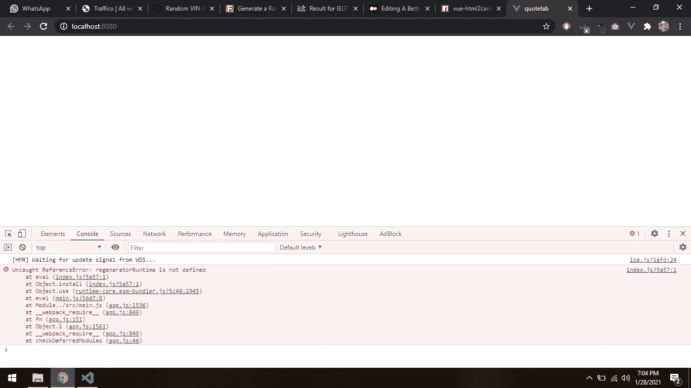
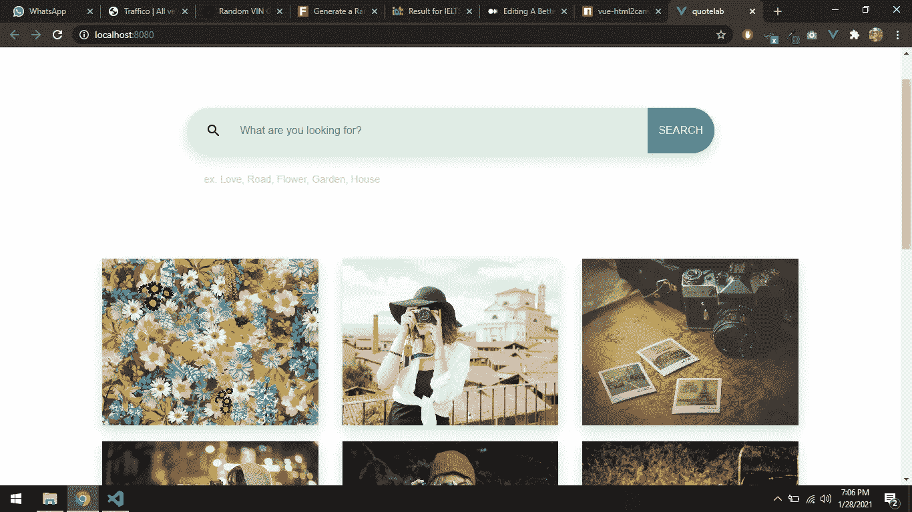

# Vue 3 中 Html2Canvas 的更好替代

> 原文：<https://javascript.plainenglish.io/a-better-alternative-to-html2canvas-in-vuejs-3-e0686755d56e?source=collection_archive---------3----------------------->


主导的和最流行的解决方案存在一种危险，尤其是当新的变化出现时。在我作为一名 ***Vue.js 软件开发人员*** 改进我的投资组合的冒险中，我受到启发，创建了一个将 HTML 元素转化为图像的项目。我对我发现的 npm 包和 API 非常满意。我想要的 JavaScript 包得到了积极的评价，这也有力地支持了我的信心。

我花了一周时间解决的主要挑战是使用 Vue.js 2 & 3 中的 **Html2Canvas** 包，我想告诉你我是如何用一个不太整理的包解决这个问题的。

## 问题是

经过精心制作甜美 UI 的热情开发过程，连接用于图像选择的**[**pix abay API**](https://pixabay.com/api/docs/)，利用 **Vuex** 状态管理机制，以及 ***将*** 组件化在一起，我已经准备好使用将文字引用转换成图像的想法将 HTML 元素转换成图片。当我安装了[**Vue-html 2 can vas**](https://www.npmjs.com/package/vue-html2canvas)NPM 包并集成到我的 **Vue 3 app** 中时，我傻眼了，屏幕一片空白。**

****

**Blank Screen after installing Vue-Html2Canvas**

```
**# npm install vue-html2canvas***import { createApp } from ‘vue’
import store from “./store”
import App from ‘./App.vue’* ***import VueHtml2Canvas from ‘vue-html2canvas’***const app = createApp(App)
app.use(store)
**app.use(VueHtml2Canvas)**
app.mount(‘#app’)
```

**它完全摧毁了我的应用程序，在控制台上没有任何合理的警告，但每当我在 main.js 文件中注释掉那行代码时，它又开始工作了。这种情况持续了一周，甚至在我用谷歌在网上搜索解决方案之后。**

## **解决方案**

**最终，经过一番祈祷，我找到了一个不同的 npm 包，它甚至比 *Html2Canvas* 还要老，叫做[**Dom-To-Image-More**](https://www.npmjs.com/package/dom-to-image-more)。我不情愿地在项目中安装了这个包，令我惊讶的是，它完全按照我想要的那样工作。下面的图片证实了我的说法。**

****

**Dom-To-Image-More solved the crazy issue of a blank screen**

## **结论**

> **总之，承担升级我的投资组合的新的和光荣的冒险给我上了我软件开发生涯中重要的一课。这个教训就是，“永远不要相信最流行的做事方式”。我希望这能解决其他人在使用 Vue.js 3 中的 Html2Canvas 时遇到的问题，也建议你在开始之前寻找多种方法来做一件事。如果你打算在你的 Vue.js 项目中使用 **Html2Canvas** ，我建议你选择 **Dom-To-Image-More** npm 包。**

## **项目链接**

**[演示](http://quotes-lab.web.app/)， [Git 回购](https://github.com/Daltonic/quoteLab)**

***更多内容尽在*[***plain English . io***](http://plainenglish.io/)**