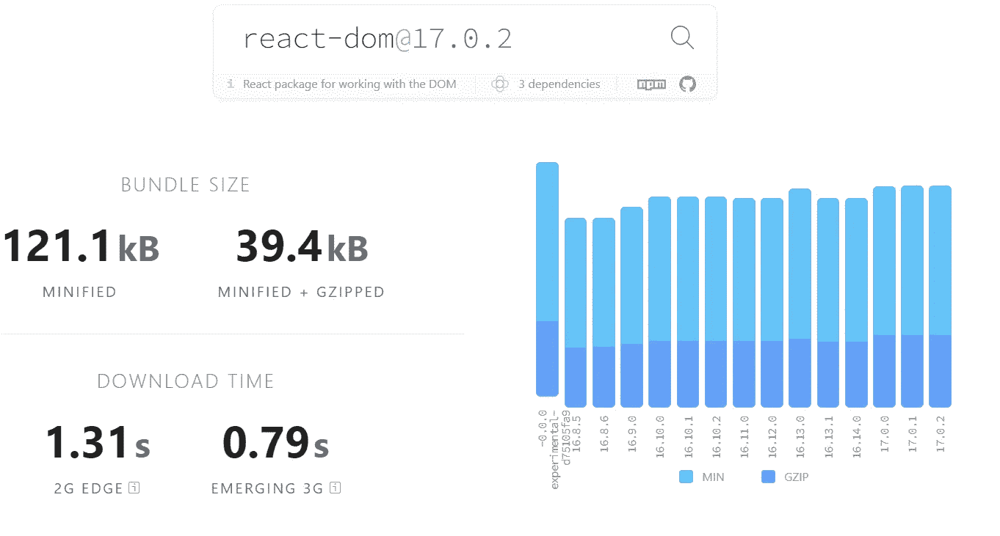
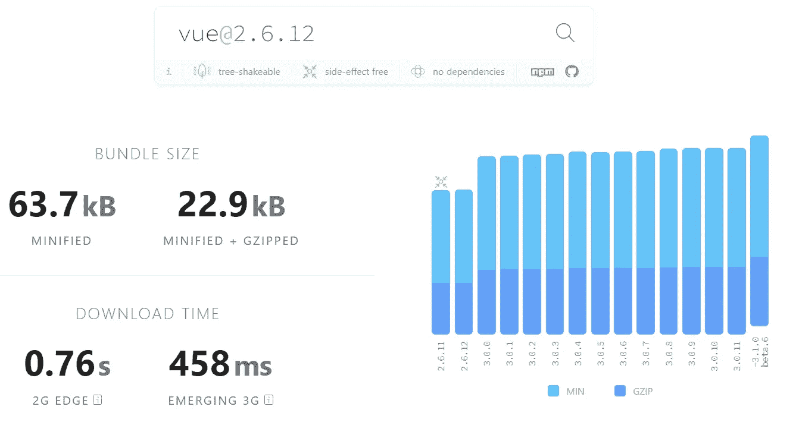
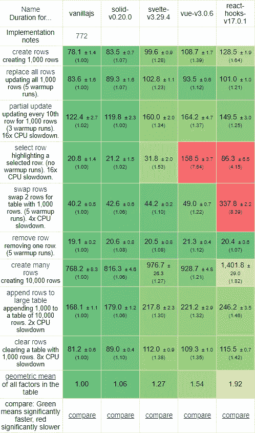
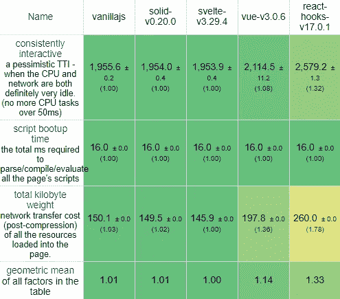
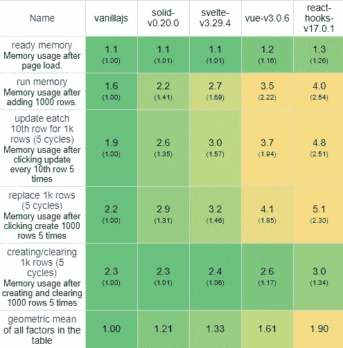

# 一个编译成 JavaScript 接口框架的例子

> 原文：<https://javascript.plainenglish.io/a-case-for-compile-to-javascript-interface-frameworks-a684b361884f?source=collection_archive---------6----------------------->

## 为什么将声明性 UI 编译成 JavaScript 既有用又快速

Photo by [Ferenc Almasi](https://unsplash.com/@flowforfrank?utm_source=medium&utm_medium=referral) on [Unsplash](https://unsplash.com?utm_source=medium&utm_medium=referral)

今天，像 React 和 Vue 这样的 web 框架在创建现代 web 应用程序时非常流行，这是有充分理由的。它们有助于将代码片段变成可重用的组件，并使使用声明性标记基于数据进行更新变得容易。

然而，几乎所有这些都有性能成本，因为它们需要大型运行时库。此外，这种接口语言功能更弱，也更冗长，因为它受限于原生 JavaScript 的约束。

但是，这个问题的解决方案可以让您在使用较少冗长代码的同时获得更好的性能。

这些框架将针对声明式用户界面设计优化的语言编译成本地 JavaScript。因为它们是编译的，不需要庞大的运行时库，所以要小得多。

有两种主要类型的编译 JavaScript 用户界面框架。有些使用 JavaScript 实现实际逻辑，如[苗条的](https://svelte.dev/)和[坚实的](https://github.com/solidjs/solid) *，还有一些使用完全不同的语言，通常不仅仅做声明性标记，如 [Elm](https://elm-lang.org/) 和 [Mint](https://www.mint-lang.com/) 。在本文中，我们将主要关注像 Svelte 这样的框架。现在让我们看看为什么要使用这些框架。

*Solid 可以被认为是一个运行时框架，但是因为它大量使用编译来优化代码，所以对于本文，我认为它是一个编译成 JS 的框架。

## 编译的 JavaScript 很快

许多被编译的框架，尤其是较新的框架，比运行时框架要快得多，也轻得多。

这是因为他们可以在代码运行之前进行大量的优化，并且他们可以将代码转换成普通的 DOM 操作 JavaScript，从而避免了对大型包的需求。

例如，比较 Svelte 和 Solid 这两个大量使用编译的框架，以及 React*和 Vue 这两个设计用于运行时的框架。

* React 确实使用了编译过的 JSX，但那只是对`createElement`调用的基本语法修饰。

React 的和 Vue 的捆绑包大小，根据 BundlePhobia，分别是 39.4kb GZip 和 22.9kb GZip。

React’s bundle size

Vue’s bundle size

相比之下，Svelte 实际上没有基本的包大小，因为除了原生 DOM 操作之外，它使用的东西很少，而 Solid 只有一些小函数来帮助更新元素。

因为大部分的包权重是编译器，不包含在生成的 web app 中，所以不能从 Bundlephobia 量化权重，但是下面的 startup times benchmark 对权重有一个合理的估计。

此外，Solid 和 Svelte 在运行时都要快得多。根据[krausset Framework benchmark](https://krausest.github.io/js-framework-benchmark/2021/table_chrome_90.0.4430.72.html)，Solid 和 Svelte 在启动时间、DOM 操作速度和内存使用方面都更快。

Framework speed benchmark

Framework startup benchmark

Framework memory benchmark

如您所见，在大型 DOM 操作、启动(受脚本大小和解释时间的影响)和内存使用方面，Solid 和 Svelte 比 React 和 Vue 更优化。

当然，您必须记住，大多数时候，这没什么大不了的。但是，如果您需要更高的性能，那么利用编译 UI 代码来优化性能的框架可能是一个不错的选择。

例如，如果您正在为速度慢的 2G 或 3G 网络上的人开发，使用 Svelte 带来的体重减轻可能是一件非常有益的事情。

此外，请记住，虽然优化的编译框架可能比非优化的框架更快，但是普通的 JavaScript 几乎总是更快。但是普通的 JavaScript 可能更冗长乏味，这就引出了我们的第二点。

## 编译后的框架经过优化，可以编写更少的代码

JavaScript 最初并不是为了像 React 这样的声明性标记而设计的，正因为如此，React 中的许多特性迫使您使用像`useState()`这样的函数和方法来代替使用普通变量，这不是坏事，但也不尽如人意。

此外，由于大多数功能都需要在运行时提供，因此功能少得多。编译对此有所帮助。Svelte 内置了对反应变量的支持，您可以使用普通的`let variable = value`语法来声明它们。

此外，你只用`$:`来做被动的陈述。这可能看起来令人困惑，所以这里有一些例子。

A click counter example in React

The equivalent click counter in Svelte

正如您在上面看到的，语法风格非常不同。Svelte 更具本土感，代码比 reactor 少 1/3。

然而，最终，您可以选择使用什么语法，但是编译器只是增加了语法的灵活性。您可能会认为编译和设置编译器所花的时间比语法优势更重要，这将引导我们进入最后一点。

## 您可能已经在编译您的 JavaScript 了

虽然您可能不会使用本机 JavaScript 以外的任何东西，但您可能仍然在编译它，即使它只是将 ES6 转换为旧浏览器支持的代码，或者只是为了缩小代码。[创建反应应用程序](https://create-react-app.dev/)在引擎盖下使用 Webpack 对您的代码执行许多不同的操作。事实上，由 React 团队推荐的 React JSX 需要编译为创建实际元素的函数调用。

不幸的是，React 没有充分利用这一点并对其进行优化，尽管他们最近通过新的 JSX 变换在这方面取得了一些进展。此外， [Vue Cli](https://cli.vuejs.org/) 也在引擎盖下使用 Webpack。这意味着，虽然您不需要使用编译器，但无论如何您很可能会使用，而且它很容易设置。

## 结论

使用编译成 JavaScript 的框架并不总是答案。一些不编译成 JavaScript 的框架比使用编译器的要快，使用编译器并不自动意味着它是更好的框架。

此外，有一个很大的范围是多少编制。有些框架，比如 Alpine.js，完全是为不需要任何构建步骤而设计的。

其他的，比如 React，只对代码的一小部分可选部分进行编译。Solid 也有点像 React，因为它使用 JSX，只是在编译时会进一步优化。

编译的最后一层是编译所有东西的东西，比如 Svelte。想编多少是你自己的选择，各有利弊。

希望你从中有所收获，感谢你的阅读。

*更多内容尽在*[***plain English . io***](http://plainenglish.io)