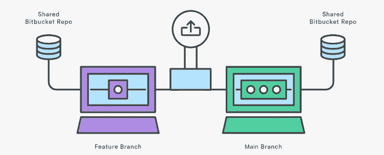
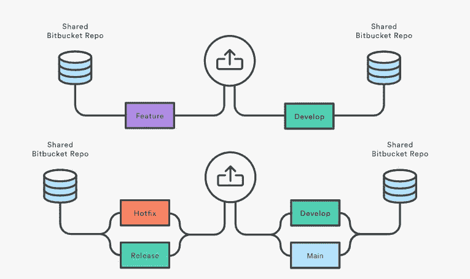

# Git 策略的经典方法

> 原文：<https://javascript.plainenglish.io/a-classic-approach-to-git-strategies-81b8a38d9ebf?source=collection_archive---------9----------------------->

Photo by [Yancy Min](https://unsplash.com/@yancymin?utm_source=medium&utm_medium=referral) on [Unsplash](https://unsplash.com?utm_source=medium&utm_medium=referral)

行业正在推进系统的开发策略和版本控制。我们现在所处的位置是，git 不仅仅是一个版本控制，还是整个开发模式的核心。既然 git 给了我们这么多东西，我们也有责任构建 git 结构。

干净和稳定的提交历史总是给你一个更好的方法来查看你的代码是如何安排的。总是需要遵循 git 策略，最适合的策略总是最好的。

Photo by [Scott Graham](https://unsplash.com/@homajob?utm_source=medium&utm_medium=referral) on [Unsplash](https://unsplash.com?utm_source=medium&utm_medium=referral)

# 战略

您的 git 策略将因项目而异，并且有多少团队成员在您的项目中工作

## 一枝一推

比方说，如果你是一个项目的工作人员，你只需要构建几个项目。你可以选择这种方法，因为这是管理你的项目的最简单的方法，也不那么令人头疼，但是同时，如果团队成员增加或者项目变得复杂，就更容易受到攻击

**亲**

*   较少管理
*   直接推送到主服务器

**缺点**

*   否，拉式请求和审查
*   无分支策略
*   部署不可见
*   最不适合中级或高级术语

## 每个环境的分支

假设您有一个中等规模的项目，那么上述方法甚至无法接近选择，但是如果您的项目是 1-3 个团队成员，中等规模，并且环境很少，您可以选择以下策略。

每个分支都与环境相关联，只有在特定分支上发布时才会发生推送。可以有一个默认分支作为`dev`，这将是一个直接推送，然后创建一个从`dev`到环境分支的 PR

**Pro**

*   会有基于环境的隔离
*   分支隔离
*   环境分支上没有直接提交
*   包括拉动式请求和审查

**缺点**

*   不适合团队成员超过 3 人的大型项目
*   在提交到其他开发人员之前没有测试套件
*   没有开发人员的等级

## 基于特征的方法

基于特征的方法更适合任何规模的项目。将后两种方法合二为一，它将成为当今最著名的方法之一

**优点**

*   提交的可见性更好
*   独立分支
*   拉式请求和审核
*   适合企业项目

**缺点**

*   需要更多额外的元素来使其企业就绪
*   直接将请求拉至 main 会导致子依赖项并导致更多冲突

## 连续交货

如果您正在一个已经构建好的企业级应用程序上工作，并且处于服务模式，那么您可能需要连续部署该应用程序

Continuous deployment

除了上述方法，我们可以创建一个连续的部署管道，根据优先级直接发布

很少有元素是

*   修补程序
*   释放；排放；发布
*   发展
*   错误修正

在发布部分，您可以附加步骤三，这是一个更加精确和测试驱动的方法。

一组开发人员将开发这些特性，然后每个小组的领导将代码合并到一个单独的发布分支中。领导可以在带有测试和回归测试的分支上执行额外的检查，在那之后，最终的提交将在环境分支上进行

Rest 分支可以像 bugfix 或 hotfix 一样快速发布，而 develop 分支可以是应用程序的主要入口点

# 结论

我想对上述关于项目规模和团队成员的方法进行分类，并且完全回到第一种方法

根据标准，方法二和方法三可能是合适的，但它们不是企业应用程序的正确选择。对我来说，最好的方法是最后一种方法，它有一个基于其他方法的独立组件。

希望这些文章能帮助你理解我看待 git 策略和方法的方式。

*更多内容看*[***plain English . io***](http://plainenglish.io/)