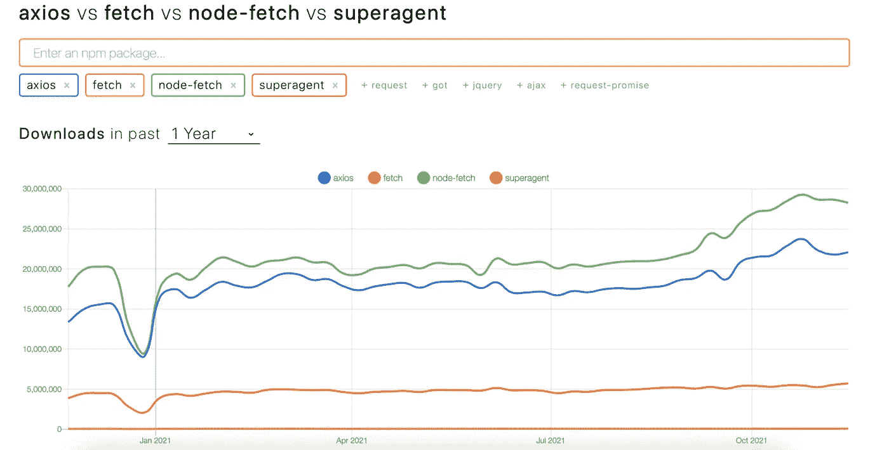

# Axios POST 请求的完整指南

> 原文：<https://javascript.plainenglish.io/a-complete-guide-to-axios-post-requests-141ae80d75e9?source=collection_archive---------4----------------------->


Photo by [Oskar Yildiz](https://unsplash.com/@oskaryil?utm_source=medium&utm_medium=referral) on [Unsplash](https://unsplash.com?utm_source=medium&utm_medium=referral)

## 介绍

axios 每周从 NPM 下载超过 2100 万次，是 JavaScript 生态系统中最受欢迎的 HTTP 客户端之一。简洁直观的库 API 和丰富的第三方插件/扩展使得这个 HTTP 客户端成为许多 web 和 Node.js 开发人员的选择。



在我们深入示例之前，我只想指出，使用 axios 编写 HTTP 请求有不同的方式(风格)，例如，创建一个新的实例并在创建的实例上调用方法。然而，在这篇文章中，我们将结合使用一个全局实例和[请求方法别名](https://github.com/axios/axios#request-method-aliases)。

## 请求正文

```
axios.post('URL', { name: 'Bob' }).then(console.log)
```

在 HTTP POST(或 PUT 和 PATCH)的情况下，请求体是该方法采用的第二个参数。默认情况下，在没有任何配置的情况下，axios 假设目的是发送一个 JSON 主体，并将其视为 JSON 主体。换句话说，JavaScript 对象在被发送到服务器之前被序列化为 JSON。

**表单 url 编码— x-www-form-urlencoded**

但是，在某些情况下，需要发送一个 POST 请求，其主体不是 JSON，而是表单数据。

当发送表单 POST 请求时，还需要一个额外的步骤。根据您是在 Node.js 还是在 browser 中使用 axios，配置会有所不同。

在 Node.js 中，我们可以使用内置库 [**querystring**](https://nodejs.org/docs/latest-v12.x/api/querystring.html) 。

```
axios.post('URL', querystring.stringify({ 'name': 'Bob' }))
.then(console.log)
.catch(console.error)
```

另一方面，在浏览器中，我们可以在浏览器的原生[**URLSearchParams**](https://developer.mozilla.org/en-US/docs/Web/API/URLSearchParams)上进行中继。

```
const params = new URLSearchParams();
params.append('name', 'Bob');
axios.post('URL', params);
```

## 请求标题

除了向服务器发送请求体之外，我们通常需要包含关于请求的附加信息，这种需求的一个非常常见的例子是 auth token 或 key。在 axios 中，给请求附加一个头非常简单，通过向`axios.post`方法传递第三个参数来完成。

```
axios.post('', {}, { headers: { 'api-key': 'x'}}).then(console.log)
```

然而，在幕后，库附加了关于请求的附加头。值得一提的是，如果没有这些头，比如`content-type`和`content-length`，一些服务器解析主体内容会有困难，或者请求会被视为无效并被拒绝。*附加头的过程不是 axios 独有的，大多数 HTTP 客户端都执行相同的过程。*

发送 JSON body 请求时默认头的完整列表。

表单数据中出现的所有标题

## 附加配置

其他一些有用的配置选项不是针对 POST 请求的，但仍然值得一提。

1.  添加请求**超时**是的方式与头作为第三个方法参数传递的方式相同，可以定义以毫秒为单位的超时。

```
axios.post('...', {name: 'Bob'}, {timeout: 30000}) //30 sec timeout
```

2. **keep-alive** 选项(仅 Node.js 特性)，通知服务器保持底层 TCP 连接打开，这反过来使后续请求更快(因为建立新 TCP 连接的过程被完全跳过)

```
httpAgent: new http.Agent({ keepAlive: true }),
httpsAgent: new https.Agent({ keepAlive: true }),
```

3.Axios 内置了对**基本授权**保护的 API 的支持。同样，它是以与 headers 相同的方式完成的(第三个方法参数)。你可以在这里了解更多。

```
auth: {
    username: 'janedoe',
    password: 's00pers3cret'
},
```

4.设置全局基本 URL — `axios.defaults.baseURL = 'https://localhost:3000/api/';`

我希望你觉得这很有用，如果你有兴趣了解更多关于 axios 的信息，这里是我的一些其他帖子。

[](https://sabljakovich.medium.com/basic-authentication-with-axios-nodejs-browser-cfabe08ced39) [## 使用 axios 的基本身份验证—节点和浏览器

### 像许多其他流行的 HTTP 客户端一样，Axios 内置了对基本身份验证的支持。然而，通常在代码中…

sabljakovich.medium.com](https://sabljakovich.medium.com/basic-authentication-with-axios-nodejs-browser-cfabe08ced39) [](https://sabljakovich.medium.com/axios-interceptors-log-request-and-response-72b01333a760) [## Axios 拦截器—日志请求和响应

### 在从事 node.js 项目时，许多人会求助于第三方的 HTTP 客户端库。即使有…

sabljakovich.medium.com](https://sabljakovich.medium.com/axios-interceptors-log-request-and-response-72b01333a760) [](https://sabljakovich.medium.com/axios-response-time-capture-and-log-8ff54a02275d) [## Axios 响应时间—捕获和记录

### 注意:确保使用不同于 0.19.0 的 axios 版本，因为它引入了此功能/错误。

sabljakovich.medium.com](https://sabljakovich.medium.com/axios-response-time-capture-and-log-8ff54a02275d) 

*更多内容请看*[*plain English . io*](http://plainenglish.io/)*。报名参加我们的* [*免费周报在这里*](http://newsletter.plainenglish.io/) *。*