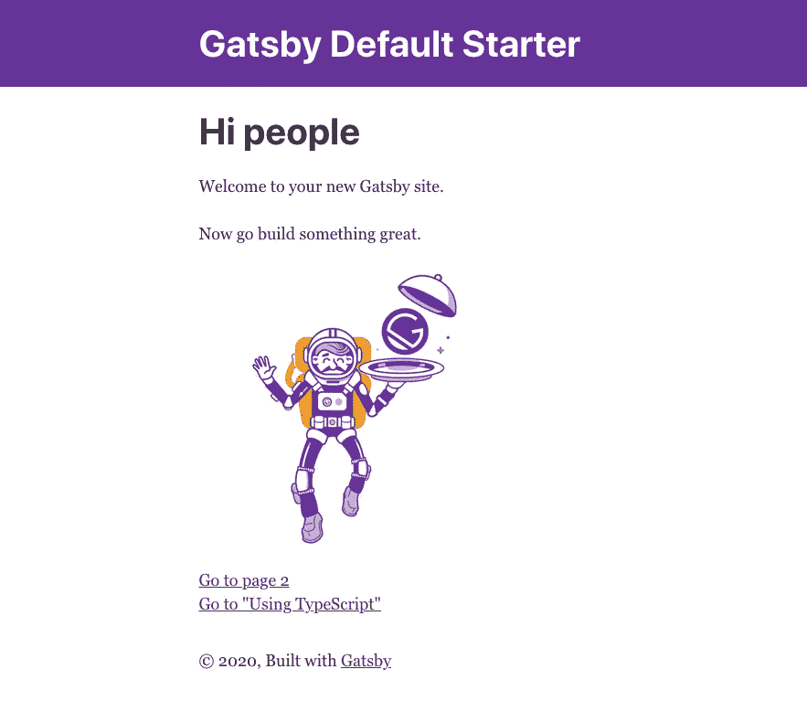
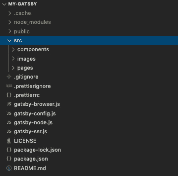
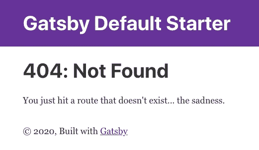
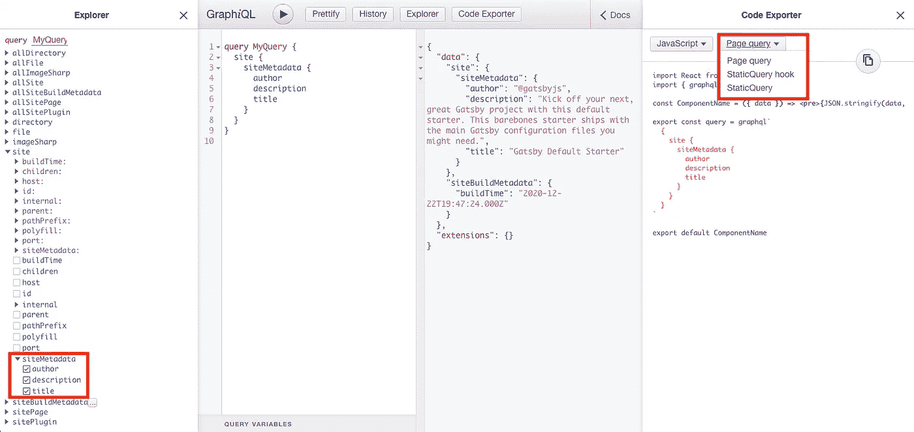
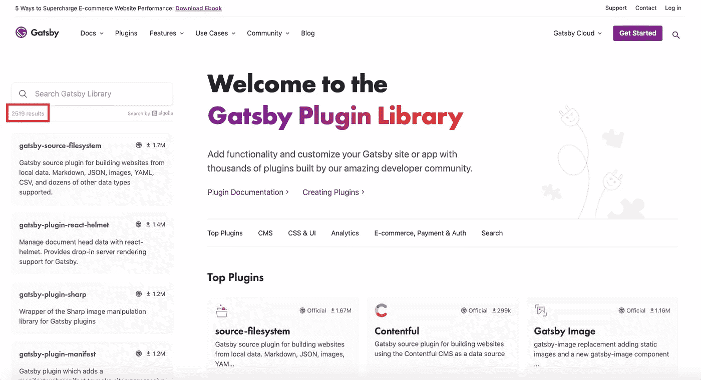
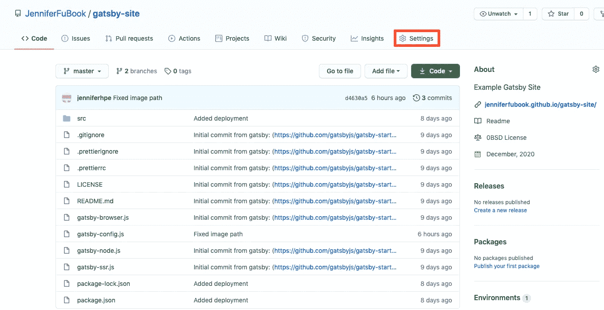
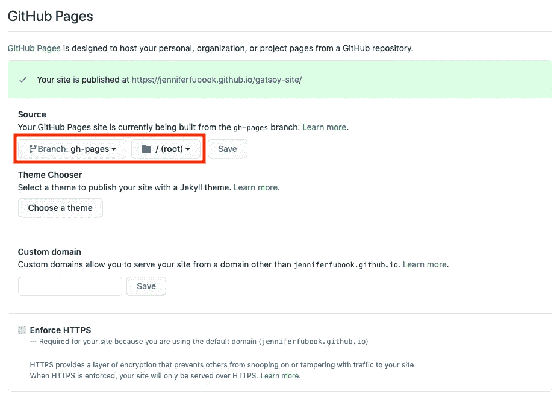

# 盖茨比+反应完全指南

> 原文：<https://javascript.plainenglish.io/a-complete-guide-to-gatsby-react-34039da49438?source=collection_archive---------15----------------------->

## 介绍 Gatsby，它是一个健壮而快速的静态站点生成器


Image credit: Michael Foster

什么是`[The Great Gatsby](https://en.wikipedia.org/wiki/The_Great_Gatsby)`？

这是美国作家 f .斯科特.菲茨杰拉德在 1925 年写的一部小说。这本书讲述了 1922 年夏天生活在繁华的长岛上的虚构小镇西卵和东卵的一群角色。许多文学评论家认为这是有史以来最伟大的小说之一。

今天我们谈论另一个 [Gatsby](https://github.com/gatsbyjs/gatsby) ，一个基于 React 的免费开源框架，帮助开发者构建超快的网站和应用。

启动新的 React 应用程序时，您可以考虑 React 团队的建议:

*   如果你正在学习 React 或创建一个新的单页应用，使用[创建 React 应用](https://medium.com/better-programming/10-fun-facts-about-create-react-app-eb7124aa3785)。
*   如果你正在用 Node.js **，**构建一个服务器渲染的网站，试试 [Next.js](https://nextjs.org/) 。
*   如果你正在建立一个静态的面向内容的网站**，**试试 Gatsby。
*   如果你正在构建一个组件库或者集成一个现有的代码库，试试 [Neutrino](https://neutrinojs.org/) 、 [Nx](https://nx.dev/react) 、[package](https://parceljs.org/)或者 [Razzle](https://github.com/jaredpalmer/razzle) 。

什么是静态内容？它是无需额外处理即可交付给最终用户的内容，即服务器向用户交付相同的文件。静态网站对服务器的要求不高。它们更容易被缓存，并且需要更少的计算能力。这是通过互联网传输内容的最简单、最有效的方式之一。静态网站的好处是速度、搜索引擎优化(SEO)和安全性。

Gatsby 是一个健壮而快速的静态站点生成器，它使用 React 在 web 上呈现静态内容。在这篇文章中，我们将解释盖茨比是如何工作的。

# 安装并运行盖茨比

Gatsby CLI 工具提供了一组创建和开发 Gatsby 站点的命令。可以通过以下命令安装它:

```
$ npm install -g gatsby-cli
```

安装使`gatsby`命令在全球可用:

```
$ gatsby --help
Usage: gatsby <command> [options]Commands:
  gatsby develop                      Start development server. Watches files, rebuilds, and hot reloads if something changes
  gatsby build                        Build a Gatsby project.
  gatsby serve                        Serve previously built Gatsby site.
  gatsby info                         Get environment information for debugging and issue reporting
  gatsby clean                        Wipe the local gatsby environment including built assets and cache
  gatsby repl                         Get a node repl with context of Gatsby environment, see
                                      ([https://www.gatsbyjs.com/docs/gatsby-repl/](https://www.gatsbyjs.com/docs/gatsby-repl/))
  gatsby recipes [recipe]             [EXPERIMENTAL] Run a recipe
  gatsby new [rootPath] [starter]     Create new Gatsby project.
  gatsby telemetry                    Enable or disable Gatsby anonymous analytics collection.
  gatsby plugin [cmd]                 Useful commands relating to Gatsby plugins
  gatsby options [cmd] [key] [value]  View or set your gatsby-cli configuration settings.Options:
  --verbose                Turn on verbose output                                 [boolean] [default: false]
  --no-color, --no-colors  Turn off the color in output                           [boolean] [default: false]
  --json                   Turn on the JSON logger                                [boolean] [default: false]
  -h, --help               Show help                                                               [boolean]
  -v, --version            Show the version of the Gatsby CLI and the Gatsby package in the current project 
```

让我们使用`gatsby`命令初始化一个名为`my-gatsby`的 Gatsby 项目:

```
$ gatsby new my-gatsby
```

转到文件夹`my-gatsby`，启动开发服务器:

```
$ cd my-gatsby
$ gatsby develop
```

在浏览器窗口中，键入 URL `http://localhost:8000`。它显示了默认的盖茨比网站:



这里是`src/pages/index.js`，它指定了上述网页中的文本和图像。

`Link`(第 2 行)是一个内置组件，用于站点内页面之间的链接。第 17 行是到页面`/page-2`的链接，第 18 行是到页面`/using-typescript`的链接。

`Layout`(第 4 行)、`Image`(第 5 行)、`SEO`(第 6 行)是用户自定义组件，对文字和图片进行排列，为 SEO 提供元数据。

# 盖茨比文件夹结构



以上是`gatsby`的开箱文件夹结构。

*   `.cache`、`node_modules,` 和`public`是自动生成的文件夹。
*   `src`是源文件夹。它包含特定于项目的代码。
*   `.gitignore`为 Git 指定未跟踪的文件。
*   `.prettierignore`和`.prettierrc`包含`Prettier`的代码格式规则。
*   `gatsby-browser.js`是 Gatsby 期望找到任何 Gatsby 浏览器 API 用法的地方。它用于自定义或扩展影响浏览器的默认 Gatsby 设置。
*   `gatsby-config.js`是一个 Gatsby 网站的主配置文件。它指定了`pathPrefix`、`siteMetadata`、插件、标志、聚合填充、映射、代理和开发硬件。
*   `gatsby-node.js`是 Gatsby 期望找到任何 Gatsby 节点 API 用法的地方。它用于定制或扩展影响站点构建过程的默认 Gatsby 设置。
*   Gatsby 希望在这里找到 Gatsby 服务器端呈现 API 的任何用法。它用于定制影响服务器端呈现的默认 Gatsby 设置。
*   `package.json`保存项目的各种 NPM 相关元数据。

下面是`package.json`的内容。

第 7 - 20 行是[依赖](https://medium.com/better-programming/package-jsons-dependencies-in-depth-a1f0637a3129)，包括 React 和 Gatsby 包，以及 Gatsby 插件。

第 29 - 38 行列出了可用的脚本。Gatsby CLI 命令也可以由 npm 命令执行。

# Gatsby Src 文件夹

`src`是项目特定源代码的文件夹。它由几个子文件夹组成，如`pages`、`components`和`images`。

## **src/pages**

`src/pages`包含页面组件，这些组件根据文件名由路径自动呈现。这是一条直接的路由规则。

```
$ ls src/pages
404.js               index.js             page-2.js            using-typescript.tsx
```

*   `404.js`用于在生产模式下生成`404.html`文件。
*   `index.js`是索引文件，是加载 URL 的默认页面`/`。
*   `page-2.js`是要加载 URL 的页面，`/page-2`。
*   `using-typescript.tsx`是要加载 URL 的页面，`/using-typescript`。

404 是 HTTP 状态代码，表示请求的文件不可用。Gatsby 建议构建`404.js`用于错误处理，以防文件被移动、删除或只是路径错误。

如果你在浏览器的地址栏中输入[https://jenniferfubook.github.io/gatsby-site/unknown](https://jenniferfubook.github.io/gatsby-site/unknown)，你会看到未知页面的如下界面:



这里是`src/pages/404.js`文件:

TypeScript 是 JavaScript 超集。它扩展了 JavaScript 以包含允许静态检查代码库的类型定义。开箱即用，Gatsby 通过插件`gatsby-plugin-typescript`支持 TypeScript。使用 TypeScript 不需要配置这个插件。但是，如果你想管理 TypeScript 的选项，在`gatsby-config.js`中配置这个插件。

这里是`src/pages/using-typescript.tsx`文件，由 Gatsby 为路由 URL 自动渲染，`/using-typescript`。

第 8 - 12 行定义了类型`DataProps`。

第 14 行将`UsingTypescript`打成`React.FC<PageProps<DataProps>>`。

第 28 - 34 行用 GraphQL 检索`site.buildTime`。检索到的值`data.site.buildTime`呈现在第 20 行。

## **src/组件**

`src/components`包含页面构建块，作为用户定义的可重用组件。

```
$ ls src/components
header.js  image.js   layout.css layout.js  seo.js
```

*   `header.js`定义了`Header`组件，使用 html 标签，比如`header`、`h1`和`div`。
*   `image.js`定义了加载`gatsby-astronaut.png`的`Image`组件。
*   `layout.js`建立在`Header`和 html 标签之上。它用标准化的页眉和页脚定义了`Layout`组件。
*   `layout.css`是`layout.js`的 CSS 文件。
*   `seo.js`创建`SEO`组件，该组件在文档头中嵌入了 SEO 信息。它使用了 react 的文档头管理器。

下面是`src/components/header.js`文件。它使用内嵌样式。或者，我们可以定义一个外部 CSS 文件，并将其导入到任何 JavaScript/TypeScript 文件中，类似于`layout.js`和`layout.css`。

## src/图像

`src/images`包含项目使用的图像文件。

```
$ ls src/images
gatsby-astronaut.png gatsby-icon.png
```

# 数据层

Gatsby 的数据层由脸书发明的 GraphQL 提供支持。GraphQL 是一种查询语言(QL)，其工作方式类似于 SQL。它提供了一种革命性的思考 API 的方式。我们可以在单个请求中发送描述要检索的数据格式的查询，而不是使用严格的服务器定义的端点。Gatsby 站点中的数据可以来自任何地方:Markdown、JSON、API、数据库、内容管理系统、本地文件等。在构建时，Gatsby 创建一个内部 GraphQL 服务器来托管所有这些数据。

在`src/pages/using-typescript.tsx`文件中，我们已经看到了`data.site.buildTime`的 GraphQL 用法:

`graphql`(第 1 行)可用于查询`src/pages/<files>`中的数据。如果查询在`src/components/<files>`中，React 钩子`useStaticQuery`可以和`graphql`结合使用。

这里是`src/components/seo.js`文件:

第 14 行和第 15 行应用`useStaticQuery`和`graphql`。

你可能想知道`siteMetadata`(第 18 - 22 行)的内容来自哪里。

在`gatsby-config.js`文件中定义:

第 3 - 7 行指定了`siteMetadata`对象，它分配了`title`、`description`和`author`的值。

您可能想知道如何编写 GraphQL 查询。

当我们运行`gatsby develop`时，输出包含以下信息:

```
View GraphiQL, an in-browser IDE, to explore your site's data and schema
⠀
  http://localhost:8000/___graphql
```

去链接，我们看到了盖茨比的仙境。它显示来自内部 GraphQL 服务器的所有数据。这些数据是在构建时收集的。



在最左侧的窗格中，我们选择了`siteMetadata`中的项目。第二个左侧窗格显示了生成的 GraphQL 查询。左侧第三个窗格显示查询结果的实际值。最右边的窗格显示示例代码，有`Page query`、`StaticQuery hook`和`StaticQuery`选项。

# 盖茨比插件

像大多数静态站点生成器一样，Gatsby 应用[插件](https://www.gatsbyjs.com/plugins)来扩展其功能或修改现有功能。此时此刻，已发布的插件有 2519 个。



鼓励用户构建或者发布他们自己的插件。有关于如何创建一个盖茨比插件的详细指导。任何项目特定的、未发布的插件应该放在`/plugins`文件夹中。

# 部署 Gatsby 站点

对于盖茨比项目，我们做了一个构建:

```
$ gatsby build
```

在`/public`文件夹中生成编译后的代码。它可以通过以下 Gatsby 命令启动:

```
$ gatsby serve
```

该页面在`http://localhost:9000/`可用。

如果我们退出`gatsy serve`，网站将不再活跃。

这个网站怎么能一直运行呢？

最简单的方法是将其发布到 CDN(内容交付网络，或内容分发网络)，这是代理服务器及其数据中心的地理分布式网络。

## 部署到浪涌

[Surge](https://github.com/sintaxi/surge) 是一个用于`surge.sh`托管服务的 CLI 客户端，它只需一个命令就可以将 web 应用发布到 CDN，无需任何设置。

我们在全球范围内下载 Surge 并登录。

```
$ npm install --global surge# Then create a (free) account with them$ surge login
```

然后发布`public`文件夹。

```
$ surge public/Running as ******project: public/
         domain: adjoining-rings.surge.sh
         upload: [================] 100% eta: 0.0s (91 files, 2646769 bytes)
            CDN: [====================] 100%encryption: *.surge.sh, surge.sh (124 days)
             IP: 138.197.235.123Success! - Published to adjoining-rings.surge.sh
```

在浏览器的地址栏中输入`[adjoining-rings.surge.sh](http://adjoining-rings.surge.sh/)`，这个页面就会一直打开并运行。

## 部署到 Github

`[gh-pages](https://github.com/tschaub/gh-pages)`可以发布一个盖茨比 app 到 GitHub 页面。演示站点已经设置为 [Github repo](https://github.com/JenniferFuBook/gatsby-site) ，名称为`/gatsby-site`。

以下命令安装`gh-pages`。

```
$ npm install gh-pages --save-dev
```

在`gatsby-config.js`中，`pathPrefix`需要设置为回购名称。

为方便起见，在`package.json`中添加一个`deploy`脚本:

```
"scripts": {
  "deploy": "gatsby build --prefix-paths && gh-pages -d public"
}
```

执行`npm run deploy`，它进行新的构建，并将`public`文件夹的所有内容复制到存储库的`gh-pages`分支。

正如我们在[另一篇文章](https://medium.com/better-programming/build-advanced-react-input-fields-using-styled-components-and-storybook-js-a231b9b2438#e765-bf98276875df)中所描述的，从 GitHub 页面选择`Settings`:



在设置页面，向下滚动到 GitHub 页面部分。确保您的存储库的设置将`gh-pages`分支设置为要部署的源。



`gh-pages`自动设置所有这些。静态网站可以在这里访问[。](https://jenniferfubook.github.io/gatsby-site/)

# 一个真正的盖茨比网站

我们讨论了盖茨比的主要特点。现在我们展示迈克尔·福斯特的盖茨比网站。

他的网站是用盖茨比和[理智工作室](https://www.sanity.io/studio)搭建的。`sanity.io`是一个开源的实时内容编辑环境，连接到 Sanity 后端。

在浏览器中输入网址: `[https://ranchtoplate.com/](https://ranchtoplate.com/)`。


你准备好尝尝牛肉或盖茨比了吗？

# 结论

Gatsby 是一个健壮而快速的静态站点生成器。它为你照顾速度，搜索引擎优化和安全。这被认为是创建 React 项目的最好方法之一。

《盖茨比》不负众望，既是一部小说，也是一个反应框架。

感谢阅读。我希望这有所帮助。你可以在这里看到我的其他媒体出版物。