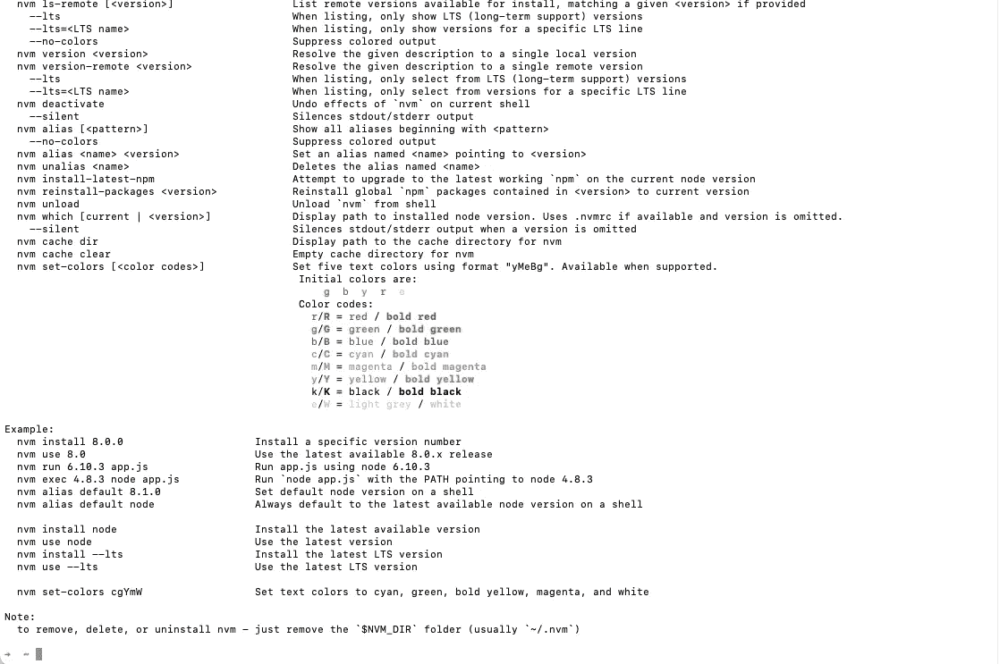

# 通过 NVM 更新 Node.js 版本的完整指南

> 原文：<https://javascript.plainenglish.io/a-complete-guide-to-updating-your-node-js-version-via-nvm-4953d32df312?source=collection_archive---------3----------------------->



nvm options and parameters

本文将指导您完成使用 nvm 更新 Node.js 版本所需的所有步骤。大多数步骤也适用于名为“N”的 npm 库，但是特定于 N 的命令的语法会略有不同，这取决于您希望如何指定节点版本。

请注意，虽然我说的是“更新”，但您可以轻松地使用 nvm 来指定比当前运行的版本更旧的版本。

首先，如果你还没有安装 nvm，你需要安装它，如果 nvm 库有一段时间没有改变，你可以选择更新它。一般来说，较新的 nvm 版本与 Node 的早期版本兼容，因此更新 nvm 包不会丢失任何东西。

如果您有一个标准的 npm 设置，并且没有在连接到开放互联网的设备上工作，您可以通过键入以下内容来确保您拥有 nvm 的版本 38(截至本文发布之日的最新版本):

```
curl -o- https://raw.githubusercontent.com/nvm-sh/nvm/v0.38.0/install.sh | bash
```

对于较新版本的 nvm，您可能需要使用 nvm GitHub 库的[“安装和更新”部分中的最新安装脚本来更新上面的命令。](https://github.com/nvm-sh/nvm)

一旦你有了最新版本的 nvm，你应该有能力将 Node 更新到你喜欢的任何版本，并删除你不希望有的任何其他版本。让我们看几个例子。

例如，假设您需要使用某个新的库，该库只支持 10.2.1 版本的 node，并且这是您唯一的活动 node 12 项目，您应该输入以下内容:

```
nvm install 10.2.1
```

但是，假设您最终决定不使用该库，而是希望更新回之前的 node 12 版本，并放弃 node 10 安装。因为两者目前都已安装，所以您不需要再次安装 node 12 的任何版本，而是

```
nvm use 12
nvm uninstall 10.2.1
```

这将自动使用 Node 12 的最新安装版本，并将卸载 node 10.2.1。您也可以只指定`nvm uninstall 10`，这将只卸载 node 10 的最新版本。

然而，您肯定会遇到的一个警告是，如果您不安装特定节点版本的包，主要节点版本的更改将不会与许多流行的库一起使用。NVM 不会自动为您完成这项工作，因此如果您的项目由于库问题而不再构建，您需要重新生成 package-lock.json 和 node modules 文件夹。方法如下:

```
**#After navigating to the project in question** rm -rf ./package-lock.json ./node_modules
npm install
```

# **常见问题解答**

*如果我的设备无法出站访问互联网(特别是 GitHub ),该怎么办？*

我建议您使用 npm 库“n ”,您可以通过以下方式安装它:

```
npm n
```

语法有一点不同，但是 N 对于访问控制严格的服务器来说是更容易访问的工具。即使您在一个使用私有包注册中心(比如 Codeartifact)的环境中工作，您也应该能够安装 n。

*我可以使用未被* `*nvm use*` *设置为* `*current*` *的节点版本运行我的应用程序吗？*

是的，通过`nvm exec`或`nvm run` -

```
nvm exec 6.1.2 node my-cool-math-app.js | cat output.txt 
**# executes everything after the version in the context of node 6.1.2** nvm run 8.0.0 my-cool-math-app.js
**# executes the filename given after the version as if you had run   # `node my-cool-math-app.js` using node 8.0.0**
```

*`*nvm uninstall 10*`*为什么只卸载最新的节点版本？**

*一般来说，如果有歧义，nvm 总是选择最近的节点目标。这不仅适用于与 uninstall 一起使用的部分版本，也适用于 use、install、run 和 exec。*

*如果我安装了多个版本，如何确保我的节点服务器在运行时运行的是正确的版本？*

*如果`nvm current`和`npm -v`对您来说还不够完善，您还可以将`process.version`作为标准 JavaScript 日志语句记录在您的应用程序中，即:*

```
*console.log("NODE.JS VERSION: ", process.version);*
```

*我错过了什么吗？如果是这样，请发表评论让我知道，或者发电子邮件给我，我很乐意补充你认为被遗漏的任何其他细节。*

**感谢阅读。**

**更多内容请看*[*plain English . io*](http://plainenglish.io/)*