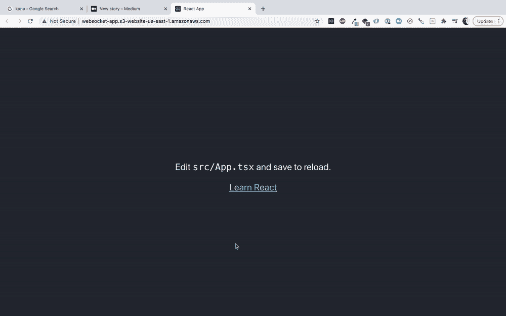

# 为客户端呈现的应用程序创建一个“控制室”

> 原文：<https://javascript.plainenglish.io/a-control-room-for-client-side-rendered-apps-31047e011a37?source=collection_archive---------10----------------------->


Photo by [Hector Farahani](https://unsplash.com/@hectorfarahani?utm_source=unsplash&utm_medium=referral&utm_content=creditCopyText) on [Unsplash](https://unsplash.com/s/photos/yazd?utm_source=unsplash&utm_medium=referral&utm_content=creditCopyText)

我不确定这个帖子的标题，我想了 24 个小时，没有找到更好的，所以就叫它*“为客户端渲染的前端应用程序创建控制室！”* \_(ツ)_/。
如果你需要与你的前端应用程序进行一些`States`交流，这种模式是有益的，正如我们所知，对于客户端渲染应用程序来说，存在一些挑战。在这篇文章中，我将通过一个例子给你一个全面的描述。

## **客户端渲染应用**

部署前端应用程序最简单的方法是构建它，并将资产(Javascript、CSS、HTML 等)推送到您的服务器(或无服务器)，并让应用程序在客户端呈现(而不是服务器端呈现)。一个非常常见的例子是构建一个 React 应用程序，并将其推送到 AWS S3，然后就这样了！但这种方法有一个问题，即在客户端渲染后，你无法控制应用程序的**状态**，如果你正在处理一个每天有很多用户的企业应用程序，这是一个非常重要的问题。

例如，如果由于一些 API 迁移或 API 服务上的一些基础设施任务，您需要将应用程序置于维护窗口中，您如何处理这种情况？你发布一个新版本来更新你的应用程序**状态**吗？

另一个例子是，每当你发布一个新版本时，使用你的应用程序的用户在刷新他们的页面之前不知道新版本，因此，如果你部署了一个新版本的 API 服务，需要在前端进行一些更改，你如何让用户知道他们需要刷新他们的页面以获得最新版本？

## **适用于所有场景的通用解决方案**

底线是我们想为我们的前端应用程序创建一个控制室。我想在这里谈论的解决方案是众多解决方案中的一个，它不一定是最好的，但如果你正在开发一个需要这种级别控制的应用程序，你可以考虑一下。

我在这里的方法是让我们添加一个可以发送`messages`到我们的前端应用程序的`Web Socket Server`，然后前端应用程序可以处理这些消息。在我们进入细节之前，让我们先来看看我的演示应用。

## **新版本可用**

为了演示的目的，我创建了一个超级简单的 React 应用程序(几乎是空的)，你可以在这里看到部署的版本并查看代码，你可以检查这个[库](https://github.com/mostafa-drz/better-client-side-react)。让我们看一下部署脚本:

```
"prepush":"yarn build",
"push": "aws s3 sync --delete build s3://websocket-app --profile websocket",
"postpush": "node postPush.js"
```

部署脚本包括构建资产，然后将其推送到 S3。我们不会在这篇文章中讨论 React 的应用部署，但如果你感兴趣，你可以看看这篇[文章](https://www.newline.co/fullstack-react/articles/deploying-a-react-app-to-s3/)。我们的重点是`postpush`中发生的事情，我们的目标是向我们的前端应用程序发送一条**消息**，让用户知道有一个新版本可用，他们需要刷新他们的页面才能获得它。



## **如何？**

在我浏览代码之前，我应该提到，在这篇文章中，我不想浏览一个生产就绪的解决方案，因为它可能会因不同的交付解决方案和管道而有所不同，我只想让您对这种方法有一个总体的了解。

为了实现这种方法，我使用了`Web Sockets`。如果你从未与`Web Sockets`合作过，你所需要知道的就是与 HTTP 协议相比，没有任何请求。`Clients`打开与`server`的连接，然后他们等待来自服务器的消息(这正是我们想要的！)如果你想了解更多关于 web sockets 的知识，你可以阅读这篇文章。

对于前端，我创建了一个`Context`，它在顶层包装了整个应用程序，并将负责打开与我们的`Web Socket Server`的连接，每当它收到消息时，就根据`messageId`和消息提供的更多数据采取行动。当我们的应用程序加载时，在`useEffect`中，我们连接到我们的 Web Socket 服务器，然后我们监听所有传入的消息:

```
useEffect(() => {
    socket.current.onopen = function (e) {
      console.info("[open] Connection established");
    };
    socket.current.onerror = function (error) {
      console.error(`[error] ${error}`);
    };socket.current.onmessage = function (event) {
      const data = JSON.parse(event.data);
      switch (data.messageId) {
        case "new-version":
          notify.show(
            <div>
              <h2>Sorry to intrupt you 🙈</h2>
              <p>
                A new version of our App is available and to get the latest
                features you should refresh your page
              </p>
              <button onClick={() => window.location.reload()}>Reload</button>
            </div>,
            "warning",
            -1
          );break;
        case "maintenance":
          if (data.status === "on") {
            notify.show(
              <div>
                <h2>Sorry to intrupt you 🙈</h2>
                <p>{data.message}</p>
                <button onClick={() => notify.hide()}>Ok</button>
              </div>,
              "warning",
              -1
            );
            setMaintWindow(true); 
          } else {
            setMaintWindow(false);
          }
          break;
        default:
          break;
      }
    };
  }, []);
```

你可以在这里看到前端应用[的完整代码。](https://github.com/mostafa-drz/better-client-side-react)

现在在后端，为了演示的目的，我创建了一个简单的 HTTP 和 Web Socket 服务器。HTTP 服务器是为了能够向控制室服务发送一些事件(我喜欢，很花哨的名字，控制室！😅)然后控制室将消息服务`**Broadcasts**`给所有连接的客户端。让我们来看看服务器代码，它非常简单:

```
const WebSocket = require("ws");
const express = require("express");
const app = express();
const http = require("http");
const server = http.createServer(app);
const PORT = process.env.PORT || 8080;
const path = require("path");app.use(express.json());
let wss;app.post("/api/message", function (req, res) {
  const { messageId, messageBody } = req.body;
  switch (messageId) {
    case "new-version":
      broadCastToAllClients(
        wss,
        JSON.stringify({
          messageId,
          newVersion: messageBody.version,
        })
      );
      return res.send("ok");
    case "maintenance":
      broadCastToAllClients(
        wss,
        JSON.stringify({
          messageId,
          message: messageBody.message,
          status: messageBody.status,
        })
      );
      return res.send("ok");
    default:
      return res.status(400).send("what do you mean?");
  }
});app.get("/", (req, res) => {
  res.sendFile(path.resolve(__dirname, "index.html"));
});app.get("/api/ping", (req, res) => {
  res.send("PONG");
});server.listen(PORT, (error) => {
  if (error) {
    console.error(`Something went wrong on Express Server 💔`);
  } else {
    console.log(`Express server is running on port ${PORT}`);
    wss = new WebSocket.Server({ server });
  }
});function broadCastToAllClients(wsServer, message) {
  wsServer.clients.forEach(function each(client) {
    if (client.readyState === WebSocket.OPEN) {
      client.send(message);
    }
  });
}
```

如果你喜欢尝试，你可以在两个不同的标签上打开前端应用程序和 Web Socket 服务，然后尝试一下:

前端应用:[http://websocket-app.s3-website-us-east-1.amazonaws.com/](http://websocket-app.s3-website-us-east-1.amazonaws.com/)
Web Socket 服务:[https://thawing-depths-04303.herokuapp.com/](https://thawing-depths-04303.herokuapp.com/)
你可以在前端应用上尝试那些简单的命令，看看结果。
既然您已经尝试了演示应用，让我们回到我们的`publish`脚本，看看`postpush`做了什么:

```
"postpush": "node postPush.js"
```

而`postPush.js`:

```
const fetch = require("node-fetch");const body = {
  messageId: "new-version",
  messageBody: {
    version: "1.1.1",
  },
};fetch("[https://thawing-depths-04303.herokuapp.com/api/message](https://thawing-depths-04303.herokuapp.com/api/message)", {
  method: "POST",
  headers: { "Content-Type": "application/json" },
  body: JSON.stringify(body),
})
  .then((resp) => resp.text())
  .then((data) => console.log(data))
  .catch((error) => console.log("Ooops", error));
```

正如您在这个脚本中看到的，我们所做的就是向我们的`Control Room Service`发送一个`POST`请求，让它知道有一个新的前端版本，这样它就可以向所有连接的客户端广播消息。

## **结论**

客户端渲染应用带来了一些挑战，在这篇文章中，我试图向你展示一种方法，你可以用它来更好地控制它们。基于您的管道，您可能能够以不同的方式实现它。

我希望你喜欢我的*控制室服务*😉

注意安全，🤿

[***穆斯塔法***](https://www.linkedin.com/in/mostafa-darehzereshki/)