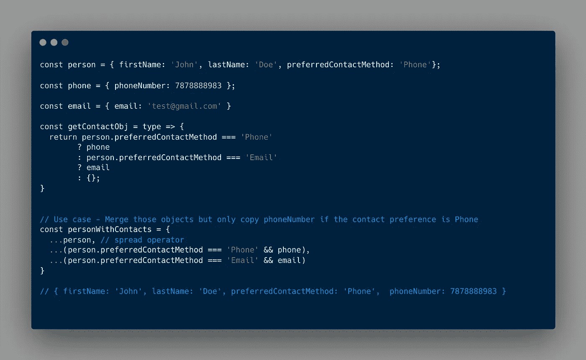

# 在 JavaScript 中添加动态对象属性的酷方法

> 原文：<https://javascript.plainenglish.io/a-cool-way-to-add-dynamic-object-properties-in-javascript-61c9d8512404?source=collection_archive---------18----------------------->

## 有条件地向对象添加属性的简单而简洁的方法。

Photo by [Mohammad Rahmani](https://unsplash.com/@afgprogrammer?utm_source=unsplash&utm_medium=referral&utm_content=creditCopyText) on [Unsplash](https://unsplash.com/s/photos/dynamic%2Bjavascript?utm_source=unsplash&utm_medium=referral&utm_content=creditCopyText)

作为开发人员，在我们的日常生活中，使用 JavaScript 中的对象是很常见的。我们对对象进行的常见操作包括添加、删除和有条件地添加属性。

嗯，做这些操作没有对错之分。但是，在本文中，我想分享一个很酷的方法，以一种简单的方式有条件地添加多个属性。

让我们考虑一个场景，我们想要通过合并电话和联系人对象来创建一个联系人对象，但是有一个条件依赖于首选的联系方法，我们需要添加特定的联系方法。

Dynamic object properties illustration

如果我们看一下上图，我们通过利用对象析构操作符有条件地合并那些对象。

希望你们都喜欢这个。请关注更多有趣和有用的 JavaScript 技巧。

感谢您的阅读。

*更多内容看* [*说白了。在这里注册我们的*](http://plainenglish.io/) [*免费周报*](http://newsletter.plainenglish.io/) *。*