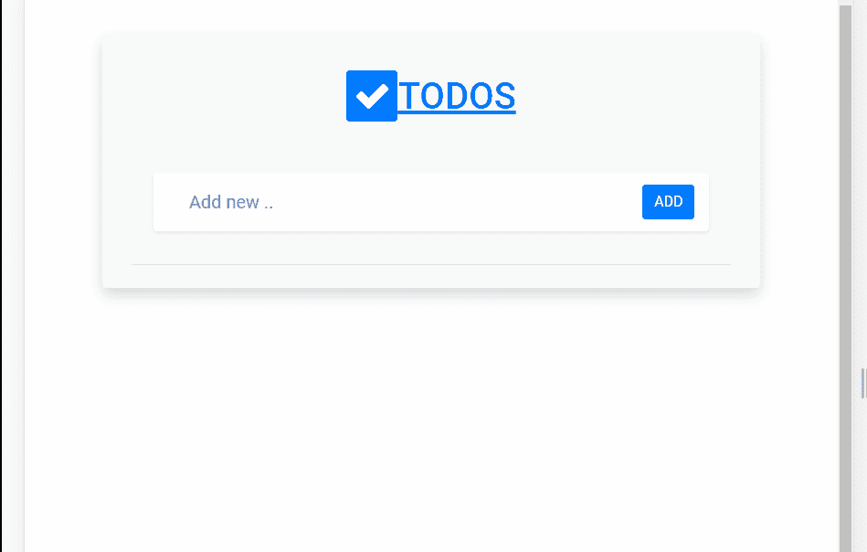

# 构建一个有角度和水平的 CRUD

> 原文：<https://javascript.plainenglish.io/a-crud-with-angular-and-supabase-c205e393c823?source=collection_archive---------8----------------------->

*本文是后*[*Angular 11 and Supabase 的延续 Firebase 的替代！？*](https://kheronn-machado.medium.com/angular-11-e-supabase-uma-alternativa-ao-firebase-5d76f49b0182)

[演示](https://supabase-angular.vercel.app/)

在本文中，我将介绍一个教程，探索使用在第 11 版和 Supabase 中用 Angular 编写的应用程序进行 CRUD 的主要操作。

通过 CLI ( ***ng new)*** 创建项目后，第一步是安装 supabase lib。在终端和项目内部，键入:

仍然在终端，我们将创建一个服务类来建立连接和方法。

# 生成服务类

我们生成了一个名为 **ApiService** 的服务类。

> 出于更多的教学目的，我没有遵循任何组织或应用程序架构(我在实际项目中不这样做！)

在文件**中，api.service.tswe 将**开始定义连接参数。

导入库(第 3 行)后，我们声明**supabasurel**、 **supabaseKey** 和 **supabase** (客户端)变量(第 9 到 11 行)。

该信息(*supabasurel*和 *supabaseKey* )可在 supabase 仪表盘的身份验证标签中找到，如这里所述的。

## 再次强调，小心钥匙暴露。在面板上，有关于允许匿名访问的客户端密钥的信息，还有一个永远不应该向客户端公开的服务密钥。

*建议在服务器上或环境变量中使用。*

> [阅读建议](https://betterprogramming.pub/how-to-secure-angular-environment-variables-for-use-in-github-actions-39c07587d590) — [安全角环境](https://betterprogramming.pub/how-to-secure-angular-environment-variables-for-use-in-github-actions-39c07587d590)

在构造函数方法中，第 14 行我们使用 **createClient** 方法创建连接。

因此，已经可以在表中编写查询、包含和排除方法。

请注意，我们导入了一个 Todo 类(第 1 行)。由于它还不存在于 VSCode 或其他编辑器中，这将指示一个错误。没问题，为了解决这个问题，让我们创建一个类，它代表了整个表中信息的模型。

在*应用程序*文件夹中，创建文件 **todo.model.ts** ，并按照以下示例进行编码:

我们有三个属性:id、名称和 done，它们将代表表的一条记录。

# 编码方法

返回到 API 文件。因此，已经可以在表中写入查询、包含和排除方法。

我们将从插入方法**开始添加待办事项**。

关于该方法的一些考虑:

*   我们可以用 **< Todo >** 键入返回，并传入 **insert** 而不需要对对象进行任何变换。这将有助于创建更通用的类。
*   此外，我们能够在出现故障时恢复返回(日期)或错误。

这一逻辑同样适用于恢复、更新和删除方法。

select 方法可以与其他几种方法嵌套在一起([参见文档](https://supabase.io/docs/guides/client-libraries))。在这个例子中，我确实使用了 10 条记录的限制。

另一方面，**更新**、**删除**方法，与 id 相比(第 13、21 行)。

# 组件和模板

我将重点描述组件 **app.component.ts logic** 。在教程的最后，我留下了这个项目的知识库链接。

我们声明了一个 todo 数组，一个 **todo** 对象和一个 **actionLabel** ，它们在‘ADD’ADD 或‘UPDATE’UPDATE 状态之间切换。在构造函数方法中，我们进行依赖注入来使用 API。

在 ngOnInit()方法中，请注意，在第 20 行和第 21 行中，我们调用了 API 的 getTodos()方法，一加载页面就加载现有的 TODOs，并将结果分配给最初声明的数组。

在 **addTodo** 方法中，我们做了一个初始检查来检查是否有 **id** ，因此，我们转移了流程进行更新。否则，我们调用 API 方法，最后，我们将结果添加到数组中。

我们接下来使用的方法是从列表中选择记录，更新或更改**到**的状态。

在**更新**方法中，第 9 行，我检索数组索引来更新第 10 行的引用。
在**检查**的方法中，目的是改变已完成的状态(第 18 行)。

最后**删除**的方法，我们用一个辅助的方法将对象从数组中移除。

# 结论

我真的很喜欢这个服务，并且很容易创建集成了 Supabase 服务的应用程序。他们承诺很快会有更多的功能。方法是等待。

你可以在我的库中找到[完整的项目代码。](https://github.com/kheronn/Supabase-Angular)

谢谢你，回头见。

 [## kher on/Supabase-Angular

### TODOs 的一个 CRUD，使用 Angular 和 Supabase 的版本 11。【Angular 11 和 Supabase——fire base 的替代方案！？一个…

github.com](https://github.com/kheronn/Supabase-Angular)