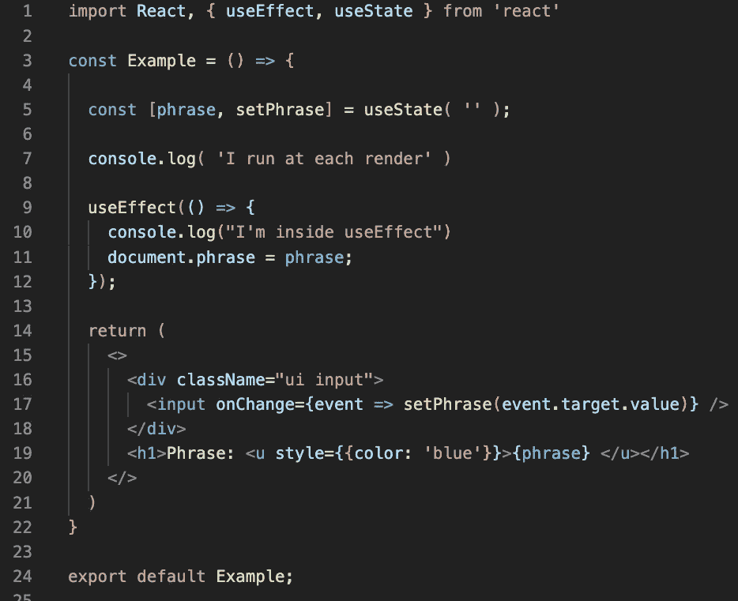
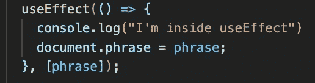
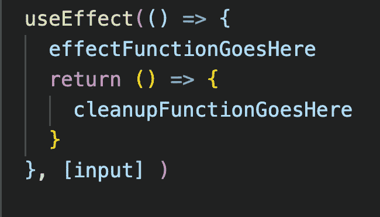

# React 中对“useEffect”挂钩的深入探究

> 原文：<https://javascript.plainenglish.io/a-deeper-dive-into-the-useeffect-hook-in-react-4c932215ad00?source=collection_archive---------1----------------------->

在钩子出现之前，我们只能在类组件中使用**状态**或**生命周期方法**。然而，现在有了钩子，React 为我们提供了类似于*使用状态*、*使用效果*、*使用上下文*、 *useRef* 等函数，这些函数在函数组件中提供了额外的功能。

我们本质上可以像在类组件中一样“挂钩”React 特性。例如，如果您正在处理一个功能组件文件，并且发现自己需要向它添加状态，没问题！您可以简单地使用 useState 钩子。React 钩子中有一个对我来说比较难掌握的函数是 **useEffect** 钩子。因此，让我们深入研究一下它是什么，什么时候使用它，以及如何使用它。

# **什么是 useEffect？**

**使用效果**本质上是*“使用副作用”的简称它允许你在功能组件中添加副作用，或者本质上，类似生命周期方法的东西。如果您还不熟悉钩子，基本上它是 componentDidMount、componentDidUpdate 和 componentWillUnmount 生命周期方法，所有这些都组合在一个称为 useEffect 的有效函数中。*

在 React 组件中，有两种常见的副作用——不需要清理的副作用和需要清理的副作用。这些影响的例子包括获取数据、注册事件监听器或设置对外部数据源的订阅。

基于类的组件中的生命周期方法和功能组件中的 useEffect 挂钩之间的区别在于，开发人员可以更容易地直接识别在类中做什么的代码部分。语法更加明确，例如，对于“反点击”任务看到 componentDidMount，对于初始点击之后的另一次点击看到 componentDidUpdate。useEffect 允许我们减少这段代码的重复。

# 使用 useEffect 挂钩

为了在函数组件中使用它，我们将它添加到文件顶部的 import React 语句中。

标准语法如下所示。我们调用 **useEffect，**然后我们提供一个函数作为**第一个参数**，也就是 **( ) = > { }。第一个参数总是函数。这放在箭头后的花括号内。下面的第二张图更多地展示了这种结构，给出了上下文，其中“效果”是我们想要执行的功能或“副作用”。**

我们放在 useEffect 函数中的第二个参数是在代码被执行时控制**的。这要么是一个数组，里面有像上面看到的**【输入】**一样的东西，要么是一个空数组 **[]** ，要么根本没有数组。由于第二个参数是可选的，下面的代码也同样有效。**

那么，这三者之间有什么区别呢？在三种情况下，我们会配置 useEffect 钩子来自动运行我们的代码。：

1.  **[]****空数组****:***仅在第一次渲染组件时*
2.  ***…。**** nothing ****:**组件第一次渲染时以及以后每次重新渲染时*
3.  ***【数据】****内部有数据的数组** **:**
    组件第一次渲染时，以及每当组件重新渲染且某段数据发生变化时。*

*让我们举例说明这些场景。在这个例子中，我们有一个页面，用户可以在这里输入并看到他们的短语打印在屏幕上。*

**

*这是我们的代码。*

**

*我在 useEffect 函数内部和外部添加了 console.logs，这样我们就可以使用控制台看到不同副作用的行为。*

**

*一旦页面加载完毕，我们会看到一个初始控制台日志“我在每次渲染时运行*”和“我在使用效果*中运行*和* *”。如果没有参数，我们的 useEffect 会在每次渲染后被调用。**

**

*很少会没有第二个参数，因为通常会有一个包含数据的数组或一个空数组。但是出于演示的目的，我想让你看看当你跳过提供依赖数组时是什么样子。*

*现在，我们添加一个空数组作为第二个参数。*

****

*对于空数组，我们看到 useEffect 中的文本只在初始渲染时运行。每次修改后，我们只能在控制台中看到“我在每次渲染时运行”。*

*现在来看第三个场景，一个包含数据的数组。*

****

*有了一个包含数据的数组，我们的效果将在初始渲染时运行，并且如果数据在上次渲染后发生了变化，它也将在每次重新渲染后运行。*

# *卸载呢？*

*如开头所述，useEffect 将生命周期方法 componentDidMount、componentDidUpdate 和 componentWillUnmount 组合成一个函数。到目前为止，我们只看到了安装和更新。为了实现 componentWillUnmount，也称为“清理”，我们只需在我们的效果函数下面，在我们的第二个参数之前返回一个函数。下面反映了语法方面的情况。*

**

*效果中的这个返回是一个可选功能，充当效果的清理工具。*

*对于这个例子，我修改了我的代码，增加了一个“显示/隐藏切换”按钮。当我们切换到“隐藏”时，我们有一个 console.log，它打印“ ***Unmount*** ”，当我们切换到“显示”时，它打印“ ***Rende*** r”到屏幕上。*

**

*正如你可以在我们的 useEffect 中看到的，我们跳过了添加第二个参数。让我们看看在第 8–9 行添加清理机制后会发生什么。*

**

*当我们切换 show/hide 按钮时，当 **Hello** 消失时，它打印“ *unmount* ”，当它重新出现时，它打印“Render”。但是，当我单击“re-render”按钮时，每次单击都会同时打印卸载和渲染。那么，为什么它在每次渲染后也“卸载”，而不是在卸载期间只卸载一次呢？这是因为我们必须记住，每次在没有依赖关系(也就是第二个参数( **[]** 或**【某些数据】**)的情况下，渲染时都会调用效果。*

*如果你想运行一个效果并且只清理一次，记得传入空数组作为第二个参数。*

****

*在这里，当我们单击 Show/Hide 切换时，它会像我们期望的那样在控制台上打印 Unmount 和 Render。但是，当我们单击 re-render 时，控制台中不会打印任何内容，因此只在装载(显示)或卸载(隐藏)时运行一次。这种方法是一种稍微好一点的优化性能的方法，因为我们减少了调用清理函数的次数。*

# *关于 useEffect 需要注意的几件事*

*   *正如我们在例子中看到的，useEffect 在每次渲染后运行。查看 useEffect 运行时间的最佳方式是打开控制台，这样您就可以看到。*
*   *您可以使用多个 useEffect 函数来分离单个组件中的关注点。尽管一个单独的 useEffect 被设计成只处理一个问题，但是如果需要的话，不要犹豫使用几个。这比用一个效果处理几个问题要好得多。*
*   *确保不要不必要地重新渲染组件。您可以通过提供第二个参数来防止这种情况，第二个参数可以是包含数据或值的数组，也可以是空数组。*

# *结论*

*希望这能对 useEffect 有所启发，不管你是钩子新手还是只知道使用它的基本知识。它非常强大，并为您的 React 应用程序添加了如此多的功能。*

*虽然基于类的组件很少在较新的 React 应用或项目中使用，但我认为知道这一点仍然很重要，即使是对那些新 React 的人来说。你可能会加入一家公司，最终不得不从事具有基于类的组件的遗留代码。了解生命周期方法和 useEffect 的差异、相似性、利弊将对您的职业生涯和 React 发展大有裨益。编码快乐！*

**更多内容尽在*[*plain English . io*](http://plainenglish.io/)*