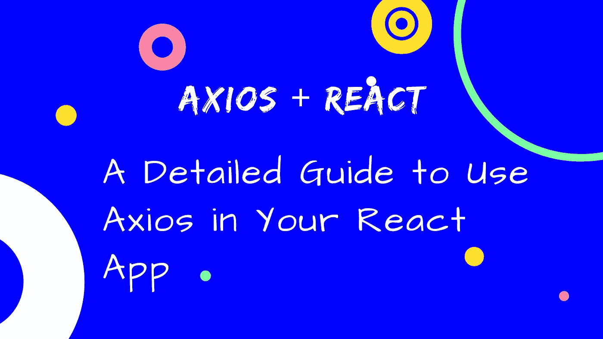
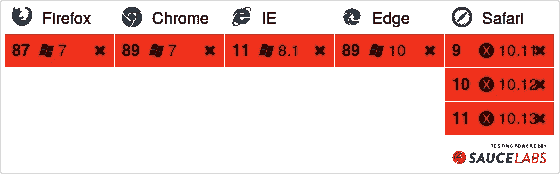
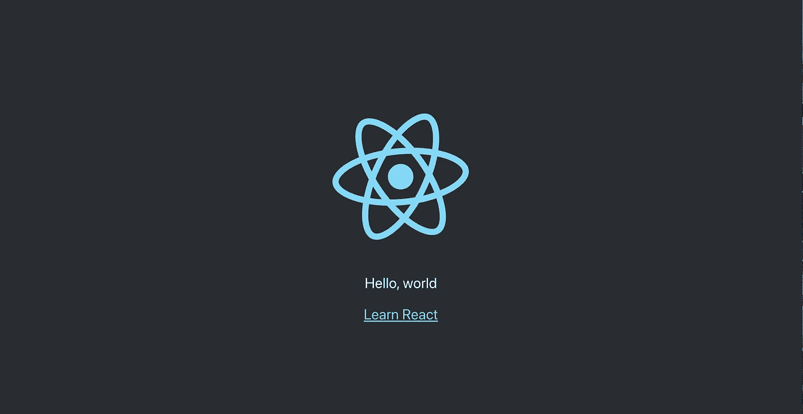
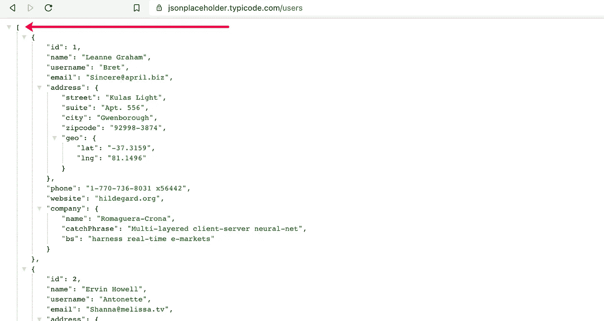

# 在 React 应用中使用 Axios 的详细指南

> 原文：<https://javascript.plainenglish.io/a-detailed-guide-to-using-axios-in-your-react-app-7396f79fb4c2?source=collection_archive---------3----------------------->



## **简介**

React 不是一个成熟的框架，所以它不太关心路由、网络调用等事情。

在 React 环境中，我们对几乎所有事情都有很多选择。对于网络，我们也有很多选项，如`fetch`、`axios`、`react-http-client`等。

除此之外，Axios 还提供了许多功能，如`global-config`、`Interceptors`，更好的错误处理程序等等。

## Axios

Axios 是用于浏览器和 Node.js 的基于 promise 的 HTTP 客户端。Axios 提供了许多特性来为 React 应用程序进行 HTTP 网络调用。

## 浏览器支持

Axios 拥有出色的浏览器支持，包括 IE11。因此，它将解决许多基于浏览器网络问题。



[https://saucelabs.com/open_sauce/build_matrix/axios.svg](https://saucelabs.com/open_sauce/build_matrix/axios.svg)

看酱上的报道:[https://saucelabs.com/u/axios](https://saucelabs.com/u/axios)

## 安装:

使用 npm 安装 Axios】

地点:[https://axios-http.com/](https://axios-http.com/)

## 创建一个空项目

我们将创建 use [Create-React-App](https://create-react-app.dev/) 并进行您想要的必要更改:`npx create-react-app **react-simple-http**`。

现在你会看到这个页面:



我们将对 JSON 占位符服务器进行 API 调用。

在`App.jsx`中:

在这段代码中，您可能会注意到我们通过`res.data`访问响应数据，但是在响应中，它是一个数组。



因为 Axios 会自动解析响应并在数据键中分配数据。它还会在响应对象中提供大量信息。

上面的例子非常简单，现在我们来看看实际应用中的具体问题，比如:

1.  **如何在每个请求的头中添加 auth token？**
2.  **在退出页面/组件时，如何停止待定请求？**
3.  **如何用 Axios 处理 react js 中的错误？**
4.  如何处理 Axios 中的 CSRF？

## 批准


[https://unsplash.com/photos/Vp3oWLsPOss](https://unsplash.com/photos/Vp3oWLsPOss)

在真实的应用程序中，每个请求都必须包含用于授权的 auth-token。在 Axios 中，我们可以使用 [Axios 拦截器](https://axios-http.com/docs/interceptors)为每个请求添加 auth 头。

如果令牌可用，这段代码将为每个请求添加`Authorization`头。在登录/注册页面中，我们不需要将它们发送到服务器。在这些页面上，删除本地存储令牌(如果可用)。

## 中止/取消请求


[https://unsplash.com/photos/IqB5MPcQp6k](https://unsplash.com/photos/IqB5MPcQp6k)

如果组件被破坏，我们应该取消该特定组件发出的所有未决网络调用。在 Axios 中，我们可以通过使用 [Axios 取消](https://axios-http.com/docs/cancellation)来中止/取消。

通过使用 Axios 取消令牌，我们可以取消挂起的请求。

```
const cancelTokenSource = axios.CancelToken.source();

axios.get('/user/12345', {
  cancelToken: cancelTokenSource.token
});

// Cancel request
cancelTokenSource.cancel();
```

上面的例子是 Axios 消除的最简单的应用。

我们可以通过 3 个简单的步骤实现 Axios 消除。

我已经为这三个简单的步骤添加了注释。

## **错误处理**


[https://unsplash.com/photos/bMvuh0YQQ68](https://unsplash.com/photos/bMvuh0YQQ68)

在现实世界中，每个应用程序都使用一些共同的规则，如“如果响应头包含 401，则重定向到登录页面，等等”。为此，我们需要处理应用层。

```
axios.interceptors.response.use(undefined, function (error) { *// Handle you error* return Promise.reject(error);});
```

上面的代码是 Axios 拦截器在全局错误处理程序中最简单的用法，但是在现实世界中，应用程序需要在生产和开发模式下处理大量的错误。

如果响应状态代码为 401，此代码将重定向到登录页面，并且仅在开发模式下显示控制台错误，在生产和开发模式下都显示警报。

## CSRF 代币


[https://unsplash.com/photos/QozzJpFZ2lg](https://unsplash.com/photos/QozzJpFZ2lg)

如果你使用一个高级的网络框架，比如 Laravel，Django 等等。我们可能需要将 CSRF 令牌和请求数据一起发送。Axios 默认支持 CSRF 令牌。

如果您对在 react 应用程序中使用 Axios 有任何疑问，请在评论中留下。

**感谢您的阅读！**如果你喜欢这篇文章，可以考虑[在 Twitter 上关注我](https://twitter.com/NaveenDA_)，并与你的开发者朋友分享这篇文章。🐋

*更多内容请看*[***plain English . io***](http://plainenglish.io/)