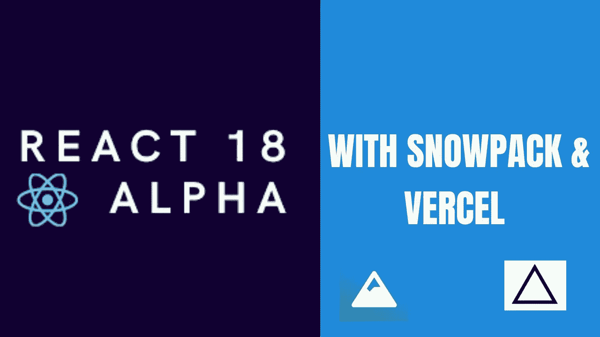
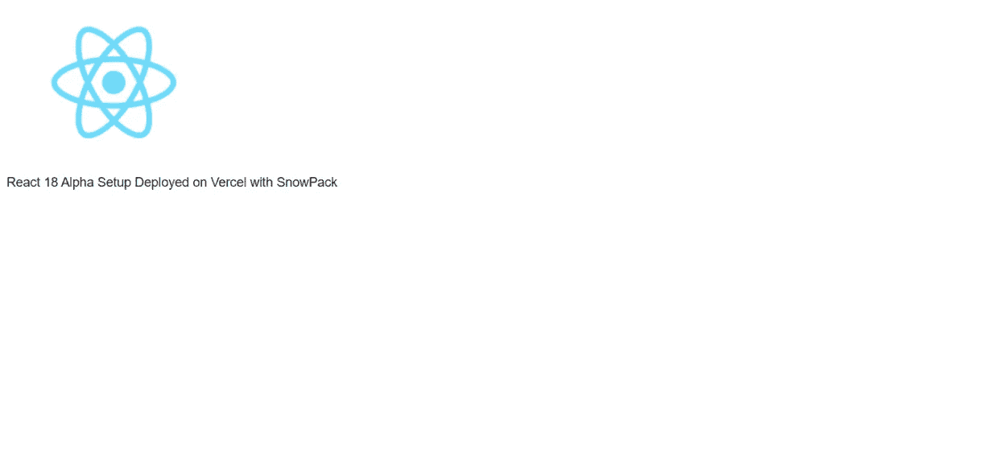
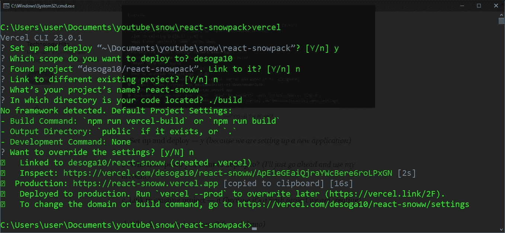
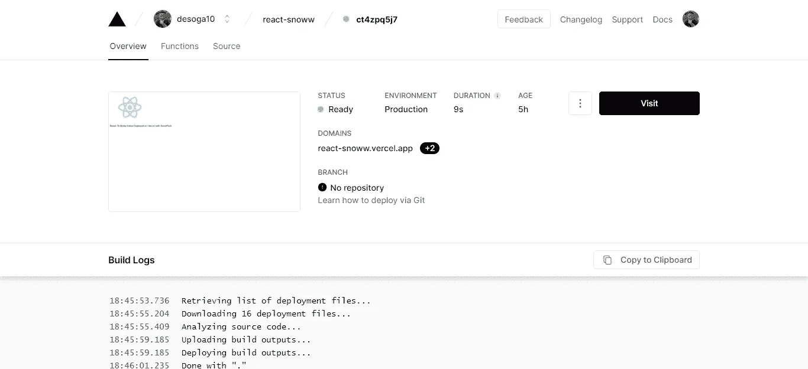

# 首先看看如何用 Snowpack 和 Vercel 设置 React 18 Alpha

> 原文：<https://javascript.plainenglish.io/a-first-look-at-how-to-set-up-react-18-alpha-with-snowpack-and-vercel-d49f31d18f42?source=collection_archive---------8----------------------->

## 如何用 Snowpack 和 Vercel 设置 React 18 Alpha



Header Image

# 如果你喜欢看视频…

*一定要订阅官方* [*码角*](https://www.youtube.com/c/TheCodeAngle/videos) *Youtube 频道获取更多视频。*

the video version of the article

> 空谈不值钱。给我看看代码
> ――莱纳斯·托沃兹

# 目录

1.  [*简介*](#1f8f)
2.  [*使用 Snowpack 安装和设置 React*](#95c7)
3.  [*文件夹结构*](#1c90)
4.  [*代码概述*](#55ba)
5.  [*运行应用*](#4ae5)
6.  [*部署流程使用 Vercel*](#798f)
7.  [*结论*](#af36)

# 介绍

本月早些时候，React 团队发布了一些关于 React 18 发布的更新。这些更新包括以下内容:

*   React 18 版本的工作已经开始，这将是下一个主要版本。
*   已经成立了一个工作组，为社区逐步采用新功能做准备。
*   一个 Alpha 版本已经发布，供库作者尝试并提供有价值的反馈。

本教程旨在使用 SnowPack 设置 React 18 Alpha 版本，snow pack 是一个为现代 web 设计的快速前端构建工具。然后我们在 **Vercel** 上部署。

# 使用 Snowpack 安装和设置 React

首先，你需要安装 [Node.js](https://nodejs.org/en/) ，一旦完成，你就可以安装 [Snowpack](https://www.snowpack.dev/) 。您可以使用下面的命令来安装 Snowpack。

```
npm install snowpack
```

安装完成后，您可以转到您想要放置新项目的目录。

现在在您的终端中运行以下命令，创建一个名为 ***react-snowpack 的新目录。*** 这将自动生成一个最小锅炉板模板。

```
npx create-snowpack-app react-snowpack --template @snowpack/app-template-minimal
```

现在，您可以使用以下命令转到新目录

```
cd react-snowpack
```

一旦进入这个目录，我们就可以通过运行下面的命令来安装 React 18 Alpha 版本。

```
npm i react@alpha react-dom@alpha
```

一旦完成，你可以检查你的 package.json 文件来确认 ***React 18 Alpha*** 已经安装。它应该看起来像我们下面的东西。

```
"dependencies": { "react": "^18.0.0-alpha-cb8afda18-20210708", "react-dom": "^18.0.0-alpha-cb8afda18-20210708" 
 } 
}
```

# 文件夹结构

React 使用一种叫做 **JSX** 的模板语言。 **JSX** 代表 JavaScript XML。它是一个看起来像 **HTML** 的内嵌标记，在运行时**被转换成 **JavaScript** 。**

文件夹重组的第一步是用扩展名 **jsx** 重命名 ***index.js*** 文件，就像这样， ***index.jsx.*** 这样做将允许 ***Snowpack*** 知道我们正在运行一个 React 项目。

最后，我们应该有下面的文件夹结构。

```
> public 
  > index.css 
  > index.html 
> src 
  > App.jsx 
  > index.jsx 
.gitignore 
package-lock.json 
package.json 
snowpack.config.mjs
```

# 代码概述

在我们启动应用程序并将其部署在 Vercel 上之前，我们将在四个文件(***index.html、App.jsx、index.jsx 和 snowpack.config.mjs*** )中进行代码修改。

# index.html

在 index.html 法典中，必须注意三件事:

*   这个 ***id*** 称为 ***根*** 我们将在 index.jsx 文件中引用。
*   在脚本标签中，我们有一个名为 module 的类型，使 snowpack 知道我们将使用 ES6 语法。
*   同样在脚本标签中，我们有一个 **src** 属性来表示我们的部署目录的路径，该目录将在***snow pack . config . mjs***文件中进行配置。

# App.jsx

在上面的***app . jsx****文件中，我们使用一个功能组件生成一个简单的***React****样板文件。**

# **索引. jsx**

**在***index . jsx****文件中，我们做了三件事使我们能够启动 app。***

*   ***首先，我们导入 **React、ReactDOM** 和***app . jsx****文件。****
*   ***然后我们创建了一个变量来获取*文件中的 id。****
*   ***最后，我们利用 **React 18** 中新的***create root***API 来渲染应用程序。***

# **snow pack . config . mj**

**每个 **Snowpack** 应用程序都使用***snow pack . config . mjs***文件进行任何配置，如部署流程。在这个项目中，我们将只通过添加***public****和***src****键来编辑挂载对象。****

***当我们运行 build 命令时，它们充当指向将构建我们的部署文件夹的路径的指针。***

# ***运行应用程序***

***现在，保存好所有文件后，我们可以返回终端，运行开始命令`npm run start`，这将在浏览器中生成下面的页面。***

******

***现在我们的 ***React 18 alpha*** app 已经成功上线运行。***

# **使用 Vercel 的部署流程**

> **Vercel 使开发人员能够托管即时部署和自动扩展的网站和 web 服务，无需任何配置。**
> 
> ****-Vercel** 文档**

**部署的第一步是在我们项目的根目录下运行下面的命令。**

```
**npm run build**
```

**这将生成一个**构建**目录。在 **build** 目录中有一个***dist****文件夹，其中包含我们将推送到 **Vercel** 的代码。***

***接下来，我们将执行以下操作:***

*****①。安装 Vercel*****

***为此，我们运行命令`npm i -g vercel`***

*****2)。登录到 Vercel*****

***在您的机器上全局安装 Vercel 之后。在终端输入`vercel`。如果您尚未登录，这将提示您登录您的帐户。***

*****3)。项目设置和部署*****

******

***为了总结上图中的提示问题，将询问以下问题:***

*   ***设置部署— ***Y*** *(是新应用)。****
*   **您要部署到哪个范围？ *—选择您的帐户名称。***
*   **找到项目“desoga10/snowpack-react”。链接到它？— ***N*** *(因为我们要作为不同的项目部署)。***
*   **链接到不同的现有项目？— ***N*** *(因为我们正在创建一个新项目)。***
*   **你的项目叫什么名字？ *(react-snoww)。***
*   **您的代码是在哪个目录下创建的？。/build(它在我们用 ***npm run build*** 命令生成的构建文件夹中)。**
*   **想要覆盖设置吗？ ***N*** *(防止 Vercel 更改或默认设置)。***

**Vercel 现在将构建应用程序，在这个过程中安装所有的依赖项。安装完成后，终端中将出现一个检查链接。通过这个链接，我们可以访问 Vercel 仪表板来查看我们部署的应用程序。**

****

****4)。打开已部署的项目****

**现在，您可以通过单击上图所示仪表板上的“访问”按钮来访问新部署的项目。**

****

# **结论**

**你可以在我的 [GitHub](https://github.com/desoga10/react-snow) 账号中找到部署的代码。**

**我也创建了 [Youtube](https://www.youtube.com/TheCodeAngle) 教程，请务必订阅，谢谢。**

***原载于 2021 年 7 月 18 日 https://thecodeangle.com*[](https://thecodeangle.com/a-first-look-at-how-to-set-up-react-18-aplha-with-snowpack-and-vercel/)**。****

***更多内容请看*[***plain English . io***](http://plainenglish.io/)**