# 一个好的开发者也是一个好的谷歌人

> 原文：<https://javascript.plainenglish.io/a-good-developer-is-also-a-good-googler-307ca19d160?source=collection_archive---------15----------------------->

## 找到您需要的东西的提示和技巧

Photo by [Luca Sammarco](https://www.pexels.com/@samma97?utm_content=attributionCopyText&utm_medium=referral&utm_source=pexels) from [Pexels](https://www.pexels.com/photo/person-holding-white-tablet-computer-6155000/?utm_content=attributionCopyText&utm_medium=referral&utm_source=pexels)

为了有效地开发软件，了解不同的技术技能是必要的，但是了解如何搜索你不知道的内容也是必不可少的。

我会在这篇文章中给你一些提示和技巧，我用它们来更快地找到我的答案。

## 1.通配符

通配符意味着匹配任何单词或短语。如果您不知道想要搜索的单词/短语的一部分，或者如果您要替换某些内容(在本例中，我想用通配符替换单词“resources/fil1.jsk ”),这将非常有用。

用“*”表示。

示例:

错误:*Java . io . file not found exception:类路径资源[resources/fil1.jsk]不存在，无法打开。*

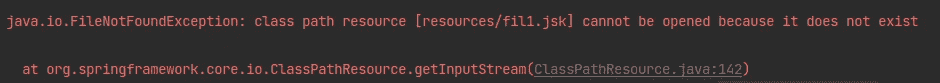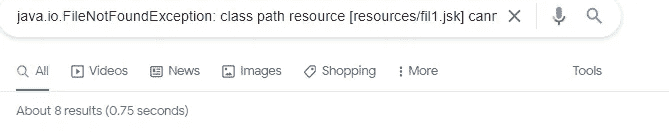

Without using the “*” command.

如果不使用“*”命令，我们只能获得八个结果，但是如果我们使用“*”命令，搜索中获得的结果数量会大大增加。

错误:*Java . io . filenotfoundexception:类路径资源* ***[*]*** *不存在，无法打开。*

Using the “*” command.

## 2.使用特定的域

如果你知道在哪里搜索，你可以改进你的搜索结果。如果您搜索一个特定的代码示例，并且希望结果是由[堆栈溢出](https://stackoverflow.com/)提供的，您可以使用关键字“site”:

**站点** : stackoverflow java 头部空间异常

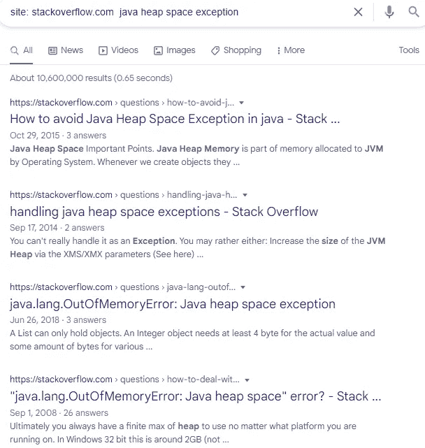

Find out the key keywords by adding the site command.

或者您可能想搜索源代码来做一些事情:

**站点**:github.com Java 编码器

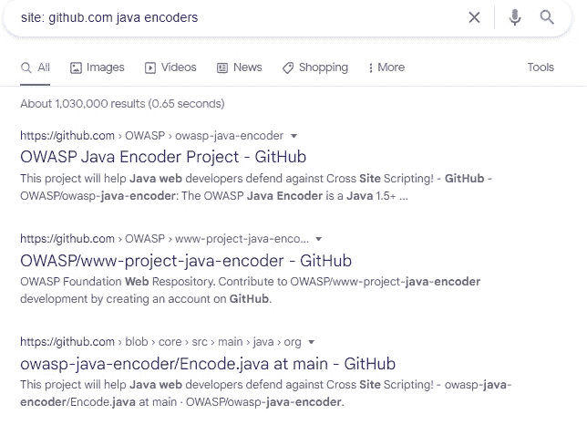

Results in GitHub for “java encoders.”

## 3.使用学到的行话

在下一个查询中添加您从之前的搜索中学到的行业术语。

在这个行业，我们使用特殊的行话。当我们面对一个不知道如何解决的问题并开始寻找信息时，我们会学到越来越多的行话。如果我们使用我们所学的，我们将重新定义更多的后续搜索，并获得更好的结果。

## 4.将你的问题分成关键词进行搜索

在这里，向下滚动相关问题是很重要的，因为有人已经问得更好了。

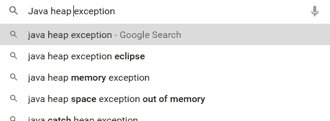

Slice your questions into keywords and search

## 5.使用“对”对命令

当你想寻找替代品的时候，A 型 vs. B 型是最好的选择。

例如:

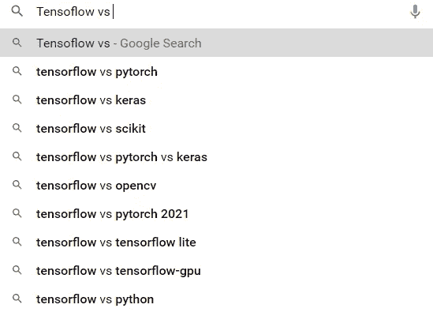

Use the “versus” vs. command.

## 6.逐渐添加搜索词

好的建议是从简单的开始，然后逐渐变得复杂。请参见下面的示例:

*   Java 堆异常
*   java 堆异常 eclipse
*   …

这种搜索将逐步改进您的搜索，为您带来更少、更有针对性的术语。

## 7.花时间学习基本的搜索命令

*   使用双引号迫使谷歌使用精确匹配。例如*“numpy 数组”*

Without the double-quotes.

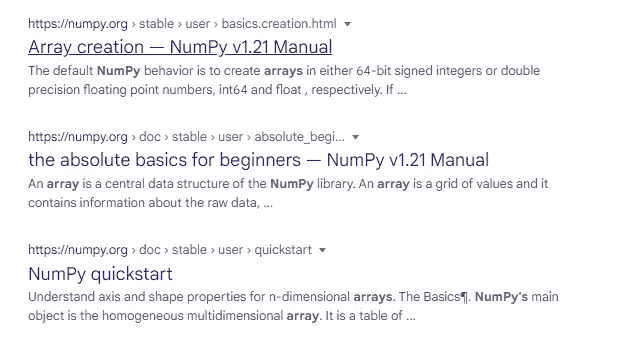

Without the double-quotes.

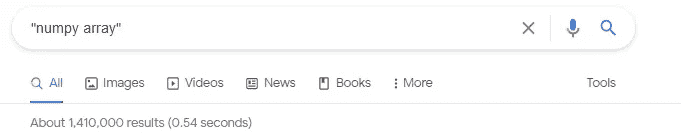

With the double-quotes.

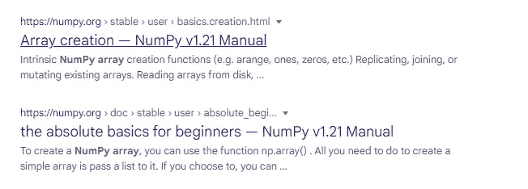

With the double-quotes.

*   <or>、谷歌搜索默认为词与词之间的逻辑 AND。为逻辑 or 指定“OR”。例如 JavaScript 或 TypeScriptor JavaScript | TypeScript。</or>
*   任何术语或其他命令前面的减号(-)用于将该术语从结果中排除。例如 SE JDK 15，以避免带有“SE”字的结果。

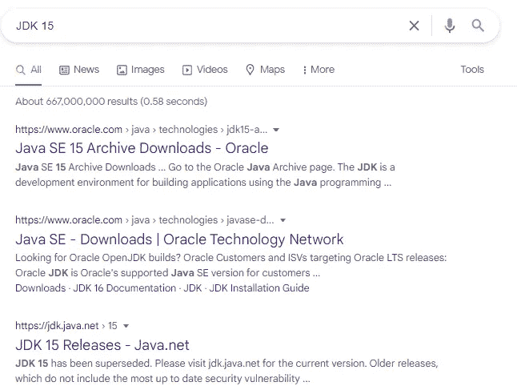

Without the exclude word command.

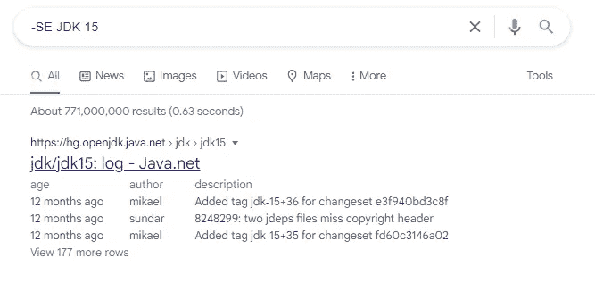

With the exclude word command, the search result is now more refined.

*   就像"-"命令一样，但在本例中，for 包含单词。

## 8.使用关键字“如何”

如何在<language>的</language>

例如:如何解决内存头异常

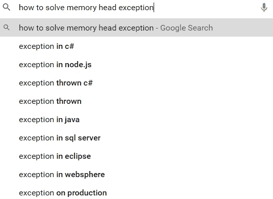

Use the key “How to.”

## 9.只使用必要的单词

确定什么是关键的关键字。

举个例子，当我想用 JavaScript 搜索“如何在数组中迭代”时，我放上关键词:“迭代数组 ES6”。然而，我从不使用有意义的或大的句子。

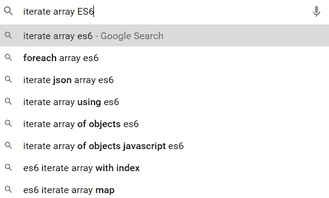

Use important words only.

在这个例子中，我使用单词“ES6”，因为正如我在第二点中指出的，我已经知道使用“ES6”将返回最新的结果。

## 10.使用“已解决”、“已接受”或“示例”作为额外的搜索词

虽然这还不是 Google 的功能，但是使用关键字“已解决”或“已接受”可以为您节省很多其他开发人员提出相同问题的答案，但是问题还没有解决。

一般来说，在网站上搜索时，关键字“已解决”比关键字“已接受”表现得更好。但是在堆栈溢出中，后者效果更好。

当寻找某样东西的例子时，关键字“例子”很方便，因为它们通常是有效的。

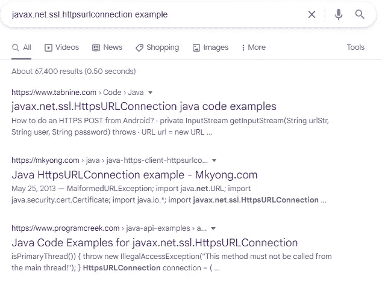

Use “solved,” “accepted,” or “example” as an additional search term.

## 11.直接使用跟踪错误链

当我们去谷歌搜索一个错误时，最好的办法是直接搜索错误的文本。

如果我们没有找到我们需要的，我们可以从错误信息开始，缩小范围。

但是请记住，如果有必要避免使用特定于系统的单词，使用第三点中的“*”通配符是有帮助的。

## 11.使用 Google 提供的工具(或同等工具)

如果你想搜索一个当前的解决方案，向你显示最新版本的最相关的结果，你可以指示谷歌使用过滤器“工具-过去一年”来限制答案。

一般来说，使用搜索引擎提供的过滤器是一个好主意。

例如:添加“after:2021–09–01”以排除过时的答案。

或者你也可以使用谷歌的建议:

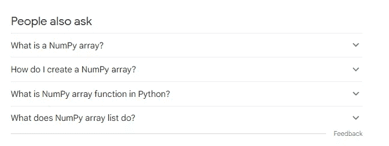

Google suggestion list.

# 最后的想法

您不需要了解所有的技术或编程语言，但是您需要对它们有一个基本的了解，以便知道要寻找什么以及找到您要寻找的内容的适当技术。此外，如果你知道如何高效地搜索，你会获得更好更快的结果，你的生产力也会提高。

请记住，你搜索得越多，你就越知道如何搜索正确答案。

*更多内容请看*[***plain English . io***](http://plainenglish.io/)