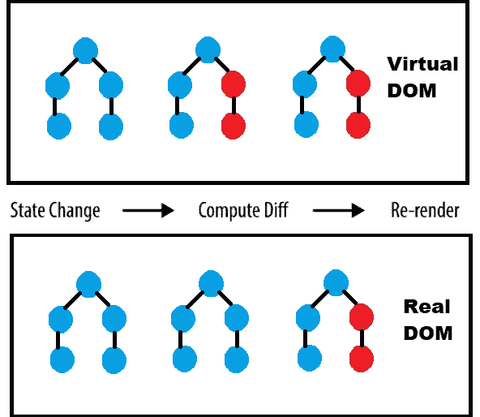

# React 虚拟 DOM:用简单的话解释

> 原文：<https://javascript.plainenglish.io/a-guide-for-understanding-virtual-dom-tekolio-2f107d5122cc?source=collection_archive---------15----------------------->

让我们先了解一下 DOM 是什么。DOM 代表文档对象模型。它是一个树的结构表示，节点将不同的 HTML 标签表示为 JavaScript 对象，这使得浏览器更容易理解。

我们以前都在普通 JS 中使用过 DOM，比如 document.getElementById 或 document.getElementByClass，列表是红色的，我们可以根据自己的意愿轻松地修改内容。

# 更新内容

要修改内容或样式，我们需要 JavaScript 对象，因为浏览器不能理解 HTML 标签。每次我们更改内容或样式时，都会产生一个与该更改相对应的新状态，因此会有一个状态更改(从初始到最终)来更新 DOM (UI)。

但是我们仍然不知道什么成为了这样一个理想过程的最昂贵的限制，React 有它自己的解决方案来处理它。

# DOM 的问题

如前所述，实际过程中不存在这样的问题，但是这个过程只能用于具有少量节点的 DOM 树，当我们谈论，比如说一千个节点时，一切都可能出错。

根据该过程，在每次状态改变之后，DOM 树必须被重新呈现，并且重新呈现具有 1000 个节点的树不是处理它的好方法，因为许多事情可能出错，例如失去速度或准确性，并且甚至可能花费我们很多空间。

为了解决这个问题，react developed 为他的应用程序开发了一个名为虚拟 DOM 的新 DOM。

# 虚拟 DOM

根据 React 的[文档，“**虚拟 DOM 或 VDOM 只是 UI 的虚拟表示，保存在内存中，与真实 DOM 同步”。**](https://reactjs.org/docs/faq-internals.html)

更简单地说，VDOM 与真正的 DOM 没有什么不同，只是它是 UI 的虚拟或轻量级副本，存储在内存中，并始终与实际的 UI 保持联系。

它与真实的 DOM 具有相同的属性并遵循相同的过程，但它不能直接影响内容，而真实的 DOM 在相对于 VDOM 进行修改后需要更多的时间来加载或呈现其 UI。

> ***但真正的问题是，在修改后所有属性甚至渲染 UI 的过程都一样的情况下，如何更快？***

# VDOM 的工作

我们都知道，在虚拟 DOM 中，与实际对象相似的虚拟对象是用相似的属性创建的，并且在每次状态改变后，DOM 都会重新呈现自己，但是 React 为我们准备了一些不同的东西。

React 同时维护两个虚拟 DOM。一个 DOM 是更新版本，而另一个是预更新版本或原始版本。它们之间会发生状态变化。

在两个 DOM 之间进行比较，并且其中发生了变化的组件(只有该组件)将被再次呈现，而其他组件保持不变。这个过程叫做**差分。**

一旦 diffing 完成，React 拥有了发生了变化的组件或对象，那么在真正的 DOM 中只有这一部分得到更新。这个过程是一个批处理过程，而不是一步到位的过程，在这个过程中，所有的更改都被同时发送到真正的 DOM。

简单地说，真正的 DOM 将只为那些发生变化的部分渲染，而不会为树的其余部分重新渲染。这将影响我们的应用程序和页面的速度和效率。

# 例子

让我们看一个例子来更好地理解它。

下图显示了 DOM 的树结构及其节点。蓝色圆圈代表 DOM 的原始状态，而红色圆圈代表更新后的状态

如上所述，虚拟 DOM 在真实 DOM 之前得到更新，这是因为真实 Dom 将只进行虚拟 Dom 检测到的那些更改，并按原样显示 UI 的其余部分。

在上图中，虚拟 DOM 检测到第三组节点中的两处红色变化，第三组节点中的真实 DOM 显示相同的圆圈，而之前没有任何变化。

红色的圆圈只会被渲染，因为只有那些被检测到被真正的 DOM 修改的圆圈会被渲染得更快更有效。

# 概述

1.  虚拟 DOM 是 DOM 在内存中的虚拟表示或轻量级副本。
2.  虚拟 DOM 和真实 DOM 通过 ReactDOM 库同步在一起。这个过程叫做和解。
3.  React 将更新后的虚拟 DOM 与更新前的虚拟 DOM 进行比较，以检查更新后的对象或组件，然后在真实 DOM 中进行更新。这个过程叫做 diffing。
4.  React 使用关键点来避免不必要的重新渲染。
5.  虚拟 DOM 比真实 DOM 快
6.  虚拟 DOM 具有与真实 DOM 相同的属性，但是它缺乏直接改变屏幕 UI 的能力。
7.  每件事都是分批完成的，这样更容易、更快地完成。

*原载于 2021 年 12 月 16 日*[*【https://tekolio.com】*](https://tekolio.com/a-guide-for-understanding-virtual-dom/)*。*

*更多内容请看*[***plain English . io***](https://plainenglish.io/)*。报名参加我们的* [***免费周报***](http://newsletter.plainenglish.io/) *。关注我们关于*[***Twitter***](https://twitter.com/inPlainEngHQ)*和*[***LinkedIn***](https://www.linkedin.com/company/inplainenglish/)*。加入我们的* [***社区不和谐***](https://discord.gg/GtDtUAvyhW) *。*