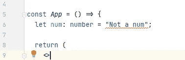
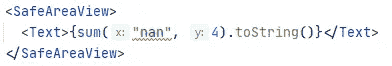

# React Native 中的流程指南

> 原文：<https://javascript.plainenglish.io/a-guide-to-flow-in-react-native-48497ef78e99?source=collection_archive---------6----------------------->

## *流默认自带 React Native，但是怎么用呢？*


Photo by [Austin Distel](https://unsplash.com/@austindistel?utm_source=unsplash&utm_medium=referral&utm_content=creditCopyText) on [Unsplash](https://unsplash.com/s/photos/app-development?utm_source=unsplash&utm_medium=referral&utm_content=creditCopyText)

# 介绍

[Flow](http://flow.org/) 是一个框架，和 [TypeScript](https://www.typescriptlang.org/) 一样，提升了 JavaScript 中的静态类型。和 TypeScript 一样，React Native 也没有任何问题。所以我在想，为什么他们要推广两种静态类型呢？

与 TypeScript 相比，Flow 似乎没有那么大的承诺，因为它使用常规的`.js`文件而不是`.ts`。

# 我们开始吧

我们首先通过在我们的终端中运行`npx react-native init flow`来初始化一个新的 [React Native](https://reactnative.dev/) 项目(没有 Expo ),其中‘flow’是项目的名称。这可以是您想要的任何有效名称。

尝试在您的设备或模拟器上运行裸机应用程序。我将使用一个实际的 Android 设备，并使用`npx react-native run-android`运行它。确保您在正确的目录中。

运行裸应用程序后，我们将继续设置流程。我们已经有了一个`.flowconfig`文件，但是我们缺少依赖关系。

运行`npm i --save-dev flow-bin`将 Flow 安装为一个开发依赖项。

打开您的`App.js`，您已经可以看到第一个流语法。您的 IDE 可能会为此向您提供错误。我用的是 WebStorm，因为它内置了对心流的支持，而且对学生是免费的。

# 流程基础

开始使用 Flow 的第一件事是在文档的顶部添加`// @flow`。这将让 Flow 知道文档使用 Flow 进行静态类型化。

我们在文档的顶部声明了 Flow，并且在 App 函数体中定义了一个变量`num`，我们在`Text`组件中使用这个变量。

如您所料，流使用的语法与 TypeScript 非常相似。您在变量名定义后添加一个冒号`:`，并将变量设置为一个数字。



Error showcase

然而，如果我们用一个字符串值声明我们的`num`变量，我们将得到一条红线。如果你有任何使用 TypeScript 的经验，这并不新鲜。但是让我们更深入地了解一下。

您可以将参数设置为特定的类型，并且您可能会了解这对于提高可读性和减少开发过程中的错误是多么有用。



Error showcase

因为如果我们插入一个无效的参数，我们会得到一个错误。这可以减少头痛，因为你可能永远不会再得到类型不匹配。

# 类型

像 TypeScript 一样，您可以声明类型。这些对象很可能是人物类型、书籍类型或更复杂的类型。

这里我们定义一个`person`类型，根据`name`和`age`的有效类型声明一个人`marques`。我们还可以向`person`声明子对象类型。

现在我们在`person`类型中有了一个子对象`children`。

您可能想在 React 或 React Native 中做的事情是给`props`参数赋予类型。这完全符合你的期望。

## 可选类型

有时你会希望有可选的类型。如果使用“400k”和“22m”这样的格式，并不是每个数字都是数字类型。您可以使用`?`符号来定义它们，如下所示:

```
type Props = {
  foo: number,
  bar?: string
};
```

如你所见，这很容易做到，就像在其他编程语言中一样。

# 下一步是什么？

这些是心流的绝对基础。在使用它一段时间后，我可能不得不说我不会很快使用 Flow。目前缺少 IDE 支持。举例来说，我无法让它在 VSC 工作而不出现错误，说明我只能使用`.ts`文件中的类型。

但尽管如此，我对这个项目的发展方向很感兴趣，我相信支持会继续增长，因为它仍在积极开发中。

如果您想了解更多信息，我将向您推荐 Flow 网站上的官方文档。即使对我来说，还有很多东西要学。

那么，你会使用心流吗？或者你会坚持打字稿吗？

祝你愉快。