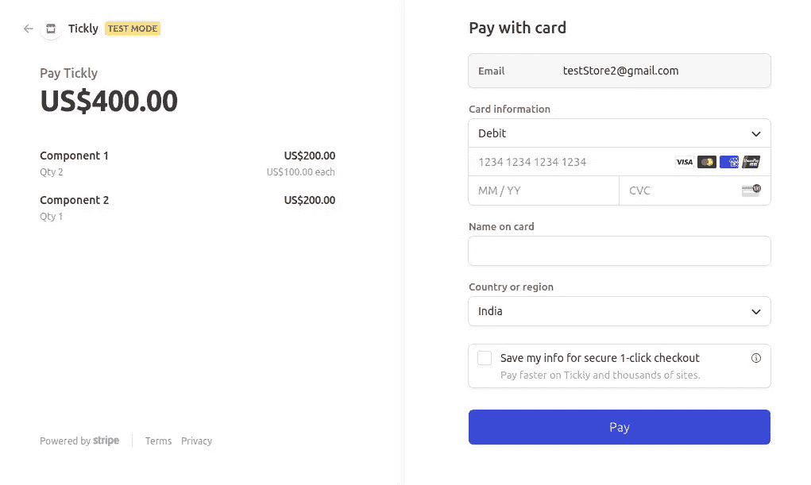
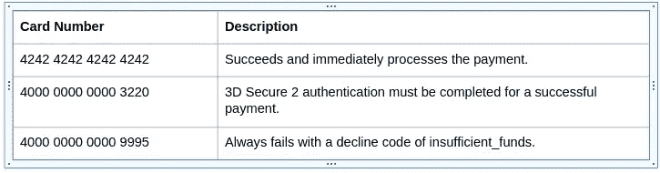

# 条带支付网关集成指南

> 原文：<https://javascript.plainenglish.io/a-guide-to-stripe-payment-gateway-integration-98cb44559b5?source=collection_archive---------14----------------------->

## 您首次将支付网关与 JavaScript 集成所需的一切

Stripe Payment Integration

# **什么是条纹？**

Stripe 是**一个面向企业**的在线支付处理和信用卡处理平台。当客户在网上购买产品时，需要将资金交付给卖家；插入条纹。Stripe 允许通过信用卡或银行安全高效地处理资金，并将这些资金转移到卖家的账户上(详情请见)。

# 开发者快速入门

创建 Stripe 帐户后，即可开始将 Stripe 集成到您的应用或网站中，这需要三个步骤:

1.  [获取您的 API 密钥](https://stripe.com/docs/development/quickstart#api-keys)，以便 Stripe 可以验证您的集成 API 请求。
2.  [安装一个客户端库](https://stripe.com/docs/development/quickstart#api-library)，这样您的集成就可以与 Stripe API 交互。
3.  [发出测试 API 请求](https://stripe.com/docs/development/quickstart#test-api-request)以确认一切正常运行

# 条带签出会话

这是在 Stripe 上构建转换优化支付表单的最快方式。Checkout 创建了一个安全的 Stripe 托管支付页面，让您可以快速收款。它适用于各种设备，有助于提高你的转化率。结帐让您轻松打造一流的支付体验:

*   **旨在消除摩擦** —内置错误信息的实时卡验证
*   **移动就绪**—Apple Pay 和 Google Pay 的全面响应设计
*   **国际** —支持超过 25 种语言和多种支付方式
*   **定制和品牌** —可定制的按钮和背景色
*   **欺诈和合规** —简化的 [PCI 合规](https://stripe.com/docs/security/guide#validating-pci-compliance)、 [SCA 就绪](https://stripe.com/docs/strong-customer-authentication)，以及用于减轻[卡测试](https://stripe.com/docs/card-testing)攻击的验证码。
*   **附加功能** —申请折扣、收税、发送电子邮件收据等等。

# 让我们看看真正的代码是什么样的

在 server.js 中导入`stripe`

使用商品详细信息(名称、单价<in cents="">，数量)、货币创建结帐会话。</in>

# 创建签出会话的元素

结帐会话是当您的客户被重定向到付款表单时所看到的内容的编程表示。您可以使用以下选项对其进行配置:

*   *要收费的行项目*
*   *货币*使用

您还需要指定:

*   一个 *success_url* ，你网站上的一个页面，在你的客户完成支付后重定向到他们。
*   一个 *cancel_url* ，你网站上的一个页面，如果你的客户在结账时点击后退按钮或图标，这个页面会将他们重定向。

# 签出会话页面

这是一个基本的结帐页面的样子，我们可以进一步定制。

Checkout Session Page

# 支付测试

您可以使用几个测试卡来确保您的集成为生产做好准备。将它们与任何 CVC、邮政编码和未来到期日期一起使用。

Card number for testing different cases

# 结论

Try it yourself and enjoy

对于纯在线业务，Stripe 可能是一个非常好的信用卡处理器。对于有开发经验的人来说，它实现起来既快又容易，而且相对便宜。Stripe 的主要缺点是它不处理 PayPal 支付，不像它的一些竞争对手。

你可以在这里找到 GitHub Repo。

你可以在这里买一杯☕咖啡[来支持。](https://www.buymeacoffee.com/amanagarwal)

在 [Twitter](https://twitter.com/02amanag) 和 [LinkedIn](https://www.linkedin.com/in/02amanag/) 上关注我。

*更多内容请看*[***plain English . io***](http://plainenglish.io/)