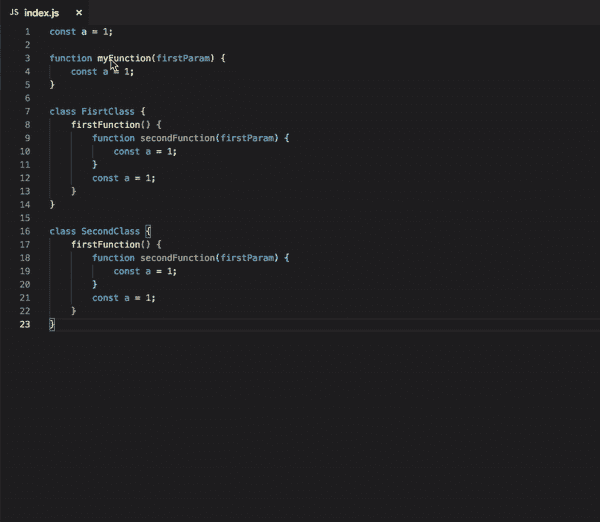

# 2022 年面向前端开发人员的 20 种最佳 VSCode 扩展

> 原文：<https://javascript.plainenglish.io/a-guide-to-the-20-best-vscode-extensions-for-frontend-developers-f75a5d716091?source=collection_archive---------1----------------------->

## 前端开发中最有用的 VSCode 扩展的综合指南

Visual Studio Code (VSCode)是最强大的源代码编辑器之一，它通过提供诸如 IntelliSense 代码完成和调试之类的工具，使开发人员的生活变得更加轻松。

Photo by [Ferenc Almasi](https://unsplash.com/@flowforfrank?utm_source=medium&utm_medium=referral) on [Unsplash](https://unsplash.com?utm_source=medium&utm_medium=referral)

Visual Studio 市场中有数以千计的扩展。我想提及一些扩展，它们对我的前端开发旅程非常有帮助。

## 1.Visual Studio IntelliCode

这个扩展为不同的语言，比如 Python、JavaScript 和 Java，提供了人工智能的帮助。

它支持不同的 JavaScript 框架，比如 Angular、React 和 Next.js。

如果您编写的语言支持，它会自动完成方法或代码。

 [## Visual Studio 智能代码— Visual Studio 市场

### Visual Studio 代码的扩展——人工智能辅助开发

marketplace.visualstudio.com](https://marketplace.visualstudio.com/items?itemName=VisualStudioExptTeam.vscodeintellicode) 

## 2.ESLint

林挺是开发人员解决一些前沿编码问题的最佳工具之一。这个扩展不仅可以检测问题，还可以自动修复一些问题。

 [## eslit—Visual Studio 市场

### 将 ESLint 集成到 VS 代码中。如果您是第一次接触 ESLint，请查看文档。该扩展使用 ESLint 库…

marketplace.visualstudio.com](https://marketplace.visualstudio.com/items?itemName=dbaeumer.vscode-eslint) 

## 3.JavaScript (ES6)代码片段

该扩展有助于自动完成与 ES6 相关的代码。

 [## JavaScript (ES6)代码片段—Visual Studio market

### Visual Studio 代码的扩展 ES6 语法中的 JavaScript 代码段

marketplace.visualstudio.com](https://marketplace.visualstudio.com/items?itemName=xabikos.JavaScriptSnippets) 

## 4.更漂亮—代码格式化程序

当你在一个小组中工作时，格式是很有帮助的关键之一，因为如果代码格式不正确，就很难阅读。

这个扩展有助于格式化任何类型的代码。我们也可以根据需要进行配置。

 [## 更漂亮—代码格式化程序— Visual Studio 市场

### Visual Studio 代码的扩展——使用更漂亮的代码格式化程序

marketplace.visualstudio.com](https://marketplace.visualstudio.com/items?itemName=esbenp.prettier-vscode) 

## 5.实时共享

其中一个最好的工具，您可以编辑或调试的人少机器。

它有助于共享项目，提供终端或调试工具，以及语音呼叫。

 [## 实时共享扩展包 Visual Studio 市场

### 如果您还不熟悉 Visual Studio Live Share，请参考此处了解更多信息。这个扩展包…

marketplace.visualstudio.com](https://marketplace.visualstudio.com/items?itemName=MS-vsliveshare.vsliveshare-pack) 

## 6.Chrome 调试器

如果你想在 VSCode 中调试，那么这是你最好的工具，你可以运行你自己的 chrome 实例并在 VSCode 中轻松调试。

 [## 为 VS 代码引入 Chrome 调试

### Visual Studio 代码的 Chrome 调试器扩展

code.visualstudio.com](https://code.visualstudio.com/blogs/2016/02/23/introducing-chrome-debugger-for-vs-code) 

## 7.路径智能感知

我们在前端开发中处理不同的导入，有时很难得到正确的语法，我们需要一遍又一遍地挖掘，以便在代码中找到正确的路径。

当我们开始键入时，Path Intellisense 帮助自动完成文件路径。令人印象深刻，不是吗？

 [## Path Intellisense — Visual Studio 市场

### 自动完成文件名的 Visual Studio 代码插件。消除上下文切换和昂贵的干扰。创建并…

marketplace.visualstudio.com](https://marketplace.visualstudio.com/items?itemName=christian-kohler.path-intellisense) 

## 8.自动重命名标签

有时我们想改变标签名，如果我们改变第一个标签，我们需要一路搜索相同的标签来改变。

这个扩展有助于自动重命名标签打开/关闭标签。

 [## 自动重命名标记— Visual Studio 市场

### Visual Studio 代码的扩展—自动重命名成对的 HTML/XML 标记

marketplace.visualstudio.com](https://marketplace.visualstudio.com/items?itemName=formulahendry.auto-rename-tag) 

## 9.REST 客户端

我们处理不同的服务集成，可能是 REST 或 GraphQL 服务。

为了在 UI 中实现代码之前检查响应，我们大多使用 Postman，SOAP UI，或者 REST client。

这个扩展可以方便地检查 VSCode 本身的响应。

 [## REST 客户端— Visual Studio 市场

### Visual Studio 代码的扩展—Visual Studio 代码的 REST 客户端

marketplace.visualstudio.com](https://marketplace.visualstudio.com/items?itemName=humao.rest-client) 

## 10.代码拼写检查器

最糟糕的噩梦之一是在代码审查中你得到一个纠正拼写的注释。

这些扩展有助于在编码时纠正拼写。我最好的伴侣 LOL。

 [## 代码拼写检查器— Visual Studio 市场

### Visual Studio 代码的扩展—源代码的拼写检查

marketplace.visualstudio.com](https://marketplace.visualstudio.com/items?itemName=streetsidesoftware.code-spell-checker) 

## 11.项目管理人

有时候，我们一次处理多个项目，需要在不同的文件夹中打开不同的项目。

这个扩展帮助了我们，因为它支持边栏中的多个项目。借助远程项目选项，远程工作变得更加轻松。

 [## 项目经理— Visual Studio 市场

### 改进侧边栏的可用性完全远程开发支持“(波浪号)符号的设置支持全球…

marketplace.visualstudio.com](https://marketplace.visualstudio.com/items?itemName=alefragnani.project-manager) 

## 12.实时服务器

web 开发过程中的一项繁琐任务是，当我们更改代码时，我们需要刷新浏览器来查看新更改的效果。

这个扩展帮助我们在代码发生变化时自动刷新浏览器。这无疑有助于我们提高生产率。

 [## 实时服务器— Visual Studio 市场

### 对不起，但是我现在非常忙。如果你想成为项目的维护者，欢迎随时联系我！你已经…

marketplace.visualstudio.com](https://marketplace.visualstudio.com/items?itemName=ritwickdey.LiveServer) 

## 13.吉特朗斯

了解代码块何时被修改以及由谁修改的最佳工具。它也有助于检查什么是旧代码。

 [## GitLens — Git 增压— Visual Studio 市场

### Visual Studio 代码扩展—增强内置于 Visual Studio 代码中的 Git 功能—可视化代码…

marketplace.visualstudio.com](https://marketplace.visualstudio.com/items?itemName=eamodio.gitlens) 

## 14.代码运行程序

想要在不设置任何东西的情况下运行特定代码吗？有这个扩展就可以实现。

 [## 代码运行器— Visual Studio 市场

### Visual Studio 代码扩展—运行 C、C++、Java、JS、PHP、Python、Perl、Ruby、Go、Lua、Groovy、PowerShell、CMD…

marketplace.visualstudio.com](https://marketplace.visualstudio.com/items?itemName=formulahendry.code-runner) 

## 15.打字英雄

有助于改进您的类型脚本代码。

 [## TypeScript Hero — Visual Studio 市场

### TypeScript Hero 是一个 vscode 扩展，使您的生活更加轻松。当你正在编写大量的打字稿时，你可能想…

marketplace.visualstudio.com](https://marketplace.visualstudio.com/items?itemName=rbbit.typescript-hero) 

## 16.括号对着色机

这个扩展允许通过颜色来识别匹配的括号。

当我们进入一个调试会话并在一个巨大的代码库上工作时，这个扩展可以帮助我们很容易地识别开括号和闭括号。

 [## 括号对着色程序— Visual Studio 市场

### 这种扩展允许用颜色来识别匹配的括号。用户可以定义匹配哪些字符…

marketplace.visualstudio.com](https://marketplace.visualstudio.com/items?itemName=CoenraadS.bracket-pair-colorizer) 

## 17.设置同步

有时我们可能在不同的机器上工作，是的，我们保存的任何 vs 代码片段、扩展、键绑定或设置可能在这里都不可用。

这个扩展有助于在任何机器上重用相同的配置。是不是很酷？

 [## 设置同步— Visual Studio 市场

### 虽然是免费和开源的，但如果你觉得它有用，请考虑通过 PayPal 或 Open……

marketplace.visualstudio.com](https://marketplace.visualstudio.com/items?itemName=Shan.code-settings-sync) 

## 18.CSS 的智能感知

这个扩展有助于给出不同的建议和我们在工作空间中使用的 CSS 类的自动完成。

 [## HTML 中 CSS 类名的 IntelliSense—Visual Studio 市场

### Visual Studio 代码的扩展—基于定义的 HTML 类属性的 CSS 类名完成…

marketplace.visualstudio.com](https://marketplace.visualstudio.com/items?itemName=Zignd.html-css-class-completion) 

## 19.更好的评论

在维护项目时，注释起着至关重要的作用。如果注释写得正确，下一个开发人员就更容易理解代码。

这个扩展有助于进行交互式评论，这将是非常有用的。希望下一个正在阅读我的代码的开发者现在会很高兴。哈哈！！

 [## 更好的评论— Visual Studio 市场

### 更好的注释扩展将帮助您在代码中创建更加人性化的注释。有了这个扩展，你…

marketplace.visualstudio.com](https://marketplace.visualstudio.com/items?itemName=aaron-bond.better-comments) 

## 20.ES7 React/Redux/graph QL/React-本机代码片段

这个扩展很有帮助，因为它会自动提示一些有用的代码。

 [## ES7 React/Redux/graph QL/React-本机代码片段— Visual Studio Marketplace

### 这个扩展为你提供了 ES7 中的 JavaScript 和 React/Redux 代码片段，以及 VS 代码启动的 Babel 插件特性…

marketplace.visualstudio.com](https://marketplace.visualstudio.com/items?itemName=dsznajder.es7-react-js-snippets) 

# 奖金

## 21.涡轮控制台日志

这个扩展通过自动化编写有意义的日志消息的操作，使调试变得更加容易。

 [## Turbo 控制台日志— Visual Studio 市场

### 这个扩展通过自动化编写有意义的日志消息的操作，使调试变得更加容易。I)插入…

marketplace.visualstudio.com](https://marketplace.visualstudio.com/items?itemName=ChakrounAnas.turbo-console-log) 

## 22.进口成本

这个扩展将在编辑器中以内联方式显示导入包的大小。

**延伸阅读:**

*更多内容尽在*[plain English . io](http://plainenglish.io/)