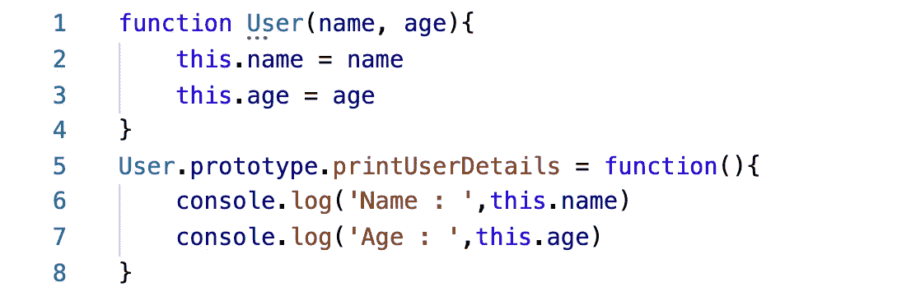
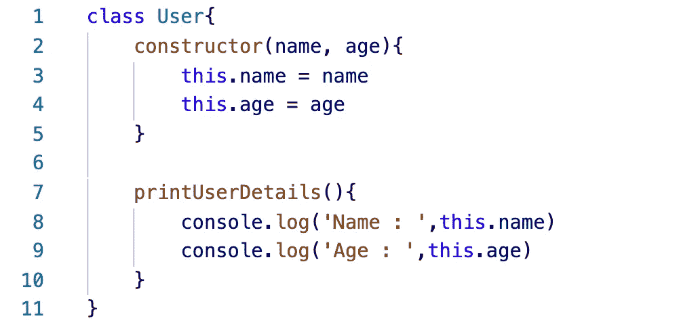
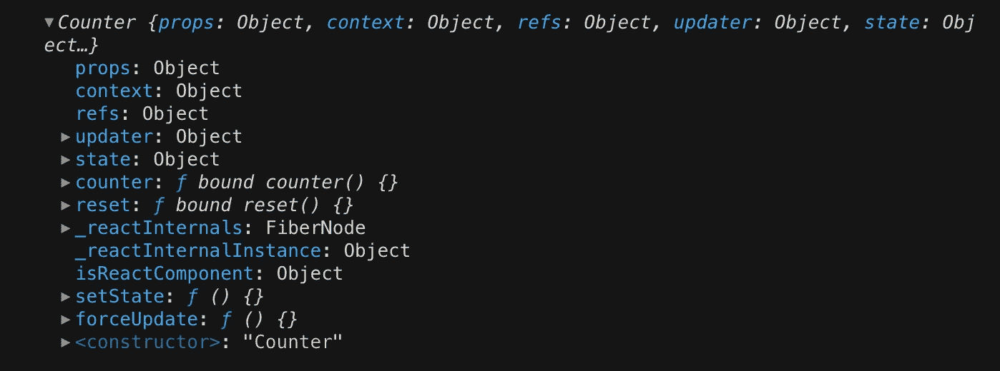
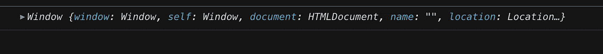

# React 组件中“this”关键字的理解指南

> 原文：<https://javascript.plainenglish.io/a-guide-to-understanding-the-this-keyword-in-react-components-c280c37d4862?source=collection_archive---------3----------------------->

Photo by [Ferenc Almasi](https://unsplash.com/@flowforfrank?utm_source=medium&utm_medium=referral) on [Unsplash](https://unsplash.com?utm_source=medium&utm_medium=referral)

React 是一个令人惊叹的视图库，被 web 开发行业的许多人使用。当您正确理解 React 的核心概念时，在您的项目中使用 React 就变得容易了。

如果您不了解 React 所基于的一些关键 JavaScript 概念，您可能会遇到一些麻烦，其中一个概念就是`this`关键字。

让我为你解码。React 类组件基本上是一个 JavaScript 类，当一个类扩展到`**React.Component**`类时，它被赋予 React 的所有功能。所以，如果你不知道 JavaScript 类是如何工作的，不要担心！我已经为你准备好了。

事情是这样的。JavaScript 类只是构造函数的*语法糖*，这是 JavaScript 的一个重要概念，用于创建对象。而构造函数里面的`this`关键字，指的是一个对象，这个对象由使用`this`关键字声明的所有属性和方法组成。

为了给你一个清晰的概念，下面是 JavaScript 中一个**构造函数**和一个 c **类**的比较。

*   **构造函数示例**

Constructor Function Example

*   **班级示例**

Class Example

当用`new`关键字调用时，两者以相似的方式工作并创建相似的实例(对象)。因此，在这两个例子中，`this`指的是一个具有所有属性和函数的对象，当用`new`关键字调用时将返回这些属性和函数。

所以，到了 React 类组件中的`this`，让我们通过创建下面的例子来理解它。

React Class Component Example

当您使用`ReactDOM.render()`将这个组件渲染到一个特定的`DOM node`中时，我们通过将`this`的值记录到浏览器的控制台中来获得它，如下所示。

`this` value inside Class Component

React 使用`this`的东西有很多，正如你所看到的上面的对象由很多东西组成。我们会试着把它分解，然后一个一个地进行。

如您所知，类中声明的函数将被添加到`this`对象中。两个函数`count`和`reset`被添加到`this`对象中，如上图所示；然后可以通过`this`访问它们，并作为事件处理程序附加在 HTML(反应元素)中，HTML 将从组件返回([参考上面的代码](#f9ba) —第 39 行)。

这里有个问题。当在类中声明的普通函数中使用 React 基于类的特性时，像`this.setState or this.state`一样通过`this`访问会导致**错误！那么这里出了什么问题呢？答案是`this`没有引用 React 类组件，而是引用了`Window`对象**

这是因为当带有附加事件处理程序的 HTML 被注入到`DOM`中时，函数内部的`this`将引用`Window`对象，因为普通函数拥有自己的`this`对象，而不管该函数是在什么环境下创建的。

window object example

有两种方法可以解决这个问题:

1.  **将函数**(事件处理程序)与类组件的`this`值绑定，这样无论函数在`DOM`中运行到哪里，`this`都将始终指向一个特定的 **React 类组件** ( [参考上面的代码](#f9ba) —第 9 行)。
2.  **箭头功能**是解决这个问题的另一种方法。使用箭头函数代替函数声明，因为箭头函数没有自己的`this`。因此，arrow 函数中的“this”总是指 arrow 函数的外部环境的`this`，在那里创建了**。在我们的例子中，**外部环境是 React 类组件** ( [参考上面的代码](#f9ba) —第 22 行)。**

**有时候，即使你注意到了上面的事情，当在任何嵌套函数中放置基于`this`的调用时，你也必须小心，[就像上面第 18 行](#f9ba)中的代码。因此，总是建议使用箭头函数，并在编码时注意`this`是如何工作的。**

**你可能想知道`this`在**反应功能组件** *里面指的是什么？***

**React 将其函数组件视为一个普通的函数，该函数返回 **React 元素**、**，除了将函数组件的第一个字母大写之外，React 将其视为 React 组件。**这是因为 React 认为以 **small case 开头的元素是要创建并放入 DOM 的 HTML 元素**，如下例所示。**

**`
{this.state.count}
` ( [参考上面的](#f9ba)代码)**

**所以**中的`this`功能组件**指的是`Window Object` ( [指的是](#0fed)上面的窗口对象图像)。**

**接下来，我们将关注 **React** 使用`this`关键字实现的**概念****

**除了`state`、`props`、`setState`是 React 的基本特性，还有其他微小的东西是类组件中`this`的一部分。了解这些会有所不同。**

1.  **`**this.forceUpdate(callback)**` :
    每当我们依赖于`state`和`props`之外的东西获取数据，并且如果这些数据应该被用来改变 UI 的某个部分，我们使用`forceUpdate`调用 render 方法将新的改变放入 DOM，因为除了 `**state**` **和** `**prop**` **改变**之外， **React 不会重新呈现。****
2.  **`**this.isReactComponent**` :
    我们怎么知道一个组件是类组件还是功能组件？假设我们看不到源代码，比如从其他模块导入，基于此，我们必须在代码中做一些事情。

    这就是`isReactComponent`属性通过有一个值`{}`(空对象)告诉我们它是一个 React 类组件，对于函数组件，该属性不存在，它是`undefined`。**
3.  **`**this.context**` :
    Props 是数据在组件树中流动的方式，但有时当只有树深处的一些组件需要时，它不是传递数据的有效方式，因为这会使其他中间组件不必要地访问那些数据。这就是上下文存储这些数据的地方。

    当一个组件订阅一个上下文时，该数据将在类组件内的`this.context`中可用。要了解更多关于上下文的信息，请点击[此处](https://reactjs.org/docs/context.html)。**

**这就是关于`this`的一切！你在这里看到的其他东西都涉及 React 的内部设置，你根本不需要担心。嗯，你可能认为在`this`里面有我们看到的`refs`。但是`this.refs`是访问组件中 DOM 元素的引用的遗留方式。React 的未来版本将不再支持并移除这一功能。如果您确实想使用`refs`，请查看本[指南](https://reactjs.org/docs/refs-and-the-dom.html)。**

**好了，**感谢您的宝贵时间！**我希望这篇博客能帮助你理解`this`在 React 组件中是如何工作的！**

**请一定要看看我的手艺。我很想在评论区看到你的意见。**

**并且让我知道你在 React 和 JavaScript 还有什么不懂的，我会为你覆盖:)**

***更多内容请看*[*plain English . io*](http://plainenglish.io/)**