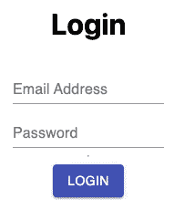
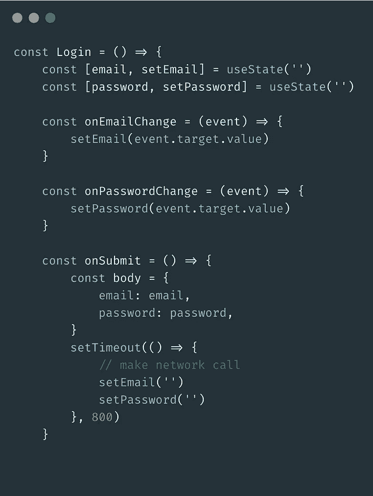
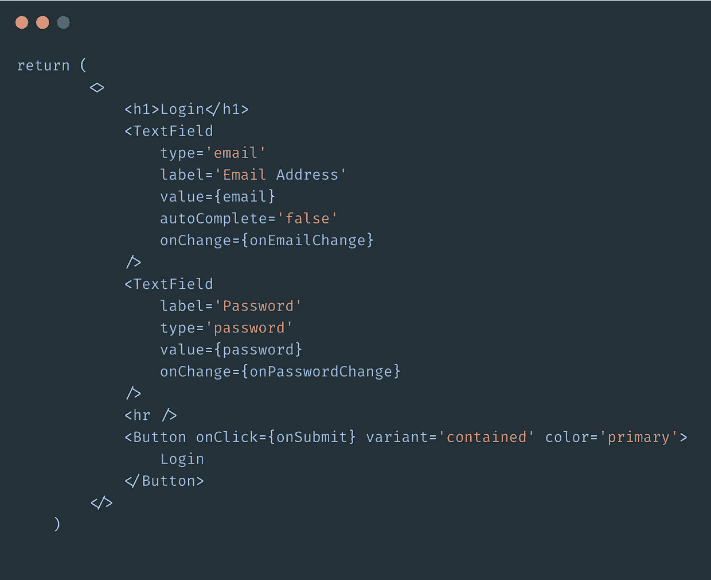
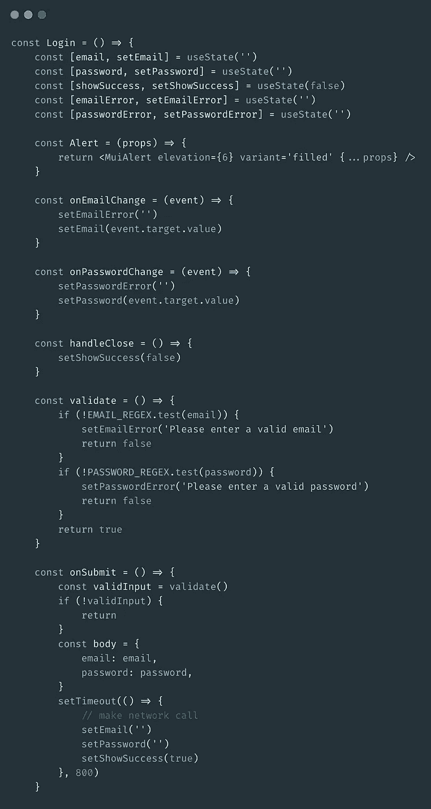
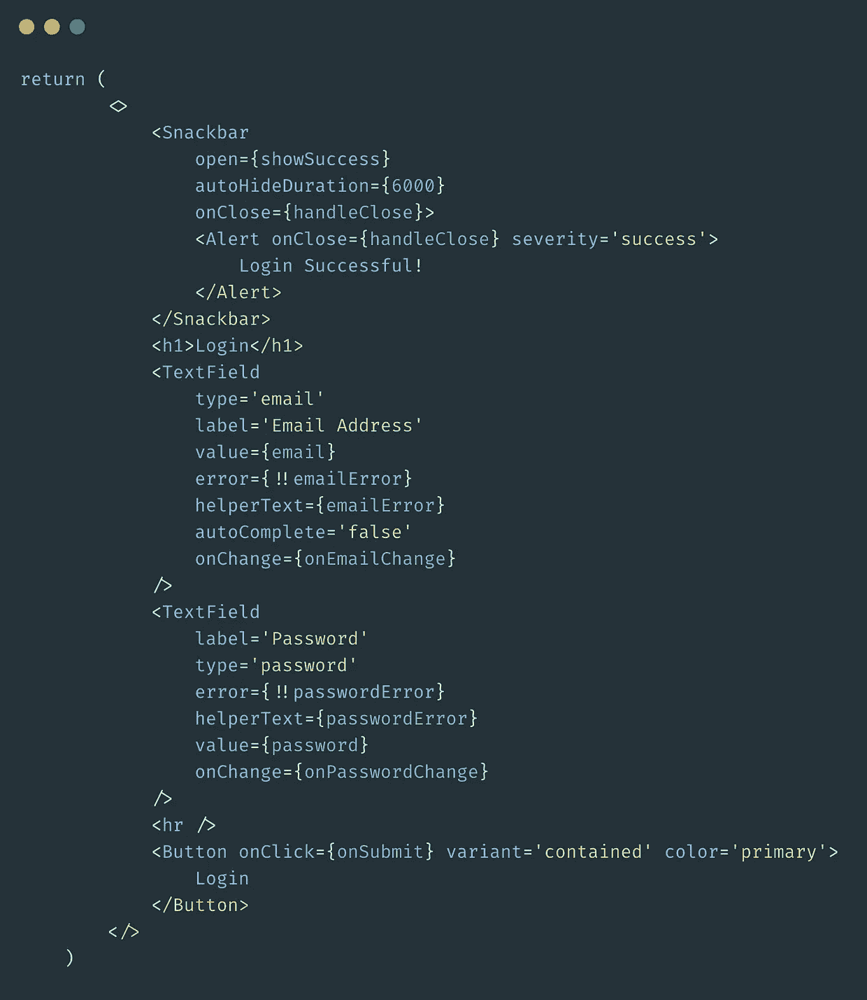
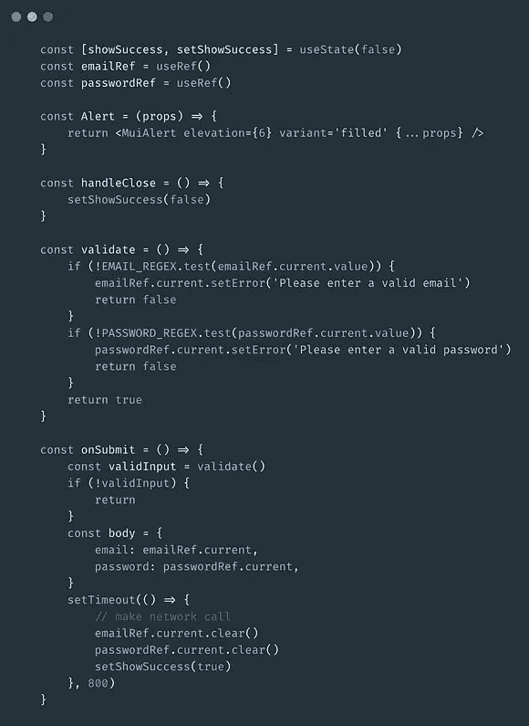
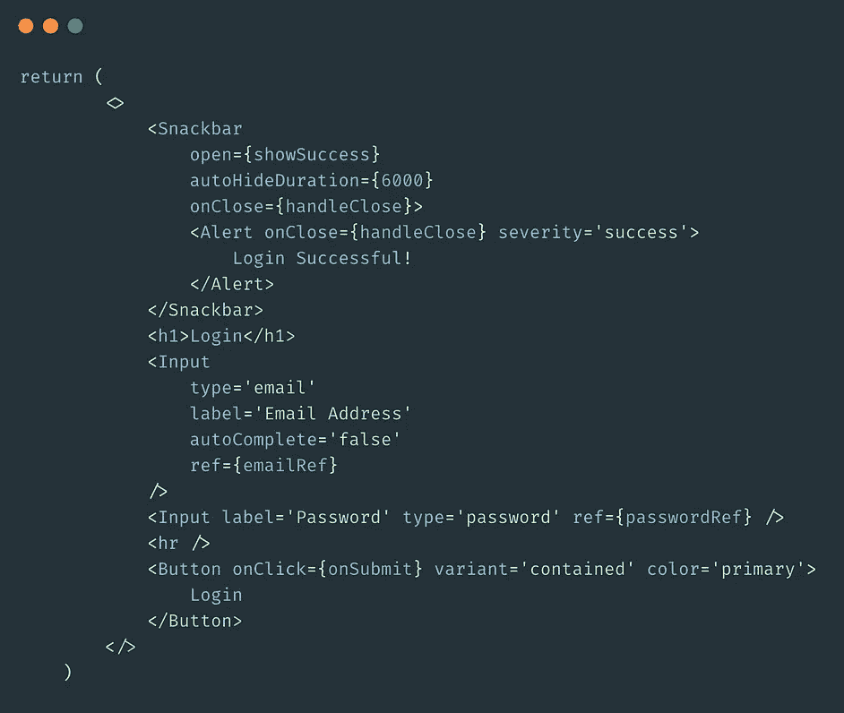
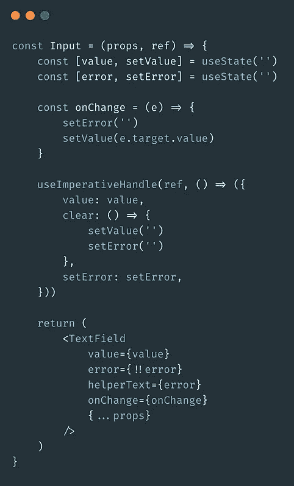

# 构建登录页面的最佳方式是什么？

> 原文：<https://javascript.plainenglish.io/a-login-page-whats-the-best-way-to-build-it-1c4bdf41092a?source=collection_archive---------1----------------------->

## 如何优化一个非常普通的页面的性能——这个页面可能会很快变得复杂。

Basic Login UI

# 动机

作为一名前端开发人员，我在过去的 3.5 年里一直在构建 UI。在我工作过的大多数应用程序中，都有一个进入/登录页面。我已经使用普通 HTML 和 JavaScript、Polymer、React 和 React Native 构建了登录组件。

每次，目的都是用干净的代码创建一个简单的页面。毕竟，它看起来很简单，对吗？一个电子邮件输入框，一个密码输入框，最后是一个登录按钮。

外表可能具有欺骗性，因为一旦我们开始适应各种用例及条件，这个页面很容易变得复杂。因此，让我们直接进入主题，浏览一个示例。

# 设置

我使用 [create-next-app](https://nextjs.org/docs/api-reference/create-next-app) 创建了一个简单的 [Next.js](https://nextjs.org/) app。添加了一个简单的登录页面，包含电子邮件、密码和提交按钮。我没有纠结于样式和 CSS，而是在本文的范围内使用了 material UI。

The initial code for the login page.

正如你在上面的图片中看到的，有两个输入框，一个提交按钮，非常简洁的样式。我认为这是你日常登录页面的基本表现。

由于我们使用 React，我使用了两个 useState 变量来处理电子邮件和密码，并使用一个 submit 按钮来模拟登录过程。

The login Page UI

这就是它看起来的样子，和你在本文顶部看到的一样。

# 并发症

既然我们已经创建了基本的 UI，我们必须开始考虑所有的用例:验证输入、显示错误状态、登录时的可视指示器等。让我们继续将它们添加到我们的页面中。

The code after adding other fields.

我们添加了以下内容:

1.  直观显示成功登录的小吃店。
2.  两个字段的错误状态和错误处理。
3.  提交时使用正则表达式对电子邮件和密码进行输入验证。

正如你所看到的，它变成了一个更大的页面，只有这些非主要的功能，我们现在在页面上有 5 个状态变量。

现在，让我们来衡量性能。

# 过程

为了简单起见，我在我的登录组件上添加了一个简单的**控制台。count** ，以测量登录过程中的重新渲染量。

然后，我经历了以下步骤:

1.  提交两个空白字段。
2.  输入电子邮件:电子邮件，提交。
3.  输入电子邮件:email@website.com，提交。
4.  添加密码:1234，提交。
5.  添加密码 1234ABC@，提交。
6.  控制台中渲染计数的数量。

我发现这种方法是明智的，因为它为代码提供了一个机会来运行我处理过的所有条件，即测量整个流程。

当我检查控制台时，这个过程的重新渲染总数是惊人的 **33。**

33 次，整个页面被重新渲染，主要是因为每次我在文本字段中输入一个值，整个页面都要重新渲染，这要感谢状态。可以想象，在真实的页面中，这将是一个巨大的性能难题，因为有更多的代码和更多的状态变量！

# 另一种方法

另一种方法是使用 Refs 而不是 state 变量，并将 TextField 移到一个单独的组件中，以保持代码干燥。

L to R: The login page functions, the login page UI, and the Input component.

你可以在这里看到更新的代码。需要注意的主要事情是，我们现在使用 ref 来访问输入字段的值，而不是在登录页面中使用 state。使用 React 的 **forwardRef** 和 **useImperativeHandle，**我们能够接收我们定义的输入组件的值和功能，并根据需要在父组件中使用它们。

关键是，无论何时修改输入组件，只有那个特定的组件会重新呈现，而其他输入(和页面的其余部分)保持不变。

虽然这种特殊情况下的性能提升可能微乎其微，但我们可以想象在包含更多组件的大型应用程序中的性能提升。

现在，让我们在与上一个相同的测试下运行这个新的登录页面，完成以下任务:

1.  添加邮箱:发邮件，提交。
2.  添加邮箱:email@website.com，提交。
3.  添加密码:1234，提交。
4.  添加密码 1234ABC@，提交。
5.  控制台中渲染计数的数量。

我再次检查控制台来查看渲染的数量，在这里我们看到了巨大的差异: **2。**

由于状态变量的本地化，整个页面在整个过程中只呈现了两次。

使用这种组件和引用的方法，我们将能够以更高效的方式构建登录页面。

感谢阅读！

*更多内容请看*[*plain English . io*](http://plainenglish.io/)