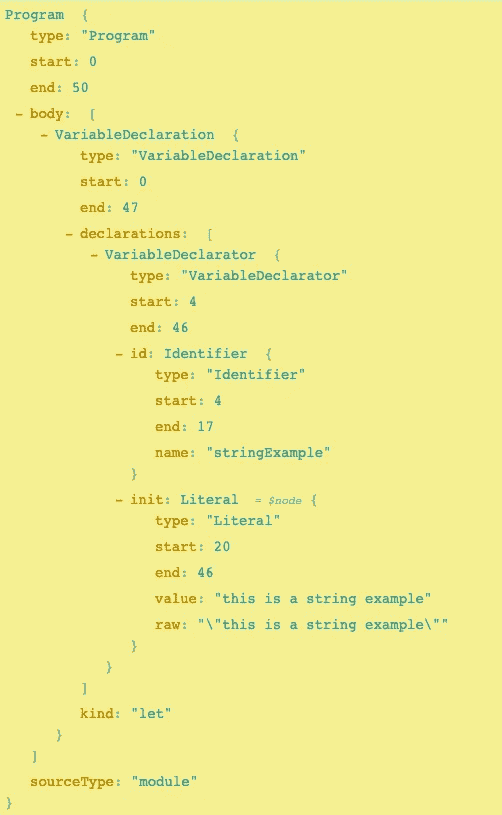

# 看看众所周知的 JavaScript 引擎

> 原文：<https://javascript.plainenglish.io/a-look-under-the-proverbial-hood-of-a-javascript-engine-3f10f6bb4a66?source=collection_archive---------19----------------------->


JavaScript 引擎是 [JavaScript 运行时环境](https://www.codecademy.com/articles/introduction-to-javascript-runtime-environments)的一部分。运行时环境是一个容器，包含了运行 JavaScript 代码所需的所有部分。它使 Javascript 能够在浏览器和节点中运行。

除了引擎之外，运行时环境还包含 API、事件循环和回调队列(根据所使用的运行时环境，可能还有一些其他部分)。

**JavaScript 引擎是运行时环境的核心，负责 ECMAScript 源代码的解析、编译和执行。**

## 不同的 JavaScript 引擎

有许多不同的 JavaScript 引擎。最值得注意的是，你可能听说过[谷歌的 V8 引擎](https://v8.dev/)，它被用来驱动 Chrome 浏览器和 Node.js 中的 JavaSript 环境

另一个流行的引擎是 SpiderMonkey，它支持 Mozilla Firefox 浏览器中的运行时环境——每个主流浏览器都有自己的引擎。

点击查看发动机[的详细列表。](https://en.wikipedia.org/wiki/List_of_ECMAScript_engines)

## 不同的 JavaScript 运行时环境

虽然浏览器和 Node.js 可以共享相同的 JavaScript 引擎，但它们永远不会有相同的运行时环境。这两种环境需要满足非常不同的需求。

例如，浏览器中的运行时环境允许您访问 API，如 *fetch* 、 *localStorage* ，以及与窗口和 DOM 对象交互的能力。

在节点环境中，没有窗口或 DOM 对象，所以没有理由与它们交互，相反，您可以访问不同的 API，如模块，它们允许通过文件系统访问来实现功能。它们还共享一些 API，比如 *setTimeout* 和*控制台* API。

不同的环境可以容纳许多不同的 API 来满足应用程序的需求，但是不同的 JavaScript 引擎通常以非常相似的方式工作。

# 更深入地了解 JavaScript 引擎

所有的 JavaScript 引擎都有三个主要职责:源代码的**解析**、**编译**和**执行**。

## 从语法上分析

首先，必须下载源代码。然后对其进行扫描并转换成代币。然后，[语法解析器](https://v8.dev/blog/preparser)会“消费”这些标记，并创建一棵[抽象语法树](https://itnext.io/ast-for-javascript-developers-3e79aeb08343)(或 AST)。AST 是用编程语言编写的语法源代码结构的分层树表示，每个 AST 节点对应于源代码中的一个构造。

使用[astexplorer.net](https://astexplorer.net/)我们可以看到我们输入的任何代码的 AST 是什么样子:

```
let stringExample = “this is a string example”;
```

上面变量声明的 AST 如下所示:



*可以想象，这些树会生成大量代码……*

## 汇编

JavaScript 引擎利用编译器和解释器的最佳部分，被称为**实时(或 JIT)编译**。但是什么是编译器和解释器呢？

在使用**编译器**的编程语言中，代码在运行时之前被编译。编译后形成代码的优化版本，然后执行该版本。与使用解释器的语言相比，这种优化的代码提供了性能增强。

然而，编译代码比编译解释器要花更长的时间。Java 等语言使用这种方法。

在**解释的**编程语言中，代码是在运行时编译的，这意味着它在读取代码时开始逐行执行代码。这使得代码执行非常快，因为代码在运行之前不必编译和优化。但是，性能不会像在运行之前用编译器编译的代码那样高效。

在 JavaScript 的初期，浏览器中的引擎只能使用解释器，因为浏览器无法在运行时之前编译代码。如今，随着浏览器的发展，所有 JavaScript 浏览器引擎都使用解释器和编译器的组合，称为**实时(或 JIT)编译**。

## 执行

在代码被解析成 AST 之后，它被发送给解释器。解释器开始逐行编译代码，并发送[字节码](https://medium.com/dailyjs/understanding-v8s-bytecode-317d46c94775)来执行。当代码运行时，引擎收集反馈。反馈和字节码被发送到编译器，然后编译器产生优化的机器码。根据使用的 JavaScript 引擎，这个过程在本质上有所不同。

编译代码的变量、对象、函数等。然后被分配到 [**内存堆**](https://developer.mozilla.org/en-US/docs/Web/JavaScript/Memory_Management) 中的内存，后者也驻留在引擎中。

[**调用栈**](https://www.javascripttutorial.net/javascript-call-stack/) 也是引擎的一部分，也在执行阶段使用。每次从内存堆中调用一个函数时，它都被发送到调用堆栈中执行，然后在完成时被移除。

[**垃圾收集**](https://javascript.info/garbage-collection) 也发生在这个阶段，确保任何不再“可及”的值或对象不会占用内存堆中的宝贵空间。

## 结论

JavaScript 引擎在短时间内取得了长足的进步。其独特的编译和执行有助于使 JavaScript 成为一种适应性很强的通用语言，随着时间的推移，它继续吸引着越来越多的程序员。

*更多内容请看*[***plain English . io***](http://plainenglish.io/)