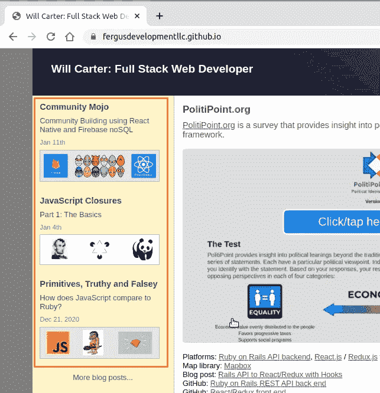
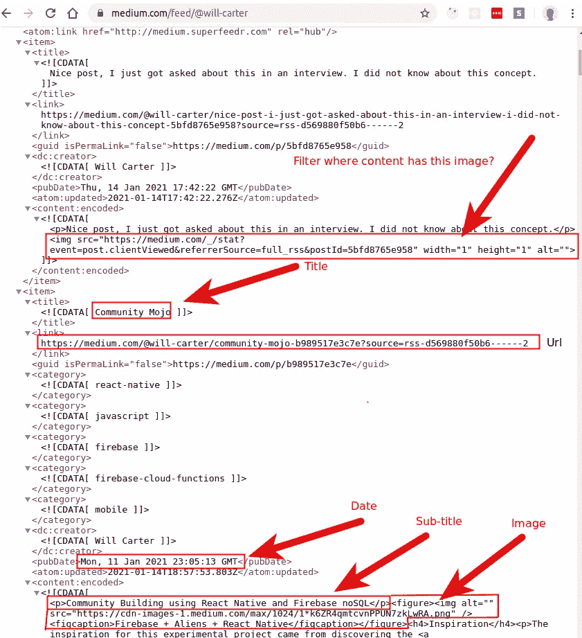
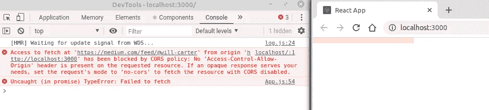
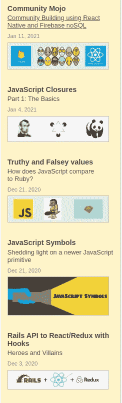
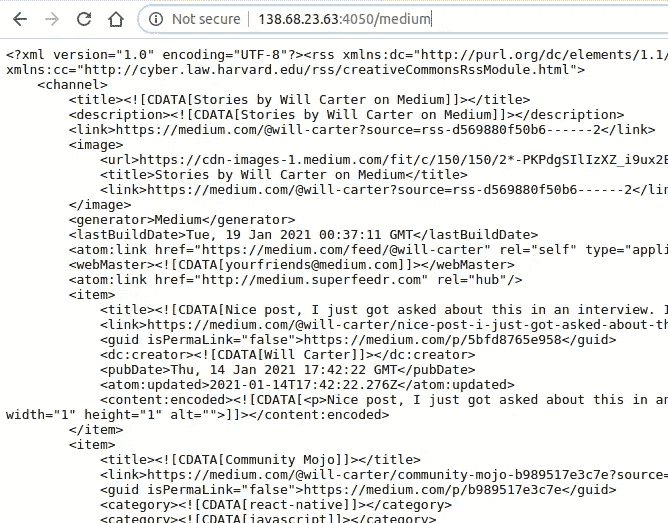

# CORS 的变通方法是在反应应用程序中使用 RSS

> 原文：<https://javascript.plainenglish.io/a-medium-slice-430c413adfb9?source=collection_archive---------3----------------------->

## 创建“中”切片


RSS + proxy + React

这篇文章将探索一种在我的网站开发[文件夹](https://fergusdevelopmentllc.github.io/)中显示最近的 Medium 博客文章的方法。具体来说，在左侧，我们希望动态获得这个列表(在下图中用红色标出)。我们想显示最后 5 篇有**标题**、**副标题**、 **url** 、 **pubDate** 和 **imgUrl** 的博客帖子。



[https://fergusdevelopmentllc.github.io/](https://fergusdevelopmentllc.github.io/)

培养基确实有 [API](https://github.com/Medium/medium-api-docs) ，起初看起来很有希望。但是经过一番研究，我发现 API 是**只写**，不可能从 API 中得到博文信息。该 API 只能用于发布新的博客条目，在此确认。

经过进一步的研究，我发现 Medium 确实在以下网址为博客作者提供了一个 RSS 源:

```
https://medium.com/feed/@user-name
```

## 什么是 RSS？

RSS(真正简单的聚合)是一种允许用户和应用程序以标准化的计算机可读格式访问网站更新的网站。

就我而言，这个网址是[https://medium.com/feed/@will-carter](https://medium.com/feed/@will-carter)。这个网址提供了我在 Medium 的所有活动(帖子、评论等)的 RSS 源。仔细查看 RSS 源，我们可以看到博客文章与源中的其他项目混合在一起。在研究了一点 RSS 之后，似乎可以过滤掉那些不是真实帖子的内容，并将博客帖子信息作为显示的目标。有关详细信息，请查看下面 RSS 源中突出显示的部分。



Medium RSS feed for a user

我的投资组合是基于反应的。该计划是对 RSS url 进行异步请求，将该信息过滤为博客文章，并显示最后 5 篇文章。

为了简单起见，我们将在 App.js 中进行异步调用，并将检索到的帖子传递给 **FeaturedPosts** 组件。

```
App.jsimport './App.css'
import React, { useEffect, useState } from 'react'
import FeaturedPosts from './components/FeaturedPosts'
**import Parser from 'rss-parser'**function App() { **const [posts, setPosts] = useState([])**

  useEffect(() => {
    const parser = new Parser() const filterPosts = (items, limit) => {
      ...
    } const fetchPosts = async () => {
      const url = 'https://medium.com/feed/@will-carter'
      **const feed = await parser.parseURL(url)
      const blogPosts = filterPosts(feed.items, 5)
      setPosts(blogPosts)** } fetchPosts() }, []) return (
  <div className="home">
    <main></main>
    <aside className="left">
      <FeaturedPosts posts={ **posts** } />
    </aside>
  </div>)
}export default App
```

1.  首先，请注意**解析器**是从 **rss-parser** 导入的。 [rss 解析器](https://www.npmjs.com/package/rss-parser)包允许从一个 URL 轻松解析 rss。在这种情况下，RSS url 是:[https://medium.com/feed/@will-carter](https://medium.com/feed/@will-carter)
2.  useState 钩子用于存储检索后显示的博客文章。它被初始化为一个空数组，并将在调用 feed 后被填充。
3.  在 useEffect()函数内部，进行异步调用。当返回结果 RSS 时，使用 filterPosts 函数过滤项目。
4.  过滤后的帖子被设置为状态。
5.  **FeaturedPosts** 组件对状态变化做出反应，并显示帖子。

```
FeaturedPosts.jsimport React from 'react'const FeaturedPosts = ({
  posts = []
}) => {return (
<ul>
  {posts.map((post, i) => {
    const postDate = new Date(post.pubDate)
    const options = { 
                      year: 'numeric', 
                      month: 'short',
                      day: 'numeric'
                     }
    return (
      <li key={ i }>
        <h4><a href={ post.url }>{ post.title }</a></h4>
        <div><a href={ post.url }>{ post.subtitle }</a></div>
        <div>{ postDate.toLocaleDateString("en-US", options) }</div>
        <a href={ post.url }></a>
      </li>)
    })}
</ul>
)}export default FeaturedPosts
```

上面的 **FeaturedPosts** 组件的唯一工作是将通过 props 发送给它的**帖子**显示为一个无序列表。

让我们试一试！

## 遭遇 CORS 相关问题

不幸的是，由于源代码上的 CORS 策略，代码在这一点上遇到了错误。



Hitting a CORS error

```
Access to fetch at '[https://medium.com/feed/@will-carter'](https://medium.com/feed/@will-carter') from origin '[http://localhost:3000'](http://localhost:3000') has been blocked by CORS policy: No 'Access-Control-Allow-Origin' header is present on the requested resource ... Failed to fetch
```

发生此错误是因为除 medium.com 之外的域已阻止对 RSS 源的访问。这种 cors 设置很常见，经过一番研究，我发现了[https://cors-anywhere.herokuapp.com/](https://cors-anywhere.herokuapp.com/)API，它允许跨源请求到任何地方。所需要做的就是将 url 更改为以下内容:

```
https://cors-anywhere.herokuapp.com/https://medium.com/feed/@will-carter
```

通过使用 cors-anywhere 作为代理，可以在 FeaturedPosts 组件中收集和显示 RSS 数据。请注意下面的 url 更改:

```
const fetchPosts = async () => {
  const url = '**https://cors anywhere.herokuapp.com/https://medium.com/feed/@will-carter**' const feed = await parser.parseURL(url)
  const blogPosts = filterPosts(feed.items, 5)
  setPosts(blogPosts)
}
```



Medium Post RSS data rendered

## 创建我自己的代理

虽然上面的 API 可以工作，但最好不要依赖 CORS anywhere.herokuapp.com。

幸运的是，创建我们自己的代理相当容易，它做的事情与上面的 cors-anywhere 代理一样。**在服务器到服务器通信**中不强制执行同源策略，这就是以下 express web 服务器工作的原因。

```
server.jsconst express = require('express')
const request = require('request')const app = express()app.use((req, res, next) => {
  res.header('**Access-Control-Allow-Origin**', '*')
  next()
})app.get('**/medium**', (req, res) => {
  request(
    { url: '**https://medium.com/feed/@will-carter**' },
    (error, response, body) => {
      if (error || response.statusCode !== 200) {
        return res.status(500).json({ type: 'error', message:
      err.message })
    }

    res.set('Content-Type', 'application/rss+xml')
    res.send(Buffer.from(**body**))
  })
})const PORT = process.env.PORT || 4050
app.listen(PORT, () => console.log(`listening on ${PORT}`))
```

1.  这个代理使用 express 中间件将一个**Access-Control-Allow-Origin:***头应用于来自服务器的每个响应。
2.  当在此服务器上访问 **/medium** 时，它将访问位于[https://medium.com/feed/@will-carter](https://medium.com/feed/@will-carter)的 RSS 提要，并将传递在那里找到的数据。

我已经安装了这个服务器，可以访问以下网址，所有来源都允许:[http://138.68.23.63:4050/medium](http://138.68.23.63:4050/medium)



proxy for [https://medium.com/feed/@will-carter](https://medium.com/feed/@will-carter)

然后，如果我们更新 App.js 中的 fetchPosts 函数来命中我们的代理...

```
const fetchPosts = async () => {
  const url = '[**http://138.68.23.63:4050/medium**](http://138.68.23.63:4050/medium)**'**
  const feed = await parser.parseURL([u](http://138.68.23.63:4050/medium)rl)
  const blogPosts = filterPosts(feed.items, 5)
  setPosts(blogPosts)
}
```

帖子像以前一样显示:


Same data, but now hitting a private proxy

这个帖子的 react 代码可以在:
[https://cors-anywhere.herokuapp.com/](https://cors-anywhere.herokuapp.com/)找到

代理代码见:【https://github.com/FergusDevelopmentLLC/medium_proxy】

## 参考

[https://stack overflow . com/questions/36097527/how-to-retrieve-medium-stories-for-a-user-from-the-API](https://stackoverflow.com/questions/36097527/how-to-retrieve-medium-stories-for-a-user-from-the-api)

[https://medium . com/@ dt Katz/3-ways-to-fix-the-CORS-error-and-how-access-
control-allow-origin-works-d97d 55946 d9](https://medium.com/@dtkatz/3-ways-to-fix-the-cors-error-and-how-access-control-allow-origin-works-d97d55946d9)

[https://cors-anywhere.herokuapp.com/](https://cors-anywhere.herokuapp.com/)