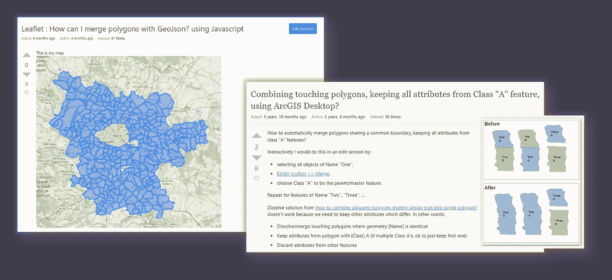
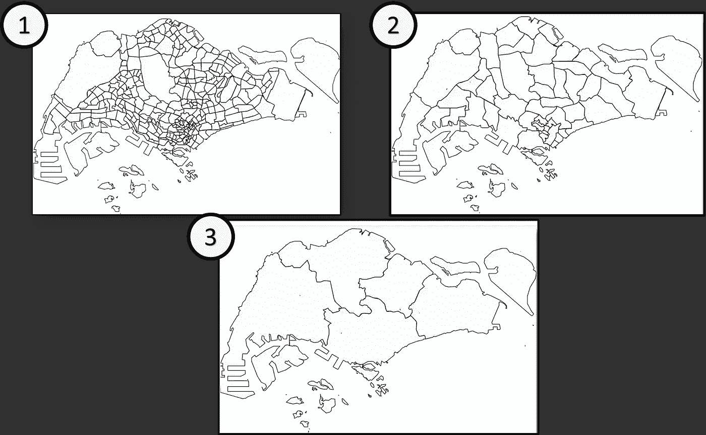
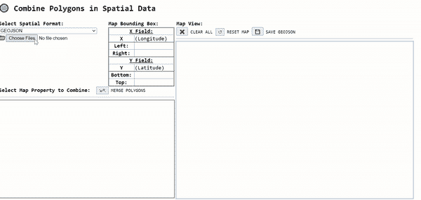
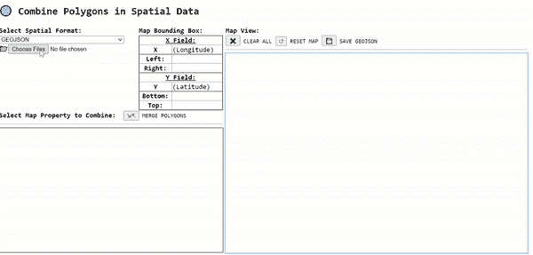

# 使用 Turf.js 合并空间数据集中相邻面的巧妙方法

> 原文：<https://javascript.plainenglish.io/a-neat-trick-to-merge-adjacent-polygons-in-spatial-datasets-with-turf-js-79e8ad84ee77?source=collection_archive---------8----------------------->

## 用例+代码实现。我的 GitHub 提供的工具。

在我的大多数地理信息系统(GIS)项目中，当涉及到为后续空间分析对空间数据集执行某些数据转换时，我倾向于转向开源实用程序，如 [Turf.js](https://turfjs.org/) ，而不是工具，如 [QGIS](https://www.qgis.org/) 和 [ArcGIS](https://www.arcgis.com/index.html) ，因为设置和安装中涉及的麻烦较少。

由于这个问题**太普通了，❝How，你会把分离的多边形合并成一个单一的特征吗？❞** 是，我决定使用 [Turf.js](https://turfjs.org/) 的内置功能——**union**写一篇专门针对这个主题的文章。

Screenshots by Author | Examples of questions revolving around combining multiple polygons into a single Geometric feature

## 用例示例:合并一个国家的分区边界，新加坡

首先，我个人使用了 [Turf.js](https://turfjs.org/) 库中的这个功能，生成了新加坡土地规划者正式使用的 3 个主要边界— **(1)分区**、 **(2)规划区** & **(3)区域**，如下图所示，它们代表 3 个递减的粒度级别:

Illustration by Author | In a clockwise direction, **(1)** refers to the most granular out of the above — **Subzone**, **(2)** refers to the 2nd most granular — **Planning Area** and finally **(3) Region** aggregation

我倾向于只检索**子区域**边界，并继续使用 [Turf.js](https://turfjs.org/) 的联合来生成基于公共几何属性的其他粒度更小的边界**，而不是分别检索所有 3 种边界类型的空间数据集:**

# 规划区汇总的分区

## 共有房产:**【PLN _ AREA _ C】**

Demo by Author | Based on the common property — **[PLN_AREA_C]**, polygons which share the same value for that property are combined as shown using Union in Turf.js | Union function is triggered when **[ ⇲⇱] MERGE POLYGONS** button is selected

# 规划区域到区域的聚合

## 公共属性:[REGION_C]

Demo by Author | Based on the common property — **[REGION_C]**, polygons which share the same value for that property are combined as shown using Union in Turf.js | Union function is triggered when **[ ⇲⇱] MERGE POLYGONS** button is selected

此后，要保存合并的输出，只需选择 **[💾]保存右上角的**按钮。

现在你知道了！不需要复杂的或企业级的软件。只是普通的旧 JavaScript。

## **参考消息:**为了方便起见，上述工具可以在我的 [GitHub Repo](https://github.com/incubated-geek-cc/Polygon-Merger) 中找到。请叉它，如果你想为自己使用:D(不需要服务器设置。可供脱机使用。)或者试试这里的！

## 非常感谢你阅读这篇文章！❤希望您发现这适用于您的用例。如果您想要更多数据分析& GIS 相关内容，请随时[关注 Medium](https://medium.com/@geek-cc) 上的我。会非常感激😀

 [## 通过我的推荐链接加入灵媒——李思欣·崔

### 获得李思欣·崔和其他作家在媒体上的所有帖子！😃您的会员费直接…

geek-cc.medium.com](https://geek-cc.medium.com/membership) 

**注:**你不妨用 [Turf.js](https://turfjs.org/) 看看下面这篇关于地理编码的文章

 [## 使用 Turf.js 通过自定义边界对坐标进行地理编码

### 这个位置属于❝Which 地区/区域/区域吗？❞

towardsdatascience.com](https://towardsdatascience.com/using-turf-js-to-geocode-coordinates-with-custom-boundaries-bb843b7150d0) 

## (可选)最后但同样重要的是，请随意[请我喝杯咖啡](https://www.buymeacoffee.com/geekcc) ☕

*更多内容请看*[***plain English . io***](http://plainenglish.io/)