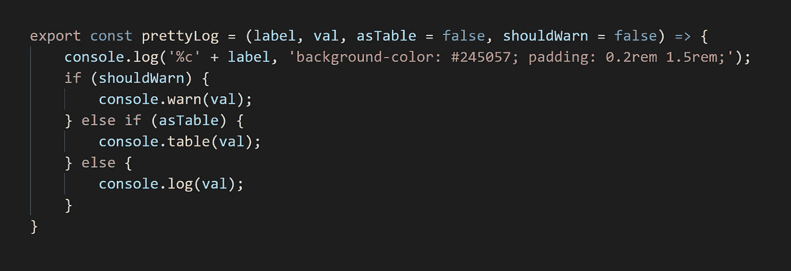
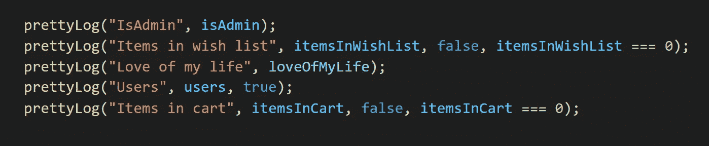
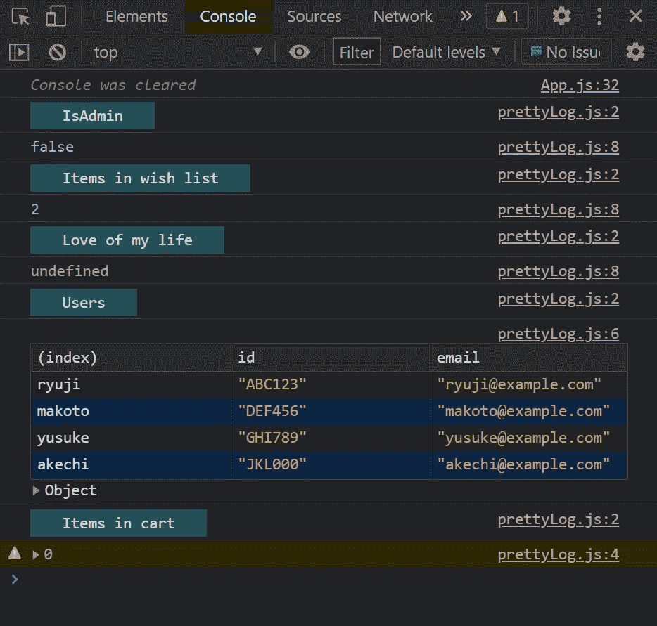
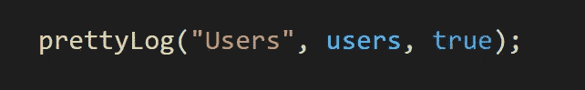
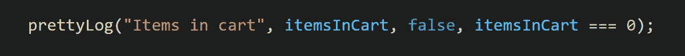

# 更漂亮的 console.log()

> 原文：<https://javascript.plainenglish.io/a-prettier-console-log-786f46d0bc3c?source=collection_archive---------8----------------------->

## 为您的 console.log()创建风格化标签

每个前端开发人员都熟悉 console.log()。我一直用它来调试值，我相信你们中的许多人也一样。大多数时候，我只是简单地键入 console . log(whateverVariableImDebugging)。前几天，我在 React 中调试一个相当复杂的视图。它有许多变量，根据从 API 接收到的数据，这些变量看起来可能非常不同。

我不得不记录许多变量，控制台变得有点混乱和令人分心。我考虑是否有一种简单的方法来组织我的控制台日志消息。是的，我真的不知道这一点，但是 console.log()很容易使用 CSS 样式化！您知道可以像这样简单地为日志消息添加样式吗？

```
console.log(‘%c’ + “Hello, world!”, ‘background-color: blue;’);
```

上面的行将为日志消息添加蓝色背景。原来，你可以给控制台添加各种样式。

有了这个新发现的知识，我决定创建一个小函数来为我的变量创建标签。造型必须干净简单，不能分散注意力。这是我想到的:



A small, reusable function for printing messages to the console. Find the full code in this [CodePen](https://codepen.io/jacob_bergdahl/pen/JjWWOYB). Screenshot by the author.

让我们用一些虚拟数据来调用这个函数:



Calling the prettyLog() function. Variable declarations have been omitted for brevity. Find the full code in this [CodePen](https://codepen.io/jacob_bergdahl/pen/JjWWOYB). Screenshot by the author.

这样做时，我们会得到以下输出:



Output printed into my Brave browser after running the above code. Screenshot by the author.

函数 prettyLog()接受一个标签和一个值，并在控制台中打印两行。我认为它使记录的消息更加结构化。更容易了解您正在记录的所有内容。我还添加了传递两个布尔值的选项，这允许用户创建一个表或一个警告，而不是一个日志消息。对于标签的样式，我选择了我喜欢的柔和的颜色和一些填充物。

这一行告诉函数将值打印成表格。第一个参数是标签，第二个是要打印的变量，第三个是一个布尔值，表示这应该是一个表。



Screenshot by the author.

这一行通过添加一个条件作为第四个参数，告诉函数在购物车中的商品数量等于零时打印一条警告。



Screenshot by the author.

这是一个非常简单的十行函数，但是我非常喜欢它。这是一种简单、快捷的记录变量的方法，而且看起来还是干净的。

我鼓励您尝试我编写的代码，并根据您的需要调整样式。我想很多人可能会认为打印两行而不是一行是浪费空间，特别是如果你更喜欢水平控制台而不是垂直控制台。如果你想出一些简洁的控制台样式，请在你的代码中发表评论，我很乐意看到。你可以在这个[密码本](https://codepen.io/jacob_bergdahl/pen/JjWWOYB)中找到完整的代码。

当我们谈到样式时，关于填充属性有一个有趣的旁注:正如你所看到的，我添加了 0.2 雷姆的垂直填充。看起来火狐开发者版(我的主要开发者浏览器)不允许在控制台中进行垂直填充，但是基于 Chromium 的浏览器如 Chrome 和 Brave 允许。没什么大不了的，只是一些有趣的琐事。

我希望你喜欢这个小功能，同样，如果你有另一种风格或构造控制台的方法，请留言告诉我！

*了解更多关于向 console.log()添加 CSS 的信息，包括背景渐变、边框半径和不同的字体系列:*

[](/adding-css-to-console-log-dde2e167ee7a) [## 将 CSS 添加到 console.log()

### 让您的控制台丰富多彩

javascript.plainenglish.io](/adding-css-to-console-log-dde2e167ee7a) 

*更多内容尽在*[plain English . io](http://plainenglish.io/)