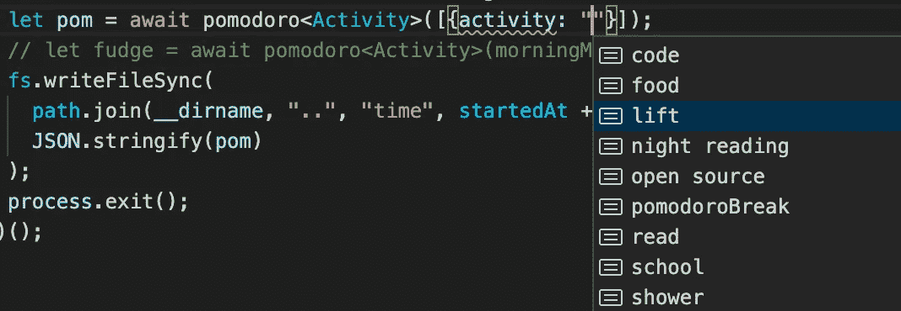
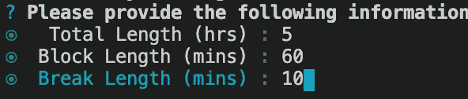
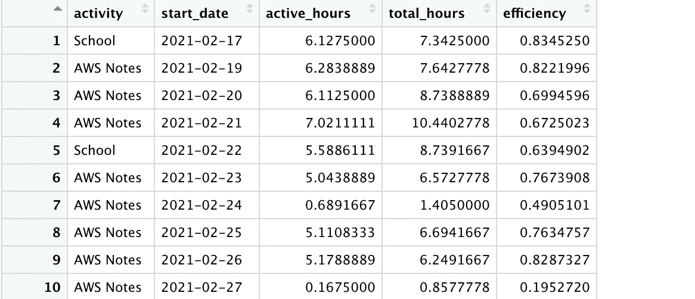
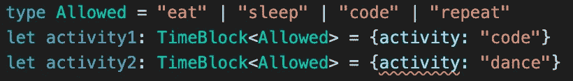
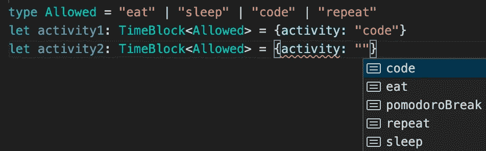
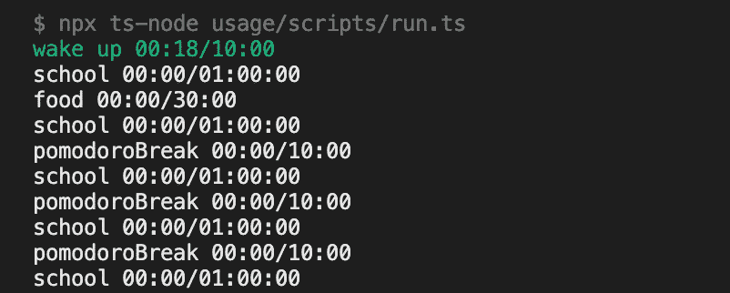
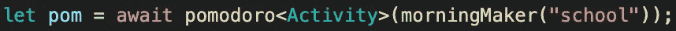
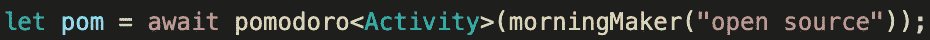
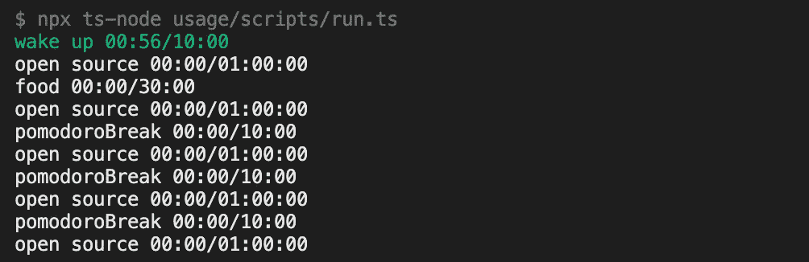

# 可编程番茄定时器

> 原文：<https://javascript.plainenglish.io/a-programmable-productivity-timer-6a8b9b087757?source=collection_archive---------18----------------------->

## 作为代码的基础设施——编辑器比终端更强大

Autocompletion in TypeScript, not available in terminals

我的番茄定时器是一个命令行界面，但我杀了命令行界面，改为发布一个 API。让我们来谈谈这是如何让我的项目好 10 倍的。

# 解决问题的初步方法

我制作自己的番茄定时器有两个原因

*   我控制我的数据
*   我可以在需要的时候定制它

最初我使用这样的命令行界面进行交互:

5 hours of work, 60-minute blocks, 10-minute breaks

我把它编程为保存 CSV 文件用于自定义数据分析。这是我对我的工作效率所做的分析。

Data explorer in RStudio

# 为什么我放弃了 CLI 而选择 API

## 展开性

CLI 不允许其他用户轻易扩展它。

*   如果用户想要 JSON 而不是 CSV 呢？
*   程序执行后如何运行自定义函数？

只要给用户一个函数，他们可以调用来创建计时器。这样，用户可以以编程方式生成初始应用程序状态，并在函数执行后提供自定义处理。

## 工具作业

我宁愿在文本编辑器中输入，也不愿在终端中输入。在 TypeScript 中使用泛型，我得到了数据验证和自动完成。

Data validation — dancing not allowed!

自动补全帮助我不会不小心把两个不同的类别弄成像`food`和`eating`。那会毁了我的数据。此外，自动完成意味着更少的输入。

Yay TypeScript!

# 在活动

我想有一个固定的早晨作息时间。这是我今天早上的计划:

*   起床后 10 分钟内开始做功课
*   做一小时作业
*   吃半小时早餐
*   做一小时作业
*   10 分钟休息
*   做一小时作业
*   10 分钟休息
*   做一小时作业
*   10 分钟休息
*   做一小时作业

这需要变成一个计时器—

ugh, school

想象一下，在一个终端中输入所有这些内容，或者有一个充满不同早晨惯例的文件，您必须从中进行选择。

相反，您可以编写自己的函数，接受定制选项。

School in the morning

这样，当我没有学校作业时，我可以开始开源工作。

Open source in the morning

该函数输出配置文件以生成定时器。

Tah dah!

你没有限制用户使用你的代码。通过给用户提供函数而不是 CLI，您可以让用户构建新的东西。

# 结论

当你为开发者发布一个产品时，确保他们能够进入并使用代码使用它**。对于我的时间跟踪器，我发现我可以通过使用更多的代码和更少的 JSON 来自动化日常配置生成。**

这个范例可以在 AWS 云开发工具包中看到。当然，你可以在 AWS CloudFormation 中使用像 YAML/JSON 这样的配置语言，但是一旦你开始用你的用户最喜欢的编程语言为他们提供周到的 API，你还可以提供更多。

非常感谢您的阅读！

番茄计时器—【https://github.com/MatthewCaseres/pomodoroble 