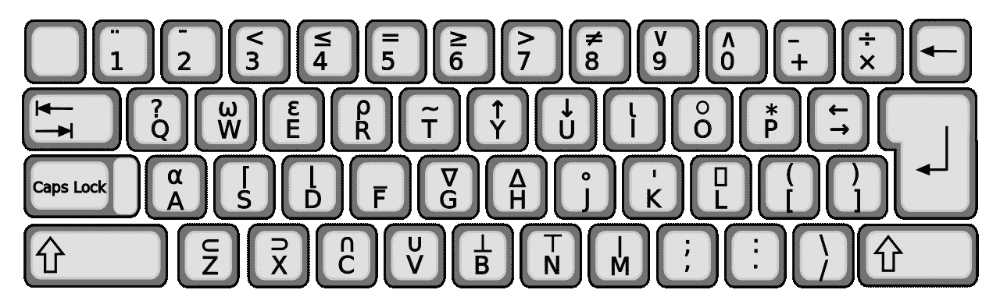

# 一种编程语言因为键盘而消亡了

> 原文：<https://javascript.plainenglish.io/a-programming-language-became-dead-because-of-the-keyboard-8fdbe6fa88bf?source=collection_archive---------1----------------------->

## 程序员必须使用一种独特的键盘来用那种语言编写代码

Source: [Wikimedia](https://commons.wikimedia.org/wiki/File:APL-keybd.svg) under creative commons license

APL 据说是 80 年代最流行的编程语言之一，由 IBM 的 Ken Iverson 于 1962 年开发。当时，行业中的编程语言非常少。

> 是的，我们正在谈论已经死亡的语言，其中一个主要原因是键盘。你可以在这篇文章中了解更多！

APL 最初是作为一种表示数学过程的符号发布的。它允许代码简洁，但不能持续很长时间，因为它编写代码的字符集很复杂，不够方便，不能在成功一段时间后留住用户。

## 为什么 APL 如此受欢迎？

早在 80 年代，APL 就以其准确性和快速解决问题而闻名。APL 旨在帮助人们定义和学习解决问题的程序，不像其他编程语言那样让计算机自己工作以获得结果。数据处理是该语言最有效的特性之一。APL 可以-

*   无需复杂的编程即可处理数组数据
*   使用强大的预定义和用户定义函数，甚至可以解决矩阵问题。
*   将任务分解成小问题和子任务来解决整个问题。
*   在非常有限的代码行内完成大量工作。其简洁的代码使其更具交互性，并能够对您的工作提供即时反馈。
*   一种动态的语言，灵活且易学。一旦开始探索，一个人可以很快学会，并建立自己的基本程序。

## **故障点**

APL 的主要失败点是字符集，这种语言提供的使代码更具体的功能只会使代码更复杂。要编写代码，需要一个带有几个新符号的增强型键盘。

因此，只有 APL 程序员可以阅读和处理 APL 代码。它让代码更加清晰，但却是逆流而行。因此，如果学习了 APL，它并不会因为使用了特殊字符&歧义片段而比其他语言更有优势。除此之外-

*   APL 中的一行代码可以做大量的工作来表达几个语句，这使得程序可读性、可更改性或可维护性较差。
*   由于其他语言的程序不同，APL 开发人员与其他开发人员是分开的，APL 开发人员更难转到其他部门。
*   开发人员需要用 ASCII 代码编写。否则，它不会起作用。不过，后来还是修好了。然而，为时已晚。
*   APL 不能在同一个数据结构中同时存储字符串和数字。它只能处理同质数据，没有数据框架，这导致处理字符串是一项艰巨的任务。

## **试图重建**

APL 从一个阶段到另一个阶段都在创新，但并不奏效。APL 的创新带来了编程语言，如 R、NumPy、pandas、Matlab、Dyalog、K、Q 等等。

j 试图解决 APL 的字符集和键盘问题，并推出了一些版本，如 APL*Plus 和 SharpApl 等。但是 APL 需要特定的硬件来使用这种语言，但是当软件工程、PC 或 OOP 概念变得流行时，人们转向了其他的选择。

决策者不理解他们需要对他们的系统做出的改变。跟不上潮流，它们变得更短了。APL 仍然为其现有用户创造生产价值，并且有一个干净的工具包。尽管在商业产品或问题解决中不再使用它。

## **故事结束或留给 APL 的生命不多**

APL 已经不在商业项目中了。这些年来，硬件和方法发生了很大的变化和升级，使它成为一门几乎死亡的语言。但是现代的杀伤人员地雷正在取得巨大的进步。

它现在比以往任何时候都更有意义。无论世界如何看待它，仍然有一个充满激情的 APL 社区。仍然是一个成长缓慢但可靠的程序员的小社区。

APL 是一种高效的编程语言。说到性能，它抛弃了很多现代语言。它的高层次、复合性、功能性和机械共鸣的方法使它成为一种很好的语言。

从零开始解决问题。一种适应性强、灵活、简单的语言可能不会因为 APL 所包含的特性而被轻易放弃。

*更多内容尽在*[***plain English . io***](http://plainenglish.io/)