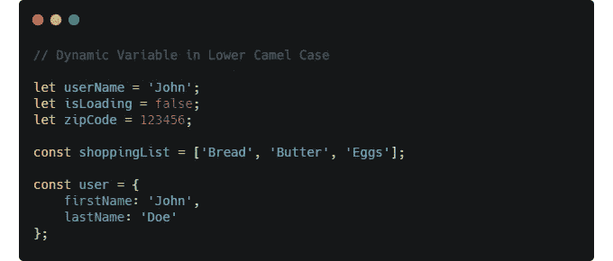
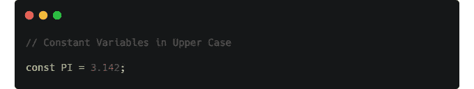
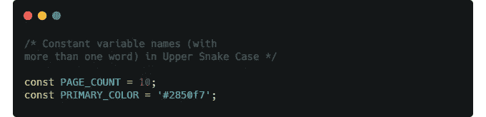
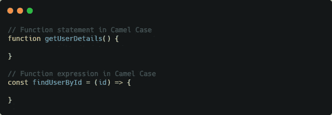
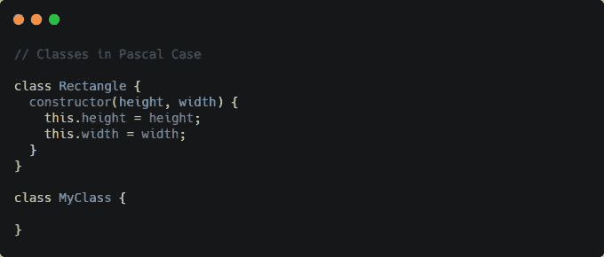
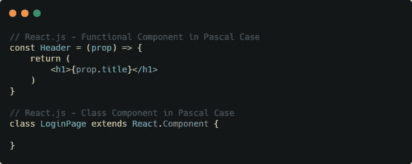
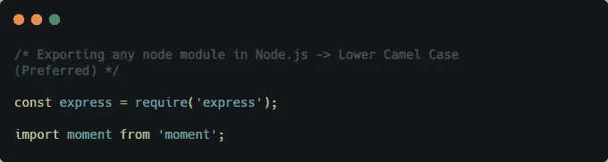
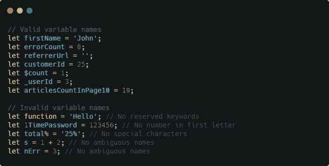
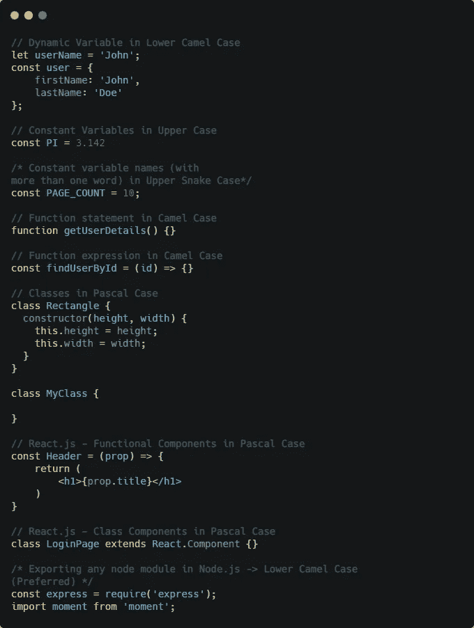

# 用 JavaScript 命名变量、函数和类的初学者指南

> 原文：<https://javascript.plainenglish.io/a-quick-beginners-guide-on-naming-variables-and-functions-in-javascript-d44f31de8012?source=collection_archive---------3----------------------->

# 介绍

变量、函数和类的正确命名非常重要。这使得您的代码可读性更好，也更容易调试。在这篇文章中，我总结了一些风格指南的最佳实践，比如 [Google](https://google.github.io/styleguide/jsguide.html) 和 [Airbnb](https://github.com/airbnb/javascript) 。大多数流行的 JavaScript 框架和库都遵循这些最佳实践。

在我们开始之前，您需要先了解以下内容。

不同的编程语言使用不同的大小写样式来命名变量。让我们讨论一些案例风格。

*   **骆驼大小写**:是书写短语不加空格或标点符号的做法，用单个大写字母表示单词的分隔，第一个单词以小写开头。
    举例:`pageCount`
*   **帕斯卡大小写**:和骆驼大小写很像，只是第一个字母以大写开头。
    举例:`PageCount`
*   **Snake Case** :这里我们用下划线(`_`来分隔单词，单词可以是小写也可以是大写。
    例如:`page_count`或`PAGE_COUNT`

现在我们已经学习了不同的大小写风格，让我们来详细了解如何在 JavaScript 中命名变量、函数和类。

# 命名变量

JavaScript 中的变量有两种类型

*   **动态变量**:其值不断变化。`let`用于定义带有原始值的动态变量(如字符串、布尔和数字等。).并且我们还使用`const`来定义带有非原语值的动态变量(比如对象和数组)。最好使用*小写*来命名动态变量。

*   **常量变量**:其值保持恒定不变。`const`用于定义常量变量。最好使用*大写*来命名常量变量。

*   如果常量变量名称有多个单词，那么建议使用*上蛇形样式*来定义。

# 命名功能

函数名也最好使用*小写*样式定义。

# 命名类别

类名最好使用 *Pascal 大小写*样式定义。

# 命名 React 组件

React 组件(类组件和函数组件)通常在 *Pascal 用例*中命名。

# 命名导出的节点模块(Node.js)

最好使用*小写字母*来命名导出的节点模块名称。

# 命名变量时要做什么和不要做什么

*   变量名应该以字母、下划线(`_`)或美元符号(`$`)开头。
*   变量名不能以数字或下划线或美元符号以外的任何特殊字符开头。
*   变量名可以有数字，但不能在名称的开头(第一个字母)。
*   变量名不能有空格。
*   不要使用任何 JavaScript 的保留关键字，如(`const`、`for`、`if`、`function`等。).
*   使用像`userName`或`ShoppingList`这样有意义的名字，避免不明确的名字/缩写。
*   在变量的情况下，名称应该指定它持有什么值(如`orderNumber`或`employeeName`)
*   在函数的情况下，名字应该指定*动作*在做什么(如`getStudentDetail`或`updateCartItems`)。

# 摘要

让我们总结一下到目前为止我们所学的内容。

谢谢你的来访。如果你喜欢的内容，请支持我，并关注我更多这样的内容。

Support my work by buying me a coffee 😉

在 [LinkedIn](https://www.linkedin.com/in/syedafrozpasha/) 、 [Twitter](https://twitter.com/SyedAfroz_Pasha) 和 [GitHub](https://github.com/SyedAfrozPasha) 上与我联系。

*更多内容请看*[***plain English . io***](http://plainenglish.io)