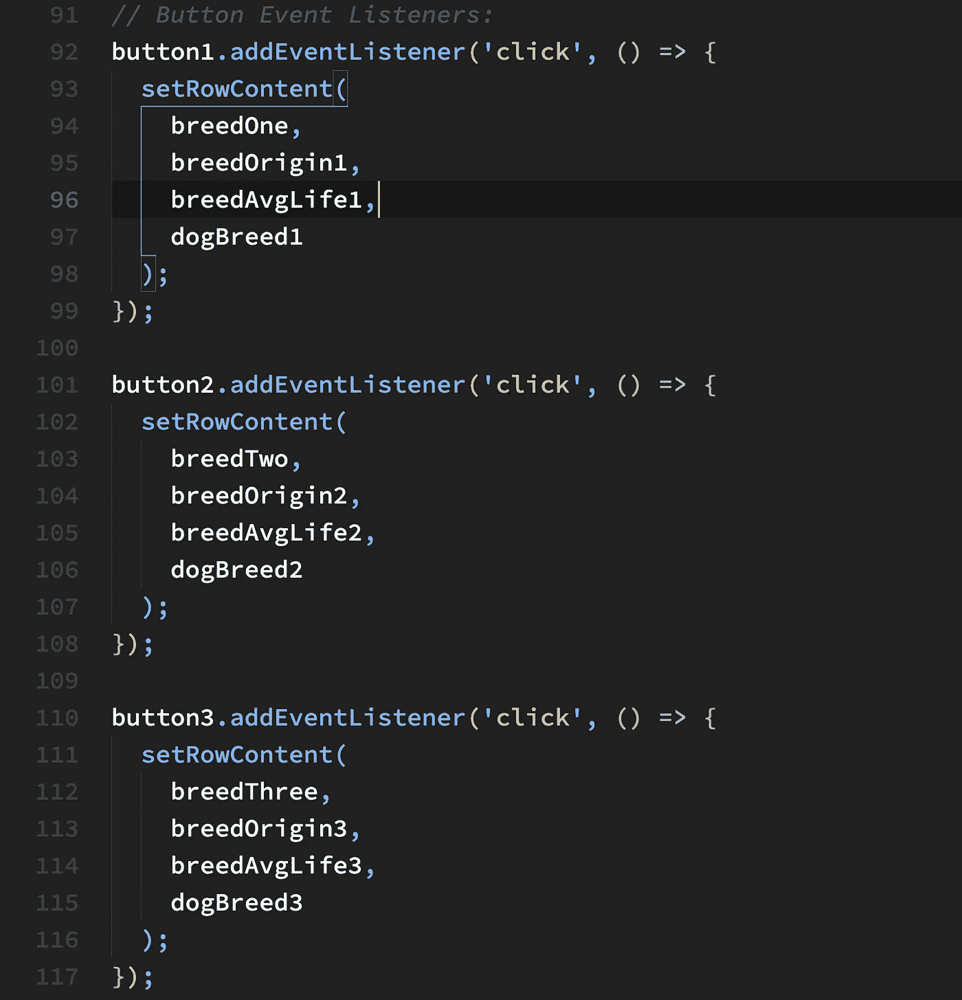

# 快速浏览一下 JavaScript apply()方法

> 原文：<https://javascript.plainenglish.io/a-quick-look-at-the-javascript-apply-method-26fcd97c9ccb?source=collection_archive---------10----------------------->

Photo by [Kelly Sikkema](https://unsplash.com/@kellysikkema?utm_source=unsplash&utm_medium=referral&utm_content=creditCopyText) on [Unsplash](https://unsplash.com/s/photos/javascript-programmers?utm_source=unsplash&utm_medium=referral&utm_content=creditCopyText)

在这三个教程的第三个中，我们将检查`apply()`方法的使用。

我们的主要焦点是重构之前的
教程的成品，以便它利用`apply()`方法，而不是
T2 方法。

如果您还没有阅读本系列的第二篇教程，您最好通读一下 JavaScript 的`[**bind()**](/a-quick-look-at-the-javascript-bind-method-part-ii-f08bc9451dcc)`[***方法***](/a-quick-look-at-the-javascript-bind-method-part-ii-f08bc9451dcc) 。当然，如果您还没有完成本系列的第一个教程，您最好复习一下 [***快速浏览一下 JavaScript***](/a-quick-look-at-the-javascript-call-method-b5b2383eb4e6)`[**call()**](/a-quick-look-at-the-javascript-call-method-b5b2383eb4e6)`[***方法***](/a-quick-look-at-the-javascript-call-method-b5b2383eb4e6) ，它包含了本教程中已完成项目的所有先决条件信息。

我们的起点将是本系列
第二篇教程中完成的代码。

# 简要回顾

上一篇教程给出了一个简单的演示应用程序，演示了`bind()`方法的使用，而在本教程中，我们将重构同一个应用程序来利用`apply()`方法。

**下图 1** 显示了本教程的起点——应用程序的打开屏幕。

**Fig. 1 My Favorite Dogs Opening Screen**

完成后，重构后的应用程序应该产生与其前两个应用程序完全相同的输出。

# 我们开始吧

要开始，请下载[教程入门代码](https://github.com/RHieger/my-favorite-dogs/blob/4b7d6c7a4b71d40a42fa3bc12b0eb25ea7e0c521/starter-code-tutorial-3.zip)。只需点击 Github 链接中的下载按钮，如下图**图 2** 所示:

**Fig. 2 Github Starter Code Download Page**

您可以将归档文件解压缩到您的本地驱动器上，您将看到如下文件结构，如下面的**图 3** 所示:

**Fig. 3 Starter Code File Structure**

# 需要改变什么？

应用程序的两个主要部分需要重构。第一个是**index.html**文件，它本身主要是因为语义原因和与重构后的应用程序目的的一致性而改变的。第二个是 **app.js** 文件，这里的改动更加广泛和实质性。

**下面的图 4** 显示了需要重构的第一块代码:

**Fig. 4 The Dog Objects and the DogBreed Arrays Resulting from their Invocation**

在图 4 中，我们看到三个**狗**物体。存储在这些对象中的值来自于`getDogInfo()`对象，在该对象上调用了`info()`方法，并将其绑定到**品种**对象，该对象又包含了每个喜爱的狗品种的属性。

在下面的代码中， **dog1** 到 **dog3** 被调用，返回分配给 **dogBreed1** 到 **dogBreed3** 的三个数组。这是上一个教程中使用的方法，用来收集填充三行关于最喜欢的狗品种的数据。

**图 5** 显示了我们在本教程中关注的最后一块 JavaScript 代码:

**Fig. 5 Event Listeners for Buttons 1–3**

与本系列的第二篇教程一样，我们将需要重构**按钮 1** 到**按钮 3** 的事件监听器。**按钮 4** 在本系列的三个教程中保持一致。

## 现在让我们重构代码

我们现在可以重构代码来利用`apply()`方法。解压缩启动代码档案后，请按照以下步骤操作:

# 第一步:对 index.html 进行必要的修改

**下面的图 6** 显示了包含在您的启动代码中的**index.html**文件的`<head>`部分:

**Fig. 6 <head> Section of index.html**

和上一个教程一样，我们只关心上面图 6 的**线 8** 和**线 10** 。

对**index.html**进行以下更改:

1.  改变**线 8** ，使其显示为`<title>apply() Method Demo</title>`。
2.  更改**第 10 行**，使其显示如下:
    `<link rel="stylesheet" href="css/apply-demo.css" />`

> 对于本教程来说，上面的两个变化使得 HTML 标记在语义上是正确的。

# 步骤 2:重命名 CSS 样式表

如果您参考上面的**图 3** ，您将看到 css 样式表被命名为**bind-demo . CSS。**这不仅在语义上不正确，因为我们重构的代码是`apply()`方法的演示，而且它将导致错误，因为在**步骤 1** 中，第 10 行现在引用了一个名为 **apply-demo.css** 的 CSS 文件，该文件尚不存在。

为了解决这个问题，将 **bind-demo.css** 重命名为 **apply-demo.css.** 如果你在浏览器中打开【index.html】的**，一切都会正确显示。事实上，如果你点击应用程序的按钮，它们的功能将与上一教程完全相同。这是因为我们的起始代码是在第二个教程中创建的代码。**

> *****现在我们可以深入探讨如何重构 app.js 中的应用程序逻辑，以便它利用*** `***apply()***` ***方法，而不是*** `***bind()***` ***方法。*****

# **步骤 3:重构 dog 对象以使用 apply()方法**

****图 7** 显示了与我们的任务相关的代码:**

****

****Fig 7 The getDogInfo() Object and the Derived dog Objects****

**让我们回顾一下上面的代码，以便更好地理解我们将在重构后的代码中改变什么。**

**在我们的启动代码中，**第 51 行**到**第 53 行**，在 **getDogInfo()** 对象上调用了`info()`方法，并且将`bind()`方法链接到了`info()`方法。**

**三个顺序编号的**品种**对象被传递给`bind()`方法，结果被存储到三个顺序编号的**狗**对象中。**

**最后，如上一篇教程中完成的代码所示，每个狗对象被调用，它们的结果存储在三个顺序编号的**狗品种**对象中，这些对象的内容是包含狗品种信息的数组，这些信息将被动态注入到本文开头的**图 1** 中所示的表行中。**

**我们重构图 7 中的代码的目的是用`apply()`方法替换**狗**对象上调用的`bind()`方法。**

# **`Function.prototype.apply()` 和`Function.prototype.bind()`有什么不同？**

**`bind()`方法返回一个新函数，这个函数在被调用时，有一个设置了关键字`this`的引用。它还可能有一组可选参数，这些参数必须在调用新返回的函数时传递的任何参数之前。**

**相比之下，`apply()`方法调用一个已经设置了对`this`关键字的引用的函数，然后调用一个数组(或类似数组的对象),该数组包含函数中需要的任何参数。**

> *****现在让我们看看如何重构上面图 7 中第 51–53 行的代码，以利用*** `***apply()***` ***方法。*****

****对代码进行以下更改:****

1.  **在您的启动代码中修改第 51 行,使其如下所示:**

****

**2.更改**第 52 行**使其显示如下:**

****

**3.最后，改变**线 53** ，使 at 读数如下:**

****

**上面 3 个**狗**对象中的代码有两个显著的不同。首先是用`apply()`方法代替了`bind()`方法。正如我们将很快看到的，重构代码中剩下的差异有更大的含义。**

**上面定义的对象中的`apply()`方法的第一个参数是`this`关键字引用的引用对象。如上所述，还有一系列参数。在这种情况下，参数引用一个数组，该数组包含要放入包含狗品种信息的每一行的三个表格单元格中的信息。**

**第二个相当显著的区别是，当使用`apply()`方法时，因为不返回新对象，就像使用`bind()`时的情况一样，不再需要引用存储在`dogBreed`对象中的信息，如前面的**图 7** 所示。**

**这无疑使代码更加紧凑，减少了整整三行代码。由于我们直接访问通过`getDogInfo.info()`方法调用创建的 **dog** 对象中存储的值，也如上面的**图 7** 所示，我们能够直接访问 **dog** 数组中的索引，省去了一个中间步骤。**

****这是否意味着** `bind()` **方法是低效的或者不可取的？**在这种情况下，答案大于问题。所涉及的概念相当先进，但是已经发表了几篇文章来探讨三种方法的最佳用例问题，这三种方法是本系列教程中探讨的`call()`、`bind()`和`apply()`。**

## *****call()、bind()和 apply()*** 学习推荐阅读**

> ***值得一读的一篇相当全面的文章是* [如何以及何时在 Javascript](https://www.eigenx.com/blog/https/mediumcom/eigen-x/how-and-when-to-use-bind-call-and-apply-in-javascript-77b6f42898fb) *中使用绑定、调用和应用。本文概述了每种方法的相对效用和良好的用例。尽管本文中的信息绝对是相当先进的，但还是值得花一些时间来研究其中表达的思想，因为它们开始阐明如何最好地使用这些方法。***

# **步骤 3:重构按钮 1 到按钮 3 的事件侦听器**

**作为我们重构的最后一步，必须对**按钮 1** 到**按钮 3** 的事件监听器做一个细微的改变，如上面的**图 5** 所示。**

**回头参考**图 5** ，你会注意到`setRowContent()`回调函数中的最后一个参数是 **dogBreed1、dogBreed2** 和 **dogBreed3** 。这些争论可以追溯到我们之前的应用程序迭代，它使用了`bind()`方法。**

**您可能还记得，`bind()`方法将`this`关键字的值设置为指定的对象——在我们的示例中是 **breed1、breed2** 和 **breed3** 。但是，在此过程中，会返回一个新的对象。为了访问该对象中的属性，调用了`info()`方法，并将`apply()`方法链接到该方法。结果存储在全新的数组中，这些数组存储在常量 **dogBreed1-dogBreed3** 中。**

**使用`apply()`方法，我们可以省去这个“中间人”步骤，允许直接访问为`this`关键字设置的对象引用中的属性。因此，我们可以从**狗 1、狗 2** 和**狗 3** 访问属性。**

****下面的图 8** 显示了要重构的相关代码:**

****

****Fig. 8 Event Listeners for button1 through button3****

**对上述事件侦听器进行以下微小更改:**

1.  **更改**第 92–99 行**，使其显示如下:**

****

**2.更改**第 101–108 行**，使其显示如下:**

****

**3.更改**第 110–117 行**，使其显示如下:**

****

**现在这些改变已经实现了，你可以通过将浏览器指向你的应用程序文件夹中的**index.html**文件，或者访问 [codepen.io](https://codepen.io/RHieger/full/mdmLLyL) 上的页面来查看结果。**

**您应该会得到与前两个教程相同的输出。**

# **下一步是什么？**

**在第一篇教程的结尾，我提到我们创建的小迷你应用程序过于简单，没有考虑用户输入。因此，有一个相当简单的带有 4 个按钮的按钮栏，其中三个按钮填充 3 个确定的狗品种的细节，一个按钮将表格重置为初始状态。我表示我将重构当前的应用程序，使之成为一个更加健壮、动态和用户交互的单页面应用程序(SPA)。**

**当前的应用程序勉强称得上是动态生成数据的应用程序。我现在正在对一个完全修改过的版本的**我最喜欢的狗**应用程序进行最后的润色。新版本将包括一个模态对话，用户可以输入选择的狗品种信息。因此，在这个版本的应用程序中，品种不是预先确定的。**

**从用户界面和数据验证的角度来看，这些变化的影响是深远的，因为无法提前预测用户将输入什么，以及输入的数据是否有效。**

**敬请期待我的下一个教程——***我最喜欢的狗狗——一个简单的单页应用(SPA)*** *。***

***更多内容请看*[***plain English . io***](http://plainenglish.io/)**